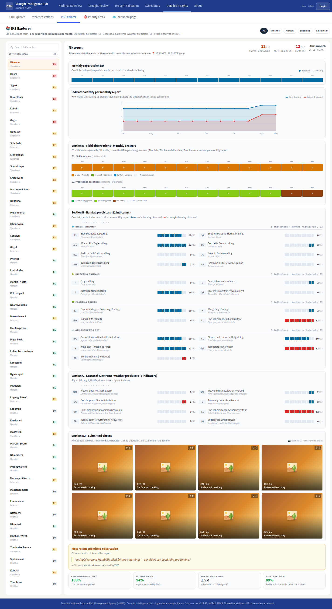

# Feature Design Document

## Feature: IKS explorer tab in Detailed Insights

**Task ID**: [IKS-2]
**Author**: DIH team
**Date**: 2026-06-12
**Status**: Draft

---

<!-- prototype-screens -->
### Prototype reference

Screens captured from the prototype (`index.html`) that this spec implements:


*IKS explorer tab: regional breakdown and per-indicator observation strips.*

<!-- /prototype-screens -->

## 1. Context & Problem Statement

```
Currently:
- IKS-1 (backend) introduces the v1_iks app: the 29-indicator catalogue and
  field submissions, plus DB-level aggregation endpoints
  (/api/v1/iks/aggregations/net-signal, /indicator-counts, /agreement).
- INS-1 (frontend) introduces the "Detailed Insights" tab shell — the
  container that hosts analytical sub-tabs. IKS has no presence in it.
- The Streamlit prototype shows the IKS story (weekly net-signal trend per
  region, an indicator catalogue with counts, an Inkhundla x week submission
  heatmap, IKS-vs-satellite agreement) but nothing equivalent exists in the
  Next.js hub. The prototype reference data is data/prototype/iks_data.json.
- The frontend has NO charting library (frontend/package.json: antd, leaflet,
  react-leaflet, topojson-client only). Ant Design 5 ships no charts.

Goal:
- Add an "IKS" sub-tab inside the Detailed Insights shell (INS-1) that
  consumes ONLY the IKS-1 aggregation endpoints and renders:
  - a weekly net-signal trend (line chart) per region in the 4 region colours,
  - an indicator catalogue table with per-indicator submission counts and the
    IKS-vs-CDI agreement summary,
  - an Inkhundla x week submission heatmap with tooltips.
- Introduce NO new endpoints; share a single region-colour constant; keep the
  heatmap render non-blocking; show loading/empty states.
```

---

## 2. Requirements

### User Acceptance Criteria
- [ ] In the Detailed Insights tab, the user can open an **IKS** sub-tab.
- [ ] The user sees a **weekly net-signal trend** chart with one line per region (Hhohho, Manzini, Lubombo, Shiselweni), each drawn in its **region colour** (the 4 region colours), with an axis of weeks and a legend.
- [ ] The user sees an **indicator catalogue table** listing the 29 indicators (code, label, type rainfall/seasonal, meaning drought/rain) with a **submission count** column and a summary of **IKS-vs-CDI agreement**.
- [ ] The user sees an **Inkhundla × week submission heatmap**; hovering a cell shows a **tooltip** with the Inkhundla name, week and submission count.
- [ ] Each panel shows clear **loading** and **empty** states (e.g. no submissions yet for the season) and a comprehensible error state.

### Technical Acceptance Criteria
- [ ] All data comes from the **IKS-1 aggregation endpoints** via the `api()` wrapper (`frontend/src/lib/api.js`) — no direct `fetch`, no client-side re-aggregation.
- [ ] The 4 region colours come from a **single shared region-colour constant** (Section 6) consumed by the trend chart, heatmap legend and table — no per-component colour literals.
- [ ] The **heatmap renders non-blocking**: it must not freeze the tab while drawing (the prototype grid is ~59 Tinkhundla × ~13 weeks). Use deferred/async rendering (e.g. render after first paint, or a canvas/virtualised approach) so the rest of the tab is interactive immediately.
- [ ] **Loading / empty / error** states use Ant Design (`Spin`, `Empty`, `Result`).
- [ ] A charting library is added to `frontend/package.json` (Section 5) — Ant has no charts.
- [ ] **Jest + RTL** tests cover: sub-tab renders, trend lines present (4 regions / 4 colours), catalogue table renders rows with counts + agreement, heatmap renders cells and a tooltip on hover, and loading/empty states.
- [ ] No regression to the Detailed Insights shell (INS-1) or other sub-tabs.

---

## 3. Data Model Changes

**N/A — consumes `v1_iks` aggregates.** This is a frontend-only feature. No new
Django models, no schema changes, no migrations. All data comes from the IKS-1
aggregation endpoints (`/api/v1/iks/aggregations/net-signal`,
`/indicator-counts`, `/agreement`) and the catalogue (`/api/v1/iks/indicators`).

### New Models

```python
# N/A — no backend models created or modified by IKS-2.
```

### Modified Models

| Model | Change | Reason |
|-------|--------|--------|
| _N/A_ | _No backend model changes_ | Frontend consumes existing IKS-1 aggregates |

### Migration Strategy

```python
# N/A — no migration. Frontend-only feature consuming existing v1_iks aggregates.
```

---

## 4. API Contract

**This feature introduces NO new endpoints.** It documents the **existing IKS-1
endpoints** it consumes.

### Endpoints

| Method | URL | Purpose | Auth |
|--------|-----|---------|------|
| GET | `/api/v1/iks/indicators` | Consumed (IKS-1). 29-indicator catalogue (code, label, type, meaning). | Required |
| GET | `/api/v1/iks/aggregations/net-signal` | Consumed (IKS-1). Weekly net signal per region → trend chart. | Required |
| GET | `/api/v1/iks/aggregations/indicator-counts` | Consumed (IKS-1). Per-indicator submission counts → catalogue table. | Required |
| GET | `/api/v1/iks/aggregations/agreement` | Consumed (IKS-1). IKS-vs-CDI agreement per Inkhundla → catalogue summary + heatmap context. | Required |

> The Inkhundla × week heatmap matrix is served by IKS-1's submission aggregation
> (per the IKS-1 net-signal/counts queries, keyed by `administration_id` × `observed_week`);
> confirm the exact heatmap payload shape with the IKS-1 author (assumed `{weeks, rows:[{administration_id, name, region, counts:[...]}]}`).

### Request/Response Examples

```json
// GET /api/v1/iks/aggregations/net-signal  (auth via JWT in session cookie, attached by api())
{
  "weeks": ["2026-05-04", "2026-05-11", "2026-05-18"],
  "data": [
    {"region": "Hhohho",     "series": [2.0, 1.4, 1.8]},
    {"region": "Manzini",    "series": [1.1, 0.9, 1.5]},
    {"region": "Lubombo",    "series": [-0.4, 0.2, 0.6]},
    {"region": "Shiselweni", "series": [0.8, 1.0, 1.3]}
  ]
}

// GET /api/v1/iks/aggregations/indicator-counts
{
  "data": [
    {"indicator": 1, "code": "BS", "indicator_type": "rainfall",
     "meaning": "rain", "submission_count": 73}
  ]
}

// GET /api/v1/iks/aggregations/agreement
{
  "data": [
    {"administration_id": 1621199, "name": "Nkwene", "region": "Shiselweni",
     "iks_net_signal": 1.8, "cdi_category": 2, "agreement": "agree"}
  ]
}
```

---

## 5. Decision Log

### D-1: IKS lives as a sub-tab of Detailed Insights (INS-1), not a new top-level page

**Options Considered**:
1. A standalone `/iks` route.
2. An "IKS" sub-tab plugged into the Detailed Insights shell introduced by INS-1.

**Decision**: Option 2 — plug into the INS-1 Detailed Insights tab shell.

**Rationale**: IKS is one analytical lens among several; it belongs beside the other insights. INS-1 already owns the tab container, protected routing and layout chrome, so IKS-2 only contributes a panel.

**Impact**: Hard dependency on INS-1 (shell) and IKS-1 (aggregation endpoints). IKS-2 ships a `components/Insights/IksTab/` panel that INS-1 registers as a tab; no routing/middleware work in IKS-2.

### D-7: Add a charting library — recommend Recharts

**Options Considered**:
1. **Recharts** — React-native SVG charts (line + custom cells), composable, plays well with React 18 / Next 14, small surface for a line chart + a custom-cell heatmap.
2. **@ant-design/charts** (G2Plot) — matches Ant visually but is a heavier dependency and pulls in AntV/G2.
3. **Chart.js + react-chartjs-2** — canvas-based; good for large heatmaps but a more imperative API.
4. Hand-rolled SVG/canvas — no dependency but reinvents axes/legends/tooltips.

**Decision**: Add **Recharts** for the net-signal trend (`LineChart`) and render the heatmap as a deferred **canvas** (or Recharts custom cells) layer.

**Rationale**: Frontend currently has **no** charting library (confirmed against `frontend/package.json`: only `antd`, `leaflet`, `react-leaflet`, `topojson-client` — Ant Design 5 ships no charts). Recharts is the lightest fit for a single line chart with categorical colours and integrates with RTL for tests. The heatmap is rendered on canvas (or as deferred custom cells) to satisfy the non-blocking requirement for the ~59×13 grid.

**Impact**: One new dependency (`recharts`) added to `frontend/package.json`; bundle impact isolated to the IKS tab via dynamic import. **Confirm the chosen lib and version against `frontend/package.json` at implementation time** and align with any UI-1 token decisions.

### D-8: Heatmap render is non-blocking

**Decision**: The heatmap draws after first paint (dynamic `import()` of the heatmap component + `requestAnimationFrame`/`useEffect` deferral, or a canvas draw), so the trend chart and table are interactive immediately and the tab never freezes on a large grid.

**Rationale**: The prototype heatmap is a dense Inkhundla × week matrix; a synchronous SVG render of ~767 cells would block the main thread on tab open.

**Impact**: Heatmap component is `next/dynamic` with `ssr:false`; a `Spin` placeholder shows until it mounts.

---

## 6. Type/Constant Mappings

A **single shared region-colour constant** is the source of truth for the 4
region colours, consumed by the trend chart lines, the heatmap legend and any
region chips in the catalogue table. It lives alongside the existing drought
colours (`frontend/src/static/config.js::DROUGHT_CATEGORY_COLOR`). **UI-1 tokens were
extracted from Figma 2026-06-12 (UI-1 §10)**; `REGION_COLOR` is not among the sampled
design-system tokens, so IKS-2 proposes it as an addition to the UI-1 token source
(re-exported from `config.js` for backward compatibility) rather than redefining hexes.

```js
// frontend/src/static/config.js  (new export, beside DROUGHT_CATEGORY_COLOR)
// Single source of truth for the 4 Eswatini region colours used across IKS-2.
export const REGION_COLOR = {
  Hhohho: "#3E5EB9",     // aligns with Ant colorPrimary / UI-1 token
  Manzini: "#2E8B57",
  Lubombo: "#C97A1A",
  Shiselweni: "#9B59B6",
};
```

| Frontend constant | Region | Used by |
|-------------------|--------|---------|
| `REGION_COLOR.Hhohho` | Hhohho | trend line, heatmap legend, region chip |
| `REGION_COLOR.Manzini` | Manzini | trend line, heatmap legend, region chip |
| `REGION_COLOR.Lubombo` | Lubombo | trend line, heatmap legend, region chip |
| `REGION_COLOR.Shiselweni` | Shiselweni | trend line, heatmap legend, region chip |

Serialized aggregate fields → table columns:

| API field (IKS-1) | Table column | Notes |
|-------------------|--------------|-------|
| `code` | "Code" | catalogue |
| `label_en` | "Indicator" | catalogue |
| `indicator_type` (`rainfall`/`seasonal`) | "Type" | tag |
| `meaning` (`drought`/`rain`) | "Predicts" | tag |
| `submission_count` | "Submissions" | from `indicator-counts` |
| `agreement` (`agree`/`contested`) | "CDI agreement" | summarised from `agreement` endpoint |

---

## 7. Compatibility & Migration

### Backward Compatibility
- [x] Existing API consumers unaffected (no new endpoints; read-only consumption).
- [x] Existing data preserved (frontend-only).
- [x] Existing screens (`browse/`, `compare/`, publication screens) unaffected; only the Detailed Insights shell gains a sub-tab.

### Seeder/CLI Compatibility
- [x] Existing seeders unchanged; IKS-2 adds none.
- [x] New dependency: `recharts` added to `frontend/package.json` (D-7) — `yarn install` required at deploy; `yarn lint`, `yarn test`, `yarn build` must pass.

---

## 8. Security Considerations

- [x] Permission model: the Detailed Insights route is already protected by INS-1 (`middleware.js`); IKS-2 inherits it and renders only for authenticated users. The IKS-1 aggregation endpoints are themselves `IsAuthenticated`.
- [x] Input validation: IKS-2 is read-only — it sends no user input to the backend beyond the authenticated GET requests; tooltips/labels render server-provided strings (escaped by React).
- [x] No new attack vectors: no new endpoints, no writes, no direct `fetch`; data flows solely through the `api()` wrapper which attaches the session JWT.

---

## 9. Testing Strategy

`frontend/src/components/Insights/IksTab/__tests__/` using **Jest 29 + RTL**
(`jest.config.js`, pattern of `src/app/__tests__/page.test.js`). `api()` is
mocked to return fixture payloads derived from `data/prototype/iks_data.json`.

| Test Type | Coverage |
|-----------|----------|
| Unit | `REGION_COLOR` exports all 4 regions; trend chart maps each region to its `REGION_COLOR` value (assert line `stroke` per region). |
| Unit | Catalogue table renders 29 rows with `submission_count` and a CDI-agreement cell; type/meaning tags shown. |
| Integration | Mounting the IKS sub-tab calls `api("GET", "/iks/aggregations/net-signal")`, `/indicator-counts`, `/agreement`, `/iks/indicators` (mocked) and renders trend + table + heatmap. |
| Integration | Heatmap renders cells; hovering a cell shows a tooltip with Inkhundla name + week + count (RTL `fireEvent.mouseOver`). |
| Integration | Loading state shows `Spin` before data resolves; empty payload (no submissions) shows `Empty`; rejected `api()` shows `Result` error. |
| Integration | Heatmap is dynamically imported (non-blocking): trend chart + table are present before the heatmap placeholder resolves. |
| E2E (smoke) | The Detailed Insights shell (INS-1) lists an "IKS" tab and switching to it mounts the panel without console errors. |

---

## 10. Open Questions

Resolved 2026-06-12 (decisions below).

- [x] **INS-1 tab contract — RESOLVED:** INS-1 exposes a tab registry (INS-1 §10); IKS-2 registers `{ key:"iks", label:"IKS", component:<lazy> }` and mounts lazily without editing shell internals.
- [x] **IKS-1 aggregation shapes + heatmap — RESOLVED, with one IKS-1 addition.** Trend + catalogue use IKS-1's `net-signal` (region×week) and `indicator-counts`. The **Inkhundla×week heatmap needs administration-level granularity that per-region `net-signal` doesn't provide**, so **IKS-1 adds `GET /api/v1/iks/aggregations/heatmap`** (administration × week net signal, DB-level) — a small IKS-1 scope addition (raise against IKS-1). Fallback if descoped: IKS-2 derives it client-side from a submissions list.
- [x] **Charting library — DECIDED: Recharts** (consistent with INS-1/INS-2 — single chart lib across the insights surface; re-confirmed no chart dep in `frontend/package.json`).
- [x] **`REGION_COLOR` — DECIDED: promote into the UI-1 token source**, re-exported from `static/config.js` for back-compat (matches notes.md — app-specific scales become UI-1 token additions).
- [x] **Colour-accessibility — DECIDED: don't rely on colour alone.** Trend lines carry distinct markers/dash patterns; heatmap cells show the value on hover with a CVD-safe ramp — the 4 regions and the signal stay distinguishable for colour-vision-deficient users.

---

### Findings (2026-06-12, verified against hub `eswatini.topojson`)
- **Corrected**: the agreement example paired `administration_id 4588078` with "Nkwene", but `4588078` is **Hhukwini (Hhohho)**. Nkwene's real id is **1621199** (fixed; name/region now consistent).
- 4 regions confirmed (Hhohho/Lubombo/Manzini/Shiselweni); `REGION_COLOR` is a proposed UI-1 addition (design choice, region names correct). IKS catalogue = 29 indicators (verified in IKS-1).

---

## 11. References

- Related tasks: [IKS-1] backend `v1_iks` (aggregation endpoints this tab consumes — **hard dependency**); [INS-1] Detailed Insights tab shell (the container this tab plugs into — **hard dependency**); [UI-1] design-system foundation (region-colour token home).
- Conventions: `docs/specs/notes.md` (Frontend conventions — `api()`, Pages, `DROUGHT_CATEGORY_COLOR`, Jest+RTL, no design-token system yet).
- Prototype reference: `data/prototype/iks_data.json` (weeks, trend per region, agreement, heatmap, soil_trend) — drives test fixtures.
- Hub source: `/home/iwan/Akvo/eswatini-droughtmap-hub` — `frontend/package.json` (confirmed: no charting lib), `frontend/src/lib/api.js`, `frontend/src/static/config.js`, `frontend/jest.config.js`.

---

## Approval

| Role | Name | Date | Status |
|------|------|------|--------|
| Developer | | | |
| Tech Lead | | | |
| Product | | | |
