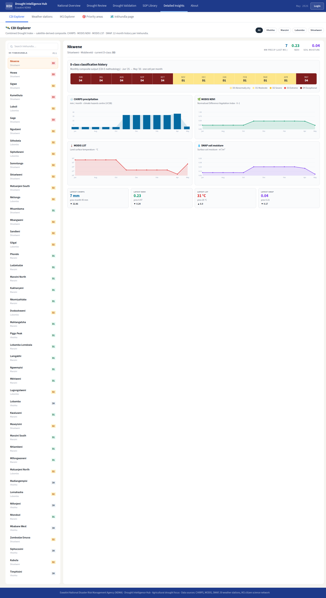
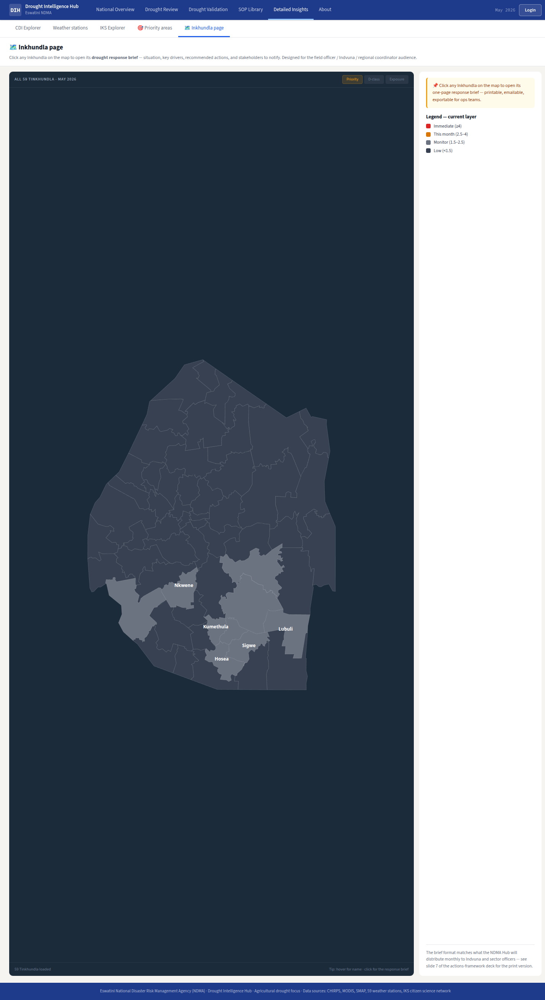

# Feature Design Document

## Feature: Detailed Insights shell + CDI explorer

**Task ID**: INS-1
**Author**: DIH team
**Date**: 2026-06-12
**Status**: Draft

---

<!-- prototype-screens -->
### Prototype reference

Screens captured from the prototype (`index.html`) that this spec implements:


*Detailed Insights shell + CDI explorer tab.*


*Inkhundla drill-down tab within the Insights shell.*

<!-- /prototype-screens -->

## 1. Context & Problem Statement

```
Currently:
- The hub exposes published CDI maps only as single-month choropleths
  (frontend/src/app/browse/page.js → PublicMap, frontend/src/app/compare/page.js).
- A visitor can view one month at a time and compare two months side-by-side,
  but there is no time-series view of how a given Inkhundla's drought class has
  evolved, and no place to read the underlying CDI indicators (LST/NDVI/SPI/SM)
  alongside the class.
- There is no "Insights" area at all (no frontend/src/app/insights/ directory yet),
  so related future features (IKS narratives via IKS-2, a Weather-stations tab from
  WX-1 aggregates, a Priority-areas link) have nowhere to live.

Goal:
- Introduce a tabbed "Detailed Insights" page at /insights that acts as the shell
  other insight features plug into.
- Ship the CDI explorer as the first tab: pick an Inkhundla, see a 12-month history
  of its published CDI class plus indicator toggles, built only from existing
  publication endpoints (D-2 source) and WX-1 aggregates — no new backend.
- Keep the satellite-vs-station delta chart explicitly out of scope (phase 2).
```

---

## 2. Requirements

### User Acceptance Criteria
- [ ] Visiting `/insights` shows a tabbed page with tabs: **CDI explorer**, **Weather stations**, **IKS**, **Priority areas** (the last as a link out to the priority-areas page).
- [ ] Switching between tabs happens without a full page reload; the active tab is reflected in the URL (deep link, e.g. `/insights?tab=cdi`) so a shared link opens the right tab.
- [ ] In the CDI explorer the user can pick an Inkhundla (search/select over the 59 Tinkhundla) and immediately see that Inkhundla's CDI **drought-class history** for the last 12 published months.
- [ ] The user can toggle indicator series (CDI value, LST, NDVI, SPI, SM) on/off; toggles update the chart without refetching the page.
- [ ] When fewer than 2 published months exist, the page still renders and shows a clear "not enough history yet" message instead of a broken chart.

### Technical Acceptance Criteria
- [ ] Built entirely from existing publication endpoints (D-2: `validated_values[].value/.category` of `status=published` publications) plus WX-1 weather aggregates; **no new backend endpoint or model**.
- [ ] Tabs are lazy-loaded: each tab's heavy content (chart, map, station widgets) is `next/dynamic`-imported and only mounted when first activated; the shell itself stays light.
- [ ] Charting uses a newly added, tree-shakeable React charting library (see D-3) — the repo currently ships **no** charting dependency.
- [ ] Page degrades gracefully with sparse history (<2 months) and with Tinkhundla that have `category = -9999` (No Data) in some months — gaps, not crashes.
- [ ] Smoke tests (Jest + RTL) cover: shell renders all 4 tab labels; tab switch updates URL; CDI explorer renders the sparse-history fallback when given <2 months of data.

---

## 3. Data Model Changes

**N/A — consumes existing/aggregate APIs.** This is a frontend-only feature. It reads published `Publication.validated_values` (D-2) and the WX-1 weather-station aggregate endpoint. No new Django models, no migrations, no changes to `Administration` or `Publication`.

---

## 4. API Contract

No new endpoints. The CDI explorer and shell consume **existing** APIs via the server-only `api(method, url, payload?)` helper (`frontend/src/lib/api.js`, base `/api/v1`, JWT from session cookie — public reads work without a session).

### Endpoints consumed (existing)

| Method | URL | Purpose | Auth |
|--------|-----|---------|------|
| GET | `/dates` | List available published map dates (`year_month`); drives the 12-month window and tab axis. | Public |
| GET | `/maps?page_size=1` | Latest published map (publication history entry); used to resolve the most recent month and map id. | Public |
| GET | `/map/{mapID}` | Single published map: `validated_values[]` (`{administration_id, value, category}`), `narrative`, `bulletin_url`, `published_at`. One call per month in the 12-month window builds the per-Inkhundla class history. | Public |
| GET | `/wx/aggregates?...` | WX-1 weather-station monthly aggregates per Inkhundla (LST/NDVI/SPI/SM context series). Consumed read-only by the CDI explorer indicator toggles. *(Provided by WX-1; INS-1 only consumes it.)* | Public |

> Publication "history" = the ordered set of `/dates` × `/map/{id}` (status=published) entries. There is no dedicated history endpoint; the explorer assembles history client-side from these existing calls. The `AppContext` already exposes `administrations` and `geoData` (topojson→geojson) so the Inkhundla picker needs no extra fetch.

### Request/Response Examples

```json
// GET /dates  → available published months (most-recent first)
["2025-07", "2025-06", "2025-05", "2025-04"]

// GET /map/512   → one published month
{
  "year_month": "2025-07",
  "published_at": "2025-07-10T08:00:00Z",
  "bulletin_url": "https://.../bulletin-2025-07.pdf",
  "validated_values": [
    { "administration_id": 7130003, "value": 6, "category": 4 },
    { "administration_id": 4588078, "value": 2, "category": 1 }
  ]
}
```

Client assembly (per selected Inkhundla `administration_id`):
```
history = dates.slice(0,12).map(month =>
  pick(map(month).validated_values, administration_id) // → { value, category } | null
)
```

---

## 5. Decision Log

### D-1: /insights is the shell other insight features plug into

**Options Considered**:
1. One monolithic CDI page; add Weather/IKS/Priority later as separate routes.
2. A tabbed `/insights` shell where each tab is an independently lazy-loaded module; CDI explorer is the first concrete tab.

**Decision**: Option 2.

**Rationale**: IKS-2 (IKS narratives tab) and a future Weather-stations tab (WX-1) and the Priority-areas link all belong to the same "Detailed Insights" surface for the user. A shell with a tab contract (`{ key, label, Component }`, lazy-mounted) lets those features land as drop-in tab modules without touching routing or layout. Deep-linkable tab state (`?tab=`) keeps shareability.

**Impact**: Establishes `frontend/src/app/insights/page.js` (server component shell) + `frontend/src/app/insights/_tabs/` modules. IKS-2 adds an `iks` tab module; WX-1 adds the `weather-stations` module; `priority-areas` is a link tab pointing at the priority-areas route.

### D-2: Drought-class source = published `validated_values[].category`

**Options Considered**:
1. Add a new time-series drought store/endpoint.
2. Read the latest published publications' `validated_values` (project-wide D-2 decision).

**Decision**: Option 2 — reuse D-2. History is the sequence of published months' `validated_values`.

**Rationale**: No new backend was sanctioned for INS-1; `validated_values` already carries `{value, category}` per `administration_id` and is the canonical published source.

**Impact**: Explorer is read-only and auto-tracks new publications with zero backend work.

### D-3: Charting library recommendation

**Options Considered**:
1. `recharts` — React-first, declarative, composable, tree-shakeable, ~widely used with Next 14.
2. `@ant-design/plots` (G2) — matches the Ant Design 5 look but heavier bundle.
3. Hand-rolled SVG/`d3`.

**Decision**: Add **`recharts`** (`frontend/package.json`, currently no chart dep).

**Rationale**: Smallest integration cost for line/stacked-bar charts needed here and in INS-2, plays well with React 18 + Next 14.2 server/client split (charts live in client tab modules), and avoids pulling the full G2 runtime. Ant Design is retained for everything non-chart (tabs, selects, layout) to stay visually consistent with the `colorPrimary:#3E5EB9` theme.

**Impact**: One new dependency shared by INS-1 and INS-2. Charts must be in `"use client"` modules; the `/insights` shell stays a server component.

### D-4: Lazy-loaded tabs

**Decision**: Each tab body is `next/dynamic`-imported (`ssr: false` for chart/map tabs, consistent with `DynamicMap.js`), mounted on first activation.

**Rationale**: Keeps the initial `/insights` payload small and avoids loading Leaflet/recharts for tabs the user never opens.

**Impact**: Tab modules export a default client component; the shell renders a placeholder until activated.

---

## 6. Type/Constant Mappings

| Frontend/Editor | Backend Constant | DB Value |
|-----------------|------------------|----------|
| `DROUGHT_CATEGORY_LABEL[0]` "Wet/normal conditions" | `DroughtCategory.normal` | `0` |
| `DROUGHT_CATEGORY_LABEL[1]` "D0 Abnormally Dry" | `DroughtCategory.d0` | `1` |
| `DROUGHT_CATEGORY_LABEL[2]` "D1 Moderate Drought" | `DroughtCategory.d1` | `2` |
| `DROUGHT_CATEGORY_LABEL[3]` "D2 Severe Drought" | `DroughtCategory.d2` | `3` |
| `DROUGHT_CATEGORY_LABEL[4]` "D3 Extreme Drought" | `DroughtCategory.d3` | `4` |
| `DROUGHT_CATEGORY_LABEL[5]` "D4 Exceptional Drought" | `DroughtCategory.d4` | `5` |
| `DROUGHT_CATEGORY_COLOR[-9999]` "No Data" (white) | `DroughtCategory.none` | `-9999` |

Class-history chart reuses `DROUGHT_CATEGORY_COLOR` / `DROUGHT_CATEGORY_LABEL` from `frontend/src/static/config.js`. A month where the selected Inkhundla has `category = -9999` renders as a gap (no marker), not a plotted point.

> **Palette note (UI-1 §10):** the D-class colours use the **legacy `DROUGHT_CATEGORY_COLOR`**, which is **retained unchanged** by decision (2026-06-12) — the warmer Figma drought palette is **not** adopted. Consume the token / UI-1 drought tokens — do **not** hardcode hexes.

---

## 7. Compatibility & Migration

### Backward Compatibility
- [ ] Existing API consumers unaffected — no endpoint or schema change.
- [ ] Existing data preserved — read-only feature.
- [ ] CLI tools still work — no backend touched.

### Sparse / degraded data handling
- [ ] **<2 published months**: render the explorer chrome (Inkhundla picker, toggles) but replace the chart area with an info state ("Not enough published history yet — at least 2 published months are needed for a trend"). Covered by smoke test.
- [ ] **Inkhundla missing in some months** (no matching `administration_id` in `validated_values`) or `category = -9999`: that month is a gap in the class series, not a crash.
- [ ] **WX-1 aggregate unavailable**: indicator toggles for LST/NDVI/SPI/SM disable gracefully with a tooltip; the published-class series still renders.

### Seeder/CLI Compatibility
- [ ] Existing seeders work — unchanged.
- [ ] New seeder commands needed: none.

---

## 8. Security Considerations

- [ ] Permission model: `/insights` is **public** (read-only), consistent with `browse`/`compare`. Not added to `middleware.js` `protectedRoutes`.
- [ ] Input validation: the Inkhundla picker is constrained to known `administration_id`s from `AppContext.administrations`; the `?tab=` param is validated against the known tab-key allowlist and falls back to the default tab.
- [ ] No new attack vectors: only GETs to existing public read endpoints; no mutations; no secrets in client code (`api()` stays server-only).

---

## 9. Testing Strategy

| Test Type | Coverage |
|-----------|----------|
| Unit | Class-history assembly (`dates` × `map.validated_values` → per-Inkhundla series); `-9999`/missing-month gap handling; `?tab=` param validation/fallback. |
| Integration (Jest + RTL, jsdom) | Shell renders all 4 tab labels (CDI explorer / Weather stations / IKS / Priority areas); clicking a tab updates the URL and mounts the lazy module; indicator toggles add/remove series. |
| Smoke / E2E | `/insights` loads with 0/1 published month → sparse-history fallback shown, no crash; deep link `/insights?tab=cdi` opens CDI explorer directly; tab switch causes no full reload. |

---

## 10. Open Questions

Resolved 2026-06-12 (decisions below).

- [x] **WX-1 aggregate endpoint — RESOLVED (WX-1 concluded):** the station series comes from WX-1's `GET /api/v1/station/{id}/daily?start&end` → `{station, unit, series:[{day, temp_mean, temp_max, temp_min, rain_total, hum_mean, wind_mean}]}` (not a `/wx/aggregates` route). **WX-1 is mock** (one demo station), so station overlays render only for Inkhundla with a seeded station; the toggle is disabled elsewhere with a tooltip.
- [x] **Indicator-series granularity — DECIDED: v1 plots the published CDI *class* history only.** The hub stores per-Inkhundla **monthly CDI category** in each `Publication.validated_values` (real 12-month series), but **not** per-Inkhundla monthly LST/NDVI/SPI/SM. So the CDI explorer shows the real class history; ingredient sub-indicator overlays are limited to what a source provides (WX-1 station temp/rain for a station's Inkhundla) and otherwise deferred until a per-Inkhundla ingredient store exists.
- [x] **12-month window — DECIDED: `min(12, available)`** — the last 12 published months from `/dates`, or all available if fewer.
- [x] Drought-band palette (UI-1 §10): **DECIDED** — the class-history series uses the legacy `DROUGHT_CATEGORY_COLOR` (unchanged); the Figma drought palette is not adopted.

---

### Findings (2026-06-12, verified against the CDI geojson + hub `eswatini.topojson`)
- **Corrected**: the §4 `validated_values` example used `administration_id 1253002` (does not exist). Replaced with **Mhlume** (`7130003`, real CDI category 4). The other id `4588078` is real (**Hhukwini**, real CDI category 1) and was kept.
- Consumes existing publication endpoints only; class-history uses the legacy `DROUGHT_CATEGORY_COLOR` (decision retained).

---

## 11. References

- Related tasks: INS-2 (national overview dashboard, shares the recharts dependency and `DROUGHT_CATEGORY_COLOR`); IKS-2 (IKS tab module plugging into this shell); WX-1 (weather-station aggregates consumed here); PA-1 (priority-areas link target).
- Conventions: `docs/specs/notes.md` (D-2 validated_values source; server vs client page pattern; `api()` helper; testing setup).
- Prior art: `frontend/src/app/browse/page.js` (public async server component), `frontend/src/app/compare/page.js`, `frontend/src/components/Map/CDIMap.js` (+ `.Legend`), `frontend/src/components/Map/DynamicMap.js` (`ssr:false` lazy pattern), `frontend/src/static/config.js` (`DROUGHT_CATEGORY_COLOR/LABEL`), `frontend/src/app/__tests__/page.test.js` (RTL pattern).
- Notebook: `eswatini_drought_analysis.ipynb` §1 (per-Inkhundla `category` 0–5 is the same value plotted in the class history).

---

## Approval

| Role | Name | Date | Status |
|------|------|------|--------|
| Developer | | | |
| Tech Lead | | | |
| Product | | | |
