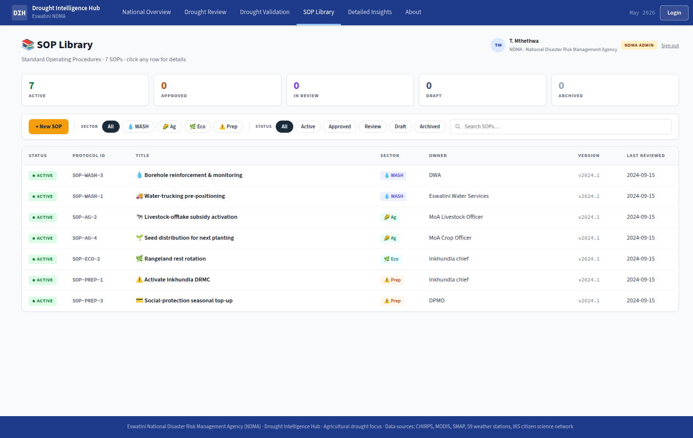
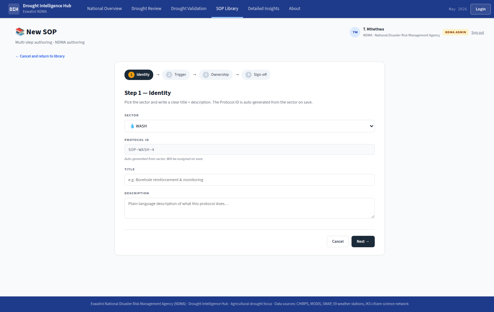

# Feature Design Document

> **Purpose**: Use this template when planning new features that require data model changes, API design, or architectural decisions. Complete this document BEFORE implementation begins. Claude can read this document for context during implementation.

---

## Feature: Frontend — SOP Library pages

**Task ID**: SOP-3
**Author**: DIH team
**Date**: 2026-06-12
**Status**: Draft

---

<!-- prototype-screens -->
### Prototype reference

Screens captured from the prototype (`index.html`) that this spec implements:


*SOP Library list with sector/status filters and search.*


*SOP create / edit wizard.*

<!-- /prototype-screens -->

## 1. Context & Problem Statement

```
Currently:
- The prototype ships a static, read-only SOP catalogue rendered from data/prototype/sop_library.json
  (7 illustrative SOPs across sectors wash/ag/eco/prep). It has no auth, no workflow, no editing,
  and no link to live drought/vulnerability data.
- The hub frontend (Next.js 14, App Router, Ant Design 5) has Publications and Reviews flows but
  NO SOP surface at all: frontend/src/app/ has no `sops` route.
- SOP triggers in the prototype are flat key/value fields (triggerDclass, triggerVulnIndicator,
  triggerVulnOp, triggerVulnValue, triggerExpIndicator, triggerExpOp, triggerExpValue) with no UI
  to author or validate them, and no enforced approval lifecycle (draft → review → approved → active, per SOP-1).

Goal:
- Build the SOP Library frontend under frontend/src/app/sops: a searchable/filterable library table,
  a rich detail view (trigger, ownership, status banner with allowed transitions, history timeline,
  comments), and a create/edit wizard whose centrepiece is a trigger builder that writes the structured
  trigger fields the priority engine (SOP-2) consumes.
- Make every surface role-aware via CASL <Can> + UserContext, matching the SOP role mapping from SOP-1
  (D-3): admin, sector-lead (reviewer + sector), scientific-reviewer (UNESWA, comment-only), viewer.
- Consume the v1_sop REST APIs delivered by SOP-1 (list/detail/transition/comment). This task adds NO
  backend models — it is pure frontend consuming v1_sop.
```

---

## 2. Requirements

### User Acceptance Criteria
- [ ] **Library**: A user can open `/sops`, see all SOPs in an Ant `Table`, free-text search by title/short title/owner, and filter by **sector** (wash/ag/eco/prep) and **status** (draft/review/approved/active/archived — SOP-1 uses `review`, not "submitted"). Results are paginated.
- [ ] **Role-aware actions**: Per-row and page-level action buttons match the viewer's role — a viewer sees no write actions; a sector-lead sees "New SOP" + "Edit" only on draft SOPs in their own sector; admin sees all actions; scientific-reviewer sees "Comment" on the detail view only.
- [ ] **Detail — what/when/who/status**: The detail view at `/sops/[id]` shows the trigger (human-readable summary + structured fields), ownership (owner, coordWith, resources, timing, geographicScope), a **status banner** showing the current status and the buttons for **only the transitions allowed for the current status and the viewer's role**, the full **history timeline**, and the **comments** thread.
- [ ] **History**: The timeline renders every `history[]` entry (ts, user, action) newest-or-oldest consistently, including draft/submit/approve/activate events.
- [ ] **Comments**: A scientific-reviewer or admin can post a comment from the detail view; the new comment appears in the thread without a full reload.
- [ ] **Wizard — build triggers**: A sector-lead (own sector) or admin can create a new SOP or edit an existing **draft** via a multi-step wizard. The **trigger builder** step shows a **live human-readable summary** that updates as fields change, e.g. `D2+ · vWater ≥ 0.65 · pop ≥ 2,500`.
- [ ] **Draft-only editing**: SOPs that are not in `draft` status are read-only in the wizard; the Edit action is hidden/disabled for non-draft SOPs.

### Technical Acceptance Criteria
- [ ] All role gating is rendered via `<Can>` from `UserContext.abilities` (client-side, UX only) AND the same actions are rejected server-side by SOP-1's permissions when the API is called directly (defence in depth — see §8).
- [ ] **Click-through verified** end to end: the same SOP can be driven `draft → submit → approve → activate` by the correct roles (sector-lead submits, admin approves/activates), and forbidden transitions are not offered.
- [ ] **Jest smoke tests** (Jest 29 + RTL, per `jest.config.js`) cover: library renders + filters, detail renders banner/timeline/comments, wizard mounts, trigger-summary string builder, and `<Can>`-gated action visibility per role.
- [ ] **Per-step form validation**: each wizard step validates before "Next" is enabled; the trigger step enforces field consistency (operator + numeric value present when an indicator is selected; D-class required).
- [ ] No backend/data-model changes; consumes `/api/v1/.../sop...` endpoints only via the server-only `api()` wrapper.

---

## 3. Data Model Changes

**N/A — consumes v1_sop APIs.**

This is a frontend-only task. There are no new Django models, no migrations, and no SQLite/mobile schema changes. All SOP persistence, status transitions, and comment storage are owned by the `v1_sop` app delivered in **SOP-1** (`backend/api/v1/v1_sop/`). This spec only consumes those REST endpoints (see §4). Field shapes referenced below mirror `data/prototype/sop_library.json` and are the contract SOP-1 serialises.

### New Models
N/A — consumes v1_sop APIs.

### Modified Models
N/A — consumes v1_sop APIs.

### Migration Strategy
N/A — consumes v1_sop APIs.

---

## 4. API Contract

All calls go through the server-only wrapper `api(method, url, payload?)` at
`/home/iwan/Akvo/eswatini-droughtmap-hub/frontend/src/lib/api.js` (base `/api/v1`, Bearer JWT injected
from session). Client pages `await api(...)` directly; there are no Next.js route handlers. These endpoints
are **consumed**, not defined here — they are delivered by **SOP-1** in `backend/api/v1/v1_sop/`.

### Endpoints (consumed from SOP-1)

| Method | URL (passed to `api()`) | Purpose | Auth | Used by |
|--------|--------------------------|---------|------|---------|
| GET | `/sops?page=&search=&sector=&status=` | List/paginate SOPs (library table) | Required (auth workspace) | `/sops` library |
| GET | `/sop/{pk}` | SOP detail (trigger, ownership, status, history[], comments[]) | Required | `/sops/[id]` detail |
| POST | `/sops` | Create new SOP (status forced to `draft` server-side) | admin / own-sector lead | wizard create |
| PUT/PATCH | `/sop/{pk}` | Update SOP — server rejects unless status is `draft` | admin / own-sector lead | wizard edit |
| POST | `/sop/{pk}/transition` | Lifecycle transition `{ "to_status": <int> }` (SOPStatus int); server validates allowed-from-status + role; **reject (`review→draft`) requires a `note`** | per SOP-1 matrix | detail status banner |
| POST | `/sop/{pk}/comment` | Add a comment `{ "text": "..." }` | admin / scientific-reviewer | detail comments |

Pagination follows the hub convention: response `{ current, total, total_page, data }`, `page_size=10`
(per `backend/utils/custom_pagination.py`). The library table maps `data` → rows and `total` → Ant
`pagination.total`.

> **API shape = SOP-1's serializer (authoritative), not the prototype JSON.** SOP-1 returns **snake_case** fields with
> **integer-coded** `status`/`sector` + `status_label`/`sector_label`, an integer **`pk`** for URLs (not the `code`
> string), `trigger_dclass` as a DroughtCategory **int** (plus a `trigger_summary` string), and the lifecycle set
> **`draft / review / approved / active / archived`** — SOP-1 uses **`review`**, not "submitted". The camelCase
> `sop_library.json` shape in the examples below is the **seed source**, not the live response; map it onto SOP-1's
> serializer when wiring the table/detail/wizard. Public/anonymous callers see **only `active`** SOPs (SOP-1 Q4); the
> `/sops` *page* itself stays auth-gated (the TWG workspace with create/edit/transition).

### Request/Response Examples

```json
// GET /api/v1/sop/SOP-WASH-3  -> 200
{
  "id": "SOP-WASH-3",
  "title": "Borehole reinforcement & monitoring",
  "shortTitle": "Borehole monitoring",
  "sector": "wash",
  "icon": "💧",
  "triggerDclass": "D2+",
  "triggerVulnIndicator": "vWater",
  "triggerVulnOp": ">=",
  "triggerVulnValue": 0.65,
  "triggerExpIndicator": "pop",
  "triggerExpOp": ">=",
  "triggerExpValue": 2500,
  "triggerOther": "",
  "owner": "DWA + Inkhundla Indvuna",
  "coordWith": "Eswatini Water Services · Red Cross",
  "resources": "2 trucks · 1 hydrogeologist · E120k",
  "timing": "immediate",
  "geographicScope": "Inkhundla",
  "version": "2024.1",
  "lastReviewed": "2024-09-15",
  "status": "active",
  "approver": "T. Mthethwa, NDMA",
  "approvedAt": "18 May 2026",
  "activatedAt": "01 Oct 2024",
  "history": [
    { "ts": "01 Sep 2024", "user": "T. Mthethwa, NDMA", "action": "Created draft" },
    { "ts": "10 Sep 2024", "user": "Sector lead", "action": "Submitted for review" }
  ],
  "comments": [
    { "ts": "12 Sep 2024", "user": "T. Mavuso, UNESWA", "text": "Trigger condition appears statistically sound." }
  ]
}
```

```json
// POST /api/v1/sop/3/transition   (integer pk = 3; review → approved)
{ "to_status": 3 }

// Response 200 — SOP-1 serializer (int status + label)
{ "id": 3, "code": "SOP-WASH-3", "status": 3, "status_label": "Approved", "approver": "T. Mthethwa, NDMA" }
```

```json
// POST /api/v1/sop  (wizard create) — server forces status:"draft"
{
  "title": "Emergency fodder distribution",
  "shortTitle": "Fodder distribution",
  "sector": "ag",
  "triggerDclass": "D2+",
  "triggerVulnIndicator": "vestock", "triggerVulnOp": ">=", "triggerVulnValue": 0.6,
  "triggerExpIndicator": "livestock", "triggerExpOp": ">=", "triggerExpValue": 1500,
  "owner": "MoA Livestock Officer", "coordWith": "Red Cross", "resources": "E300k",
  "timing": "immediate", "geographicScope": "Inkhundla"
}

// Response 201
{ "id": "SOP-AG-7", "status": "draft", ... }
```

---

## 5. Decision Log

### D-1: Trigger builder writes the structured fields SOP-2 consumes

**Options Considered**:
1. **Free-text trigger** — author types a sentence; SOP-2 parses it. Brittle; no validation; breaks the priority engine.
2. **Structured trigger builder** — discrete controls (D-class select, indicator select, operator select, numeric input) bound to named fields, with a live human-readable summary derived from those fields. *(chosen)*
3. Visual rule-graph editor — over-engineered for a 3-clause trigger.

**Decision**: Option 2. The wizard's trigger step is a controlled Ant `Form` whose fields map **one-to-one** to the `sop_library.json` trigger keys, so the payload SOP-2 reads is produced directly with no parsing:

| UI control | Field written | Domain / example |
|------------|---------------|------------------|
| Drought-class `Select` | `triggerDclass` | `"D0+" … "D4"` (maps to `DroughtCategory` int via SOP-2; D_norm = category/5 — see notes.md) |
| Vulnerability indicator `Select` | `triggerVulnIndicator` | `vWater, vestock, vIpc, vPrep, none` |
| Vuln operator `Select` | `triggerVulnOp` | `>=, >, <=, <, ==` |
| Vuln value `InputNumber` | `triggerVulnValue` | `0.0–1.0` (e.g. `0.65`) |
| Exposure indicator `Select` | `triggerExpIndicator` | `pop, livestock, cropland, rangeland, u5, none` |
| Exposure operator `Select` | `triggerExpOp` | `>=, >, <=, <, ==` |
| Exposure value `InputNumber` | `triggerExpValue` | integer count (e.g. `2500`) or `null` when indicator=`none` |
| Other notes `Input` | `triggerOther` | free text, optional |

A pure helper `buildTriggerSummary(trigger)` (in `frontend/src/app/sops/_components/trigger.js`) renders the
live string, e.g. `D2+ · vWater ≥ 0.65 · pop ≥ 2,500`, omitting clauses whose indicator is `none`/empty and
thousands-formatting exposure counts. This helper is unit-tested (§9) and reused read-only on the detail view.

**Rationale**: Producing the exact structured shape at author-time removes any parsing layer between SOP-3 and SOP-2 and lets per-field validation catch bad triggers before submission. The summary is a *projection* of the fields, never a source of truth.

**Impact**: Ties directly to SOP-2 (priority engine reads these fields) and to the `sop_library.json` contract. Indicator/operator option lists live in `frontend/src/static/config.js` (new `SOP_TRIGGER_*` constants) so SOP-2 and SOP-3 share one vocabulary.

### D-2: Role-aware rendering via `<Can>` + UserContext mapping (ties to SOP-1 D-3)

**Options Considered**:
1. **Hard-coded `role` checks** (`if role === admin`) scattered in components — duplicates the SOP role model and drifts from the backend.
2. **CASL `<Can>` driven by `UserContext.abilities`** — same ability rows the backend issues, one source of truth. *(chosen)*

**Decision**: Option 2. Gate every write surface with the existing `<Can>` component
(`frontend/src/components/Can.js`, which calls `defineUserAbility(UserContext.abilities)`), using subject
`"SOP"` and the `"owner"` field check it already passes. The hub only has `role ∈ {admin, reviewer}` +
`technical_working_group` + `Ability` rows, so the prototype SOP roles are mapped per **SOP-1 D-3**:

| Prototype SOP role | Hub mapping | Abilities (subject `"SOP"`) | UI effect |
|--------------------|-------------|------------------------------|-----------|
| Admin | `role=admin` | `read, create, update, approve/activate(transition), comment` | all actions, all sectors |
| Sector-lead | `role=reviewer` + explicit `sop_sector` (SOP-1 D-3a) | `read, create/update` on **own-sector draft**, `submit(transition)` | New/Edit on own draft; submit |
| Scientific-reviewer | `role=reviewer` + UNESWA TWG | `read, comment` | comment only |
| Viewer | any authenticated | `read` | read-only |

The mapping (a sector-lead's explicit `sop_sector` + ability rows, SOP-1 D-3a) is provisioned by SOP-1;
SOP-3 only consumes `UserContext.abilities`. Action gates: `<Can I="create" a="SOP">` (New button), `<Can I="update" a="SOP">`
(Edit on draft), `<Can I="comment" a="SOP">` (comment box). Transition buttons are gated by a small
`allowedTransitions(status, ability)` helper so the status banner only renders buttons the role+status allow.

**Rationale**: Single ability source matched to the server keeps client and server in lockstep and means new roles need no frontend changes. Reuses the already-shipped `<Can>` pattern from Publications.

**Impact**: Depends on SOP-1 seeding `Ability` rows for subject `"SOP"`. Open question on TWG→sector map is owned by SOP-1 D-3 (confirm with NDMA).

### D-3: Wizard is a multi-step Ant `Steps` flow, not a flat form

**Options Considered**: (1) one long form — overwhelming, no per-section validation gate; (2) Ant `Steps` wizard with per-step validation. *(chosen)* The codebase has no existing `Steps` usage (forms are flat, e.g. `PublicationForm.js`), so this introduces the first wizard pattern under `frontend/src/app/sops/_components/SopWizard.js`.

**Decision**: 4 steps — **Basics** (title/shortTitle/sector/icon/description) → **Trigger** (the builder, D-1) → **Ownership & Resources** (owner/coordWith/resources/timing/geographicScope) → **Review & Submit** (read-only recap incl. live trigger summary). `Next` is disabled until the current step's `Form.validateFields()` resolves.

**Rationale**: Largest, most error-prone task; staged validation localises errors and the final recap doubles as the click-through confidence check.

**Impact**: New reusable wizard primitives; informs UI-1 design tokens.

---

## 6. Type/Constant Mappings

New constants added to `frontend/src/static/config.js`, shared with SOP-2:

| Frontend constant | Value(s) | Note |
|-------------------|----------|------|
| `SOP_SECTORS` | `{ wash:"WASH", ag:"Agriculture", eco:"Ecosystems", prep:"Preparedness" }` | library filter + wizard select |
| `SOP_STATUS` | `{ draft, review, approved, active, archived }` (int-coded per SOP-1; **`review`**, not "submitted") | banner + filter |
| `SOP_STATUS_COLOR` | Ant `Tag`/banner colour per status | UX only |
| `SOP_TRIGGER_DCLASS` | `["D0+","D1+","D2+","D3+","D4"]` | `triggerDclass`; maps to `DroughtCategory` int in SOP-2 (D_norm=category/5) |
| `SOP_VULN_INDICATORS` | `["vWater","vestock","vIpc","vPrep"]` + `none` | `triggerVulnIndicator` |
| `SOP_EXP_INDICATORS` | `["pop","livestock","cropland","rangeland","u5"]` + `none` | `triggerExpIndicator` |
| `SOP_OPERATORS` | `[">=",">","<=","<","=="]` | `triggerVulnOp` / `triggerExpOp`; rendered as `≥ > ≤ < =` in summary |
| `SOP_TIMING` | `{ immediate:"Immediate", thismonth:"This month" }` | `timing` |
| `SOP_TRANSITIONS` | `{ draft:[review], review:[approved, draft], approved:[active, archived], active:[archived] }` (mirrors SOP-1 `SOP_TRANSITIONS`; `review→draft` = reject, requires a `note`) | allowed-from-status graph (intersected with ability) |

These mirror the `sop_library.json` field domains so the wizard output is byte-compatible with SOP-2's reader.

---

## 7. Compatibility & Migration

### Backward Compatibility
- [x] Existing API consumers unaffected — purely additive `/sops` routes; no change to Publications/Reviews.
- [x] Existing data preserved — no data model touched; reads/writes go to SOP-1's `v1_sop` endpoints.
- [x] CLI tools still work — N/A (frontend task).

### Seeder/CLI Compatibility
- [x] Existing seeders work — unaffected.
- [x] New seeder commands needed: **none in this task** — SOP seeding (from `sop_library.json`) is owned by SOP-1's `v1_sop` seeder. SOP-3 assumes that seed data is present for click-through testing.

---

## 8. Security Considerations

- [x] **Permission model defined** — see D-2. Client gating via `<Can>` + `UserContext.abilities` maps the SOP roles (D-3).
- [x] **Client checks are UX only; the server enforces.** `<Can>` and `allowedTransitions()` exist solely to *hide/disable* controls the user may not use — they prevent confusing UI, not unauthorised actions. Every write goes through `api()` to SOP-1's endpoints, which independently re-check `request.user.role` / `Ability` (and reject e.g. a reviewer transitioning `approved→active`, or editing a non-draft, or editing another sector's SOP) regardless of what the client rendered. A user who forges a request bypassing the hidden button still gets a 403 from the backend.
- [x] **Input validation specified** — per-step `Form.validateFields()` (§9): required title/sector/D-class; numeric ranges (`triggerVulnValue` 0–1, `triggerExpValue` ≥ 0 integer); operator+value required when an indicator ≠ `none`; the server applies the authoritative validation again on `POST/PUT`.
- [x] **No new attack vectors introduced** — no secrets in client code; JWT injected server-side by `api()`; comment text is rendered as plain text (no `dangerouslySetInnerHTML`) to avoid stored-XSS in the comments thread.

---

## 9. Testing Strategy

| Test Type | Coverage |
|-----------|----------|
| Unit | `buildTriggerSummary()` produces `D2+ · vWater ≥ 0.65 · pop ≥ 2,500`, omits `none` clauses, thousands-formats exposure; `allowedTransitions(status, ability)` returns the correct button set per status/role. |
| Unit (validation) | Each wizard step's validators: missing title/sector/D-class blocks Next; `triggerVulnValue` out of 0–1 fails; indicator selected but operator/value empty fails; exposure indicator `none` clears/ignores value. |
| Integration (Jest + RTL smoke) | Library `/sops` renders rows from a mocked `api()` and applies sector/status filter + search; detail `/sops/[id]` renders status banner, history timeline, and comments; wizard mounts and steps forward only when valid; comment submit appends to thread. |
| Integration (`<Can>` gating) | With mocked `UserContext.abilities` for each role (admin / sector-lead / scientific-reviewer / viewer), assert the correct action buttons render: viewer sees none, sector-lead sees New+Edit(own draft)+Submit, scientific-reviewer sees Comment, admin sees all. |
| E2E (role click-through) | Drive one SOP `draft → submit → approve → activate` across roles: sector-lead creates+submits, admin approves then activates; assert forbidden transitions are never offered and the backend would 403 a forged call (covered by SOP-1 server tests). |

Tests follow `jest.config.js` (Jest 29 + RTL, `jsdom`) and live under `frontend/src/app/sops/__tests__/`,
mirroring the existing example at `frontend/src/app/__tests__/page.test.js`. `api()` is mocked at the module
boundary. Scripts: `yarn lint`, `yarn test`, `yarn build`.

---

## 10. Open Questions

- [x] **Sector-lead source — RESOLVED (SOP-1 D-3a):** a sector-lead's sector is the explicit `sop_sector` field on `SystemUser` (not derived from `technical_working_group`, which has no eco/prep value). SOP-3 reads `UserContext.abilities` (encoding the `{sector:$own}` condition) and needs no change. (The TWG→sector *derivation* is no longer used.)
- [x] **SOP `id` scheme — RESOLVED: server-assigned integer `pk`** (the DB primary key, used in URLs); `code` (`SOP-WASH-3`) is a separate unique display field the author enters. The wizard does not propose the pk.
- [x] **Archive from UI — DECIDED: admin-only, on the detail status banner** (not a wizard step). Per SOP-1 §8, `approved→archived` / `active→archived` are admin-only, so the banner shows "Archive" only for admins on approved/active SOPs; the wizard drives `draft→review→approved→active`.
- [x] **Live trigger preview — DEFERRED.** "How many Tinkhundla currently match" needs a SOP-2 dry-run, which SOP-2 doesn't expose in v1; deferred (the SOP-4 recommended-actions panel already shows per-Inkhundla triggers).

### Findings (2026-06-12)
- SOP-3 consumes SOP-1's `v1_sop` endpoints and references the **7 seeded SOPs** + trigger summaries (e.g. `D2+ · vWater ≥ 0.65 · pop ≥ 2,500`), all verified correct against `sop_library.json` in SOP-1's Findings. There are **no `administration_id` or place-identity claims** in this spec — nothing to fix.

---

## 11. References

- Related tasks: **SOP-1** (backend `v1_sop` models/APIs/abilities — list/detail/transition/comment, D-3 role mapping), **SOP-2** (priority engine consuming the structured trigger fields), **UI-1** (design-token system).
- External docs: `data/prototype/sop_library.json` (field contract); `docs/specs/notes.md` (hub conventions, D-1…D-4); Ant Design 5 `Steps`, `Table`, `Form`.
- Prior art: `frontend/src/app/publications/page.js` (client table + filters + `<Can>`), `frontend/src/components/Forms/PublicationForm.js` (Ant `Form` + `useForm`), `frontend/src/components/Can.js`, `frontend/src/lib/api.js`, `frontend/src/static/config.js`, `frontend/src/app/__tests__/page.test.js`.

### Concrete frontend paths (to be created)

```
frontend/src/app/sops/page.js                         # "use client" — library table (search, sector/status filters, role-aware actions)
frontend/src/app/sops/layout.js                       # server layout, wraps children in UserContextProvider (abilities from session)
frontend/src/app/sops/[id]/page.js                    # "use client" — detail: trigger, ownership, status banner, history timeline, comments
frontend/src/app/sops/new/page.js                     # "use client" — create wizard
frontend/src/app/sops/[id]/edit/page.js               # "use client" — edit wizard (draft only; redirects/guards if not draft)
frontend/src/app/sops/_components/SopWizard.js        # Ant <Steps> wizard (Basics → Trigger → Ownership → Review)
frontend/src/app/sops/_components/TriggerBuilder.js   # structured trigger step (writes triggerDclass/Vuln*/Exp* fields)
frontend/src/app/sops/_components/StatusBanner.js     # status + allowedTransitions(status, ability) buttons -> POST /sop/{id}/transition
frontend/src/app/sops/_components/HistoryTimeline.js  # Ant Timeline from history[]
frontend/src/app/sops/_components/Comments.js         # comments[] thread + <Can I="comment" a="SOP"> input
frontend/src/app/sops/_components/trigger.js          # pure helpers: buildTriggerSummary(), allowedTransitions()
frontend/src/app/sops/__tests__/                      # Jest smoke + unit tests
frontend/src/static/config.js                         # ADD SOP_SECTORS / SOP_STATUS / SOP_TRIGGER_* / SOP_OPERATORS / SOP_TIMING / SOP_TRANSITIONS
frontend/src/middleware.js                            # ADD "/sops" to protectedRoutes
```

---

## Approval

| Role | Name | Date | Status |
|------|------|------|--------|
| Developer | | | |
| Tech Lead | | | |
| Product | | | |
