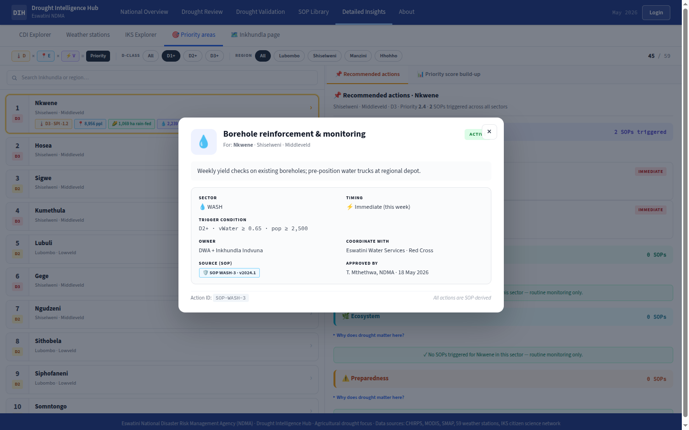
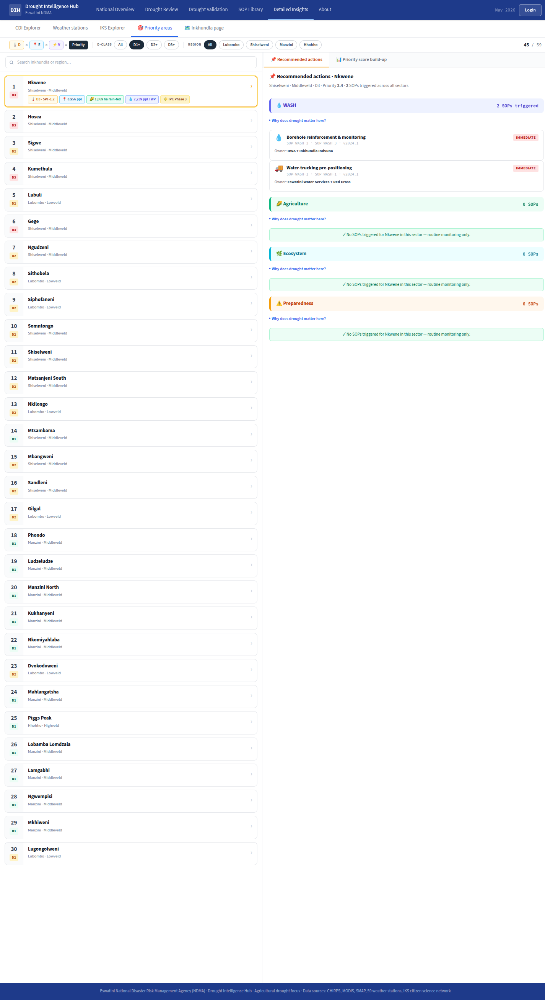

# Feature Design Document

> **Purpose**: Use this template when planning new features that require data model changes, API design, or architectural decisions. Complete this document BEFORE implementation begins. Claude can read this document for context during implementation.

---

## Feature: Recommended-actions panel in Priority Areas

**Task ID**: SOP-4
**Author**: DIH team
**Date**: 2026-06-12
**Status**: Draft

---

<!-- prototype-screens -->
### Prototype reference

Screens captured from the prototype (`index.html`) that this spec implements:


*Recommended-action detail modal (sector, timing chip, resources, status).*


*Recommended-actions panel alongside the priority ranking.*

<!-- /prototype-screens -->

## 1. Context & Problem Statement

Describe the current state and why this change is needed.

```
Currently:
- PA-3 delivers the /priority-areas page with a ranked list, a priority choropleth,
  and a right-hand panel that (so far) only shows the score build-up
  (drought / exposure / vulnerability).
- SOP-2 (backend) exposes triggered Standard Operating Procedures per Inkhundla at
  GET /api/v1/recommended-actions?administration_id=<id>.
- SOP-3 delivers an SOP detail view (link target).
- There is NO place in the UI that tells a user "for THIS Inkhundla, here are the
  actions you should take now" — the SOP-2 data is invisible.

Goal:
- Add a "Recommended actions" tab to the existing PA-3 right-hand panel.
- When an Inkhundla is selected (from list OR map, via PA-3's existing selection),
  fetch GET /api/v1/recommended-actions?administration_id=<id> and show the
  triggered SOPs with timing chips (immediate / this month / monitor), owner,
  resources, and a link to the SOP detail page (SOP-3).
- Provide a clear empty state when no SOPs are triggered for the selection.
- Refetch on selection change WITHOUT duplicate requests on rapid selection.
```

---

## 2. Requirements

### User Acceptance Criteria
- [ ] When an Inkhundla is selected in PA-3, a **"Recommended actions"** tab in the right panel shows the triggered SOPs for that Inkhundla.
- [ ] Each SOP row shows a **timing chip** (immediate / this month / monitor), the **owner**, the **resources** needed, and a **link to the SOP detail** page (SOP-3 target).
- [ ] When no SOPs are triggered for the selected Inkhundla, a **clear empty state** is shown (not a blank panel or spinner).
- [ ] Switching selection updates the panel to the newly selected Inkhundla's actions.

### Technical Acceptance Criteria
- [ ] Data fetched via the **`api()` wrapper** to `GET /api/v1/recommended-actions?administration_id=<id>` (from SOP-2).
- [ ] Panel **refetches on selection change** but issues **no duplicate requests** for the same selection (and handles rapid selection without races/stale renders).
- [ ] **Timing-chip colours match the SOP library badges** (single source — UI-1 / SOP library tokens).
- [ ] **Jest** smoke tests cover both the **populated** and **empty** states.
- [ ] Loading and error states are shown within the tab.

---

## 3. Data Model Changes

**N/A — consumes existing APIs.** Frontend-only feature. No new Django models, no schema
changes, no migrations. Triggered-SOP data comes from the existing SOP-2 endpoint
`GET /api/v1/recommended-actions?administration_id=<id>`. The detail link points at the
SOP-3 route.

### New Models

```python
# N/A — no backend models created or modified by SOP-4.
```

### Modified Models

| Model | Change | Reason |
|-------|--------|--------|
| _N/A_ | _No backend model changes_ | Frontend consumes existing SOP-2 API |

### Migration Strategy

```python
# N/A — no migration. Frontend-only feature consuming existing APIs.
```

---

## 4. API Contract

**This feature introduces NO new endpoints.** It consumes one **existing** endpoint
(owned by SOP-2) and links to one **existing** route (owned by SOP-3).

### Endpoints

| Method | URL | Purpose | Auth |
|--------|-----|---------|------|
| GET | `/api/v1/recommended-actions?administration_id=<id>` | Consumed (SOP-2). Returns the SOPs triggered for the selected Inkhundla. | Required |

### Request/Response Examples

```json
// GET /api/v1/recommended-actions?administration_id=1621199   (Nkwene)
// (no request body; auth via JWT in session cookie, attached by api())

// Response 200 — SOP-2's concluded response shape (SOP-2 §4)
{
  "administration_id": 1621199,
  "administration_name": "Nkwene",
  "drought_category": 4,
  "evaluated_sops": 7,
  "recommended": [
    {
      "id": 2,
      "code": "SOP-WASH-1",
      "title": "Water-trucking pre-positioning",
      "sector": 1,
      "sector_label": "WASH",
      "timing": "immediate",
      "owner": "Eswatini Water Services + Red Cross",
      "resources": "3 trucks · 40k L tank · driver crews",
      "trigger_summary": "D3+ · vWater >= 0.75"
    }
  ]
}
```

> SOP-2 returns `{ administration_id, administration_name, drought_category, evaluated_sops, recommended:[...] }`
> (confirmed — SOP-2 §4); the panel reads **`payload.recommended`** (not `.data`). Per SOP: `id` (int), `code`,
> `title`, `sector`/`sector_label`, `timing`, `owner`, `resources`, `trigger_summary`. **`resources` is a string**
> (e.g. "3 trucks · 40k L tank · driver crews"), not an array. SOP-2 returns **no `detail_url`**, so the panel
> builds the SOP-3 link as `/sops/{id}` from the integer `id`. `timing` ∈ `{immediate, thismonth}` (the SOP enum).

---

## 5. Decision Log

### D-1: Where the panel lives (and how it gets the selection)

**Options Considered**:
1. A standalone route/page for recommended actions.
2. A **tab inside the existing PA-3 right-hand panel**, driven by PA-3's selected Inkhundla.

**Decision**: **Tab inside the PA-3 right panel** (Option 2).

**Rationale**: The task scopes this as "recommended-actions panel **in** Priority Areas".
The selection already exists in PA-3 (`AppContext.activeAdm` / the page's selected
`administration_id`); reusing it avoids a second selection mechanism and keeps the build-up
and actions tabs side by side. SOP-4 therefore depends on PA-3 (panel host).

**Impact**: SOP-4 ships a `RecommendedActionsTab` client component mounted in PA-3's panel;
it reads the current `administration_id` from PA-3 (prop or `AppContext.activeAdm`).

---

### D-2: Refetch strategy without duplicate requests

**Options Considered**:
1. Fetch on every selection render — risks duplicate/stale requests on rapid clicking.
2. Fetch in a `useEffect` keyed on `administration_id`, guarded by a **debounce** + an
   **abort/ignore** flag, plus a small **in-memory cache** keyed by `administration_id`.

**Decision**: **Option 2** — `useEffect([administration_id])` with debounce + stale-guard +
per-id cache.

**Rationale**: Satisfies "refetch on selection without duplicate requests". The cache means
re-selecting an Inkhundla shows instantly with no network call; the stale-guard (ignore flag
set in the effect cleanup) prevents an earlier slow response from overwriting a newer one;
the debounce collapses rapid map/list clicks into one request. (Exact debounce window / cache
TTL is the Section 10 open question.)

**Impact**: One request per distinct, settled selection; instant re-display for cached ids.

---

### D-3: Timing-chip colour source

**Options Considered**:
1. Hard-code chip colours in SOP-4.
2. Reuse the **SOP library badge tokens** (UI-1 design tokens) so the chips match the SOP
   library and SOP-3 detail badges exactly.

**Decision**: **Option 2 — reuse SOP library badge tokens.**

**Rationale**: Tech AC requires chip colours to match the SOP library badges. A single token
source prevents drift between this panel, the SOP library, and SOP-3.

**Impact**: SOP-4 imports the same `--sop-timing-*` tokens (Section 6); no local colour constants.

---

## 6. Type/Constant Mappings

Timing value -> chip colour. Colours come from the **SOP library badge tokens (UI-1)** —
the same tokens the SOP library and SOP-3 detail use. Hex values below are indicative and
MUST be replaced by the token reference at implementation time.

> **UI-1 status (extracted 2026-06-12, UI-1 §10):** UI-1 tokens now have concrete values, but
> the SOP **timing/badge** colour scale is NOT among the sampled Figma design-system components —
> so SOP-1/SOP-3/SOP-4 propose the `--sop-timing-*` set as an addition to the UI-1 token source.
> The indicative hexes below reuse the legacy `DROUGHT_CATEGORY_COLOR` hues until the `--sop-timing-*` tokens are added (the drought palette itself stays legacy — UI-1 §10 decision).

| Frontend (timing) | SOP-2 value (SOP enum) | UI-1 token (intended) | Indicative hex | Label |
|-------------------|-----------------------|-----------------------|----------------|-------|
| `"immediate"` | `immediate` | `--sop-timing-immediate` | `#e60000` | Immediate |
| `"thismonth"` | `thismonth` | `--sop-timing-thismonth` | `#ffaa00` | This month |

> The SOP-2/SOP-1 `timing` enum is `{immediate, thismonth}` (confirmed — SOP-2 §4; the prototype has no "monitor"
> timing). Only triggered (active) SOPs appear in `recommended`, so every row carries one of these two values.

---

## 7. Compatibility & Migration

### Backward Compatibility
- [x] Existing API consumers unaffected — no endpoint changed; SOP-4 only reads SOP-2's endpoint.
- [x] Existing data preserved — frontend-only feature.
- [x] CLI tools still work — no backend touch.
- [x] PA-3 unaffected beyond adding one tab — the build-up tab and the rest of the page are unchanged.

### Seeder/CLI Compatibility
- [x] Existing seeders work — untouched.
- [ ] New seeder commands needed: **None** (SOP content seeded by SOP-1/SOP-2 backend).

---

## 8. Security Considerations

- [x] **Permission model defined**: the tab lives inside PA-3's `/priority-areas` route,
  already middleware-protected (authenticated only). No additional client route to protect.
  If SOP-2 restricts SOP visibility by role/ability, wrap the tab/actions in
  `<Can I="read" a="SOP">` using `UserContext.abilities` (CASL).
- [x] **Input validation specified**: the only user input is the selected `administration_id`,
  which originates from PA-3's known Inkhundla set (not free text). It is passed as a query
  param to `api()`; values are constrained to existing administration ids.
- [x] **No new attack vectors**: JWT attached server-side by `api()` (server-only module);
  read-only GET; no write path; no new endpoint. The SOP detail link targets an internal
  SOP-3 route (no open redirect).

---

## 9. Testing Strategy

| Test Type | Coverage |
|-----------|----------|
| Unit | Timing->colour mapper returns the correct SOP library token per timing value; payload normaliser (array vs `{data}` wrapper); cache key + stale-guard logic ignores an outdated in-flight response. |
| Integration (Jest + RTL smoke) | **Populated state**: with a mocked `api()` GET returning SOPs, the tab renders each SOP with its timing chip, owner, resources, and a detail link pointing at the SOP-3 route. **Empty state**: with a mocked GET returning `[]`, the clear empty state renders (no spinner, no rows). Plus: changing the selected `administration_id` triggers exactly one new request and re-selecting a cached id triggers none; loading spinner before data; error message on rejected `api()`. |
| E2E | Out of scope (no Cypress/Playwright in repo); covered by Jest smoke tests per Tech AC. |

> `api()` is mocked; selection driven via prop/`AppContext` test wrapper.
> Run with `yarn test`; lint `yarn lint`; build `yarn build`.

---

## 10. Open Questions

- [x] **Debounce / caching — DECIDED: 200 ms debounce + page-session in-memory cache keyed by `administration_id`.** A 200 ms debounce collapses rapid map/list clicks into one request; results cache for the page session (no TTL — the data is stable within a session). The cache clears on a full page reload; since publishing a new bulletin is rare and reloads the page, no explicit publish-invalidation is needed in v1 (SOP-2's own server cache already keys on the published publication id).
- [x] **SOP-2 response shape — RESOLVED (SOP-2 §4):** `{ administration_id, administration_name, drought_category, evaluated_sops, recommended:[...] }`; the panel reads `recommended`. `resources` is a **string** (not an array); `timing` ∈ `{immediate, thismonth}`. (§4 example + §6 updated.)
- [x] **Detail link — RESOLVED:** SOP-2 returns **no `detail_url`**; SOP-4 builds `/sops/{id}` from the integer `id`. The SOP-3 detail route is `/sops/[id]` (integer pk).
- [x] **Ability-scoping — RESOLVED: none needed.** `recommended` lists only **active** SOPs (SOP-1 makes active SOPs public-readable, Q4); the tab lives inside the authenticated PA-3 page, so no `<Can>` wrapping is required.

---

### Findings (2026-06-12, verified against hub `eswatini.topojson`)
- **Corrected**: the §4 example URL used `administration_id=1253002`, which does not exist in the topojson. Replaced with **Nkwene** (`1621199`) — a real SOP-WASH-1 trigger, consistent with SOP-2. The response-body SOP ids/titles are illustrative (real ids come from SOP-1's DB).

---

## 11. References

- Related tasks: **PA-3** (host page — this tab lives in its right panel), **SOP-2**
  (`GET /api/v1/recommended-actions` endpoint), **SOP-3** (SOP detail page — link target),
  **SOP-1** (SOP library/seed), **UI-1** (design tokens — SOP badge colours).
- External docs: `docs/specs/notes.md` (hub conventions, D-3 SOP role mapping);
  `docs/templates/FEATURE_DESIGN_TEMPLATE.md`.
- Prior art: `frontend/src/app/publications/page.js` (client `useEffect`+`api()` pattern),
  `frontend/src/lib/api.js`, `frontend/src/context/AppContextProvider.js`
  (`activeAdm`), `frontend/src/components/Can.js`, `frontend/src/middleware.js`,
  `docs/specs/PA-3_priority_areas_page.md` (panel host).

---

## Approval

| Role | Name | Date | Status |
|------|------|------|--------|
| Developer | | | |
| Tech Lead | | | |
| Product | | | |
