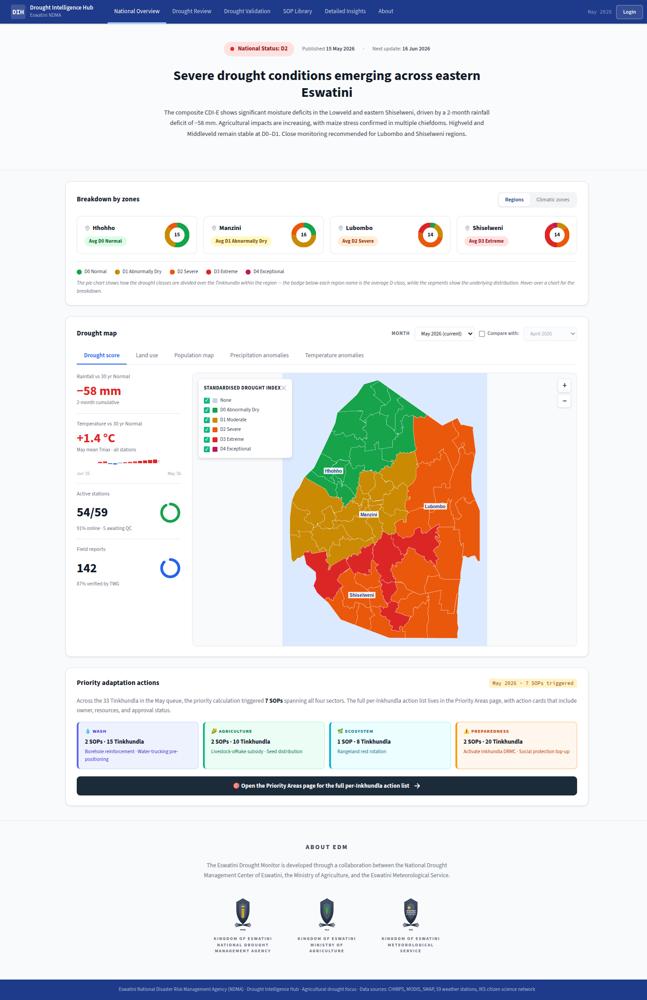

# Feature Design Document: Design system foundation + app shell from Figma

**Task ID**: UI-1
**Author**: DIH team
**Date**: 2026-06-12
**Status**: Draft

---

<!-- prototype-screens -->
### Prototype reference

Screens captured from the prototype (`index.html`) that this spec implements:


*App shell, top navigation and design tokens (brand, radius, neutral/semantic ramps) in context.*

<!-- /prototype-screens -->

## Feature: Design system foundation + app shell from Figma

Estimate: **18h**. Frontend-only. Stack: Next.js 14 (App Router) + Ant Design 5 (`ConfigProvider`) + Tailwind CSS + CSS custom properties.

---

## 1. Context & Problem Statement

```
Currently (3-layer styling reality, no single token source):
- LAYER 1 — Ant Design 5 theme: a ConfigProvider theme object is hard-coded
  inline in frontend/src/app/layout.js. token.colorPrimary = "#3E5EB9",
  colorLink = "#3E5EB9", borderRadius = 0, plus per-component overrides for
  Form, Tabs (inkBarColor/itemSelectedColor "#3E5EB9", itemColor "#3E4958"),
  Table (cellPaddingInline 8 / cellPaddingBlock 4) and Descriptions
  (labelBg "#f1f5f9", titleColor "#020618").
- LAYER 2 — Tailwind: frontend/tailwind.config.js hard-codes
  colors.primary = "#3e5eb9" (note: lower-case duplicate of the Ant value),
  plus background/foreground bound to CSS vars, custom maxWidth and container.
- LAYER 3 — CSS variables: frontend/src/app/globals.css :root defines
  --primary-color #3e5eb9, --background, --foreground, --table-border #e5e7eb,
  --white-color, font-family bindings (--font-inter / --font-roboto /
  --font-roboto-mono from src/app/fonts.js), and many hard-coded ".edh-row"
  D-class background hex literals (#b9f8cf, #ffff00, #fbd47f, #ffaa00,
  #e60000, #730000, #ffffff) duplicated as Tailwind arbitrary-value classes.
- LAYER 4 (data, not theme) — D-class colour scale: frontend/src/static/config.js
  DROUGHT_CATEGORY_COLOR maps DROUGHT_CATEGORY_VALUE {normal:0, d0:1, d1:2,
  d2:3, d3:4, d4:5, none:-9999} to the SAME six drought hex values, plus
  DROUGHT_CATEGORY_LABEL. This is a FOURTH place the band palette lives.

Pain points:
- The brand blue "#3E5EB9"/"#3e5eb9" is written by hand in >=4 files; the six
  drought-band hexes live in BOTH globals.css AND static/config.js (and the
  Tailwind arbitrary classes). A palette change means hand-editing every layer.
- There is NO single token source. Spacing, radius, neutral greys and band
  colours drift between Ant components, Tailwind utilities and raw CSS.
- Shared primitives (nav, headers, role badge, tables, status pills, D-class
  badges, cards, buttons, forms, modals) are styled ad-hoc per component
  (see src/components/: Navbar.js, DashboardLayout.js, Footer.js, Buttons/,
  Forms/, Modals/, ValidationTable.js, ReviewList.js) with inline hexes.

Goal:
- Introduce ONE token source of truth (a plain JS/JSON module) that feeds all
  three styling layers (Ant theme object + tailwind.config + CSS vars) so brand,
  neutral, semantic and drought-band scales are defined exactly once.
- Restyle the global app shell (nav, page headers, role badge) and shared
  primitives (tables, status pills, D-class badges, cards, buttons, forms,
  modals) to consume tokens only — no new inline hexes.
- Achieve this with ZERO functional regression on existing pages.
```

---

## 2. Requirements

### User Acceptance Criteria
- [ ] All pages (public: `/`, `/browse`, `/compare`, `/about`; protected: `/profile`, `/publications`, `/reviews`, `/settings`) share the new global navigation and page header.
- [ ] Role badge (admin / reviewer) renders consistently in the shell across every authenticated page.
- [ ] Status pills (publication status: In Review / In Validation / Published) and D-class band badges (normal, D0–D4, No Data) are visually consistent everywhere they appear.
- [ ] Tables, cards, buttons, forms and modals share one consistent look.
- [ ] No functional regression: every existing flow (browse, compare, login, publication validation, review submission, settings) works exactly as before.

### Technical Acceptance Criteria
- [ ] Design tokens are defined exactly ONCE in a single source module and consumed by the Ant theme object, `tailwind.config.js`, and CSS variables — no token value is hand-written in more than one place.
- [ ] The D-class / drought-band colour scale and any status-band colours are centralised in the token source; `DROUGHT_CATEGORY_COLOR` in `static/config.js` derives from tokens (no independent hex literals).
- [ ] Shell + shared primitive components consume tokens only (via Ant theme, Tailwind classes, or CSS vars) — zero new inline hex literals introduced.
- [ ] Jest smoke tests green (`yarn test`); `yarn lint` and `yarn build` pass.
- [ ] A token reference (name → Ant token → Tailwind key → CSS var) is documented.

---

## 3. Data Model Changes

**N/A — no backend schema change.** This is a frontend-only task; no Django models, migrations, serializers or API endpoints are added or modified.

### New Models

N/A — no backend schema change.

### Modified Models

N/A — no backend schema change.

### Migration Strategy

N/A — no backend schema change. (Frontend-only "migration" is the mechanical token extraction described in Section 7; it touches only frontend styling files.)

---

## 4. API Contract

**N/A — no API change.** UI-1 adds no endpoints and changes no request/response contracts. The frontend continues to call existing endpoints via `frontend/src/lib/api.js` (`api(method, url, payload?)`, base `/api/v1`). The only data-side touch is that `static/config.js::DROUGHT_CATEGORY_COLOR` is refactored to read its hexes from the token source — its exported shape (`{0..5, -9999} → hex string`) is unchanged, so every consumer keeps working.

### Endpoints

| Method | URL | Purpose | Auth |
|--------|-----|---------|------|
| — | — | N/A — no endpoints added or changed | — |

### Request/Response Examples

N/A — no API change.

---

## 5. Decision Log

### D-1: Single token source feeding all three styling layers

**Options Considered**:
1. **Ant-theme-first** — keep the theme object in `layout.js` as the source; have Tailwind/CSS read from it. Rejected: Ant theme is a runtime React object, not importable into the build-time `tailwind.config.js` or static CSS cleanly; couples styling to a client provider.
2. **CSS-vars-first** — declare everything in `globals.css` `:root` and have Ant/Tailwind reference `var(--x)`. Rejected: Ant 5 theme tokens (radius, spacing numbers, component overrides) are JS numbers/strings, not CSS-var-friendly; `tailwind.config.js` cannot resolve runtime CSS vars for values like spacing scales used in JS.
3. **Plain token module (chosen)** — a framework-agnostic `frontend/src/tokens/tokens.js` (mirrored as `tokens.json` for non-JS consumers) exports the raw primitives (brand, neutral, semantic, drought-band scales, spacing, radius, font families). Three thin adapters consume it:
   - `frontend/src/tokens/antTheme.js` builds the Ant `ConfigProvider` theme object (imported by `layout.js`).
   - `tailwind.config.js` `require()`s `tokens.js` and maps values into `theme.extend.colors` / `spacing` / `borderRadius`.
   - `frontend/src/tokens/cssVars.js` (or a generated `tokens.css`) emits the `:root` custom properties imported by `globals.css`.

**Decision**: Option 3 — a plain, dependency-free token module is the single source; Ant theme, Tailwind config, and CSS vars are all derived adapters.

**Rationale**: Only a plain JS/JSON module is importable by all three consumers — a client React provider (Ant), a Node build-time config (Tailwind, which uses CommonJS `require`), and static CSS (via a generated `:root` block). It keeps a single edit point and satisfies the "tokens defined once" Tech AC. `tokens.js` stays CJS-compatible (or dual-export) so `tailwind.config.js` can `require` it.

**Impact**: New `frontend/src/tokens/` dir; `layout.js`, `tailwind.config.js`, `globals.css`, and `static/config.js` all change from holding literals to consuming the token module.

### D-2: Drought-band scale centralised; `DROUGHT_CATEGORY_COLOR` derives from tokens

**Options Considered**:
1. Leave `DROUGHT_CATEGORY_COLOR` as-is (data layer) and only theme the shell. Rejected: leaves the band palette duplicated in `globals.css` `.edh-row` rules and Tailwind arbitrary classes — fails the "D-class/band colour scales centralised" Tech AC.
2. Move band colours into tokens and have `static/config.js` import them.

**Decision**: Option 2 — define `drought.normal / d0 / d1 / d2 / d3 / d4 / none` in `tokens.js`; `DROUGHT_CATEGORY_COLOR` maps `DROUGHT_CATEGORY_VALUE` ints onto those tokens; the `.edh-row` CSS and the D-class `<Badge>` primitive read the same tokens (via CSS vars / Tailwind keys).

**Rationale**: One palette, one edit point, identical hexes across map legend, table row backgrounds, and badges. Exported shape of `DROUGHT_CATEGORY_COLOR` is preserved for backward compatibility.

**Impact**: `static/config.js`, `globals.css` `.edh-row` block, and the new D-class badge primitive all consume the band tokens.

### D-3: Restyle in place vs. new primitive layer

**Decision**: Add a thin shared-primitives layer under `frontend/src/components/` (`StatusPill`, `DClassBadge`, `RoleBadge`, plus token-driven Card/Button/Form/Modal wrappers where helpful), and refactor the shell components (`Navbar.js`, `DashboardLayout.js`, page headers, `Footer.js`) to use them. Existing call sites swap inline styling for these primitives.

**Rationale**: Centralises the badge/pill/table look so "consistent badges/tables" is enforced structurally, not by convention, while keeping diffs reviewable per component.

**Impact**: New primitive components; shell + table/list components updated to use them. No behavioural change.

### D-4: Figma-extracted token values (extraction done 2026-06-12)

**Context**: Figma access restored; tokens harvested from node `3154:28259` + the Assets design-system page (see Section 10 for node IDs and findings).

**Decision**: Seed tokens with the **Figma values**, not just the current code values, for the dimensions where Figma intentionally differs:
- `color.brand.primary` = `#3E5EB9` (confirmed unchanged) + new `brand.dark #1A274E`, `brand.muted #485D92`.
- `radius` scale `{ sm:4, md:8, pill:9999 }` — replaces the current single `0` (Figma uses rounded corners; buttons are pills).
- Neutral ramp (`#020617 / #344054 / #475467 / #606060 / #667085`), input border `#D0D5DD`, brand tint `#ECEFF8`, surface `#F8F8F8`.
- Semantic success ramp `#12B76A / #027A48 / #ECFDF3`.

**Rationale**: The structural seed (D-1) and the Figma value adoption are split into two passes (Section 7) so regressions stay isolated: pass 1 moves values without changing them; pass 2 swaps in the Figma radius/neutral/semantic values per component, reviewed visually.

**Impact**: `tokens.js` ships Figma values; the radius change (0 → 4/8/pill) is the most visible diff and is rolled out component-by-component. **The drought-band palette is NOT changed** — the legacy `DROUGHT_CATEGORY_COLOR` values are retained (decision, Section 10); UI-1 only re-homes them into the token module.

---

## 6. Type/Constant Mappings

Token name → Ant theme token → Tailwind key → CSS var. (Token source: `frontend/src/tokens/tokens.js`.)

| Token name | Ant token | Tailwind key | CSS var |
|-----------|-----------|--------------|---------|
| `color.brand.primary` (`#3E5EB9`) | `token.colorPrimary`, `token.colorLink` | `colors.primary` | `--primary-color` |
| `color.neutral.bg` (`#ffffff`) | `token.colorBgBase` | `colors.background` | `--background` |
| `color.neutral.fg` (`#171717`) | `token.colorTextBase` | `colors.foreground` | `--foreground` |
| `color.neutral.white` (`#ffffff`) | — | `colors.white` | `--white-color` |
| `color.border.table` (`#e5e7eb`) | `components.Table.borderColor` | `colors.tableBorder` | `--table-border` |
| `color.text.muted` (`#3E4958`) | `components.Tabs.itemColor` | `colors.textMuted` | `--text-muted` |
| `color.surface.labelBg` (`#f1f5f9`) | `components.Descriptions.labelBg` | `colors.labelBg` | `--label-bg` |
| `color.text.heading` (`#020618`) | `components.Descriptions.titleColor` | `colors.heading` | `--heading` |
| `radius.sm` (`4` — Figma inputs/badges; was `0`) | `token.borderRadius` | `borderRadius.DEFAULT` | `--radius-sm` |
| `radius.md` (`8` — Figma cards) | `components.Card.borderRadius` | `borderRadius.md` | `--radius-md` |
| `radius.pill` (`9999` — Figma buttons/pills/dots) | `token.borderRadiusLG`/Button shape | `borderRadius.full` | `--radius-pill` |
| `color.brand.dark` (`#1A274E`) | — | `colors.brandDark` | `--brand-dark` |
| `color.brand.muted` (`#485D92`) | — | `colors.brandMuted` | `--brand-muted` |
| `color.semantic.success` (`#12B76A`) | `token.colorSuccess` | `colors.success` | `--success` |
| `color.semantic.successFg` (`#027A48`) | — | `colors.successFg` | `--success-fg` |
| `color.semantic.successBg` (`#ECFDF3`) | — | `colors.successBg` | `--success-bg` |
| `color.border.input` (`#D0D5DD` — Figma fields) | `components.Input.colorBorder` | `colors.inputBorder` | `--input-border` |
| `color.surface.tint` (`#ECEFF8` — brand tint) | — | `colors.brandTint` | `--brand-tint` |
| `space.table.inline` (`8`) | `components.Table.cellPaddingInline` | `spacing.tableX` | `--space-table-x` |
| `space.table.block` (`4`) | `components.Table.cellPaddingBlock` | `spacing.tableY` | `--space-table-y` |
| `space.form.itemMb` (`16`) | `components.Form.itemMarginBottom` | `spacing.formItem` | `--space-form-item` |
| `font.heading` (Inter) | `token.fontFamily` (via inherit) | `fontFamily.heading` | `--font-inter` |
| `font.body` (Roboto) | — | `fontFamily.body` | `--font-roboto` |
| `font.mono` (Roboto Mono) | `token.fontFamilyCode` | `fontFamily.mono` | `--font-roboto-mono` |
| `drought.normal` (`#b9f8cf`) | — (badge via Tailwind/CSS) | `colors.drought.normal` | `--drought-normal` |
| `drought.d0` (`#ffff00`) | — | `colors.drought.d0` | `--drought-d0` |
| `drought.d1` (`#fbd47f`) | — | `colors.drought.d1` | `--drought-d1` |
| `drought.d2` (`#ffaa00`) | — | `colors.drought.d2` | `--drought-d2` |
| `drought.d3` (`#e60000`) | — | `colors.drought.d3` | `--drought-d3` |
| `drought.d4` (`#730000`) | — | `colors.drought.d4` | `--drought-d4` |
| `drought.none` (`#ffffff`) | — | `colors.drought.none` | `--drought-none` |
| `status.inReview` (orange) | — (Tag color prop) | `colors.status.inReview` | `--status-in-review` |
| `status.inValidation` (blue) | — | `colors.status.inValidation` | `--status-in-validation` |
| `status.published` (green) | — | `colors.status.published` | `--status-published` |

Note: `DROUGHT_CATEGORY_COLOR` in `static/config.js` maps `DROUGHT_CATEGORY_VALUE` ints (`0,1,2,3,4,5,-9999`) onto the `drought.*` tokens above, preserving its current exported shape. The `drought.*` hexes here are the **retained legacy values** (not the Figma palette) per the Section 10 decision — UI-1 re-homes them without changing them.

---

## 7. Compatibility & Migration

### Two-pass migration (structural seed, then Figma value adoption)
- [ ] **Pass 1 — pixel-equivalent structural seed**: tokens are seeded with the EXACT current values (`#3E5EB9`, `borderRadius:0`, table paddings 8/4, form mb 16, the six drought hexes, `#e5e7eb`, `#f1f5f9`, `#020618`, `#3E4958`). This commit changes WHERE values live, not WHAT they are — existing pages render identically (snapshot baseline taken here).
- [ ] **Pass 2 — Figma value adoption** (per decision D-4): swap in the Figma-extracted values component-by-component — radius `0 → {4,8,pill}`, neutral/semantic ramps, input border `#D0D5DD`. Each component reviewed visually against Figma; snapshots updated intentionally. The **drought-band palette is NOT touched** — the legacy `DROUGHT_CATEGORY_COLOR` values are retained by decision (Section 10).

### Backward Compatibility (zero functional regression is the hard constraint)
- [ ] `DROUGHT_CATEGORY_COLOR` keeps its exported object shape and key set; only its internal source changes (literals → tokens). All consumers (`Map/CDIMap` legend, `ValidationTable.js`, `ReviewList.js`, `.edh-row` CSS) keep working unchanged.
- [ ] The Ant `ConfigProvider` theme object passed in `layout.js` is structurally identical (same tokens, same `components` overrides) — just imported from `tokens/antTheme.js` instead of inlined.
- [ ] Tailwind `colors.primary`, `background`, `foreground`, `maxWidth`, and `container` config preserved (now token-derived); no existing utility class breaks.
- [ ] No route, auth (`middleware.js` protected paths), CASL (`Can.js`), or context (`AppContext`/`UserContext`) behaviour is touched.
- [ ] Existing CLI/scripts unaffected — frontend-only.


### Seeder/CLI Compatibility
- [ ] N/A — no backend seeders or CLI involved. `yarn lint`, `yarn test`, `yarn build` remain the gate.

---

## 8. Security Considerations

- [ ] No new attack vectors: change is presentational (colours, spacing, component wrappers). No new data fetching, auth, or user input handling.
- [ ] No secrets touched; tokens contain only design constants (hex, px, font names) and are safe to commit.
- [ ] Role badge renders existing `UserContext.role` only; it adds no new authorization logic and does not gate any action (CASL/`middleware.js` remain the sole authority).
- [ ] Input validation unchanged — forms keep their existing Ant `Form` rules; only styling is restyled.

---

## 9. Testing Strategy

| Test Type | Coverage |
|-----------|----------|
| Unit (Jest 29 + RTL) | Token module: assert `tokens.js` exports expected keys and that `antTheme.js`, Tailwind mapping, and `cssVars.js` resolve the same primitive values (single-source assertion). Assert `DROUGHT_CATEGORY_COLOR` still maps each `DROUGHT_CATEGORY_VALUE` to the matching `drought.*` token. |
| Smoke (Jest 29 + RTL) | Render the shell (`Navbar`, `DashboardLayout`, page header, `Footer`) and each shared primitive (`StatusPill`, `DClassBadge`, `RoleBadge`, Card/Button/Form/Modal wrappers) — assert they mount without crashing and apply token-derived classes/vars. Extend existing pattern in `src/app/__tests__/page.test.js`. Target: `yarn test` green. |
| Visual / Snapshot | Jest snapshot tests for each shared primitive and the shell header/nav to catch unintended visual drift; first-pass snapshots are taken AFTER the pixel-equivalent token seed so the baseline equals today's look. Optionally a Playwright screenshot pass on `/browse` and `/publications` to confirm no visible regression. |
| Integration / E2E | Manual smoke of core flows after restyle: browse map+legend, compare slider, login, publication validation table, review submission, settings — confirm no functional regression (the User AC). `yarn build` must pass (catches Tailwind/CSS/import errors). |

---

## 10. Open Questions

**Figma access RESTORED** (token refreshed 2026-06-12) and design tokens were extracted from the high-fidelity frames — node `3154:28259` ("National overview") plus the **Assets** design-system page (Button base `3019:7536`, _Badge base `3045:53063`, Header navigation `3028:14907`, Drought class & confidence `3061:6816`, Fields `3019:7260`, Cards `3019:7547`, Login `3347:29592`, Legend `3116:28583`). The previously-blocked questions are resolved below; remaining items are narrowed.

**Resolved by extraction:**
- **Brand primary is UNCHANGED** — `#3E5EB9` recurs across the badge, header nav, field focus ring and confidence chips. Seed `color.brand.primary` as-is. (A darker navy `#1A274E` and a secondary `#485D92` also appear — candidates for `brand.dark` / `brand.muted`.)
- **Border radius is NO LONGER `0`** — Figma uses a rounded scale: inputs/badges/chips **4px**, cards **8px** (some 16px), **buttons are pill-shaped (~50px ≈ full)**, status pills **16px**, avatars/status dots **full**. → `radius` becomes a scale `{ sm: 4, md: 8, pill: 9999 }` (was a single `0`). This is a deliberate value change — see the Section 7 reconciliation pass.
- **Role/status badge spec** — `_Badge base` = brand `#3E5EB9` fill, white label, light-brand border `#7E93D0`, 16px radius, Inter 14. The `RoleBadge` / `StatusPill` primitives adopt this.
- **Neutral & semantic ramps have real values** — heading `#020617`; body `#344054` / `#475467`; muted `#606060` / `#667085`; borders `#D0D5DD`; brand tint `#ECEFF8`; surface `#F8F8F8`. Semantic success ramp: `#12B76A` / text `#027A48` / bg `#ECFDF3`. (Ignore Figma's `#9747FF` / `#8A38F5` / `#6941C6` — those are editor component-set boundaries, not design tokens.)
- **Typography** — Inter is the dominant heading font (700 @ 24/28/40) and matches the code; keep **Inter** (body/heading) + **Roboto Mono** (code). Scale observed: 10/12/14/16/20/24/28/40, weights 400/500/600/700.

**Decided:**
- [x] **Drought-band palette — KEEP the legacy `DROUGHT_CATEGORY_COLOR`** (decision 2026-06-12). The D-class category colours (`#b9f8cf, #ffff00, #fbd47f, #ffaa00, #e60000, #730000`, `none → #ffffff`) are pre-existing hub system colours and are **retained unchanged**. The warmer Figma drought palette (candidates `#FFCD37/#F39C12/#C23F01/#B10D0B`, SPI scale `#8B0286…`) is **NOT** adopted. Figma is the source of truth for the other tokens (brand, radius, neutral, semantic) but **not** the drought categories. UI-1 only re-homes `DROUGHT_CATEGORY_COLOR` into the token module (§6 `drought.*`) without changing its values; the same legacy palette is used in the notebooks.

**Still open (narrowed):**
- [x] **Fonts — DECIDED: standardize on Inter** (+ Roboto Mono for code). The Source Sans Pro / Public Sans in some imported Assets components are **not** intended brand fonts (Inter is already the code's primary and the Figma's dominant heading font); the token set ships Inter only.
- [x] **Semantic set — DECIDED: define the full ramp now.** `success #12B76A` (from Figma) plus `warning`, `error`, `info` seeded from Ant Design 5 defaults (`#FAAD14`, `#FF4D4F`, `#1677FF`) until Figma specifies them — all as UI-1 tokens. Only success was sampled from Figma; the other three use Ant defaults as a safe, themeable starting point.

---

## 11. References

- Template: `/home/iwan/Akvo/Eswatini/eswa-proto_2.0/docs/templates/FEATURE_DESIGN_TEMPLATE.md`
- Conventions: `/home/iwan/Akvo/Eswatini/eswa-proto_2.0/docs/specs/notes.md` (Frontend conventions: Ant `ConfigProvider` + Tailwind + CSS vars; `DROUGHT_CATEGORY_COLOR`)
- Current styling sources:
  - `/home/iwan/Akvo/eswatini-droughtmap-hub/frontend/src/app/layout.js` (Ant theme block)
  - `/home/iwan/Akvo/eswatini-droughtmap-hub/frontend/src/app/globals.css` (CSS vars + `.edh-row` band hexes)
  - `/home/iwan/Akvo/eswatini-droughtmap-hub/frontend/tailwind.config.js` (`colors.primary`)
  - `/home/iwan/Akvo/eswatini-droughtmap-hub/frontend/src/static/config.js` (`DROUGHT_CATEGORY_COLOR`, `DROUGHT_CATEGORY_VALUE`, `DROUGHT_CATEGORY_LABEL`)
  - `/home/iwan/Akvo/eswatini-droughtmap-hub/frontend/src/app/fonts.js` (Inter / Roboto / Roboto Mono)
- Shell + primitives to restyle: `frontend/src/components/` (`Navbar.js`, `DashboardLayout.js`, `Footer.js`, `Buttons/`, `Forms/`, `Modals/`, `ValidationTable.js`, `ReviewList.js`)
- New files (proposed): `frontend/src/tokens/tokens.js`, `frontend/src/tokens/tokens.json`, `frontend/src/tokens/antTheme.js`, `frontend/src/tokens/cssVars.js`, `frontend/src/components/StatusPill.js`, `frontend/src/components/DClassBadge.js`, `frontend/src/components/RoleBadge.js`, `frontend/docs/design-tokens.md` (token reference)
- Figma (tokens extracted 2026-06-12): https://www.figma.com/design/gtNfp5n7NawbYW5u8cPrpT/Eswatini--Wireframes?node-id=3154-28259
  - Harvested nodes — `3154:28259` National overview; Assets page: Button base `3019:7536`, _Badge base `3045:53063`, Header navigation `3028:14907`, Drought class & confidence `3061:6816`, Fields `3019:7260`, Cards `3019:7547`, Login `3347:29592`, Legend `3116:28583` / Chart Legends `3110:36773`
  - Note: file has NO published Figma styles or variables (not Enterprise) — tokens were read from layer fills / text styles / corner radii directly
- Tests: `frontend/jest.config.js`, `frontend/src/app/__tests__/page.test.js`

---

## Approval

| Role | Name | Date | Status |
|------|------|------|--------|
| Developer | | | |
| Tech Lead | | | |
| Product | | | |
