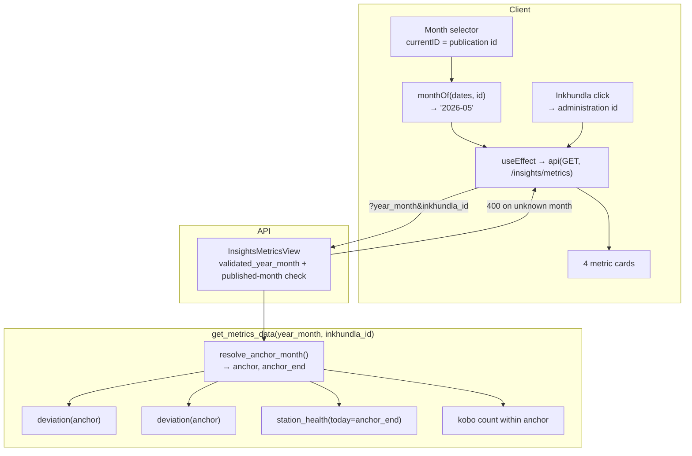

# Feature Design: KPI Month Anchoring

**Task ID**: KPI-1
**Author**: Iwan Firmawan
**Date**: 2026-09-03
**Status**: Implemented and complete — every National Overview KPI and every Weather
Explorer card anchors to the reviewed month (2026-09-04, 1123 backend + 361 frontend tests
green). No open questions.
**Surfaces**: Track 1 National Overview (`DroughtMapSection`), Track 3 Weather Station Explorer (`WeatherTab`)

---

## 1. Context & Problem Statement

Two public surfaces present monthly figures that are not about the month they appear to
describe.

### 1a. National Overview KPI cards

The four cards beside the drought map are served by `get_metrics_data()`
([services.py:341](backend/api/v1/v1_insights/services.py#L341)), which anchors every
figure on `timezone.now()`. Measured on 2026-09-03, with the latest published publication
at **2026-05** and the map rendering May:

| Card | Value served | Actually describes |
|---|---|---|
| Precipitation vs 30-yr normal | −32.3 mm, note "Sep 2026 deviation" | Sep 2026 — **3 days** of observations, differenced against a whole-month normal |
| Temperature vs 30 yr Normal | −2.1 °C, note "Sep 2026" | the same 3-day partial month |
| Active stations | 0/4 | station health at this instant |
| Field reports | 18 | rolling 30 days ending today |

Four cards, four different time anchors, none of them the reviewed month.

Two mechanisms produce this:

- The window is built from `now` — `to_period = now.strftime("%Y-%m")`
  ([services.py:404](backend/api/v1/v1_insights/services.py#L404)) — and is never clipped
  to a complete month, so a partial month becomes the headline and reads as a sharp
  rainfall deficit that is an artefact of the calendar. Any card built this way shows a
  deficit around the 3rd of every month, whatever the weather did.
- `_latest_value()` ([services.py:42](backend/api/v1/v1_insights/services.py#L42)) walks
  the series backwards to the newest non-null point, while `month_note` is built from
  `now` regardless. The note and the number can therefore name different months with
  nothing signalling the mismatch.

The month selector beside the map (`currentID` in
[DroughtMapSection.js:73](frontend/src/components/NationalOverview/DroughtMapSection.js#L73))
drives the map and the layer payloads but never reaches `/insights/metrics`. Changing the
month repaints the map and leaves all four cards untouched.

### 1b. Weather Explorer 12-month precipitation

The card reports **3.8 mm** for Ngwempisi while the chart directly beneath it shows CHIRPS
bars summing **1161 mm** and a 30-year average near 900 mm/yr.

The card's arithmetic is correct: 3.8 mm is exactly the sum of the station series in the
same chart. The contradiction comes from three stacked causes:

1. `precipitation_12m` sums only `station.daily_values`
   ([services.py:416](backend/api/v1/v1_weather/services.py#L416)); the chart's dominant
   bars are `precipitation_satellite_monthly`, a different series.
2. The resolved station (MOTI) has its first record on 2026-05-26 — **5 months of
   history, not 12** — and `months_covered` is surfaced only as a hover hint.
3. MOTI resolves via `nearest_station_fallback`: a gauge from another region standing in
   for this Inkhundla. The card never says so.

The neighbouring cards have the same class of defect, each in its own way. "Total
precipitation last month" resolved to the latest month with *any* data, which on 2026-09-03
was **2026-09** — three days old. "Difference between station and satellite" walked back to
the latest month where both sides happened to exist. Both are periods *discovered from the
data*, so they differ per Inkhundla, and no two cards on the page necessarily describe the
same month.

### Goal

```
Currently:
- Four KPI cards each derive their own period from timezone.now()
- The map's month selector reaches the map but not the cards
- A partial current month is reported as a completed observation
- A 12-month card sums a 5-month gauge and contradicts the chart below it

Goal:
- Every figure names the period it covers
- All figures on one surface cover the same period
- That period is the reviewed (published) month, driven by the map's selector
```

---

## 2. Requirements

### Functional — National Overview

- **FR-1** `/insights/metrics` accepts an optional `year_month` (`YYYY-MM`). Absent, it
  defaults to the **latest published publication's month** — never the current calendar
  month.
- **FR-1a** Accepted values are restricted to **published publication months**, the same
  set the map's selector is built from. A month outside that set is rejected rather than
  silently served, so the cards can never describe a period the map cannot show.
- **FR-2** All four cards are computed against that anchor month. No card may use a
  different anchor from its neighbours.
- **FR-3** The map's month selector drives the metrics request. Changing the month
  refetches; the cards and the map always agree.
- **FR-4** `year_month` and `inkhundla_id` compose — selecting an Inkhundla keeps the
  anchor month, and changing the month keeps the Inkhundla filter.
- **FR-5** Precipitation and temperature report the deviation **for the anchor month
  itself**. If that month has no observation the card renders its empty state; it must
  never fall back to a different month's value while labelled with the anchor.
- **FR-6** No partial month is ever reported. A month still in progress is treated as
  having no complete observation.
- **FR-7** Active stations reports the station's state **as of the last day of the anchor
  month**, reusing `station_health()`'s thresholds with its clock moved back — not live
  up/down status. Stations with no record by that date were not yet installed and leave
  the denominator (D-6).
- **FR-7a** `station_health()` must be clipped to its `today` argument before FR-7 can use
  it — see §5 D-5 and the evidence in §1 of the decision log.
- **FR-7b** `OFFLINE_AFTER_DAYS` stays at 2. Because that is shorter than a single missed
  ingestion run, "every station offline" is a routine state, not a national outage. The
  card must distinguish **stations not reporting** from **ingestion running behind**.
- **FR-8** Field reports counts submissions dated **within the anchor month**, replacing
  the rolling 30-day window. Its note names the month.
- **FR-9** Every card's note states the anchor month explicitly (e.g. "May 2026"),
  including the empty states.
- **FR-10** The PDF export carries the same anchor month as the on-screen section.
  *Satisfied by FR-9 with no extra work — see D-10.*

### Functional — Weather Explorer

- **FR-11** `precipitation_12m` headlines the **CHIRPS satellite total**, with the station
  gauge total as a secondary figure on the same card.
- **FR-12** Each figure is labelled with its source (satellite vs gauge) and its actual
  coverage in months. Short coverage is visible text, not a hover hint.
- **FR-12a** A total is shown when its series **spans the window start**, and withheld
  when the record begins inside the window — the gauge line then states coverage instead:
  "Station gauge: 5 of 12 months on record (since 26 May 2026), total not shown". The
  figure is suppressed, never the fact that a gauge exists: the chart below always plots
  the station series, so a card that silently omitted it would contradict the chart in the
  opposite direction. *Amended during design — see D-8.*
- **FR-13** The windowed cards end at the **reviewed month**, not at today and not at the
  last complete month, and stay pinned there independently of the charts' range picker.
  Where nothing is published the window falls back to the last complete month, so the tab
  stays useful rather than blanking every card at once. *Amended twice — during design (see
  D-8, §10 A-1) and again by D-13.*
- **FR-13a** The 12-month window starts **no earlier than the satellite archive reaches**.
  A nominal 12 months back from May 2026 begins three months before CHIRPS exists, and D-8
  would then withhold a series that is complete over every month it covers. The window is
  shortened instead and the label states the real span, so D-8 stays intact and no card
  claims a period no dataset can fill.
- **FR-13b** Completeness keeps its fixed 12-month denominator (D-1, revised 2026-08-05) —
  only the window's end moves. The card names the window in visible text so a low share
  reads as "the network is young", not "this station is unreliable".
- **FR-14** The single-month cards report the **reviewed month** — the latest published
  publication's — not a period discovered from whichever data happens to exist. This
  covers both **"Total precipitation"** (renamed from "Total precipitation last month",
  which resolved to the last month the gauge produced a row for) and **"Difference between
  station and satellite"** (which walked back to the latest month where both sides
  existed). Both were a different month per Inkhundla, and none of them the month under
  review. *Extended after the first implementation — see D-11.*
- **FR-14a** Those two cards are **satellite-sourced** for the anchor month, with the gauge
  underneath. CHIRPS covers the whole month everywhere; the gauge network reaches back only
  to 2026-05 and covers a published month partially or not at all. A gauge sum from a
  handful of days presented as a monthly total is the partial-month artefact FR-6 forbids,
  so it is withheld with its day count stated (`incomplete_station_month`), reusing
  `MIN_STATION_DAYS_PER_MONTH` — the threshold the difference card already applied — so the
  two cannot disagree about whether a month's gauge record is usable.
- **FR-15** When the resolved station is a `nearest_station_fallback`, the card says so,
  naming the station and its region.
- **FR-16** Every card names its period in **every** state, including the empty ones. The
  difference card previously rendered a bare reason ("Too few station reporting days") with
  no month attached, which is the same defect as a wrong month: the reader cannot tell what
  period the absence refers to.

### Non-Functional

- **NFR-1** No new "0" where the truth is "unknown". Missing months stay null and render
  as the em dash empty state — 0 mm is a real reading.
- **NFR-2** Changing the month must not cost a full-page reload; the cards show their
  existing skeleton state while refetching.
- **NFR-3** Cards must degrade to a labelled empty state for any anchor month with no
  data, including months before the weather archive begins.

### User Acceptance Criteria

- [ ] **AC-1** With May 2026 as the latest published month, all four National Overview
      cards read "May 2026" and no card references the current calendar month.
- [ ] **AC-2** Selecting April 2026 in the map's selector updates all four cards to April
      2026 figures, and the map with them.
- [ ] **AC-3** Selecting an Inkhundla, then changing the month, keeps both filters applied.
- [ ] **AC-4** A month with no weather observation renders an em dash and a note naming
      that month, never a neighbouring month's number.
- [ ] **AC-6** The 12-month precipitation card's headline figure is within rounding of the
      sum of the CHIRPS bars in the chart below it, over the same window.
- [ ] **AC-7** For an Inkhundla served by a fallback station, the card names the station
      and its region.
- [ ] **AC-9** For a station whose record starts inside the window, the card shows no gauge
      total and instead states the months covered and the first record date.

### Technical Acceptance Criteria

- [ ] **AC-5** A card's stated month and its value are always the same month — verifiable
      by asserting that no code path pairs a `now`-derived label with a series-derived
      value.
- [ ] **AC-8** `precipitation_last_month.meta.period` and
      `station_satellite_difference.meta.period` both equal the latest published month,
      and never a month that has not ended.
- [ ] **AC-12** With a published month whose gauge covers fewer than
      `MIN_STATION_DAYS_PER_MONTH` days, both single-month cards withhold the gauge figure
      and report `incomplete_station_month` with `days_reported`.
- [ ] **AC-13** With nothing published, both single-month cards report
      `reason: "no_published_month"` and a null period rather than inventing one.
- [ ] **AC-10** `station_health(station, today=<a past date>)` never returns a
      `last_reading` later than `today`, over data extending beyond it.
- [ ] **AC-11** When every station's last record is the same recent date, the active
      stations card attributes the shortfall to ingestion lag rather than reporting the
      network as failed.
- [ ] **FR-1a** `?year_month=<unpublished month>` returns 400, not a served payload.
- [ ] **NFR-2** Initial render issues no metrics request; changing the month issues
      exactly one.

---

## 3. Data Model Changes

### New Models

**None.** No table, column, or migration is required. Every figure this feature
re-anchors is already stored at daily or monthly granularity —
`StationDailyValue.date`, `AdministrationObservation.year_month`,
`Publication.year_month`, and the Kobo `submission_time`
([models.py:63](backend/api/v1/v1_iks/models.py#L63)). The defect is that the query
windows are derived from the wall clock, not that the data lacks the dimension.

### Modified Models

| Model | Change | Reason |
|-------|--------|--------|
| — | none | The feature is a re-parameterisation of existing queries |

### Migration Strategy

No migration. The only schema-adjacent addition is one pure function, `month_end()`, in
[`utils/periods.py`](backend/utils/periods.py) alongside `month_start`, `shift_period`,
`period_span` and `month_range`.

---

## 4. API Contract

### Endpoints

| Method | URL | Purpose | Auth |
|--------|-----|---------|------|
| GET | `/api/v1/insights/metrics` | National Overview KPI cards, anchored to a month | Public |
| GET | `/api/v1/weather/administrations/{id}/stats` | Explorer stat cards | Public (completeness TWG-gated) |

### 4.1 `GET /api/v1/insights/metrics`

**Request**

| Param | Type | Required | Notes |
|---|---|---|---|
| `year_month` | `YYYY-MM` | no | Must be a published publication month. Absent → latest published month. |
| `inkhundla_id` | int | no | Unchanged. Composes with `year_month`. |

**Responses**

- `200` — payload below.
- `400` — `{"year_month": "Expected YYYY-MM."}` (malformed) or
  `{"year_month": "No publication has been published for 2026-07."}` (well-formed but not
  published).

```jsonc
// GET /api/v1/insights/metrics?year_month=2026-05
// Response 200 — additions marked NEW; existing keys keep their shape,
// so the serializer change is additive.
{
  "period": "2026-05",                       // NEW — the anchor actually used
  "periodLabel": "May 2026",                 // NEW — one source for every label

  "rainfall": {
    "value": -18.3,                          // null when the anchor month has none
    "unit": "mm",
    "note": "May 2026 deviation",            // names the anchor, never `now`
    "label": "Precipitation vs 30-yr normal",
    "history": [ { "key": "2025-06", "value": null } ]   // 12 months ENDING AT the anchor
  },

  "temperature": { /* same shape */ },

  "activeStations": {
    "online": 3,
    "total": 3,                              // stations reporting BY the anchor (D-6)
    "onlinePct": 100,
    "notYetInstalled": 1,                    // NEW — excluded from `total`
    "asOf": "2026-05-31",                    // NEW — the clock station_health was given
    "label": "Active stations",
    "note": "As of 31 May 2026 · 3 reporting, 0 offline · 1 not yet installed",
    "reason": null                           // NEW values, see §6
  },

  "fieldReports": {
    "count": 20,                             // submissions dated within the anchor
    "verifiedPct": null,                     // unchanged — no verification exists
    "label": "Field reports",
    "note": "in May 2026"
  }
}
```

`history` moving to *12 months ending at the anchor* is the one behavioural change to an
existing field. It is required by FR-2: a sparkline running to the current month under a
May headline is the same defect at chart scale.

### 4.2 `GET /api/v1/weather/administrations/{id}/stats`

No request change. The `precipitation_12m` card is restructured:

```jsonc
{
  "key": "precipitation_12m",
  "label": "Precipitation · Sep 2025 – May 2026",   // states its real span
  "value": 1141.7,                                  // CHIRPS — the headline (FR-11)
  "units": "mm",
  "meta": {
    "source": "chirps",
    "from": "2025-09",            // clipped to the archive's start (FR-13a)
    "to": "2026-05",              // the reviewed month (FR-13)
    "window_months": 9,           // what the window ACTUALLY spans
    "target_window_months": 12,   // NEW — what it aims for once data allows
    "months_covered": 9,
    "lag_months": 0,                                // trailing publication lag
    "station": {
      "value": null,                                // withheld by D-8
      "reason": "record_starts_mid_window",
      "months_covered": 1,
      "first_record": "2026-05-26",
      "name": "MOTI",
      "region": "Shiselweni",
      "resolution": "nearest_station_fallback"      // FR-15
    }
  }
}

{
  "key": "completeness_12m",
  "label": "Data completeness",
  "value": 0.083,
  "meta": {
    "window_months": 12,          // denominator unchanged (D-1, FR-13b)
    "months_with_data": 1,
    "definition": "months_with_data / window_months",
    "from": "2025-06",            // NEW — the window, named on the card
    "to": "2026-05"               // NEW — the reviewed month
  }
}
```

The two single-month cards are re-anchored to the reviewed month (FR-14). Both keep their
existing `key` — the key is the API contract and three consumers read it — while the
`label` and the period change:

```jsonc
{
  "key": "precipitation_last_month",   // key kept; "last month" no longer describes it
  "label": "Total precipitation",      // renamed
  "value": 49.7,                       // CHIRPS for the reviewed month (FR-14a)
  "units": "mm",
  "meta": {
    "period": "2026-05",               // the latest published month
    "source": "chirps",
    "reason": null,                    // or "satellite_not_published" / "no_published_month"
    "station": {
      "value": null,                   // withheld — 4 days is not a month
      "reason": "incomplete_station_month",
      "days_reported": 4,
      "name": "MOTI",
      "region": "Shiselweni"
    }
  }
}

{
  "key": "station_satellite_difference",
  "label": "Difference between station and satellite",
  "value": null,
  "units": "mm",
  "meta": {
    "period": "2026-05",               // NEW — present even in the empty states (FR-16)
    "reason": "incomplete_station_month",
    "days_reported": 4                 // NEW — says how far short the gauge fell
  }
}
```

When the difference card *does* resolve, `meta` also carries `comparator`, `dataset`,
`station_value`, `satellite_value` and `anchor_inkhundla` as before.

---

## 5. Decision Log

### D-1: The anchor is a `YYYY-MM` string, not a publication id

**Options Considered**:
1. Pass the publication id and let the service resolve it to a month.
2. Pass `YYYY-MM`, converted once at the frontend boundary.

**Decision**: Option 2.

**Rationale**: The metrics service is about weather and field reports, which are keyed by
calendar month; publication ids are a Track 2 concern. The frontend already owns the
conversion — `monthOf(dates, id)`
([DroughtMapSection.js:27](frontend/src/components/NationalOverview/DroughtMapSection.js#L27))
exists and is used for the layer endpoints. Option 1 would give the insights service a
dependency on `Publication` rows for something that is not about publications.

**Impact**: No new lookup, no new endpoint. `/dates` already returns exactly the published
months FR-1a restricts us to ([views.py:1255](backend/api/v1/v1_publication/views.py#L1255)).

### D-2: Validation is membership, not just shape

**Options Considered**:
1. Regex-validate `YYYY-MM` and serve whatever the month yields.
2. Regex plus a check that the month is one of the published publication months.

**Decision**: Option 2 — `ValidationError` → 400 for a well-formed but unpublished month.

**Rationale**: FR-1a. Serving an unpublished month would let the cards describe a period
the map cannot render, which is the original defect wearing a different hat. The existing
`validated_year_month()` ([views.py:32](backend/api/v1/v1_insights/views.py#L32)) already
establishes the shape check and the reason for it.

**Impact**: One extra query in the view. Callers passing a stale month get a clear error
instead of a plausible-looking payload.

### D-3: `_latest_value()` is deleted, not repaired

**Options Considered**:
1. Keep it as a fallback when the anchor month has no value.
2. Delete it; read the anchor month's point directly.

**Decision**: Option 2.

**Rationale**: Its entire purpose is the backwards walk to the newest non-null point,
which FR-5 forbids. Kept as a "fallback" it preserves the exact defect — a value from one
month under a label naming another — and does so precisely in the cases where the data is
thin enough for nobody to notice.

**Impact**: More em dashes (see §8), each of them honest. NFR-1 and NFR-3 cover the
rendering.

### D-4: `month_end()` joins `utils/periods.py`

**Options Considered**:
1. Compute the last day inline where FR-7 needs it.
2. Add the helper beside the four that already live there.

**Decision**: Option 2.

**Rationale**: `month_start`, `shift_period`, `period_span` and `month_range` are already
shared for exactly this reason; the module docstring says calendar arithmetic belongs to
neither app. Leap years make the inline version a repeated correctness risk.

**Impact**: The only new helper in the design.

### D-5: `station_health()` is fixed at source, not worked around

**Options Considered**:
1. Filter the rows before calling, at the insights call site.
2. Clip inside the function, honouring the `today` parameter it already accepts.

**Decision**: Option 2.

**Rationale**: The parameter already exists and is already the right interface — it is
simply ignored by both of the function's reads. `last_reading = max(row["date"] …)`
([services.py:124](backend/api/v1/v1_weather/services.py#L124)) scans every row including
rows dated after `today`, and the completeness window
([services.py:125-131](backend/api/v1/v1_weather/services.py#L125-L131)) has no upper
bound. Measured 2026-09-03 with `today=2026-05-31`:

| Station | Status now | As-of 31 May | `last_reading` returned |
|---|---|---|---|
| MOTI | offline | online | 2026-09-01 |
| LUBOVANE | offline | online | 2026-09-01 |
| MBABANE | offline | online | 2026-09-01 |
| BIG BEND | offline | degraded | 2026-09-01 |

`(2026-05-31 − 2026-09-01).days` is −93, which never satisfies `>= OFFLINE_AFTER_DAYS`, so
a historical query can only ever report the network as healthier than it was. The leak
survived because `today` is passed nowhere but
[tests_health.py](backend/api/v1/v1_weather/tests/tests_health.py), whose fixtures never
postdate it.

**Impact**: Fixes a live defect for every caller —
[views.py:118](backend/api/v1/v1_weather/views.py#L118) and the seeder included. Option 1
would have left them reading the future.

### D-6: A station with no record by the anchor was not yet installed

**Options Considered**:
1. Count it offline — it reported nothing that month.
2. Exclude it from the denominator and report it separately.

**Decision**: Option 2. `total` means *stations reporting by that month*.

**Rationale**: BIG BEND's first record is 2026-06-11. Calling it "offline in May 2026"
asserts a failure that could not have happened, and inflates the denominator so a healthy
network reads as degraded.

**Impact**: New `notYetInstalled` field; the note states it. Where no station has any
record by the anchor, `reason` becomes `no_station_data_for_period` and the counts are
null per NFR-1.

### D-7: Uniform staleness is an ingestion fact, not a network fact

**Options Considered**:
1. Raise `OFFLINE_AFTER_DAYS` so a normal lag stops tripping it.
2. Keep the threshold; detect that every station is stale at the same date.

**Decision**: Option 2 — `reason: "ingestion_lag"`, naming the date.

**Rationale**: The threshold was confirmed correct at 2 days (FR-7b). The card reads 0/4
today because the last records are 2026-09-01 against a 2026-09-03 clock — a two-day
pipeline lag, not four independent failures. When every station shares one last-record
date, the shortfall is upstream by definition. Raising the threshold would hide genuine
outages to paper over a reporting bug.

**Impact**: Rare for historical anchors, where data is settled; it is the common state
whenever the current month is anchored.

### D-8: A total is shown when its series spans the window start

**Options Considered**:
1. Show a total only at full 12-month coverage (the original FR-12a).
2. Show a total when the series' first month is at or before the window start.

**Decision**: Option 2.

```
show_total(series) := series.first_month <= window.start
```

**Rationale**: Option 1 cannot be applied symmetrically. The CHIRPS archive holds **11
months** (2025-09 … 2026-07, all 59 Tinkhundla complete), one month behind the last
complete calendar month — so a full-coverage rule would suppress the headline figure too
and leave the card empty, defeating the fix. Option 2 draws the distinction a reader
actually means: missing at the front is "this did not exist yet", missing at the back is
"not published yet". CHIRPS starts 2025-09 and the window starts 2025-09 → shown, with the
lag disclosed. MOTI's gauge starts 2026-05, inside the window → withheld, because a
5-month sum under a 12-month label is a different quantity.

**Impact**: No threshold constant. Supersedes the original FR-12a wording; FR-12a and
FR-13 above are the amended text.

### D-9: One fetch path on the frontend, not two

**Options Considered**:
1. Add a month parameter to the existing `handleInkhundlaSelect` fetch and a second effect
   for month changes.
2. Collapse both into one effect keyed on month and Inkhundla, using the shared `api()`
   helper.

**Decision**: Option 2.

**Rationale**: `handleInkhundlaSelect` currently calls
`fetch("/api/v1/insights/metrics?...")` raw
([DroughtMapSection.js:258](frontend/src/components/NationalOverview/DroughtMapSection.js#L258))
while the rest of the component uses `api()`. Month and Inkhundla are two inputs to one
query. Option 1 leaves two paths that must be kept in agreement — which is how the map and
the cards drifted apart in the first place.

**Impact**: FR-4 falls out of the structure rather than needing to be arranged.

### D-10: The SSR payload stays the first paint

**Options Considered**:
1. Drop the server-side `metrics` prop and always fetch on the client.
2. Keep the prop; the client effect skips while the selection is still the default.

**Decision**: Option 2.

**Rationale**: `page.js` fetches `/insights/metrics` server-side with no `year_month`,
which FR-1 defines as the latest published month — the same month `/maps?page_size=1`
returns for the map ([views.py:1179-1182](backend/api/v1/v1_publication/views.py#L1179)).
The two already agree. The existing `fetchValues` effect uses exactly this guard
([DroughtMapSection.js:129](frontend/src/components/NationalOverview/DroughtMapSection.js#L129)).

**Impact**: No duplicate request on load, no flash of changed numbers. Also settles FR-10:
the metric cards live in the normal DOM and print with the section — only the extra map
layers are print-mounted — so FR-9's server-rendered notes carry the month into the PDF
with no print-specific work.

### D-11: The Weather Explorer's single-month cards take the same anchor

*Added after the first implementation shipped, on the product goal "make all cards
consistent using the last published publication".*

**Options Considered**:
1. Rename the label only, leaving each card to discover its own period from the data.
2. Anchor both single-month cards to the latest published month, gauge-sourced.
3. Anchor both to the latest published month, satellite-sourced, gauge underneath.

**Decision**: Option 3.

**Rationale**: Option 1 is not a fix — the label would say one thing while the period stayed
whatever the data offered, which is the defect this feature exists to remove, and it is
per-Inkhundla so no two cards on the page agree. Option 2 is honest about the period but
reintroduces the partial-month artefact from the other end: MOTI has **4 reporting days** in
May 2026, and 4 days summed under "Total precipitation · May 2026" is the same false
monthly figure as three days of September was. Option 3 is the only one where the period is
the reviewed month *and* the number covers it — CHIRPS is a complete gridded month
everywhere, and it is already the headline on the 12-month card, so the two now agree on
source as well as on period.

The gauge is not dropped; it rides in `meta.station` with `days_reported`, so the card says
why it is showing satellite rather than going quiet about a measurement the reader can see
plotted in the chart below.

**Impact**: Supersedes FR-14's original "last complete month with data". Both cards gain
`no_published_month` and a `period` that is populated in every state (FR-16). The gauge
threshold is `MIN_STATION_DAYS_PER_MONTH`, already used by the difference card, so no new
constant. `latest_published_month()` is the shared anchor.

### D-12: `latest_published_month()` lives in `v1_publication`, not `v1_insights`

**Options Considered**:
1. Reuse `v1_insights.published_months()[0]` from `v1_weather`.
2. Query `Publication` again inside `v1_weather`.
3. One helper in `v1_publication/insights/utils.py`, imported by both.

**Decision**: Option 3.

**Rationale**: Option 1 is a circular import — `v1_insights` already imports
`v1_weather.services` for `administration_deviation`, `national_deviation` and
`station_health`. Option 2 gives "the latest published month" two definitions that can drift
apart, which is exactly the class of bug this feature is fixing. `v1_publication` is
downstream of neither app and its `insights/utils.py` already owns published-only
semantics; `v1_weather` already imports `current_dclass` from it.

**Impact**: The dependency runs one way — `v1_insights` → `v1_weather` → `v1_publication`.

### D-13: The windowed cards shorten rather than reach past their data

*Resolves OQ-6 and OQ-7.*

**Options Considered**:
1. Leave the 12-month and completeness cards on the last complete month. The page then
   shows two periods.
2. Anchor the window to the reviewed month and relax D-8 so a series short at the *front*
   still totals, with its coverage stated.
3. Anchor the window to the reviewed month and **shorten its start to what the data
   actually reaches**, stating the real span in the label.

**Decision**: Option 3.

**Rationale**: Option 1 abandons the goal — three cards saying May 2026 beside one saying
August is the inconsistency in miniature. Option 2 works but pays for it: D-8 exists so a
total never covers less than the period it names, and relaxing it for the front edge means
"Precipitation · Jun 2025 – May 2026" could be summing nine months. Option 3 gets the same
result without weakening anything — the window is a fact about the data rather than a
promise, and D-8 stays a hard rule because the series now spans its window by construction.

Concretely, a nominal 12 months back from May 2026 starts 2025-06, three months before
CHIRPS exists. Option 2 would have shown 9 months of rain under a 12-month label; option 3
shows the same number under "Sep 2025 – May 2026", which is what it is.

Completeness took the same anchor but keeps its fixed denominator: D-1 (revised 2026-08-05)
deliberately made it 12 so a young station reads 3/12 rather than 100 % of a three-month
window, and that reasoning is untouched by the anchor. Only the window's end moved. What
changed is the card's wording — the window is now named in visible text, so the 1/12 that
May 2026 produces reads as the network's age rather than a station's unreliability.

**Impact**: `window_months` becomes the window's *actual* span and `target_window_months`
carries the 12 it aims for; completeness gains `from`/`to`. Where nothing is published, both
windows fall back to the last complete month so the tab degrades rather than blanking.

---

## 6. Type/Constant Mappings

### `activeStations.reason`

| Frontend | Backend | `online`/`total` | Meaning |
|---|---|---|---|
| `null` | `None` | integers | Normal reporting |
| `"no_stations"` | existing | null | None registered |
| `"no_station_in_region"` | existing | null | None covers this region |
| `"no_station_data_for_period"` | NEW | null | No station had records by the anchor (D-6) |
| `"ingestion_lag"` | NEW | integers | All stations stale at the same date (D-7) |

### `meta.station.reason` — `precipitation_12m` (a window)

| Value | Meaning |
|---|---|
| `null` | Gauge total shown — the series spans the window |
| `"record_starts_mid_window"` | Withheld by D-8 |
| `"no_station_data"` | No gauge resolves for this Inkhundla |

### `meta.station.reason` — `precipitation_last_month` (one month)

| Value | Meaning |
|---|---|
| `null` | Gauge total shown — it covered the reviewed month |
| `"incomplete_station_month"` | Fewer than `MIN_STATION_DAYS_PER_MONTH` days; `days_reported` says how many |

### `meta.reason` — the two single-month cards

| Value | Applies to | Meaning |
|---|---|---|
| `null` | both | A figure was computed |
| `"no_published_month"` | both | Nothing is published, so there is no month to report |
| `"satellite_not_published"` | both | CHIRPS has no observation for the reviewed month |
| `"incomplete_station_month"` | difference card | The gauge fell short of the day threshold |

### Existing constants relied on

| Constant | Value | Where |
|---|---|---|
| `OFFLINE_AFTER_DAYS` | `2` | [constants.py:79](backend/api/v1/v1_weather/constants.py#L79) — unchanged per FR-7b |
| `DEGRADED_COMPLETENESS` | `0.8` | [constants.py:80](backend/api/v1/v1_weather/constants.py#L80) |
| `COMPLETENESS_WINDOW_DAYS` | `30` | [constants.py:81](backend/api/v1/v1_weather/constants.py#L81) |
| `MIN_STATION_DAYS_PER_MONTH` | existing | `v1_weather/constants.py` — the gauge-usability threshold, now shared by both single-month cards (FR-14a) |
| `METRICS_HISTORY_MONTHS` | `12` | `v1_insights/constants.py` — window length, now ending at the anchor |
| `PRECIP_WINDOW_MONTHS` | `12` | NEW — `v1_weather/constants.py`, the window the 12-month card *aims* for; the span it achieves is `meta.window_months` (D-13) |

---

## 7. Compatibility & Migration

### Backward Compatibility

- [x] Existing API consumers unaffected — `year_month` is optional and every existing
      response key keeps its shape and type. New keys are additive.
- [x] Existing data preserved — no migration, no backfill.
- [x] CLI tools still work — `station_health`'s signature is unchanged; only its
      previously-ignored `today` argument starts being honoured.

Intentional behaviour changes to existing fields:

- `rainfall.history` / `temperature.history` end at the anchor month rather than the current
  month (§4.1). Required by FR-2.
- `precipitation_last_month` is relabelled "Total precipitation", moves to the reviewed
  month, and its `value` becomes satellite-sourced (D-11). Its `key` is unchanged, so the
  three consumers that read it keep working; a consumer relying on the *label* or on the
  period being gauge-derived does not.
- `station_satellite_difference.meta.period` moves to the reviewed month and is now present
  in the empty states, where it was previously absent (FR-16).
- `precipitation_12m.meta.window_months` now reports the window's **actual** span, which is
  9 today rather than a fixed 12; `target_window_months` carries the 12. A consumer treating
  `window_months` as a constant needs the new field (D-13).
- `completeness_12m.meta` gains `from`/`to`, and its window ends at the reviewed month
  rather than today. The denominator is unchanged.

### Seeder/CLI Compatibility

- [x] Existing seeders work. `generate_weather_seeder`
      ([line 535](backend/api/v1/v1_weather/management/commands/generate_weather_seeder.py#L535))
      calls `station_health(station)` with no `today` and is unaffected by the clip.
- [x] No new seeder commands needed.

### Design-time amendments to the requirements

- **A-1** No 12-month CHIRPS window exists (archive is 11 months). FR-13 amended: the card
  states its actual window rather than asserting "12-month". See D-8.
- **A-2** FR-12a's full-coverage rule generalised to D-8; applied as originally written it
  would have suppressed CHIRPS too and emptied the card.
- **A-3** FR-7 gains the D-6 denominator rule.
- **A-4** FR-10 needs no implementation — satisfied by FR-9 plus the existing print DOM
  (D-10).
- **A-5** Most anchors render empty weather cards. The selector offers 22 published months
  (back to 2024-02); station records begin 2026-05-26 and CHIRPS 2025-09. Only May 2026
  populates the weather cards fully. Correct under NFR-1 and NFR-3, but it is the *common*
  case — the empty state is the design's main visual, not its edge case, and AC-2's April
  check will legitimately show three em dashes and a real field-report count.
- **A-6** *(after the first implementation)* The scope widened to the Weather Explorer's
  single-month cards on the goal "all cards consistent using the last published
  publication". FR-14 was rewritten and FR-14a/FR-16 added; D-11 and D-12 carry the
  reasoning. The 12-month and completeness cards followed a step later, under D-13.
- **A-8** *(D-13)* The 12-month and completeness windows moved to the reviewed month too.
  FR-13 was rewritten and FR-13a/FR-13b added. Anchoring the 12-month window exposed a
  conflict with D-8 — the CHIRPS archive does not reach back 12 months from May 2026 — so
  the window shortens to the archive rather than the rule loosening.
- **A-7** Anchoring alone was not enough for the single-month cards: the gauge covers the
  reviewed month partially (4 days for MOTI in May 2026) or not at all, so the right period
  with the wrong source would have reproduced the partial-month artefact from the other
  end. Hence the satellite-first treatment in FR-14a.

---

## 8. Security Considerations

- [x] **Permission model unchanged.** Both endpoints stay `AllowAny`. The TWG gate on
      `completeness_12m` ([services.py:446](backend/api/v1/v1_weather/services.py#L446))
      is untouched — anonymous callers keep the `twg_only` locked-card contract.
- [x] **Input validation strengthened.** `year_month` keeps its regex check — which exists
      because the parameter reaches `chirps_monthly_path` and a permissive read would be a
      path traversal ([views.py:33-42](backend/api/v1/v1_insights/views.py#L33-L42)) — and
      gains the D-2 membership check on top.
- [x] **No new attack vectors.** No new endpoint, no new model, no user-supplied value
      reaching the filesystem or the ORM outside the existing validated paths.
- [x] **No new data exposure.** The anchor month can only be a month whose publication is
      already public.

---

## 9. Testing Strategy

| Test Type | Coverage |
|---|---|
| Unit | `month_end()` across leap years and December→January |
| Unit | `station_health()` clipping — the AC-10 regression |
| Integration | `get_metrics_data()` per anchor, all four cards |
| Integration | `administration_stats()` totals and withholding rules |
| API | View-level validation and parameter composition |
| Component | `DroughtMapSection` fetch behaviour |

| AC | Test | Layer |
|---|---|---|
| AC-1 | `get_metrics_data()` with no arg → every note names the latest published month | service |
| AC-2 | `get_metrics_data("2026-04")` → all four cards on April; distinct from May | service |
| AC-3 | `?year_month=2026-04&inkhundla_id=N` → both applied | view |
| AC-4 | Anchor with no observation → `value is None`, note names that month | service |
| AC-5 | No card note derives from `timezone.now()` — assert under a frozen clock offset from the anchor | service |
| AC-6 | Card headline == sum of `_chirps_monthly_series` over the same window | service |
| AC-7 | Fallback-resolved Inkhundla → `meta.station.name`/`.region` present | service |
| AC-8 | Both single-month cards' `meta.period` == the published month, < current month | service |
| AC-9 | Gauge starting mid-window → `station.value is None`, `reason == "record_starts_mid_window"` | service |
| AC-10 | `station_health(st, today=<past>)` over later data → `last_reading <= today` | service |
| AC-11 | All stations stale at one date → `reason == "ingestion_lag"` | service |
| AC-12 | Gauge under the day threshold → `incomplete_station_month` + `days_reported` | service |
| AC-13 | Nothing published → `no_published_month`, null period | service |
| D-13 | Every window's `to` == the reviewed month | service |
| FR-13a | Archive starting inside the nominal window → `from` == archive start, `window_months` < 12, headline still shown | service |
| FR-13b | Completeness `from`/`to` bracket the anchor; `window_months` stays 12 | service |
| FR-1a | `?year_month=2026-07` (unpublished) → 400 | view |
| NFR-2 | Initial render issues no metrics request; changing month issues one | component |

Two fixture facts that decide whether these tests can fail at all:

- The AC-10 fixture must carry rows dated **after** `today` — the existing
  [tests_health.py](backend/api/v1/v1_weather/tests/tests_health.py) fixtures never do,
  which is precisely why the defect survived.
- Every explorer fixture must **publish a month**. `ExplorerDataMixin.publish(period)`
  exists for this: a fixture with observations but nothing published has no anchor, so
  every card is its empty state and an assertion about a value cannot fail for the reason
  it claims to test.

---

## 10. Open Questions

The original five were resolved 2026-09-03 and are recorded as FR-1a, FR-7, FR-7b, FR-12a
and FR-13, with the reasoning in D-2, D-6, D-7 and D-8.

All seven are resolved. OQ-6 (the 12-month window) and OQ-7 (completeness) were the last
two, both closed by **D-13**: the windows now end at the reviewed month, the 12-month window
starts no earlier than CHIRPS reaches — so the label states a real span instead of the card
going blank under D-8 — and completeness keeps its fixed denominator while naming its window
on the card.

Two consequences to carry forward rather than rediscover:

- **C-1 — the gauge total is suppressed network-wide for a long time yet.** D-8's rule is
  not an occasional edge case at present, and D-13 does not change that: shortening the
  window to the satellite archive does not help the gauge, whose records begin later still.
  No active station has more than five months on record:

  | Station | First record | Months covered |
  |---|---|---|
  | MOTI | 2026-05-26 | 5 |
  | LUBOVANE | 2026-05-26 | 5 |
  | MBABANE | 2026-05-26 | 5 |
  | BIG BEND | 2026-06-11 | 4 |

  The card is CHIRPS-only for the next eight months. The coverage line in FR-12a is the
  card's normal state, not its exception, and should be designed as such.

- **C-2 — 3.8 mm was never a calculation error.** It is the correct sum of MOTI's gauge.
  The defect is a correct number under a label promising a 12-month quantity, beside a
  satellite figure spanning a different period. Fixes that assume bad arithmetic will not
  address it.

### Actual rendering (measured 2026-09-04, anchor May 2026)

National Overview:

| Card | Renders |
|---|---|
| Precipitation | −18.3 mm · "May 2026 deviation" |
| Temperature | −0.6 °C · "May 2026 mean temperature deviation" |
| Active stations | 2/3 · "As of 31 May 2026 · 2 reporting, 1 offline, 0 degraded · 1 not yet installed" |
| Field reports | 20 · "in May 2026" |

Weather Explorer, Ngwempisi:

| Card | Renders |
|---|---|
| Total precipitation | 49.7 mm · "May 2026" — CHIRPS; gauge withheld, 4 days reported |
| Difference between station and satellite | — · "May 2026 · Too few station reporting days" |
| Precipitation · Sep 2025 – May 2026 | 1141.7 mm · 9 of 9 months covered, `lag_months: 0`; gauge withheld, `record_starts_mid_window` |
| Data completeness | `twg_only` for anonymous; authenticated, "N of 12 months ending May 2026" |

The live 0/4 offline reading disappears from the default view — not because the threshold
changed, but because May 2026 is a settled month.

All four Weather Explorer cards now end at May 2026. The 12-month card's window is nine
months rather than twelve, because that is how far CHIRPS reaches back from the anchor — the
label says so, and `meta.target_window_months` records the twelve it will span once the
archive is deep enough.

---

## 11. Implementation Plan

### Data flow



Every branch below `resolve_anchor_month()` receives the same period. There is no path by
which one card can disagree with another — AC-5 enforced structurally rather than by
review.

### Backend

**`utils/periods.py`**

```python
def month_end(period: str) -> date:
    """'YYYY-MM' -> the last day of that month."""
```

**`api/v1/v1_publication/insights/utils.py`**

```python
def latest_published_month() -> str | None:
    """'YYYY-MM' of the most recent published publication (D-12).

    Shared by v1_insights and v1_weather, so "the reviewed month" has one
    definition rather than one per app.
    """
```

**`api/v1/v1_insights/services.py`**

```python
def published_months() -> list:
    """Published months, newest first — the set FR-1a validates against."""

def resolve_anchor_month(year_month=None) -> tuple[str, date] | None:
    """(anchor 'YYYY-MM', last day of it), or None when nothing is published.

    `year_month` is trusted to be a published month — the view validates
    membership before calling (D-2).
    """

def get_metrics_data(inkhundla_id=None, year_month=None) -> dict:
    """Every card computed against the single resolved anchor (FR-2).

    `inkhundla_id` stays FIRST — see I-1.
    """
```

| Current | Becomes |
|---|---|
| `now = timezone.now()` | `anchor_period, anchor_full_end = resolve_anchor_month(year_month)` |
| — | `anchor_end = min(anchor_full_end, today)`; `month_in_progress` (I-2) |
| `cutoff_30d = now - timedelta(days=30)` | month bounds `[month_start(anchor), anchor_end]` |
| `to_period = now.strftime("%Y-%m")` | `to_period = anchor_period` |
| `_latest_value(rain_series)` | `_value_at(rain_series, anchor_period)` (D-3) |
| `month_note = now.strftime("%b %Y")` | derived from `anchor_period` |
| `station_health(st)` | `station_health(st, today=anchor_end)` |
| `kobo_qs.filter(submission_time__gte=cutoff_30d)` | `submission_time__date__range=(anchor_start, anchor_end)` |

`_latest_value()` is removed and `_value_at()` replaces it. `_active_stations_card()` gains
the D-6 denominator split and the D-7 lag branch. When nothing is published,
`resolve_anchor_month` returns `None` and `_no_publication_metrics()` returns every card in
its empty state with `period: null`.

**`api/v1/v1_weather/services.py`**

```python
def station_health(station, today=None) -> dict:
    # rows clipped to `date <= today`, so last_reading and the completeness
    # window cannot answer a past question with later data (D-5)

def _anchor_precipitation_card(administration, station, period) -> dict:
    # "Total precipitation" for the reviewed month: CHIRPS headline, gauge in
    # meta.station gated by MIN_STATION_DAYS_PER_MONTH (D-11)

def _satellite_difference_card(administration, station) -> dict:
    # same anchor; `period` present in every return, including the empty ones

def _chirps_first_month(administration) -> str | None:
    # the archive's start for this Inkhundla — the window clips to it (D-13)

def administration_stats(administration, include_completeness=False) -> dict:
    # every window ends at the reviewed month, falling back to the last
    # complete month when nothing is published (FR-13)
    # the 12-month window starts at max(nominal, archive start) (FR-13a)
    # gauge total gated by D-8; CHIRPS total is the headline
```

No record at or before `today` yields `last_reading: None`, which D-6 reads as "not yet
installed" — distinct from offline. `_chirps_monthly_series()` is reused for both CHIRPS
totals rather than a second query, so the cards and the chart read from one function; that
is what makes AC-6 hold by construction instead of by coincidence.

### Frontend

**`DroughtMapSection.js`** — the two metric fetch paths collapse into one effect:

```js
// Month and Inkhundla are two inputs to one query (D-9). The SSR payload is
// already the latest published month, so the initial state needs no fetch (D-10).
useEffect(() => {
  const yearMonth = monthOf(dates, currentID);
  if (currentID === mapId && !selectedInkhundlaId) {
    setMetricsState(metrics);
    return;
  }
  // …api("GET", `/insights/metrics?${params}`) with isMetricsLoading around it
}, [currentID, selectedInkhundlaId, dates, mapId, metrics]);
```

- `handleInkhundlaSelect` keeps only its selection state; its raw `fetch` is deleted.
- `clearInkhundlaFilter` clears selection; the effect refetches for the current month — it
  no longer restores the stale `metrics` prop, which would be the wrong month.
- `isMetricsLoading` and `MetricSkeletonCard` already exist and cover NFR-2 unchanged.
- Card notes are rendered from the API; no month string is built client-side.

**`WeatherTab.js`** — three card renderings:

- `total12m` renders `value` as the headline with `meta.station` beneath it, via
  `stationLine()`: either the gauge total, or the withheld-reason line naming coverage,
  first record, and the fallback station with its region (FR-15).
- `lastMonth` renders `monthLabel(meta.period)` as its footnote, falling back to "No
  published month"; a `footnoteHint` explains the satellite substitution when the gauge fell
  short.
- `satDiff` composes its footnote as `month · reason`, off a `SAT_DIFF_REASON` map, so the
  period leads in every state (FR-16).

`label` comes from the API in all three, so a card's period and its wording are decided in
one place, server-side.

### Sequence

1. `utils/periods.py` — `month_end()`.
2. `v1_weather/services.py` — clip `station_health` + AC-10 regression test. Independent of
   everything else and fixes a live defect; ship first.
3. `v1_insights/services.py` — `resolve_anchor_month`, re-parameterise `get_metrics_data`,
   delete `_latest_value`, D-6/D-7 in `_active_stations_card`.
4. `v1_insights/views.py` + `serializers.py` — `year_month` param, membership check,
   `period`/`periodLabel`/`asOf`/`notYetInstalled` fields.
5. `DroughtMapSection.js` — single effect, delete the raw `fetch`.
6. `v1_weather/services.py` — `administration_stats` restructure (D-8, A-1).
7. `WeatherTab.js` — card rendering.
8. *Added later (D-11):* `latest_published_month()` in `v1_publication/insights/utils.py`;
   `_anchor_precipitation_card()` and the re-anchored `_satellite_difference_card()` in
   `v1_weather/services.py`; `ExplorerDataMixin.publish()` for the fixtures;
   `WeatherTab.js` footnotes.
9. *Added later (D-13):* `_chirps_first_month()` and the re-anchored, archive-clipped window
   in `administration_stats`; `target_window_months` and the completeness `from`/`to`;
   `windowLabel()` in `WeatherTab.js`.

Steps 2 and 6 touch the same file but not the same functions; steps 3–5 are one vertical
slice and should land together, since the frontend has nothing to send until the endpoint
accepts it.

### Deviations from this design, found while building

- **I-1 — `get_metrics_data(inkhundla_id=None, year_month=None)`**, not `year_month`
  first as §11 specified. The existing signature took `inkhundla_id` positionally and
  three call sites used it that way; putting `year_month` first silently changed what
  `get_metrics_data(1013010)` means, and an int would have flowed into `month_end()` as
  a period string. Caught by the existing active-stations tests.

- **I-2 — the anchor month can still be in progress.** A publication published *during*
  the month it covers makes `month_end(anchor)` a future date. Passed to
  `station_health` as its clock, that marks every station offline for the days not yet
  elapsed; and the deviation cards would report a part-month total against a whole-month
  normal, which is the exact artefact FR-6 forbids. `anchor_end` is therefore clamped to
  today, and both deviation values are null with the note reading "(in progress)". The
  design assumed a published month is always a past month; nothing enforces that.

- **I-3 — two small additions** the design did not name: `PRECIP_WINDOW_MONTHS = 12` in
  `v1_weather/constants.py`, and a private `_period_label()` for the window stated on the
  card label.

- **I-4 — the card key outlived its name.** `precipitation_last_month` no longer describes
  a "last month" card, but the key is the API contract and three consumers read it, so only
  the `label` changed. A reader of the payload should not infer the period from the key.

### Test coverage added

16 backend tests and 5 frontend. Beyond the AC table: the ingestion-lag branch, the
not-yet-installed denominator, both validation rejections, the gauge day-threshold and
no-published-month paths on both single-month cards, and — as the AC-10 regression — a
`station_health` fixture carrying rows dated *after* `today`, which no existing fixture did.

Two fixture lessons worth keeping:

- Explorer fixtures had to start publishing a month. Every stat card now reports against
  the latest published publication, so a fixture with observations but nothing published
  has no anchor and every card is its empty state — an assertion about a value would fail
  for a reason unrelated to what it tests. `ExplorerDataMixin.publish(period)` exists for
  this.
- `DroughtMapSection.test.js` mocks antd's `Select`: its CSS-in-JS emits a selector jsdom
  cannot parse, which throws during commit. The native `<select>` standing in is also what
  makes a month change drivable, since antd's listbox does not open in jsdom. The
  ECharts-backed mini charts are mocked for the same class of reason — they paint to a
  canvas jsdom does not implement, and fail from a `requestAnimationFrame` callback after
  the test has finished.

### Verification

Measured against the running stack on 2026-09-04, not only in tests: `/insights/metrics`
defaults to 2026-05 with all four notes naming May 2026; `?year_month=2026-04` moves all
four; `?year_month=2026-07` (unpublished) returns 400; the landing page HTML contains
"May 2026 deviation" and no longer contains "last 30 days"; both Weather Explorer
single-month cards return `period: "2026-05"`, and so do the 12-month and completeness
windows' `to`. Full suites: **1123 backend, 361 frontend**, flake8 and ESLint clean.

---

## 12. References

- Related surfaces: [national-overview.md](national-overview.md),
  [national-overview-backend-v1-insights.md](national-overview-backend-v1-insights.md),
  [national-overview-pdf-export.md](national-overview-pdf-export.md)
- Weather track: [weather-explorer-public-api.md](../track-3/weather-explorer-public-api.md),
  [weather-satellite-difference-card.md](../track-3/weather-satellite-difference-card.md),
  [weather-normals-extraction.md](../track-3/weather-normals-extraction.md)
- Prior art: D-12/Q1a (calendar-month axis for weather series),
  D-5 (station resolution ladder), D-1/D-4 (station health from ingested data)

---

## Approval

| Role | Name | Date | Status |
|------|------|------|--------|
| Developer | Iwan Firmawan | 2026-09-03 | Approved |
| Tech Lead | | | |
| Product | | | |
