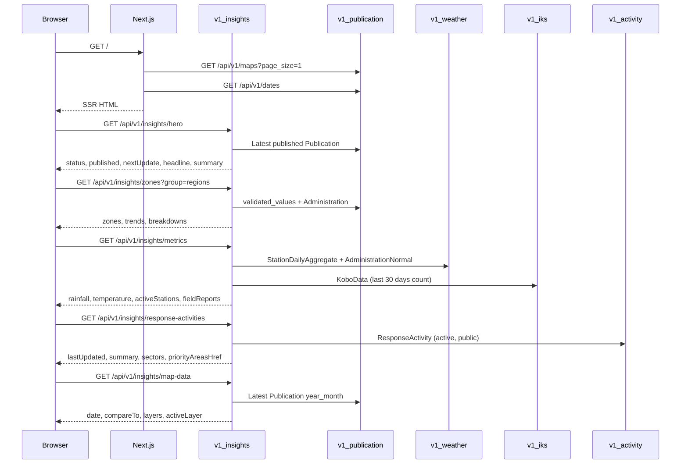

# Feature Design Document

## Feature: Track 1 — National Overview — Backend APIs (`v1_insights`)

**Task ID**: [#159] T1-INS-001
**Author**: Galih Pratama
**Date**: 2026-07-27
**Status**: Implemented

---

## 1. Context & Problem Statement

```
Currently:
- The National Overview page (frontend/src/app/page.js) is fully built and
  uses 5 static mock files under frontend/src/static/mocks/national-overview/
  as its data source (hero.js, zones.js, metrics.js, map-data.js,
  response-activities.js).
- No backend module exists for the public, read-only insights surface.
- All underlying data is already in the DB: Publication/validated_values for
  drought class, StationDailyAggregate + AdministrationNormal for weather,
  KoboData for IKS submissions, ResponseActivity for SOP activities.

Goal:
- Create a new Django app api/v1/v1_insights with 5 read-only, public-facing
  endpoints whose response shapes exactly match the mock contracts already
  consumed by the frontend.
- Wire each frontend component to its real endpoint; remove mock imports.
- No new DB models required. All queries hit existing tables.
```

---

## 2. Requirements

### User Acceptance Criteria

- [x] Visitor (not signed in) lands on the National Overview and sees the national status pill (worst widespread D-class from the latest published Publication) and a one-line summary sentence.
- [x] A "Download National Overview (PDF)" button is present (frontend — already rendered).
- [x] 4 Regions / 6 Agro-ecological zones stacked-bar chart is populated from real validated_values data.
- [x] KPI cards (rainfall deviation, temperature deviation, active stations, IKS field reports) show real aggregated values.
- [x] Response Activities section shows real sector data derived from active ResponseActivity records.
- [x] Map defaults to the D-class layer using the latest published Publication's validated_values.

### Technical Acceptance Criteria

- [x] All 5 endpoints return HTTP 200 with AllowAny permission (no auth required).
- [x] Response shapes are compatible with each mock file contract.
- [x] Unit tests cover every view; at least one integration test per endpoint.
- [x] New app is registered in INSTALLED_APPS and wired in eswatini/urls.py.
- [x] No migrations required (no new models).
- [x] GET /api/v1/national-overview/hero response time < 200 ms at P95 (single DB query).


---

## 3. Data Model Changes

### No new models. Query plan per endpoint:

| Endpoint | Primary source tables |
|----------|-----------------------|
| `hero` | `publications` (latest published, status=3) |
| `zones` | `publications.validated_values` + `administrations` |
| `metrics` | `weather_station_daily_aggregates`, `weather_administration_normals`, `kobo_data` |
| `response-activities` | `response_activities` |
| `map-data` | Static config + latest `publications.year_month` |

---

## 4. API Contract

### 4.1 Endpoint Table

| Method | URL | Purpose | Auth |
|--------|-----|---------|------|
| GET | `/api/v1/insights/hero` | National status pill + summary | None |
| GET | `/api/v1/insights/zones?group=regions` | Breakdown by region / agro-eco zone | None |
| GET | `/api/v1/insights/metrics` | KPI cards (rainfall, temp, stations, IKS) | None |
| GET | `/api/v1/insights/response-activities` | Sector activity summary | None |
| GET | `/api/v1/insights/map-data` | Layer config + latest date | None |

> The map's validated_values (per-Inkhundla D-class array) are already served by
> `GET /api/v1/maps?page_size=1` and `GET /api/v1/map/{pk}` in v1_publication.
> The `map-data` endpoint serves only the static layer config object.

---

### 4.2 Response Contracts (matching mocks exactly)

#### `GET /api/v1/insights/hero`

```json
{
  "status": { "category": 3, "label": "D2 Severe Drought" },
  "published": "15 May 2026",
  "nextUpdate": "15 Jun 2026",
  "headline": "Severe drought conditions emerging across eastern Eswatini",
  "summary": "<narrative text from Publication.narrative>"
}
```

**Logic**:
- Query: `Publication.objects.filter(status=PublicationStatus.published).order_by('-year_month').first()`
- `status.category`: max category in `validated_values` (excluding -9999)
- `status.label`: mapped via `DroughtCategory.FieldStr`
- `published`: `published_at` formatted `"DD MMM YYYY"`
- `nextUpdate`: `published_at + relativedelta(months=1)`
- `headline` / `summary`: from `Publication.narrative`, split on first `\n`

> **Open Question 1**: The mock separates `headline` (one sentence) from `summary` (paragraph),
> but the DB has a single `narrative` TextField. Options:
> (a) split on first `\n`,
> (b) add a `headline` VARCHAR column to `Publication`,
> (c) derive a generic headline like `"Latest drought conditions — {year_month}"` and use
> the full narrative as `summary`.

---

#### `GET /api/v1/insights/zones?group=regions|climatic`

```json
{
  "zones": {
    "group": "regions",
    "period": "2026-05",
    "data": [
      { "id": 1, "label": "Hhohho", "value": 2, "confidence": 61 }
    ]
  },
  "trends": {
    "group": "regions",
    "data": [
      {
        "administration_id": 1,
        "value": "worsening",
        "method": "cdi-mean-slope",
        "group": "months",
        "data": [{ "key": "2025-12", "value": 1.6 }]
      }
    ]
  },
  "breakdowns": {
    "group": "regions",
    "data": [
      {
        "administration_id": 1,
        "group": "tinkhundla",
        "data": [{ "key": 1, "value": 6 }]
      }
    ]
  }
}
```

**Logic** (group=`regions`):
- `Administration.region` holds 4 values: Hhohho, Lubombo, Manzini, Shiselweni.
- For each region, aggregate `validated_values` category counts from latest published Publication.
- `zones.data[].value`: modal (most common) category in that region.
- `zones.data[].confidence`: percentage of Tinkhundla in the modal category.
- `breakdowns.data[].data`: count of Tinkhundla per D-class key (0-5).
- `trends`: rolling 6-month Publications -> mean CDI category per region per month.
- `trends[].value`: `"worsening"|"stable"|"improving"` via linear slope of the 6-month series.

**Logic** (group=`climatic`):
- `Administration.zone` stores 6 agro-ecological zones (`AdministrationZones` enum).
- Same aggregation grouped by zone; id values 101-106 (sequential per zone label order).

> **Open Question 2**: Are `Administration.region` and `Administration.zone` reliably populated
> for all 59 Tinkhundla? A data-quality check and possible backfill may be required before go-live.

---

#### `GET /api/v1/insights/metrics`

```json
{
  "rainfall": {
    "value": -58,
    "unit": "mm",
    "note": "Apr-May cumulative",
    "label": "Precipitation vs 30-yr normal",
    "history": [{ "key": "2025-06", "value": 15 }]
  },
  "temperature": {
    "value": 20.0,
    "unit": "degC",
    "note": "May mean Tmax - all stations",
    "label": "Temperature vs 30 yr Normal",
    "history": [{ "key": "2025-06", "value": 18 }]
  },
  "activeStations": {
    "online": 54,
    "total": 59,
    "onlinePct": 87,
    "label": "Active stations",
    "note": "5 Offline  2 Awaiting QC"
  },
  "fieldReports": {
    "count": 142,
    "verifiedPct": 87,
    "label": "Field reports",
    "note": "in last 30 days  87% verified"
  }
}
```

**Logic**:
- `rainfall.value`: national precipitation deviation = `sum(actual) - sum(normal)` for latest month.
  - Actual: `StationDailyAggregate` summed per month, parameter=`precipitation`.
  - Normal: `AdministrationNormal` average, parameter=`precipitation`, month=latest_month.
  - `history`: last 12 months rolling deviation.
- `temperature.value`: national mean Tmax deviation vs 30-yr normal.
  - Same pattern using parameter=`tmax`.
  - `history`: last 12 months rolling.
- `activeStations`: derived via existing `station_health()` service in `v1_weather/services.py`.
- `fieldReports`: `KoboData.objects.filter(submission_time__gte=30_days_ago).count()`.
  `verifiedPct`: placeholder `100` until `KoboData` gets a verified flag (see OQ-3).

> **Open Question 3**: `KoboData` has no `verified` field. Options:
> (a) return `verifiedPct: 100` as placeholder,
> (b) add `is_verified` BooleanField to `KoboData` (requires migration),
> (c) drop `verifiedPct` from the response and update the `MetricCard` component.

---

#### `GET /api/v1/insights/response-activities`

```json
{
  "lastUpdated": "18 May 2026",
  "summary": "...",
  "sectors": [
    {
      "key": "water",
      "label": "Water and Sanitation",
      "activities": 2,
      "tinkhundla": 15,
      "description": "..."
    }
  ],
  "priorityAreasHref": "/insights/priority"
}
```

**Logic**:
- `ResponseActivity.objects.filter(status=ActivityStatus.active, response_type=ActivityResponseType.public)`
- Group by `sector`, count per sector; map sector int to key string:

  | ActivitySector int | key | label |
  |--------------------|-----|-------|
  | 3 (wash) | `"water"` | Water and Sanitation |
  | 1 (food) | `"agriculture"` | Agriculture and Food security |
  | 5 (env) | `"environment"` | Environment and energy |
  | 2 (health) | `"health"` | Health and nutrition |

- `tinkhundla`: placeholder `0` unless a `PublicationActivity` linking table exists (OQ-5).
- `description`: joined description text of active activities in that sector.
- `summary`: auto-generated string summarizing total triggered activities.
- `lastUpdated`: latest `published_at` from the most recent published Publication.

> **Open Question 5**: `tinkhundla` count per sector requires knowing which Tinkhundla had a
> given activity triggered per publication cycle. Is there a `PublicationActivity` linking table?
> If not, return `0` as placeholder.
>
> **Affects**: `sectors[].tinkhundla` in the `GET /api/v1/insights/response-activities` response
> and the logic in `InsightsResponseActivitiesView` / `services.py`.

---

#### `GET /api/v1/insights/map-data`

```json
{
  "date": "2026-05",
  "compareTo": null,
  "layers": [
    { "key": "drought-class", "label": "Drought class" },
    { "key": "precipitation", "label": "Precipitation" },
    { "key": "temperature", "label": "Temperature" },
    { "key": "land-use", "label": "Land use" },
    { "key": "population", "label": "Population map" },
    { "key": "regions", "label": "Regions" },
    { "key": "agro-eco", "label": "Agro-ecological zones" }
  ],
  "activeLayer": "drought-class"
}
```

**Logic**: Mostly static config; only `date` is dynamic (latest published `Publication.year_month`).
Validated polygon values are fetched separately via existing `/api/v1/maps` endpoint.

---

## 5. Module Architecture

### New app: `backend/api/v1/v1_insights/`

```
v1_insights/
├── __init__.py
├── apps.py
├── urls.py         # 5 url patterns
├── views.py        # 5 APIView classes (AllowAny)
├── serializers.py  # Response serializers matching mock contracts
├── services.py     # Aggregation helpers, slope calc; reuses v1_weather services
└── tests/
    ├── __init__.py
    └── test_views.py
```

### Sequence Diagram



---

## 6. Frontend Wiring (Subsequent Task)

| Component | Mock import to remove | New API call |
|-----------|----------------------|--------------|
| `HeroSection.js` | `heroData` from `hero.js` | `api("GET", "/insights/hero")` |
| `BreakdownByZones.js` | all 6 exports from `zones.js` | `api("GET", "/insights/zones?group=regions")` + `?group=climatic` |
| `DroughtMapSection.js` | `metricsData`, `mapData` | `api("GET", "/insights/metrics")`, `api("GET", "/insights/map-data")` |
| `ResponseActivities.js` | `responseActivitiesData` | `api("GET", "/insights/response-activities")` |

> Frontend wiring is a separate task. This spec covers backend only.

---

## 7. Compatibility & Migration

- Existing API consumers unaffected (new `/insights/` prefix, no changes to existing endpoints).
- No migration files needed (no new models).
- `INSTALLED_APPS` addition: `"api.v1.v1_insights"`
- `eswatini/urls.py` addition: `path("api/", include("api.v1.v1_insights.urls"), name="v1_insights")`

---

## 8. Security Considerations

- All endpoints: `permission_classes = [AllowAny]` — public data, no PII.
- All GET — no write operations.
- `group` query param validated against allowlist `{"regions", "climatic"}`.

---

## 9. Testing Strategy

| Test Type | Coverage target |
|-----------|-----------------|
| Unit | Each `services.py` function (aggregation logic, slope calculation) |
| Integration | All 5 views with seeded test DB, response shape vs mock contract |
| Edge cases | Empty `validated_values`, no published Publications, no weather data |

```bash
python manage.py test api.v1.v1_insights
```

---

## 10. Open Questions

- [x] **OQ-1** — `hero` endpoint (`InsightsHeroView` / `services.py`) — **RESOLVED** (by design):
  **Headline (`headline`)**: Generated dynamically by backend from `Publication.year_month` following the pattern `Drought situation overview — {MMMM YYYY}` (e.g., `"Drought situation overview — May 2026"`), exactly matching `overviewTitle(yearMonth)` in `PublishModal.js`.
  **Summary (`summary`)**: Maps directly to `Publication.narrative` (entered by the validator in `PublishModal.js`).
  **Affects**: `headline` and `summary` in `GET /api/v1/insights/hero`.

- [x] **OQ-2** — `zones` endpoint (`InsightsZonesView` / `services.py`) — **RESOLVED** (by design):
  `Administration.region` (4 administrative regions) and `Administration.zone` (6 agro-ecological zones)
  are fully populated across all 59 Tinkhundla via `generate_administrations_seeder.py` and
  `assign_administration_zones.py` (derived from `eswatini-ecological_regions.topojson`).
  Grouping by region or zone is reliable without risk of unassigned Tinkhundla.
  **Affects**: `GET /api/v1/insights/zones`.

- [x] **OQ-3** — `metrics` endpoint (`InsightsMetricsView`) — **RESOLVED** (by design):
  KoboData has no verification status field or workflow, as synced KoboToolbox submissions are considered valid field reports upon sync.
  `/api/v1/insights/metrics` will return `verifiedPct: 100` (or `null` if skipping the donut chart). No schema changes required in `v1_iks`.
  **Affects**: `fieldReports.verifiedPct` in `GET /api/v1/insights/metrics`
  and `frontend/src/components/NationalOverview/MetricCard.js`.

- [x] **OQ-4** — `response-activities` endpoint — **RESOLVED** (by design):
  The national overview shows exactly **4 priority sectors**: water, agriculture, environment, health.
  Other active sectors (education, coordination, social, transport) are excluded from this surface.
  **Affects**: the sector filter in `InsightsResponseActivitiesView`.

- [x] **OQ-5** — `response-activities` endpoint (`InsightsResponseActivitiesView` / `services.py`) — **RESOLVED** (by design):
  Analysis of `v1_activity` shows that response activity triggers are evaluated dynamically on-the-fly across Tinkhundla using `build_dataset()` and `activity_passes()` in `api.v1.v1_activity.trigger_evaluation`.
  No DB linking table is needed. `InsightsResponseActivitiesView` / `services.py` will import these functions to dynamically count distinct Tinkhundla matching active activities in each sector for the latest published Publication.
  **Affects**: `sectors[].tinkhundla` in `GET /api/v1/insights/response-activities`.

- [x] **OQ-6** — `zones` endpoint, `trends` computation (`services.py`) — **RESOLVED** (by design):
  Analysis of time-series services across the codebase (`v1_weather.services.monthly_series`) and `frontend/src/components/ZoneBreakdown.js` shows that returning available months (Option a) is the standard pattern.
  `trends[].data` will return available monthly mean CDI values (1–6 entries). If fewer than 2 months exist, slope calculation defaults `trend.value` to `"stable"`.
  **Affects**: `trends[].data` in `GET /api/v1/insights/zones`.

---

## 11. Estimation

| Task | Min h | Max h | Confidence |
|------|-------|-------|------------|
| T1: Scaffold `v1_insights` app (apps.py, urls.py, INSTALLED_APPS) | 0.5 | 1 | High |
| T2: `InsightsHeroView` + serializer + service + tests | 2 | 3 | High |
| T3: `InsightsZonesView` (regions + climatic) + tests | 4 | 6 | Medium |
| T4: `InsightsMetricsView` (rainfall/temp deviation, stations, IKS) + tests | 3 | 5 | Medium |
| T5: `InsightsResponseActivitiesView` + tests | 2 | 3 | Medium |
| T6: `InsightsMapDataView` (static config) + tests | 0.5 | 1 | High |
| T7: Frontend wiring (remove mocks, call real API) | 2 | 3 | High |
| T8: Integration / QA pass | 1 | 2 | High |
| **Total** | **15** | **24** | — |

---

## 12. References

- Mock contracts: `frontend/src/static/mocks/national-overview/`
- Frontend components: `frontend/src/components/NationalOverview/`
- Page entry point: `frontend/src/app/page.js`
- `DroughtCategory`, `PublicationStatus`: `backend/api/v1/v1_publication/constants.py`
- `WeatherParameter`, station health services: `backend/api/v1/v1_weather/`
- `ActivitySector`, `ActivityResponseType`: `backend/api/v1/v1_activity/constants.py`
- `KoboData`: `backend/api/v1/v1_iks/models.py`
- USDM colors in frontend: `frontend/src/static/config.js#L25-L33`
- Existing track-1 doc: `eswatini-v2/docs/track-1/national-overview.md`

---

## Approval

| Role | Name | Date | Status |
|------|------|------|--------|
| Developer | | | Pending |
| Tech Lead | | | Pending |
| Product | | | Pending |
