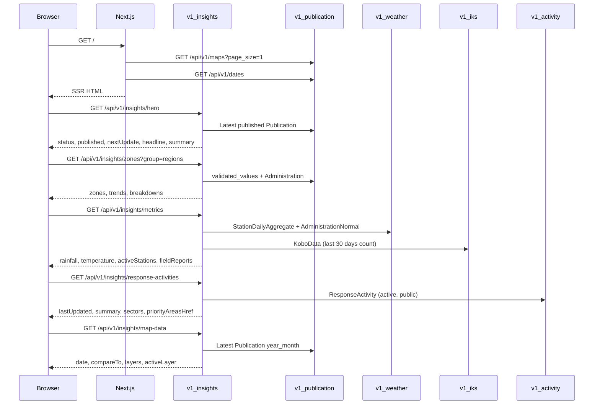

# Feature Design Document

## Feature: Track 1 — National Overview — Backend APIs (`v1_insights`)

**Task ID**: [#159] T1-INS-001
**Author**: Galih Pratama
**Date**: 2026-07-27
**Last reviewed against code**: 2026-08-04
**Status**: Implemented

> This document has been reconciled with the shipped code in
> `backend/api/v1/v1_insights/`. Where the original design and the
> implementation diverged, the implementation is described and the divergence
> is called out inline.

---

## 1. Context & Problem Statement

```
Currently:
- The National Overview page (frontend/src/app/page.js) is fully built and
  uses 5 static mock files under frontend/src/static/mocks/national-overview/
  as its data source (hero.js, zones.js, metrics.js, map-data.js,
  response-activities.js).
- No backend module exists for the public, read-only insights surface.
- All underlying data is already in the DB: Publication/validated_values for
  drought class, StationDailyAggregate + AdministrationNormal for weather,
  KoboData for IKS submissions, ResponseActivity for SOP activities.

Goal:
- Create a new Django app api/v1/v1_insights with 5 read-only, public-facing
  endpoints whose response shapes exactly match the mock contracts already
  consumed by the frontend.
- Wire each frontend component to its real endpoint; remove mock imports.
- No new DB models required. All queries hit existing tables.
```

---

## 2. Requirements

### User Acceptance Criteria

- [x] Visitor (not signed in) lands on the National Overview and sees the national status pill (worst widespread D-class from the latest published Publication) and a one-line summary sentence.
- [x] A "Download National Overview (PDF)" button is present (frontend — already rendered).
- [x] 4 Regions / 6 Agro-ecological zones stacked-bar chart is populated from real validated_values data.
- [ ] KPI cards (rainfall deviation, temperature deviation, active stations, IKS field reports) show real aggregated values.
  **Partial**: active stations and field reports are real; `rainfall.value` and
  `temperature.value` are hardcoded `0` placeholders — see §4.2 `metrics`.
- [x] Response Activities section shows real sector data derived from active ResponseActivity records.
- [x] Map defaults to the D-class layer using the latest published Publication's validated_values.

### Technical Acceptance Criteria

- [x] All 5 endpoints return HTTP 200 with AllowAny permission (no auth required).
- [x] Response shapes are compatible with each mock file contract.
- [x] Unit tests cover every view; at least one integration test per endpoint.
- [x] New app is registered in INSTALLED_APPS and wired in eswatini/urls.py.
- [x] No migrations required (no new models).
- [x] GET /api/v1/insights/hero response time < 200 ms at P95 (single DB query).

---

## 3. Data Model Changes

### No new models. Query plan per endpoint:

| Endpoint | Primary source tables |
|----------|-----------------------|
| `hero` | `publications` (latest published, status=3 **and** `published_at IS NOT NULL`) |
| `zones` | `publications.validated_values` + `administrations` |
| `metrics` | `weather_stations` (via `station_health()`), `kobo_data`. **Not yet**: `weather_station_daily_aggregates`, `weather_administration_normals` — the rainfall/temperature deviation query was never written |
| `response-activities` | `response_activities` + `v1_activity.trigger_evaluation` |
| `map-data` | Static config + latest `publications.year_month` |

> **"Published" means `status=published` AND `published_at IS NOT NULL`.**
> `hero` and `zones` both apply this. A row flagged published but never actually
> published must not surface on the public page.

---

## 4. API Contract

### 4.1 Endpoint Table

| Method | URL | Purpose | Auth |
|--------|-----|---------|------|
| GET | `/api/v1/insights/hero` | National status pill + summary | None |
| GET | `/api/v1/insights/zones?group=regions` | Breakdown by region / agro-eco zone | None |
| GET | `/api/v1/insights/metrics[?inkhundla_id=]` | KPI cards (rainfall, temp, stations, IKS) | None |
| GET | `/api/v1/insights/response-activities` | Sector activity summary | None |
| GET | `/api/v1/insights/map-data` | Layer config + latest date | None |

> The map's validated_values (per-Inkhundla D-class array) are already served by
> `GET /api/v1/maps?page_size=1` and `GET /api/v1/map/{pk}` in v1_publication.
> The `map-data` endpoint serves only the static layer config object.

---

### 4.2 Response Contracts (matching mocks exactly)

#### `GET /api/v1/insights/hero`

```json
{
  "status": { "category": 3, "label": "D2 Severe Drought" },
  "published": "15 May 2026",
  "nextUpdate": "15 Jun 2026",
  "headline": "Severe drought conditions emerging across eastern Eswatini",
  "summary": "<narrative text from Publication.narrative>"
}
```

**Logic** (as implemented in `get_hero_data()`):
- Query: `Publication.objects.filter(status=published, published_at__isnull=False).order_by('-year_month', '-id').first()`
- `status.category`: max category in `validated_values` (excluding `-9999` and `None`)
- `status.label`: mapped via `DroughtCategory.FieldStr`
- `published`: `published_at` formatted `"DD MMM YYYY"`, falling back to `year_month` as `"MMM YYYY"`
- `nextUpdate`: `(published_at or created_at) + relativedelta(months=1)`
- `headline`: generated — `"Drought situation overview — {MMMM YYYY}"` (OQ-1c)
- `summary`: `Publication.narrative` verbatim. It is **HTML**, and the frontend
  renders it with `dangerouslySetInnerHTML` in `HeroSection.js`.

**No-publication fallback** (actual response):

```json
{
  "status": { "category": 0, "label": "Normal / No Drought" },
  "published": "-",
  "nextUpdate": "-",
  "headline": "Drought situation overview — No active publication",
  "summary": "No published drought map is currently available."
}
```

> **Known gap — false-positive national status.** With no publication the hero
> still returns `category: 0`, which the page renders as a green
> "National Status: Normal" pill. Category `0` is a real verdict
> ("Wet/normal conditions"), so this asserts the country is drought-free when
> nothing has been published. `get_zones_data()` was fixed to use
> `DroughtCategory.none` (-9999) for exactly this reason; `get_hero_data()`
> has **not** been given the same treatment yet. Fixing it needs a
> `DROUGHT_CATEGORY_CODE[-9999]` pill in `HeroSection.js` as well.

---

#### `GET /api/v1/insights/zones?group=regions|climatic`

```json
{
  "zones": {
    "group": "regions",
    "period": "2026-05",             // null when nothing is published
    "data": [
      { "id": 1, "label": "Hhohho", "value": 2, "confidence": 61 }
    ]
  },
  "trends": {
    "group": "regions",
    "data": [
      {
        "administration_id": 1,
        "value": "worsening",
        "method": "cdi-mean-slope",
        "group": "months",
        "data": [{ "key": "2025-12", "value": 1.6 }]
      }
    ]
  },
  "breakdowns": {
    "group": "regions",
    "data": [
      {
        "administration_id": 1,
        "group": "tinkhundla",
        "data": [
          { "key": 1, "value": 6, "names": ["Mbabane East", "..."] },
          { "key": -9999, "value": null, "names": [] }
        ]
      }
    ]
  }
}
```

**Logic** (group=`regions`):
- `Administration.region` holds 4 values: Hhohho, Lubombo, Manzini, Shiselweni.
- For each region, aggregate `validated_values` category counts from latest published Publication.
- `zones.data[].value`: modal (most common) category in that region.
- `zones.data[].confidence`: percentage of **all** Tinkhundla in the group that
  sit in the modal category — the denominator is the whole group, so missing
  data lowers confidence rather than being silently excluded.
- `breakdowns.data[].data`: **7 entries** — one per D-class key `0..5` plus one
  for `-9999` (No Data). `value` is `null`, not `0`, when a class is unused.
  `names` carries the Inkhundla names in that class (used by the doughnut tooltip).
- `trends`: rolling 6-month published Publications -> mean CDI category per group per month.
- `trends[].value`: `"worsening" | "stable" | "improving" | "unknown"`, from the
  linear slope of the series.

**Logic** (group=`climatic`):
- `Administration.zone` stores 6 agro-ecological zones (`AdministrationZones` enum).
- Same aggregation grouped by zone; id values 101-106 (sequential per zone label order).

#### No-data semantics (implemented 2026-08-04)

The service originally defaulted every missing category to `0`. Category `0` is
`"Wet/normal conditions"` — a real verdict — so an unpublished month rendered as
a confident nationwide "no drought". Current behaviour:

| Situation | Response |
|---|---|
| No published publication | `zones.period` is `null` |
| Inkhundla has no category, or `null`, or `-9999` | Excluded from `latest_vals`; counted in the `-9999` breakdown slice |
| Group has no categorised Inkhundla at all | `zones.data[].value = -9999`, `confidence = 0` |
| Month has no categorised Inkhundla for a group | That month is **omitted** from `trends[].data` — it is not scored `0` |
| Fewer than 2 months in the series | `trends[].value = "unknown"` (not `"stable"`) |

`is_validated()` in `api/v1/v1_publication/constants.py` is the single
definition of "a real, admin-assigned D-class"; `get_zones_data()` calls it
rather than re-testing for `None`/`-9999`.

Frontend counterparts: `DROUGHT_CATEGORY_CODE[-9999] === "No data"` renders the
zone chip, and `TREND.unknown` renders `– NO TREND DATA`
(`frontend/src/components/ZoneBreakdown.js`).

> **Open Question 2**: Are `Administration.region` and `Administration.zone` reliably populated
> for all 59 Tinkhundla? A data-quality check and possible backfill may be required before go-live.

---

#### `GET /api/v1/insights/metrics`

```json
{
  "rainfall": {
    "value": 0,
    "unit": "mm",
    "note": "May 2026 deviation",
    "label": "Precipitation vs 30-yr normal",
    "history": [{ "key": "2025-06", "value": 0 }]
  },
  "temperature": {
    "value": 0.0,
    "unit": "°C",
    "note": "May 2026 mean Tmax deviation",
    "label": "Temperature vs 30 yr Normal",
    "history": [{ "key": "2025-06", "value": 0 }]
  },
  "activeStations": {
    "online": 54,
    "total": 59,
    "onlinePct": 87,
    "label": "Active stations",
    "note": "5 Offline  2 Degraded"
  },
  // With ?inkhundla_id= for a region that has no station (revised
  // 2026-08-19). Counts are null, never 0: "0/0" and an empty ring say every
  // station is down, which is a different claim. The card previously fell
  // back to the NATIONAL figures here, so Manzini — which has no station —
  // read "Active stations (Manzini) 3/4".
  // "activeStations": {
  //   "online": null, "total": null, "onlinePct": null,
  //   "label": "Active stations (Manzini)",
  //   "note": "No station in this region",
  //   "reason": "no_station_in_region"    // or "no_stations" nationally
  // },
  "fieldReports": {
    "count": 142,
    "verifiedPct": 100,
    "label": "Field reports",
    "note": "in last 30 days  100% verified"
  }
}
```

> `rainfall.value` and `temperature.value` are **placeholders fixed at 0** — see
> the logic notes below. Everything else on this endpoint is real.

**Query param**: `?inkhundla_id={id}` (optional, added by TRACK1-NAT-001). When
set, station health filters to the Inkhundla's region and field reports filter
through `IKSValue.administration`. The labels/notes are suffixed with the
Inkhundla name.

> **Neither narrowing falls back to the national figure any more.** Both did
> once, and both lied in the same way: a national number under a regional
> label. Field reports lost the fallback when the Kobo attribution moved to the
> `IKSValue.administration` join; station health lost it on 2026-08-19, after
> Manzini — which has no station — rendered `Active stations (Manzini) 3/4`.
> An empty scope is now its own answer, not a wider one.

**Logic** (as implemented in `get_metrics_data()`):
- `activeStations`: real — `WeatherStation.objects.filter(is_active=True)`,
  narrowed to `region=` the Inkhundla's region when one is selected, scored
  through `station_health()` in `v1_weather/services.py`. `note` is
  `"{offline} Offline  {degraded} Degraded"`. When the scope holds no station,
  `online` / `total` / `onlinePct` are **null** — never `0`, which claims every
  station is down — with `note` `"No station in this region"` and `reason`
  `"no_station_in_region"` (`"no_stations"` nationally). The frontend renders a
  dash and hides the ring off those nulls.
- `fieldReports.count`: real — `KoboData.objects.filter(submission_time__gte=30_days_ago).count()`.
  `verifiedPct` is a constant `100` (OQ-3).
- `rainfall.value` / `temperature.value`: **NOT IMPLEMENTED**. Both are
  hardcoded `0`, and `history` is a list of `{key: "<YYYY-MM>", value: 0}` — one
  entry per published publication in the last 12, so the mini bar charts render a
  flat zero series. The `StationDailyAggregate` / `AdministrationNormal`
  deviation query described below was never written.

> **Deferred design** (the intended implementation, for whoever picks this up):
> - `rainfall.value`: `sum(actual) - sum(normal)` for the latest month —
>   actual from `StationDailyAggregate` (parameter=`precipitation`), normal from
>   `AdministrationNormal` for that month; `history` = 12-month rolling deviation.
> - `temperature.value`: same pattern with parameter=`tmax`.
> - Tracked as a separate weather-aggregate task; see
>   `thirty-year-normals` notes — CHIRPS precipitation and AgERA5 tmean normals
>   exist, but tmax/tmin normals still have no source.

> **Open Question 3**: `KoboData` has no `verified` field. Options:
> (a) return `verifiedPct: 100` as placeholder,
> (b) add `is_verified` BooleanField to `KoboData` (requires migration),
> (c) drop `verifiedPct` from the response and update the `MetricCard` component.

---

#### `GET /api/v1/insights/response-activities`

```json
{
  "lastUpdated": "18 May 2026",
  "summary": "...",
  "sectors": [
    {
      "key": "water",
      "label": "Water and Sanitation",
      "activities": 2,
      "tinkhundla": 15,
      "description": "..."
    }
  ],
  "priorityAreasHref": "/detailed-insights/risk-level"
}
```

**Logic**:
- `ResponseActivity.objects.filter(status=ActivityStatus.active, response_type=ActivityResponseType.public)`
- Group by `sector`, count per sector; map sector int to key string:

  | ActivitySector int | key | label |
  |--------------------|-----|-------|
  | 3 (wash) | `"water"` | Water and Sanitation |
  | 1 (food) | `"agriculture"` | Agriculture and Food security |
  | 5 (env) | `"environment"` | Environment and energy |
  | 2 (health) | `"health"` | Health and nutrition |

- `tinkhundla`: computed live (OQ-5 resolved — no linking table). For each active
  activity in the sector, `activity_passes(act.triggers, row)` is evaluated
  against every row of `build_dataset()`; the count is the number of **distinct**
  Tinkhundla matched by at least one activity in that sector.
- `description`: joined description text of active activities in that sector,
  falling back to `"Active response interventions for {sector_label}."`.
- `summary`: `"{N} public response activities currently active across Eswatini."`
  where `N` is the total active activity count across the 4 sectors.
- `lastUpdated`: `published_at` of the most recent published Publication, falling
  back to today's date when none exists.
- `priorityAreasHref`: constant `"/detailed-insights/risk-level"`.
- All 4 sectors are always present in `sectors[]`, with zeroes when a sector has
  no active activities — the frontend renders a fixed 2×2 grid.

---

#### `GET /api/v1/insights/map-data`

```json
{
  "date": "2026-05",
  "compareTo": null,
  "layers": [
    { "key": "drought-class", "label": "Drought class" },
    { "key": "precipitation", "label": "Precipitation" },
    { "key": "temperature", "label": "Temperature" },
    { "key": "land-use", "label": "Land use" },
    { "key": "population", "label": "Population map" },
    { "key": "regions", "label": "Regions" },
    { "key": "agro-eco", "label": "Agro-ecological zones" }
  ],
  "activeLayer": "drought-class"
}
```

**Logic**: Mostly static config; only `date` is dynamic (latest published `Publication.year_month`).
Validated polygon values are fetched separately via existing `/api/v1/maps` endpoint.

---

## 5. Module Architecture

### New app: `backend/api/v1/v1_insights/`

```
v1_insights/
├── __init__.py
├── apps.py
├── urls.py         # 5 url patterns
├── views.py        # 5 APIView classes (AllowAny)
├── serializers.py  # Response serializers matching mock contracts
├── services.py     # Aggregation helpers, slope calc; reuses v1_weather services
└── tests/
    ├── __init__.py
    └── test_views.py
```

### Sequence Diagram



---

## 6. Frontend Wiring (Subsequent Task — DONE)

Delivered under TRACK1-NAT-001 (#173); see
[`national-overview-backend-integration.md`](national-overview-backend-integration.md).
All 8 fetches (5 insights + `/maps` + `/dates`) happen in one server-side
`Promise.all` in `frontend/src/app/page.js` and are passed down as props; no
NationalOverview component imports a mock any more.

| Component | Prop it now receives | Source endpoint |
|-----------|----------------------|-----------------|
| `HeroSection.js` | `hero` | `/insights/hero` |
| `BreakdownByZones.js` | `regionsData`, `climaticData` | `/insights/zones?group=regions` + `?group=climatic` |
| `DroughtMapSection.js` | `metrics`, `mapData` | `/insights/metrics`, `/insights/map-data` |
| `ResponseActivities.js` | `responseActivities` | `/insights/response-activities` |

`frontend/src/static/mocks/national-overview/` was **deleted** (2026-08-04) once
every section was reading a live endpoint. Per CLAUDE.md those files existed to
stand in for a missing API; with all 5 endpoints shipped they were a second,
drifting copy of the contract. The contract now lives in §4.2 of this document
and in `backend/api/v1/v1_insights/serializers.py`. The one Jest fixture that
needed a payload (`ResponseActivities.test.js`) declares it inline.

---

## 7. Compatibility & Migration

- Existing API consumers unaffected (new `/insights/` prefix, no changes to existing endpoints).
- No migration files needed (no new models).
- `INSTALLED_APPS` addition: `"api.v1.v1_insights"`
- `eswatini/urls.py` addition: `path("api/", include("api.v1.v1_insights.urls"), name="v1_insights")`

---

## 8. Security Considerations

- All endpoints: `permission_classes = [AllowAny]` — public data, no PII.
- All GET — no write operations.
- `group` query param validated against allowlist `{"regions", "climatic"}`.

---

## 9. Testing Strategy

| Test Type | Coverage target |
|-----------|-----------------|
| Unit | Each `services.py` function (aggregation logic, slope calculation) |
| Integration | All 5 views with seeded test DB, response shape vs mock contract |
| Edge cases | Empty `validated_values`, no published Publications, no weather data |

16 tests in `api/v1/v1_insights/tests/test_views.py`. The no-data guarantees are
each pinned by a test, so a regression to "everything is Normal" fails the suite:

| Test | Guarantee |
|---|---|
| `test_zones_endpoint_no_publication_is_no_data_not_normal` | `period` null, `value = -9999`, `confidence = 0`, `-9999` breakdown slice populated with names, `trends[].value = "unknown"` |
| `test_zones_endpoint_unpublished_publication_is_ignored` | `status=published` with `published_at=None` does not surface |
| `test_zones_endpoint_published_keeps_real_category` | A real category still reports normally (guards over-correction) |
| `test_zones_endpoint_no_data_category_is_not_averaged` | `-9999` in `validated_values` never enters the trend mean |
| `test_compute_linear_slope_unit` | `[]` and single-point series return `"unknown"` |

```bash
python manage.py test api.v1.v1_insights
```

---

## 10. Open Questions

- [x] **OQ-1** — `hero` endpoint (`InsightsHeroView` / `services.py`) — **RESOLVED** (by design):
  **Headline (`headline`)**: Generated dynamically by backend from `Publication.year_month` following the pattern `Drought situation overview — {MMMM YYYY}` (e.g., `"Drought situation overview — May 2026"`), exactly matching `overviewTitle(yearMonth)` in `PublishModal.js`.
  **Summary (`summary`)**: Maps directly to `Publication.narrative` (entered by the validator in `PublishModal.js`).
  **Affects**: `headline` and `summary` in `GET /api/v1/insights/hero`.

- [x] **OQ-2** — `zones` endpoint (`InsightsZonesView` / `services.py`) — **RESOLVED** (by design):
  `Administration.region` (4 administrative regions) and `Administration.zone` (6 agro-ecological zones)
  are fully populated across all 59 Tinkhundla via `generate_administrations_seeder.py` and
  `assign_administration_zones.py` (derived from `eswatini-ecological_regions.topojson`).
  Grouping by region or zone is reliable without risk of unassigned Tinkhundla.
  **Affects**: `GET /api/v1/insights/zones`.

- [x] **OQ-3** — `metrics` endpoint (`InsightsMetricsView`) — **RESOLVED** (by design):
  KoboData has no verification status field or workflow, as synced KoboToolbox submissions are considered valid field reports upon sync.
  `/api/v1/insights/metrics` will return `verifiedPct: 100` (or `null` if skipping the donut chart). No schema changes required in `v1_iks`.
  **Affects**: `fieldReports.verifiedPct` in `GET /api/v1/insights/metrics`
  and `frontend/src/components/NationalOverview/MetricCard.js`.

- [x] **OQ-4** — `response-activities` endpoint — **RESOLVED** (by design):
  The national overview shows exactly **4 priority sectors**: water, agriculture, environment, health.
  Other active sectors (education, coordination, social, transport) are excluded from this surface.
  **Affects**: the sector filter in `InsightsResponseActivitiesView`.

- [x] **OQ-5** — `response-activities` endpoint (`InsightsResponseActivitiesView` / `services.py`) — **RESOLVED** (by design):
  Analysis of `v1_activity` shows that response activity triggers are evaluated dynamically on-the-fly across Tinkhundla using `build_dataset()` and `activity_passes()` in `api.v1.v1_activity.trigger_evaluation`.
  No DB linking table is needed. `InsightsResponseActivitiesView` / `services.py` will import these functions to dynamically count distinct Tinkhundla matching active activities in each sector for the latest published Publication.
  **Affects**: `sectors[].tinkhundla` in `GET /api/v1/insights/response-activities`.

- [x] **OQ-6** — `zones` endpoint, `trends` computation (`services.py`) — **RESOLVED** (by design):
  Analysis of time-series services across the codebase (`v1_weather.services.monthly_series`) and `frontend/src/components/ZoneBreakdown.js` shows that returning available months (Option a) is the standard pattern.
  `trends[].data` returns available monthly mean CDI values (0–6 entries) — months with no categorised Inkhundla for the group are omitted, not scored 0.
  **Amended 2026-08-04**: with fewer than 2 entries `compute_linear_slope()` returns
  `"unknown"`, **not** `"stable"`. "Stable" claims the drought level held steady,
  which is a measurement that was never taken. The frontend renders `unknown` as
  `– NO TREND DATA`.
  **Affects**: `trends[].data` and `trends[].value` in `GET /api/v1/insights/zones`.

- [x] **OQ-7** — no-data vs "Normal" (`services.py`) — **RESOLVED 2026-08-04** (in code):
  `get_zones_data()` defaulted absent categories to `0`, which is the real verdict
  "Wet/normal conditions" — so an empty database rendered as a confident,
  nationwide "no drought". Resolved by routing every missing / `null` / `-9999`
  category to `DroughtCategory.none` and surfacing it as its own breakdown slice.
  See "No-data semantics" under §4.2 `zones`.
  **Still open for `hero`**: `get_hero_data()` continues to return `category: 0`
  when there is no publication.
  **Affects**: `GET /api/v1/insights/zones`, and `GET /api/v1/insights/hero` (unfixed).

---

## 11. Estimation

| Task | Min h | Max h | Confidence |
|------|-------|-------|------------|
| T1: Scaffold `v1_insights` app (apps.py, urls.py, INSTALLED_APPS) | 0.5 | 1 | High |
| T2: `InsightsHeroView` + serializer + service + tests | 2 | 3 | High |
| T3: `InsightsZonesView` (regions + climatic) + tests | 4 | 6 | Medium |
| T4: `InsightsMetricsView` (rainfall/temp deviation, stations, IKS) + tests | 3 | 5 | Medium |
| T5: `InsightsResponseActivitiesView` + tests | 2 | 3 | Medium |
| T6: `InsightsMapDataView` (static config) + tests | 0.5 | 1 | High |
| T7: Frontend wiring (remove mocks, call real API) | 2 | 3 | High |
| T8: Integration / QA pass | 1 | 2 | High |
| **Total** | **15** | **24** | — |

---

## 12. References

- Response contracts: §4.2 above + `backend/api/v1/v1_insights/serializers.py`
  (the former `frontend/src/static/mocks/national-overview/` fixtures were
  deleted 2026-08-04 — recoverable from git history if a payload sample is needed)
- Frontend components: `frontend/src/components/NationalOverview/`
- Page entry point: `frontend/src/app/page.js`
- `DroughtCategory`, `PublicationStatus`: `backend/api/v1/v1_publication/constants.py`
- `WeatherParameter`, station health services: `backend/api/v1/v1_weather/`
- `ActivitySector`, `ActivityResponseType`: `backend/api/v1/v1_activity/constants.py`
- `KoboData`: `backend/api/v1/v1_iks/models.py`
- USDM colors in frontend: `frontend/src/static/config.js#L25-L33`
- Existing track-1 doc: `eswatini-v2/docs/track-1/national-overview.md`

---

## Approval

| Role | Name | Date | Status |
|------|------|------|--------|
| Developer | | | Pending |
| Tech Lead | | | Pending |
| Product | | | Pending |
