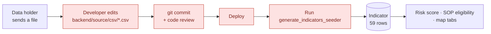
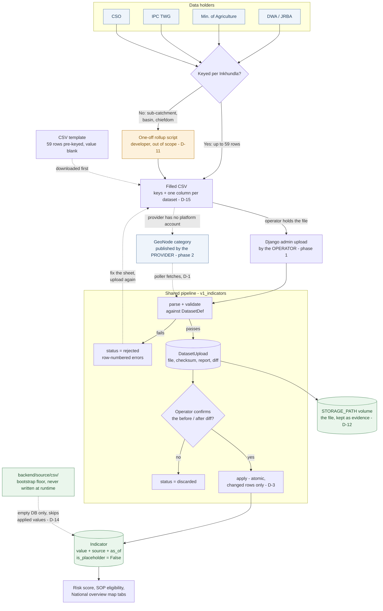
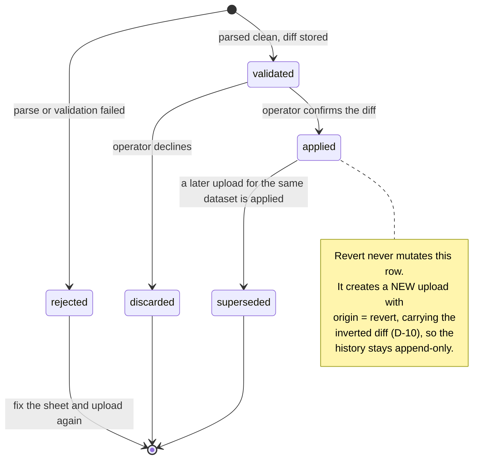

# Feature Design Document

## Feature: Operator-driven updates for non-API secondary data

**Task ID**: PA-6
**Author**: Iwan Firmawan
**Date**: 2026-08-18
**Status**: Draft
**Track**: 1 (Decision Track) — writes the exposure/vulnerability inputs consumed by Track 3 risk scoring and SOP eligibility
**Siblings**:
- [`exposure-indicator-automation.md`](./exposure-indicator-automation.md) (PA-4) — automates the two sub-indicators that *do* have a fetchable source
- [`dynamic-world-earth-engine-assessment.md`](./dynamic-world-earth-engine-assessment.md) (PA-5) — resolves PA-4's land-use half
- [`activity-library-add-new.md`](../track-3/activity-library-add-new.md) — the existing admin authoring + file-upload surface

> PA-4/PA-5 answer *"which of these can we fetch automatically?"*. This document answers the complement: **what happens to the ones that can never be fetched**, because a person receives them as a file.

**Surface**: Django admin. No frontend work — see **D-1**.

---

## 1. Context & Problem Statement

```
Currently:
- Every non-API dataset enters the platform as a CSV committed to
  backend/source/csv/ and loaded by a management command
  (generate_indicators_seeder.py). Updating a value therefore requires:
  edit CSV -> git commit -> code review -> deploy -> run the command.
  Four of those five steps need a developer.
- Two of the four risk exposure sub-indicators (cattle, water_demand) are
  null for all 59 Tinkhundla today. The DWA/JRBA water-demand snapshot
  exists (eswatini-v2/data/water_demand/) but has never been loaded,
  because loading it means a code change nobody has scheduled.
- ipc_phase is refreshed by IPC analysis roughly twice a year and has no
  API at all. The same is true of livestock census counts and the WASH
  point inventory behind the eligibility columns.
- Provenance is a single literal string: every seeded row claims
  IndicatorSource.HANDOVER_2026_07 with is_placeholder=True, regardless of
  which dataset or vintage the number actually came from.

Goal:
- The operator (the PIC for secondary data, whoever holds the role) can
  refresh any of these datasets end to end: obtain the template, fill it,
  upload it, see exactly what would change, and apply it.
- No git operation, no deploy, no management command, no tech-team ticket.
- Every applied value carries the dataset, the stated source and the
  vintage the operator declared — not the handover batch it arrived in.
- A malformed or partial file cannot silently corrupt the risk score.
```

### 1.1 Inventory — what is actually in scope

| Dataset | Target | Today | Cadence | Holder | In scope |
|---|---|---|---|---|---|
| Water demand | `Indicator.water_demand` | **null ×59** | irregular; static snapshot until JRBA MIS project ends Dec 2026 | DWA / JRBA | **yes** |
| Cattle | `Indicator.cattle` | **null ×59** | livestock census, irregular | Ministry of Agriculture | **yes** |
| IPC phase | `Indicator.ipc_phase` | seeded from `risk_dataset__Vulnerability_IPC.csv` | ~2×/year | IPC Technical Working Group | **yes** |
| Population | `Indicator.population` | seeded from `risk_dataset__Exposure_Population.csv` | — | WorldPop (PA-4 automates) | yes, as fallback |
| Land use DVI-agri | `Indicator.land_use_dvi_agri` | seeded from `risk_dataset__Exposure_LandUse.csv` | — | ESA WorldCover (PA-5 automates) | yes, as fallback |
| Eligibility counts | `under_five`, `elderly`, `rainfed_cropland`, `rangeland`, `boreholes`, `taps` | default `0` | census / WASH inventory | CSO, DWA | **yes** |
| Response activities | `ResponseActivity` | — | ad hoc | sector leads | **no** — already has an admin CRUD + upload UI |
| IKS submissions | `KoboData` | — | monthly | Kobo | **no** — API-connected |
| Weather normals, CDI rasters, boundaries | GeoTIFF / topojson | — | rare | CHIRPS, AgERA5, GeoNode | **no** — rasters and structural geometry, see §2 out of scope |

Every in-scope target is a column on **one model**, `Indicator`, keyed one-to-one to `Administration`. That is the single fact this whole design rests on: **the payload is always ≤ 59 rows of `(Inkhundla, number)`**. It is not a general-purpose data-import framework, and building one would be the wrong answer to this problem.

---

## 1.2 Data flow

### Today



Four of the five steps need a developer, and none of them tells anyone whether the file was correct.

### Proposed



Three properties of that picture carry most of the design:

- **The ingress is interchangeable, the pipeline is not.** `parse + validate` takes a file and a `DatasetDef`, never a request, so the phase-2 GeoNode poller is a fetch loop that joins at the same node — not a second pipeline (**D-1**).
- **Nothing reaches `Indicator` without a human passing through `GATE`.** That is the only edge that changes published numbers, and it is deliberately a manual one (**D-3**).
- **`backend/source/csv/` has one arrow, and it is dashed and conditional.** It seeds an empty database and then stays out of the way; it is never a write target at runtime (**D-12**, **D-14**).

### Upload lifecycle



A rejected upload is still stored. It is evidence of what was attempted, and it is where the row numbers live.

---

## 2. Requirements

### User Acceptance Criteria

- [ ] An operator can see, in one Django admin changelist, every upload ever made: which dataset, which vintage, which stated source, who uploaded it, and whether it was applied
- [ ] An operator can download one CSV template containing all 59 Tinkhundla and every dataset column, fill only the columns they hold, and leave the rest empty — so no row key is ever typed and no file has to be chosen up front
- [ ] An operator can upload a filled template and immediately see a per-Inkhundla **before → after** diff without anything being written to `Indicator`
- [ ] An operator can then apply that upload from an admin action that shows the diff on a confirmation page, or discard it
- [ ] A file with a wrong header, an unrecognised Inkhundla, or an out-of-range value is rejected with a message naming the row and the problem — not a stack trace and not a support ticket
- [ ] A file covering only some Tinkhundla applies only those; the rest keep their existing values, and the report says which were left alone
- [ ] An operator can download any previously uploaded file, and revert to the previous applied state
- [ ] Wherever the value is surfaced, it states the source and vintage the operator declared

### Technical Acceptance Criteria

- [ ] **No new Python dependency.** CSV parsing is `csv` from stdlib; file handling is Django's own `FileField` storage
- [ ] **No frontend work.** No new Next.js route, no new REST endpoint, no serializer (**D-1**)
- [ ] No new Django app — this lives in `v1_indicators`, which already owns every target column
- [ ] Validation and apply are separate operations; validation never writes to `Indicator`
- [ ] Apply is atomic per upload — a failure mid-file rolls the whole thing back
- [ ] Apply is idempotent; re-applying the same upload produces identical rows
- [ ] Missing Tinkhundla are never written as `0` or `null` (see [[exposure-indicators-half-null]] — a rendered `0` for water demand is a false statement, not a missing one)
- [ ] `generate_indicators_seeder.py` keeps working as the bootstrap loader **and stops overwriting operator-applied values** (**D-14**)
- [ ] Uploaded files land on the mounted storage volume, never in `backend/source/` (**D-12**)
- [ ] Uploaded files are retained, checksummed, and downloadable — the upload record *is* the provenance record

### Out of scope

- Rasters and geometry (CDI/component GeoTIFFs, topojson boundaries, weather normals). These change the shape of the platform, not a column value, and legitimately need a developer.
- Sub-catchment → Inkhundla spatial rollup. See **D-11**: the DWA workbook is not a 59-row file and this pipeline will not make it one.
- Editing the risk-scoring formula or the normalisation.
- Operator-defined *new* datasets. Adding a dataset means adding a target column, which is a migration (**D-5**).
- Any Next.js UI. Deliberately — **D-1**.

---

## 3. Data Model Changes

### New Models

One model, in `api/v1/v1_indicators/models.py`.

```python
class DatasetUpload(models.Model):
    """One operator-submitted file for one registered dataset.

    Doubles as the audit trail and the provenance record: the file that
    produced a value stays on the storage volume, checksummed, next to the
    declared source and vintage, so "where did this number come from" is
    answerable without asking anyone.
    """

    dataset = models.CharField(max_length=64, db_index=True)   # registry slug, D-5
    origin = models.CharField(max_length=16, default="upload")  # upload | geonode | revert
    file = models.FileField(upload_to="datasets/%Y/%m/")        # D-12
    checksum = models.CharField(max_length=64)                  # sha256 of the bytes
    source_label = models.CharField(max_length=255)             # declared, D-4
    as_of = models.DateField()                                  # declared, D-4
    status = models.PositiveSmallIntegerField(
        choices=UploadStatus.FieldStr.items(),
        default=UploadStatus.validated,
    )
    report = models.JSONField(default=dict)                     # §4.3
    geonode_id = models.IntegerField(null=True, blank=True)     # set when origin=geonode
    uploaded_by = models.ForeignKey(
        SystemUser, on_delete=models.SET_NULL, null=True,
        related_name="dataset_uploads",
    )
    applied_by = models.ForeignKey(
        SystemUser, on_delete=models.SET_NULL, null=True,
        related_name="applied_dataset_uploads",
    )
    created_at = models.DateTimeField(auto_now_add=True)
    applied_at = models.DateTimeField(null=True, blank=True)

    class Meta:
        db_table = "dataset_uploads"
        ordering = ["-created_at"]
        indexes = [models.Index(fields=["dataset", "-created_at"])]
```

```python
class UploadStatus:
    rejected = 1    # did not parse / failed validation; nothing to apply
    validated = 2   # parsed clean, diff computed, awaiting the operator
    applied = 3
    superseded = 4  # a later upload for this dataset was applied
    discarded = 5   # operator declined it
```

### Modified Models

| Model | Change | Reason |
|---|---|---|
| `Indicator` | none | every target column already exists |
| `SystemUser` | `is_staff` property → real `BooleanField` | Django admin access must be grantable without `is_superuser` (**D-13**) |
| `IndicatorSource` (constants) | add `OPERATOR_UPLOAD` prefix helper | applied rows must name the declared source, not the handover batch |

`Indicator.source` is written as `f"{source_label} ({as_of:%Y-%m})"` on apply, e.g. `"DWA/JRBA abstraction permit registry (2026-03)"`, and `is_placeholder` flips to `False`.

### Settings

```python
# eswatini/settings.py — one line, next to STORAGE_PATH
MEDIA_ROOT = STORAGE_PATH
# MEDIA_URL deliberately unset: uploaded files must never be web-reachable.
# Download goes through an authenticated admin view (§4.4).
```

`STORAGE_PATH` is already the mounted volume (`${STORAGE_PATH:-./storage}:/app/storage` on both `backend` and `worker`), and no other model uses a `FileField`, so defining `MEDIA_ROOT` affects nothing that exists today.

### The dataset registry (constants, not a model)

`api/v1/v1_indicators/datasets.py` — declarative, frozen, code-owned (**D-5**):

```python
@dataclass(frozen=True)
class DatasetDef:
    slug: str
    label: str
    field: str                    # Indicator column written
    dtype: type                   # int | float
    minimum: float | None
    maximum: float | None
    unit: str                     # rendered in the template header
    geonode_category: str         # D-1 phase 2; unused until the poller lands
    notes: str = ""


DATASETS = {d.slug: d for d in [
    DatasetDef("water-demand", "Water demand", "water_demand",
               float, 0, None, "m3/year", "exposure-water-demand"),
    DatasetDef("cattle", "Cattle count", "cattle",
               int, 0, None, "head", "exposure-cattle"),
    DatasetDef("ipc-phase", "IPC phase", "ipc_phase",
               int, 1, 5, "phase", "vulnerability-ipc"),
    DatasetDef("population", "Population", "population",
               int, 0, None, "people", "exposure-population"),
    DatasetDef("land-use-dvi-agri", "Land use DVI-agri", "land_use_dvi_agri",
               float, 0, 1, "ratio", "exposure-land-use"),
    DatasetDef("under-five", "Children under five", "under_five",
               int, 0, None, "people", "eligibility-under-five"),
    DatasetDef("elderly", "Elderly population", "elderly",
               int, 0, None, "people", "eligibility-elderly"),
    DatasetDef("rainfed-cropland", "Rain-fed cropland", "rainfed_cropland",
               int, 0, None, "ha", "eligibility-rainfed-cropland"),
    DatasetDef("rangeland", "Rangeland", "rangeland",
               int, 0, None, "ha", "eligibility-rangeland"),
    DatasetDef("boreholes", "Boreholes", "boreholes",
               int, 0, None, "count", "eligibility-boreholes"),
    DatasetDef("taps", "Taps", "taps",
               int, 0, None, "count", "eligibility-taps"),
]}
```

`minimum`/`maximum` deliberately restate the DB constraints (`ck_indicator_dvi_agri_unit`, `ck_indicator_ipc_phase_range`). The database is still the enforcer; the registry exists so the operator gets *"row 12: IPC phase 7 is outside 1–5"* instead of an `IntegrityError`.

### Migration Strategy

```
Two migrations:

1. CREATE TABLE dataset_uploads. Additive, no existing column touched.

2. SystemUser.is_staff: property -> BooleanField(default=False), plus a
   data migration setting is_staff=True wherever is_superuser=True, so no
   current Django-admin user loses access. (D-13)

Rollback: drop the table; revert is_staff to a property. Indicator values
applied before the rollback stay as they are — they are ordinary column
values. Provenance narrows back to the source string, which is the
situation today.

The seeder CSVs stay in backend/source/csv/ (PA-4 D-6, same reasoning):
re-running generate_indicators_seeder.py remains the floor to fall back to.
```

---

## 4. Admin Surface Contract

There is **no REST API**. The contract is the Django admin surface, the CSV format, and the report shape.

### 4.1 The CSV contract

Key columns, then **one column per dataset, named after its target field**. There is **one template for everything**, carrying all 11 value columns — the operator fills the ones they have and leaves the rest empty. A worked copy is committed at [`examples/template_all-datasets.csv`](./examples/README.md), generated from the live 59 `administrations` rows.

```csv
administration_id,inkhundla_name,region,water_demand
4588078,Hhukwini,Hhohho,142500
1143153,Lobamba,Hhohho,98000
...
1102838,Zombodze Emuva,Shiselweni,
```

The same shape carries several datasets at once, which is how a single census export actually arrives:

```csv
administration_id,inkhundla_name,region,under_five,elderly,boreholes,taps
4588078,Hhukwini,Hhohho,3200,410,12,45
1143153,Lobamba,Hhohho,2870,388,9,31
...
```

- `administration_id` — the platform's own key, pre-filled by the template. Matched first. Note these are **not** `1..59`: `Administration.pk` carries the identifier from `eswatini.topojson` (Hhukwini is `4588078`), which is opaque to everyone outside this system — see **§12.5**.
- `inkhundla_name` — pre-filled, used as a fallback and a cross-check (**D-6**).
- `region` — pre-filled, **ignored on parse**. Present so the operator can sort and reconcile against a partner file that arrives grouped by region.
- **One or more value columns**, each named after an `Indicator` field in the registry (§6). Each recognised column is one dataset. Blank means *"no data for this Inkhundla"*, and blank ≠ zero (**D-7**).

Rows are ordered by region, then name, because partner exports usually arrive that way and a matching order makes a manual paste-in far less error-prone than `id` order would.

**The header is the declaration** (**D-15**). There is no `dataset` form field, no `type` column and no filename convention — the parser reads which datasets are present from the header, and a file with no recognised value column is rejected with the list of valid names. Unrecognised extra columns are ignored and reported, so the operator can keep working notes in the sheet.

Header matching is case-, space- and underscore-insensitive (`Water Demand` == `water_demand`), reusing the normalisation idea already in `generate_indicators_seeder._norm_name`.

`source` and `as_of` are **not** columns — they are form fields (**D-4**). One file therefore carries one vintage, which is correct when several columns come from one census export and is the reason to upload separately when they do not.

### 4.2 `DatasetUploadAdmin`

```python
@admin.register(DatasetUpload)
class DatasetUploadAdmin(admin.ModelAdmin):
    list_display  = ("dataset", "as_of", "source_label", "status",
                     "changed_count", "uploaded_by", "created_at")
    list_filter   = ("dataset", "status")
    date_hierarchy = "created_at"
    actions       = ["apply_selected", "discard_selected", "revert_selected"]

    # Add form: the only three things an operator supplies.
    # No `dataset` field — the header declares it (D-15).
    add_fieldsets = ("file", "source_label", "as_of")
    # Everything else is derived and read-only.
    readonly_fields = ("status", "checksum", "origin", "geonode_id",
                       "uploaded_by", "applied_by", "applied_at",
                       "report_table", "download_link")

    def has_change_permission(self, request, obj=None):
        return False   # an upload is a record of an event, never edited
```

**Add form** — three fields: the file, `source_label`, `as_of`. Extension and size are checked in `clean_file`, not in `save_model`: a DRF `ValidationError` escaping `save_model` renders a 500, which is the opposite of what **D-2** asks for — the operator must get the "save it as CSV" instruction back on the field. Its `help_text` carries the template-download links. `save_model` computes the checksum, parses the header to discover which datasets the file declares, validates each, and **creates one `DatasetUpload` row per recognised value column** — all sharing the same stored file, checksum, source and vintage. Each row gets its own report, its own diff, and its own `validated`/`rejected` status, so a census file whose `elderly` column is malformed still lets `under_five` through. **Nothing is written to `Indicator`** (**D-3**).

Sibling rows are grouped by `checksum` — same bytes, same upload — so the changelist can show them together without a `batch` column existing for the purpose.

A rejected upload saves anyway and lands on its change page with the row-numbered errors, because the operator needs those row numbers to fix the sheet. Django's message framework carries the headline (`"Rejected: 3 problems found — see the report below."`).

**Change view** is read-only and shows `report_table`: a `format_html` table of the 59 rows with `before`, `after` and a status pill.

**`apply_selected`** returns a `TemplateResponse` confirmation page — the same pattern as Django's built-in `delete_selected` — rendering the full diff above a confirm button. That intermediate page *is* the acceptance gate from **D-3**.

**`revert_selected`** creates a new `DatasetUpload` with `origin="revert"` carrying the inverted diff, and applies it (**D-10**).

### 4.3 The report shape

```json
{
  "rows_read": 59,
  "matched": 46,
  "unchanged": 4,
  "changed": 42,
  "blank": 13,
  "errors": [
    {"row": 34, "column": "water_demand", "code": "unknown_administration",
     "detail": "'Mbabane West' does not match any Inkhundla."},
    {"row": 51, "column": "water_demand", "code": "out_of_range",
     "detail": "-4200 is below the minimum 0 for water demand (m3/year)."}
  ],
  "warnings": [
    {"code": "blank_value", "count": 13,
     "detail": "13 Tinkhundla have no value and will keep their current one."},
    {"code": "ignored_columns", "columns": ["households", "under_5"],
     "detail": "2 columns were NOT imported: households, under_5. "
               "Check for a typo, or ask for the field to be added."}
  ],
  "diff": [
    {"administration_id": 1, "name": "Hhukwini",   "before": null,    "after": 142500.0},
    {"administration_id": 2, "name": "Maphalaleni","before": 98000.0, "after": 98000.0}
  ]
}
```

One report per `DatasetUpload` row, so a multi-column file produces one per recognised value column. `column` is carried on every error because a single file can now fail in one dataset and pass in another (**D-15**).

Errors are capped at the first 50 with the total count reported — a mis-shaped column produces 59 identical errors otherwise.

### 4.4 Custom admin routes

Two entries in `ModelAdmin.get_urls()`, both wrapped in `self.admin_site.admin_view(...)` so staff-only access is enforced by Django rather than by us:

| Route | Purpose |
|---|---|
| `…/datasetupload/template.csv` | Generates **the** template: `administration_id`, `inkhundla_name`, `region` filled for all 59 Tinkhundla, plus one empty column per registry dataset. No slug, no parameters — the operator fills what they have (**D-15**) |
| `…/datasetupload/<pk>/download/` | Streams the stored original file back |

The template route is the highest-leverage piece of this whole feature: it means the operator never types a key, never guesses a header, and never has to be told the format.

### 4.5 Apply semantics

Inside one `transaction.atomic()`, for each **changed** row:

```python
Indicator.objects.update_or_create(
    administration_id=row["administration_id"],
    defaults={
        definition.field: row["after"],
        "source": f"{upload.source_label} ({upload.as_of:%Y-%m})",
        "as_of": upload.as_of,
        "is_placeholder": False,
    },
)
```

Refuses if `status != validated`. Any previously `applied` upload for the same dataset flips to `superseded`. The stored `report["diff"]` `before` values are the rollback (**D-10**).

### 4.6 Who triggers what

"Upload" and "update" are easy to conflate, so, plainly:

| | Phase 1 — operator | Phase 2 — provider |
|---|---|---|
| Who supplies the file | The operator, on the Add form | DWA / JRBA / CSO, published to a GeoNode category |
| Parse + validate | In the upload request | In the poller job |
| Resulting state | `validated` or `rejected` | `validated` or `rejected` |
| **What makes the figures live** | **The operator confirms the diff** | **The operator confirms the diff** |
| Scheduled components | **none** (**D-9**) | one poller, for the fetch only |

**Publishing to GeoNode does not update the platform.** The fetched upload lands in the same `validated` state as a hand-attached one and waits for the same confirmation. That is deliberate: an external organisation must not write into the national risk score unreviewed, which makes the gate a governance property and not only a safety one (**D-3**).

Phase 1 has **no scheduled component at all** — no cron, no poller, no queue. Parse and apply both run inside the operator's own request.

**Where the template comes from**: the admin-only route in §4.4 generates it on demand from the live `administrations` table, linked from the Add form's `help_text` and from a button on the changelist, since that is where the journey starts. Generating per request rather than committing a fixed file means a renamed or re-seeded Inkhundla appears in the next download; a stale copy fails at match time with no obvious cause. Providers cannot reach that route — see **OQ-12**.

### 4.7 Break-glass CLI

`python manage.py load_dataset_csv <slug> <path> --source "..." --as-of YYYY-MM-DD [--apply]` — ~30 lines over the same parser. Exists for CI fixtures, demo seeding, and the case where the admin is unreachable. Not the operator's route.

### Consumers

| Consumer | Reads |
|---|---|
| Track 3 risk scoring (`v1_indicators/services.py`) | `water_demand`, `cattle`, `population`, `land_use_dvi_agri`, `ipc_phase` |
| SOP trigger evaluation | `population` and every eligibility column |
| `/api/v1/risk-levels/{id}` build-up | all of the above, plus `source` / `as_of` for the provenance line |
| National overview map tabs (INS-3) | `population`, `land_use_dvi_agri` |

---

## 5. Decision Log

### D-1: Django admin is the surface. No frontend, no REST API

**Options Considered**:
1. **Django admin** `ModelAdmin` with an upload form and an apply action
2. A "Data updates" tab on `(auth)/settings/page.js`, backed by new DRF endpoints
3. A dedicated `(auth)/data-updates/` Next.js route
4. GeoNode document upload, polled by a job (the original plan — see phase 2 below)

**Decision**: Option 1.

**Rationale**: The interaction this feature needs is exactly what Django admin is: a list of records with filters, an add form with four fields, a read-only detail view, and an action that runs over selected rows. The one part that looked like a stretch — the before → after confirmation — is a solved pattern in Django: an action returning a `TemplateResponse` renders an arbitrary confirmation page before committing, which is how `delete_selected` works. One small template covers it.

Against that, Options 2 and 3 cost a route, a serializer layer, a viewset, a file-upload component, a diff table component, and their tests, to produce a screen that is used a handful of times a year by one person who is already authenticated. That is a lot of surface to maintain for a low-frequency internal task, and every hour of it is an hour not spent on the tracks the public actually sees.

Django admin also arrives with things the custom screen would have to be built: changelist filtering, `date_hierarchy`, search, pagination, and per-object permissions. And there is precedent in this repo for operator-facing admin — `KoboAdapterAdmin` handles credentials with a masked-password form, and `WeatherSource`/`AdministrationNormal` are registered for the same reason.

**Correction to an earlier draft of this document**, which rejected Django admin on the grounds that it renders a 59-row confirmation badly: that was wrong. The action-confirmation pattern handles it, and the cost of the custom screen was understated.

**Impact**: The frontend is untouched. The backend gains an `admin.py`, a parser module, a registry, and one template. `OQ-1` is closed.

> **Corrected 2026-08-25 — GeoNode is not an alternative transport for the operator. It is the door for people who have no platform account.**
>
> The options above were weighed as if the admin form and GeoNode were two ways for the *same person* to submit the same file, which made GeoNode look redundant. It is not. The two serve different actors:
>
> | | Django admin | GeoNode |
> |---|---|---|
> | Who | The operator / PIC — one person, holds a platform account | DWA, JRBA, CSO — the data holders, who will never hold platform accounts |
> | What they do | Review a diff and apply it | Publish a file |
> | Why they cannot use the other | GeoNode has no diff, no apply, no `Indicator` | Giving every partner organisation a DIH admin account is not acceptable (**D-13**) |
>
> So the right description is **GeoNode is the providers' inbox; Django admin is the review-and-apply desk**, and both feed the one pipeline. Phase ordering is unchanged — the pipeline and the review surface are needed either way, and the operator has files of their own to upload, such as the §13 water-demand rollup — but phase 2's *purpose* is provider self-service, not operator convenience, which is a considerably stronger reason to build it and may raise its priority.
>
> The human gate survives this correction intact, and matters more under it: an external organisation publishing a file must not write into the national risk score unreviewed. The poller stops at `validated`; the operator still confirms. That is a governance property, not just a safety one.
>
> Three things this correction opens, none of them answered: **OQ-12** (how a provider without a platform account obtains the blank template — §4.4's route is staff-only, so it cannot be the answer), **OQ-13** (whether providers have GeoNode accounts today and can be confined to their own category), and **OQ-14** (where a validation failure is delivered, given the person who caused it cannot see the admin).

**Phase 2 — GeoNode**, the provider ingress. Resources stay unpublished, exactly as CDI datasets are treated:

```
One GeoNode category per dataset slug — DatasetDef.geonode_category —
mirroring how each CDI component already gets its own category
(CDIGeonodeCategory.esi/evi2/sm/spi). Routing by category, never by
parsing a title. Resources are NOT published publicly, same as the CDI
datasets.

A scheduled job walks
  GET {GEONODE_BASE_URL}/api/v2/resources
      ?filter{category.identifier}=exposure-water-demand
      &filter{subtype}=document&sort[]=-date
reusing geonode_auth() and the paginated-walk shape of
find_component_resource; downloads any document whose checksum is not
already a DatasetUpload; creates the row with origin="geonode" and
geonode_id set; runs the identical parse + validate.

It stops at status=validated. A file arriving from a catalogue is not
more trustworthy than one arriving from a form, and an unattended apply
is exactly the silent-corruption path §2 forbids — the operator still
confirms the diff in Django admin.
```

Two constraints on that phase worth writing down now:

- **GeoNode cannot hold a CSV as a dataset.** A GeoNode *dataset* needs geometry; a 59-row table has none. It lands as a **document** — an opaque blob with a download URL. GeoNode contributes storage and cataloguing here, not structure or validation.
- **The catalogue's availability is a known incident source.** `find_component_resource` carries a comment about production 2026-08-11, when `/api/v2/resources` timed out while the file host stayed up, and every review row rendered without a confidence band. That is survivable for a *second* ingress; it would not be for the only one.

Because parse/validate/apply take a file and a `DatasetDef` — never a request — the adapter is a fetch loop and a `JobTypes` entry, not a second pipeline.

---

### D-12: Uploaded files go to `STORAGE_PATH`, never to `backend/source/`

**Options Considered**:
1. Overwrite the corresponding CSV in `backend/source/csv/` and re-run the seeder
2. Store the file under `STORAGE_PATH` (`MEDIA_ROOT`), write `Indicator` directly, leave `backend/source/` alone

**Decision**: Option 2. `backend/source/` stays a **read-only bootstrap fixture directory**.

**Rationale**: Option 1 is tempting — the shapes match, and the seeder already exists, so "drop the new file in and re-run" looks like zero new code. It has a silent failure mode that would cost far more than it saves:

- **`backend/Dockerfile.prod` is `COPY . .`** — `backend/source/` is baked into the image. A runtime write to it lives in one container's filesystem and is **gone on the next deploy**, restored to whatever is in git. The operator's update would vanish weeks later with no error, no log line and no obvious cause.
- **It is git-tracked.** In development, `./backend:/app` is a bind mount, so an upload would appear as an uncommitted change in the developer's working tree.
- **`backend/source/` is already written at deploy time** — `seeder.sh` runs `generate_config` and `generate_agro_geojson`, which emit `config.min.js` and `agro-eco.geojson` there, both gitignored. That is the precedent, and it points the same way: things in that directory are *regenerated from repo sources on every deploy*, which is precisely why operator data cannot live there.
- The seeder writes three fields from three files in one pass, with `is_placeholder=True` and `HANDOVER_2026_07`. Routing through it would throw away per-dataset granularity, the diff, the audit trail and the real provenance — the four things this feature exists to add.

`STORAGE_PATH` is the mounted volume that already survives deploys and is already shared by the `backend` and `worker` containers. It is where `ResponseActivity.source_file` already puts operator uploads.

**Impact**: `MEDIA_ROOT = STORAGE_PATH` (one line), files under `storage/datasets/YYYY/MM/`. The **database** is the source of truth for values; the file is evidence, kept and downloadable. `backend/source/csv/` keeps its current job — the bootstrap floor for a fresh environment.

**Deployment prerequisite**: `STORAGE_PATH` must be a persistent volume in production, not container-local. If it is not, this feature loses its evidence trail (though not its values, which are in Postgres). Worth confirming before release — **OQ-8**.

---

### D-13: `SystemUser.is_staff` becomes a real field

**Decision**: Change `is_staff` from a property returning `is_superuser` to a `BooleanField(default=False)`, and grant the operator a Django group holding only the `DatasetUpload` permissions.

**Rationale**: Today `is_staff` is a read-only property (`api/v1/v1_users/models.py:104`), so **the only way into Django admin is `is_superuser=True`**. Choosing Django admin as the operator surface (**D-1**) therefore means, as the code stands, handing the data operator full control over every user account, every ability, the Kobo adapter's stored server credentials, weather stations and publication rasters — in order to let the operator upload a CSV of cattle counts.

`SystemUser` already inherits `PermissionsMixin`, so groups and per-model permissions are present and working; the property is the only thing standing between here and least privilege. Making it a field is one `BooleanField`, one data migration (`is_staff=True where is_superuser=True`, so no current admin user loses access), and a group with four permissions.

This is the one place in this design where being lazier would be wrong: the cost is ~15 lines, and the alternative is a standing privilege escalation created for the convenience of a CSV upload.

**Impact**: A migration on `SystemUser`, plus a second creating the **`Data operators`** group (`add`/`view` on `DatasetUpload` and nothing else) — without a group to grant, least privilege is a hand-picked permission list, which is how "just tick superuser" happens. `UserManager.create_superuser` also sets `is_staff=True`, or `createsuperuser` would build a superuser locked out of the admin. `UserRoleTypes.admin` (the DIH application role) stays **unrelated** to `is_staff` (the Django admin flag) — a DIH admin does not automatically get Django admin, and that separation is deliberate. Granting the operator access is a checkbox plus a group in the existing `SystemUserAdmin`. Closes **OQ-5**: no per-dataset ownership, no new role — one group, granted to whoever holds the job.

---

### D-2: CSV only. `.xlsx` is rejected with an instruction, not parsed

**Decision**: Accept `.csv` (and `.txt` with CSV content). Reject `.xlsx`/`.xls` with: *"Save the sheet as CSV (File → Save As → CSV UTF-8) and upload that."*

**Rationale**: `backend/requirements.txt` has no `pandas` and no `openpyxl` — `geopandas` and `rasterio` are there, but neither reads a workbook. Supporting xlsx means a new dependency in the web image to save the operator two clicks in software already open on their desk. It also means deciding which sheet, which header row, and what to do with merged cells and Excel's date coercion — every one of which is a new failure mode that lands back on the tech team.

**Impact**: The rejection message has to be *instructional*, not a MIME complaint, or this decision quietly reintroduces the support ticket it was meant to avoid. If operators keep sending workbooks anyway, adding `openpyxl` and a sheet selector is a contained follow-up.

---

### D-3: Validate and apply are two operations with a human between them

**Decision**: Saving the add form parses, validates and computes the full diff but writes nothing to `Indicator`. A separate admin action, with a confirmation page showing the diff, performs the write.

**Rationale**: These columns are not display fields. `water_demand` and `cattle` are two of the four exposure sub-indicators, so a wrong file silently re-ranks national priority and shifts SOP eligibility. The failure would be invisible — the numbers would still render, still be plausible, still be wrong.

PA-4 reached the same conclusion for the automated commands and expressed it as `--dry-run`, describing it as *"the acceptance mechanism"*. This is that mechanism with a UI: the operator sees `before → after` for all 59 before anything is true.

**Impact**: Two steps instead of one, and a `validated` state that can be abandoned. Abandoned uploads are ordinary rows — kept, marked `discarded` or left, never auto-applied.

---

### D-4: `source` and `as_of` come from the form, not from the file

**Decision**: The CSV carries key and value only. Provenance is declared on the add form and stored on `DatasetUpload`.

**Rationale**: Three reasons, in order of how much trouble each saves:

1. **They are properties of the file, not of the row.** All 59 values come from one export with one vintage. Repeating them 59 times invites 59 chances to disagree, and then a rule about which wins.
2. **Excel and dates.** A `Reference date` column round-trips through Excel as `01/03/2026`, `2026-03-01`, `44986`, or `Mar-26` depending on locale and column width. Django admin's date widget produces one unambiguous value that no spreadsheet can reformat.
3. **The operator is the one who knows.** "Which DWA export is this?" is a question the operator can answer at upload time and nobody can answer afterwards from the numbers.

This is a deliberate break from the existing CSVs, which carry `Source` and `Reference date` columns — those columns are read by nothing, which is precisely the argument.

**Impact**: `Indicator.source` becomes `"{source_label} ({as_of:%Y-%m})"`, replacing the constant `HANDOVER_2026_07`, and `is_placeholder` becomes `False`. Anything rendering provenance starts showing real vintages. `IndicatorSource.HANDOVER_2026_07` stays for rows the seeder wrote.

---

### D-5: The dataset registry lives in code. Operators upload data, not schemas

**Decision**: `DATASETS` is a frozen dataclass registry in `v1_indicators/datasets.py`. No admin UI creates a dataset.

**Rationale**: A new dataset means a new target column on `Indicator`, which means a migration, which means a deploy — the registry is not what makes that need a developer. An admin-editable schema would only let an operator define a dataset that has nowhere to be written to. The honest version of that feature is a dynamic key/value store, which throws away every check constraint, every type, and the ability of `services.py` to name its own inputs.

**Impact**: Adding a dataset is one `DatasetDef` line plus a migration if the column is new — a small, reviewable change, not a framework.

---

### D-6: Match on `administration_id`, fall back to normalised name, cross-check both

**Decision**: The template pre-fills both columns. Matching prefers `administration_id`; if it is blank, fall back to the casefold/strip-normalised `inkhundla_name`; if both are present and disagree, that row is an **error**, not a preference.

**Rationale**: `Administration` has no stable external code — only `name` and the auto PK (`backend/api/v1/v1_publication/models.py:13`). The existing seeder matches on name alone, which is why it carries `_norm_name` and a warning path for unmatched rows. Name-only matching breaks on the first apostrophe, hyphen or spelling correction; ID-only matching breaks the moment someone sorts the sheet and the IDs no longer line up with the names they were typed against. Carrying both and treating disagreement as a bug catches the sort-mangled sheet, which is the realistic accident.

**Impact**: The template is doing the real work — a pre-keyed file means the only column the operator edits is `value`.

---

### D-7: A blank value leaves the existing value alone. Nothing writes `0`

**Decision**: Blank/absent `value` → skip the row, count it in `report["blank"]`, name the Tinkhundla in the report. A partial file is a normal file, not an error.

**Rationale**: The water-demand snapshot has documented coverage holes — 26 of 72 sub-catchments carry no permit record and 55 rows have no sub-catchment code at all, and DWA has not yet confirmed which of those are genuinely zero-demand versus missing from the export. Writing `0` for an Inkhundla that simply was not in the file states "no water is demanded here", which is a different and much stronger claim than "we do not know". That value then flows into the exposure normalisation and drags the Inkhundla's risk score down — a fabricated *low-risk* signal, which is the worst direction for the error to go.

The eligibility columns default to `0` rather than null, which makes this rule matter more, not less: for those, "untouched" means the previous real count survives instead of being zeroed by an incomplete refresh.

**Impact**: Zeroing an Inkhundla requires typing `0`, which is an assertion the operator makes deliberately. Aligns with [[exposure-indicators-half-null]].

---

### D-8: It lives in `v1_indicators`. No new app

**Decision**: Model, registry, parser, admin and tests all go in `api/v1/v1_indicators/`.

**Rationale**: Every target column is on `Indicator`, which this app owns. A `v1_datasets` app would add an `INSTALLED_APPS` entry and a migration chain to hold code whose only purpose is writing this app's model. Split it if and when a target appears outside `Indicator`.

**Impact**: `v1_indicators` gains `datasets.py`, `parsers.py`, `admin.py`, one template, plus additions to `models.py`. Per the 200–400-line file rule, the parser and the registry stay separate modules rather than growing `services.py`.

---

### D-9: Apply runs synchronously. No Django-Q job

**Decision**: Both validate and apply run in the admin request.

**Rationale**: 59 rows, one file under 1 MB, one `update_or_create` per changed row inside one transaction — tens of milliseconds. Django-Q exists here for work that is slow or unreliable (GeoNode downloads, raster extraction, email); this is neither. A job would add a `Jobs` row and a failure state the operator has to interpret, to defer work that finishes before the page would have rendered — and it would break **D-3**, because a queued apply cannot report `written`/`skipped` back on the confirmation response.

**Impact**: The **phase-2 GeoNode poller** *is* a job (`JobTypes.fetch_dataset_uploads`) — fetching over a flaky network is exactly the work Django-Q is for. It still stops at `validated`, so the human-facing apply stays synchronous.

---

### D-10: Rollback is re-applying the stored `before` snapshot

**Decision**: `report["diff"]` keeps `before` and `after` per Inkhundla. Reverting writes the `before` values back, in one transaction, recorded as a new `DatasetUpload` with `origin="revert"`.

**Rationale**: 59 numbers is a trivially cheap snapshot, and it is exact — re-applying the *previous file* is not, because that file may have covered a different subset (**D-7**), so it would restore some Tinkhundla and silently leave others at the bad value. Recording the revert as its own row keeps the history append-only: what the values are is always the last applied row, never a mutation of an old one.

**Impact**: No extra model. Revert is an admin action sharing the apply code path with an inverted diff.

---

### D-11: The DWA water-demand workbook does not fit this contract, and the pipeline will not be bent to fit it

**Decision**: This feature's input is an **Inkhundla-keyed CSV**. Producing that CSV from the six-basin DWA workbook stays a separate preprocessing step, outside this pipeline.

**Rationale**: `all_water_demand_aligned.xlsx` is 945 rows at **permit** level, and placing them needs judgement the source's own README documents as open: which record-less sub-catchments are truly zero, how to apportion the rows with no location at all, and whether MBU's "Permitted Consumption" is the same quantity as the other five sheets' "Estimated Consumption" (**OQ-3**). Those are hydrology decisions with a domain expert attached to them, not parsing.

> **Amended 2026-08-18 — the conversion is smaller than this decision assumed.** The `Aligned` sheet already carries an `Inkhundla` column, so **73.3% of demand rolls up by name with no GIS**, filling 45 of 59 Tinkhundla; only 18.5% actually needs the sub-catchment shapefile and 8.2% has no location at all. The rollup script exists and runs on `openpyxl` alone. The decision below still stands — the conversion stays outside this pipeline — but the blocker it describes is now three data questions rather than an unscheduled engineering task. The worked conversion is **§13**, which also confirms **OQ-2** (the column is `Estimated Annual Consumption (m³)`, equal to monthly × 12 in all 945 rows) and records why filtering on `Permit Op. Status = Active` would silently drop 63.5% of national demand.

Absorbing that into an admin form would mean loading `geopandas` and a shapefile in the request path, and hard-coding one dataset's quirks into a mechanism whose value is that it is dataset-agnostic.

**Impact**: Loading the current snapshot is a **two-step** first run: (1) a one-off `geopandas` rollup script producing a 59-row CSV — a developer task, once; (2) that CSV uploaded through this admin like any other, from then on by the operator. Steps 2..n need no developer, which is the actual goal. If JRBA's post-2026 MIS delivers Inkhundla-keyed exports, step 1 disappears; if it delivers sub-catchment data forever, the rollup becomes a scheduled command whose output feeds the same pipeline (`origin="pipeline"`).

**This is the honest limit of this feature, and it should be stated to the operator up front rather than discovered on the first upload.**

---

### D-15: The header declares the dataset. Wide, multi-column, no `type` and no filename

**Options Considered**:
1. **Wide, multi-column** — key columns plus one column per dataset, each named after its `Indicator` field
2. **Long, with a `type` column** — one row per `(dataset, Inkhundla)`, dataset repeated on every row
3. **Wide, single value column** named after the field — one dataset per file
4. A `dataset` dropdown on the upload form, with a generic `value` column
5. A filename convention (`water_demand_2026-03.csv`)

**Decision**: Option 1. The header names the datasets; the parser reads them from it.

**Rationale**: The question this answers is *"how does the platform know which dataset a file holds?"*, and the honest constraint is that the answer must survive an operator having a bad morning.

**Option 4 fails that test.** The dataset would come from a dropdown while the file says nothing, so picking the wrong entry writes water demand into `cattle` and *nothing contradicts it* — both are 59 non-negative numbers. Range checks catch IPC (1–5) and DVI-agri (0–1), but cattle, water demand and population are mutually indistinguishable by type. The diff would show ~42 changed rows and look entirely plausible. Making the file self-describing turns that from a silent corruption into an impossibility. **Option 5** fails harder: filenames are renamed, copied, and suffixed with `(1)` by every download folder in existence.

**Option 2 is self-describing but forces long format, and partner exports arrive wide.** A census sheet with `under_five`, `elderly`, `boreholes`, `taps` would have to be unpivoted into 236 rows before upload — a spreadsheet operation that is itself a rich source of error, imposed on the person this feature exists to help. It also repeats `type` 59 times per dataset, and a multi-dataset long file invites mixed vintages in one upload, which breaks the single `source`/`as_of` of **D-4**.

**Option 3 is self-describing and needs no pivot, but splits one census into six uploads** of the same file with the same source and the same vintage — six diffs to review where one would do.

Option 1 keeps every property that matters: wide (paste straight from the partner's sheet), self-describing (the header is the declaration), multi-dataset (one census, one upload), and 59 rows regardless of how many datasets are present. The value columns are simply the `Indicator` field names already listed in §6, so the registry needs nothing new to support it.

**Impact**: The upload form loses its `dataset` field, leaving three inputs. One `DatasetUpload` row is created per recognised value column, grouped by `checksum` (§4.2), each independently validated, applied, discarded or reverted. The parser gains a header-discovery step; the report and diff are per column. A file with no recognised value column is rejected with the list of valid names — which is also how an operator discovers what the platform accepts.

**One template, not one per dataset.** Because the header does the declaring, there is no reason to emit eleven near-identical files: the download route serves a single template carrying every registry column, and the operator fills the ones they hold. **A value column that is empty for all 59 rows is skipped entirely** — no `DatasetUpload` row, no report, no diff, nothing touched. Without that rule an operator filling one column would generate ten empty upload records to discard by hand. Deleting an unused column from the sheet is equivalent to leaving it blank, so both habits work.

**The cost of one template is a provenance risk, and it is mitigated rather than eliminated.** `source_label` and `as_of` are per file (**D-4**), so a sheet with a 2024 census population *and* a 2026 water-demand figure would stamp one date onto both. Per-dataset templates made that physically awkward; one template makes it easy. Three things hold the line: the confirmation page lists each column beside the source and vintage about to be stamped on it, so the mismatch is visible at the decision point (**D-3**); the README instructs filling only what shares an export; and the fix is cheap — upload the same template twice with different columns filled. Given the alternative was eleven files and a grouping scheme the operator had to learn, this is the better trade.

**Follow-on**: `report["errors"]` needs a `column` alongside `row`, since one file can now fail in one dataset and pass in another.

---

### D-16: An unrecognised column is a prominent warning, not a log line — and new fields split by what they feed

**Decision**: Unrecognised value columns are **ignored on import**, surfaced as a **top-level warning on the confirmation page** (not only inside the report), and recorded so recurring ones become visible as a request. Adding a genuinely new field stays a code change *when the field feeds the risk score*, and is deferred to an `Indicator.extras` JSON field *when it does not* — not built yet.

**Rationale**: Providers will send columns the registry does not know, for two quite different reasons, and conflating them produces the wrong answer to both.

**A typo is the common case.** `under_5` for `under_five`, `Population Count` for `population`. If it is the file's only value column the upload is rejected outright, which is loud and correct. But in a four-column census where three names match, the fourth silently does not import — the operator sees a line in a report they may not read, and a column of real data quietly never arrives. That is the one soft failure left in **D-15**, and the fix is presentation, not logic: name the ignored columns above the confirm button, next to the counts the operator is already reading. Effectively free, and it converts a silent miss into an obvious one at the moment of decision.

**A genuinely new dataset is the rarer case, and it divides in two:**

| | Registry field | Contextual field |
|---|---|---|
| Read by `services.py` / SOP eligibility | yes | no |
| Range and type enforced by DB constraint | yes | no |
| Cost of adding one | migration **+ a scoring decision** | none, once `extras` exists |

`services.py` names its inputs literally — `EXPOSURE_SUBINDICATORS` lists the four exposure columns and `EXPOSURE_NORM_KEYS` maps each to its normalised form. A new *exposure* sub-indicator therefore changes how the existing three are weighted and normalised. That is a modelling decision with a domain owner, not a schema chore, and no generic store removes it: a value stored outside the registry would arrive and then participate in nothing. Generic storage for risk inputs buys the appearance of extensibility and none of the substance, which is why **D-5** stands.

A *contextual* figure — `households`, `clinics` — has no formula to change. Requiring a migration and a deploy for each one reintroduces exactly the friction this feature exists to remove, and `Indicator.extras` (one `JSONField`, keyed by column name) covers it with no per-field migration.

**Impact**: The confirmation page gains an ignored-columns warning; `report["ignored_columns"]` is already implied by **D-15** and just needs surfacing and a changelist filter, so a name appearing across several uploads reads as a standing request rather than noise. `extras` is **not built** — no contextual field has been asked for, and building storage before there is something to store is how a data-import framework grows out of a CSV loader. When one is requested, this decision says what to do.

**Boundary**: `extras` must never be readable by the scoring path. The moment a figure influences the risk score it earns a typed column, a constraint and a registry entry. Enforce that in review, not at runtime.

---

### D-14: `generate_indicators_seeder.py` stops overwriting operator-applied values

**Decision**: The seeder skips any `Indicator` field whose row has `is_placeholder=False`. It keeps writing rows that are still placeholders.

**Rationale**: Today the seeder unconditionally rewrites `population`, `land_use_dvi_agri` and `ipc_phase` with `is_placeholder=True` and `HANDOVER_2026_07`. Without a guard, anyone re-running it — a fresh deploy step, a demo reseed, a developer reproducing a bug — silently reverts the operator's applied values to the 2026-07 handover numbers, and nothing surfaces that it happened.

**Impact**: ~5 lines and a test. The seeder keeps its bootstrap job on an empty database, where every row is still a placeholder and the guard never fires. Closes **OQ-4**.

---

## 6. Type/Constant Mappings

| Admin label | Registry slug | `Indicator` column | Range | Unit |
|---|---|---|---|---|
| `"Water demand"` | `water-demand` | `water_demand` | ≥ 0 | **m³/year** |
| `"Cattle count"` | `cattle` | `cattle` | ≥ 0 | head |
| `"IPC phase"` | `ipc-phase` | `ipc_phase` | 1–5 | phase |
| `"Population"` | `population` | `population` | ≥ 0 | people |
| `"Land use DVI-agri"` | `land-use-dvi-agri` | `land_use_dvi_agri` | 0–1 | ratio |
| `"Children under five"` | `under-five` | `under_five` | ≥ 0 | people |
| `"Elderly population"` | `elderly` | `elderly` | ≥ 0 | people |
| `"Rain-fed cropland"` | `rainfed-cropland` | `rainfed_cropland` | ≥ 0 | ha |
| `"Rangeland"` | `rangeland` | `rangeland` | ≥ 0 | ha |
| `"Boreholes"` | `boreholes` | `boreholes` | ≥ 0 | count |
| `"Taps"` | `taps` | `taps` | ≥ 0 | count |

> **Water demand is m³/year** (resolved 2026-08-18). `v1_risk_level/constants.py` currently declares the unit as `m3` with no period; update it to `m3/year` so the build-up card and the template header agree.

| Upload status | Constant | DB value |
|---|---|---|
| `"rejected"` | `UploadStatus.rejected` | `1` |
| `"validated"` | `UploadStatus.validated` | `2` |
| `"applied"` | `UploadStatus.applied` | `3` |
| `"superseded"` | `UploadStatus.superseded` | `4` |
| `"discarded"` | `UploadStatus.discarded` | `5` |

---

## 7. Compatibility & Migration

### Backward Compatibility

- [ ] Existing API consumers unaffected — no endpoint is added, changed or removed
- [ ] Existing data preserved — one additive table; the only altered column is `SystemUser.is_staff`, backfilled from `is_superuser` so no current Django-admin user loses access
- [ ] `generate_indicators_seeder.py` still runs, and now skips non-placeholder fields (**D-14**)
- [ ] `Indicator.source` widens from a fixed set of constants to free text. Any consumer comparing it with `==` against `IndicatorSource.*` must move to an `is_placeholder` check — grep before merging
- [ ] Risk scoring, SOP eligibility and the map tabs read columns, not provenance, so their behaviour changes only when the values do
- [ ] `v1_risk_level/constants.py` unit string changes `m3` → `m3/year`; check any snapshot test asserting the old string

### Seeder/CLI Compatibility

- [ ] Existing seeders work; `generate_indicators_seeder` gains the guard
- [ ] New command: `load_dataset_csv` (§4.6), break-glass and CI only
- [ ] `seed_demo` unaffected — it seeds no `DatasetUpload` rows, and an empty upload history is a correct empty state

---

## 8. Security Considerations

- [ ] **Permission model** — Django admin, staff-gated. `is_staff` becomes a real field (**D-13**) so the operator gets a group with exactly `add`/`view` on `DatasetUpload` plus the two custom apply/revert permissions, and **not** `is_superuser`. `has_change_permission` returns `False` for everyone: an upload is a record of an event. `applied_by` makes every write attributable
- [ ] **File validation** — extension allow-list (`.csv`, `.txt`), 2 MB cap (generous for 59 rows), row-count cap of 200 checked before parsing, and Django's own `FileField` upload handling (which sanitises the stored name). No archive formats, so no decompression-bomb surface
- [ ] **Files are not web-reachable** — `MEDIA_ROOT` is set, `MEDIA_URL` deliberately is not, and nothing serves `STORAGE_PATH`. Retrieval goes through the `admin_view`-wrapped download route (§4.4), the same posture as `ResponseActivity.source_file`
- [ ] **CSV injection, both directions** — the generated template is written by us, but Inkhundla names flow into it, so any cell beginning `= + - @ TAB CR` is prefixed with `'`. Inbound, `value` is parsed with `float()`/`int()` and never echoed as a formula; `source_label` is rendered through Django's autoescaping, and the diff table is built with `format_html`, never `mark_safe` on user input
- [ ] **Secrets** — none introduced; nothing is written to a git-tracked file (**D-12**)
- [ ] **New attack surface** — none inbound. Phase 2's GeoNode poller reuses the existing `geonode_auth()` credentials and opens no new endpoint

---

## 9. Testing Strategy

| Test Type | Coverage |
|---|---|
| Unit — parser | header normalisation (`Water Demand` → `water_demand`); **no recognised value column → rejected, listing the valid names** (**D-15**); unknown Inkhundla; id/name disagreement (**D-6**); blank value → skip, not zero (**D-7**); out-of-range per `DatasetDef`; non-numeric value; unrecognised extra columns ignored and reported; BOM (`utf-8-sig`); >200 rows rejected |
| Unit — multi-column | a 4-dataset census header yields 4 `DatasetUpload` rows sharing one checksum; one malformed column is `rejected` while its siblings are `validated`; errors carry `column`; applying one sibling leaves the others untouched (**D-15**) |
| Unit — unknown columns | a file mixing known and unknown value columns imports the known ones and lists the rest in `warnings.ignored_columns`; a file whose *only* value column is unrecognised is rejected, not silently empty; the ignored list reaches the confirmation page, not just the stored report (**D-16**) |
| Unit — registry | every `DatasetDef.field` exists on `Indicator`; every range agrees with the DB check constraints |
| Unit — template | all 59 Tinkhundla present, both key columns filled, formula-prefix escaping applied |
| Integration — admin add | saving writes **no** `Indicator` row (**D-3**); rejected file is persisted with row-numbered errors; checksum recorded; `.xlsx` rejected with the instructional message (**D-2**); file lands under `MEDIA_ROOT`, not `backend/source/` (**D-12**) |
| Integration — apply action | confirmation page renders the diff; confirming applies it exactly; `source`/`as_of`/`is_placeholder=False` written; partial file leaves unlisted Tinkhundla untouched; re-apply idempotent; apply on a non-`validated` upload refused; failure mid-file rolls back completely; previous applied upload → `superseded` |
| Integration — revert | `before` snapshot restored exactly, including nulls; recorded as its own row (**D-10**) |
| Integration — permissions | non-staff user redirected from every admin route; a staff user *without* the group cannot add or apply; the group holder can do both and nothing else; change view is read-only for everyone |
| Integration — seeder guard | re-running `generate_indicators_seeder` after an apply leaves the applied values intact and still refreshes placeholder rows (**D-14**) |
| Integration — downstream | risk score for an Inkhundla changes after applying a `water_demand` upload, and stays null-safe for Tinkhundla left blank |
| E2E | download template → fill → upload → read diff → apply → value visible with the declared source on the risk build-up |

---

## 10. Open Questions

**Resolved 2026-08-18** — kept for the record:

- ~~OQ-1 — where does the UI live?~~ → **Django admin.** No frontend work (**D-1**).
- ~~OQ-2 — water demand unit?~~ → **m³, period m³/year.** Registry and `v1_risk_level/constants.py` both updated (§6).
- ~~OQ-4 — should the seeder refuse to overwrite applied values?~~ → **Yes** (**D-14**).
- ~~OQ-5 — who else holds this role?~~ → **The existing admin role only.** No per-dataset ownership; access is one Django group (**D-13**).
- ~~OQ-6 — notify on apply?~~ → **Not for now.** No email.
- ~~OQ-7 — phase-2 trigger?~~ → **Corrected 2026-08-25: provider self-service, not operator preference.** GeoNode exists so DWA, JRBA and CSO can update data without platform accounts. Resources stay unpublished, treated the same as the CDI datasets (**D-1**, phase 2).

Still open:

- [ ] **OQ-3 — Does MBU's "Permitted Consumption" mean the same as the other five basins' "Estimated Consumption"?** Open with DWA (permitted maximum vs. estimated actual). Not a blocker for this feature — it is a property of the file the operator uploads — but it determines whether the eventual rollup is comparable across basins, and it interacts with the m³/year decision above: a permitted maximum is not an annual consumption.
- [ ] **OQ-8 — Is `STORAGE_PATH` a persistent volume in production?** `docker-compose.yml` mounts it for local development, but the production deployment config is outside this repo. If it is container-local, applied values still survive (they are in Postgres) but the uploaded-file evidence trail does not. Confirm before release (**D-12**).
- [x] ~~**OQ-9 — Who runs the one-off water-demand rollup?**~~ → **Done, and smaller than D-11 assumed.** The `Aligned` sheet already carries an `Inkhundla` column, so 73.3% of demand rolls up by name with no GIS at all, filling 45 of 59 Tinkhundla. Script and analysis: **§13**. What remains is not developer time but three data decisions — see below.
- [ ] **OQ-10 — Publish the 73% as a lower bound, or wait for the full rollup?** An Inkhundla whose permits are split between named rows and sub-catchment-only rows gets an **understated** total that renders like a complete one, which pushes its risk score down. Recommendation: wait. See U-1 in the rollup note.
- [ ] **OQ-11 — Is `Shiselweni` one Inkhundla or two?** DWA lists `Shiselweni I` and `Shiselweni II`; `administrations` holds one `Shiselweni`. The rollup sums them, which is a guess — the alternative is that our boundary data is missing an Inkhundla.

**Opened by the 2026-08-25 correction to D-1** — GeoNode serves providers who hold no platform account. All three are blockers for phase 2, none for phase 1:

- [ ] **OQ-12 — How does a provider obtain the blank template?** §4.4's route is `admin_view`-wrapped, so DWA cannot reach it. Candidates: publish the template as a document in the same GeoNode category and keep it current from the platform; an unauthenticated download route; or the operator emails it. The first keeps it self-service and in one place; the last is the fallback and quietly reintroduces the operator as a bottleneck. A committed static file is the wrong answer — it goes stale when an Inkhundla is renamed and then fails at match time (§4.4).
- [ ] **OQ-13 — Do the providers have GeoNode accounts, and can each be confined to its own category?** The design routes by category, so a DWA account able to publish into `exposure-cattle` would mis-route rather than be rejected. Needs GeoNode's per-category permissions checked against real accounts, not assumed.
- [ ] **OQ-14 — Where does a validation failure go?** The person who caused it cannot see Django admin. Options: email the GeoNode resource owner directly; notify only the operator, who then chases the provider; or both. This is the phase-2 equivalent of the immediate feedback that motivated **D-1**, and without it a provider publishes a broken file and hears nothing. It also forces **OQ-6** ("notify on apply? — not for now") to be reopened for phase 2: a fetched upload sits in `validated` with nobody watching, so the needed message is not "something was applied" but "a file you published is waiting for review".
- [ ] **OQ-15 — How often does the poller run?** Unspecified. These datasets refresh at most a few times a year, so a daily poll is generous; the cadence question is really "how long may a published file sit unnoticed", which is bounded by **OQ-14**'s notification, not by the polling interval.

---

## 11. References

- Related tasks: [`exposure-indicator-automation.md`](./exposure-indicator-automation.md) (PA-4) · [`dynamic-world-earth-engine-assessment.md`](./dynamic-world-earth-engine-assessment.md) (PA-5) · [`national-overview-map-data-tabs.md`](./national-overview-map-data-tabs.md) (INS-3) · [`risk-level-v2-risk-scoring-redesign.md`](../track-3/risk-level-v2-risk-scoring-redesign.md)
- Prior art in this repo:
  - `backend/api/v1/v1_iks/admin.py` — Django admin as an operator surface, with the credential-masking pattern
  - `backend/api/v1/v1_users/models.py:104` — the `is_staff` property that **D-13** replaces
  - `backend/api/v1/v1_activity/files.py` — upload validation constants worth mirroring
  - `backend/utils/storage.py` — the existing storage helper (superseded here by `FileField`, not removed)
  - `backend/api/v1/v1_indicators/management/commands/generate_indicators_seeder.py` — the CSV loader this supersedes for steady-state updates
  - `backend/api/v1/v1_publication/utils.py:132` — `geonode_auth()` and the paginated category walk the phase-2 adapter reuses
  - `backend/Dockerfile.prod` — `COPY . .`, the reason for **D-12**
  - `backend/source/config/.gitignore` — deploy-time generated files, the precedent that confirms **D-12**
- Source documentation: `eswatini-v2/data/water_demand/README.md` — DWA/JRBA delivery, cadence and the four open data-quality issues behind **D-11**

---

## 12. Appendix — Operator preparation checklist

For the person who will own these uploads. Nothing here needs a developer.

### 12.1 What is *not* the operator's job

`backend/source/` is a **bootstrap fixture directory**, not a data folder. The operator never edits, replaces or commits anything in it — see **D-12**. Every update is an upload, and the database is what changes. The files in `backend/source/csv/` stay exactly as they are, as the floor a fresh environment starts from.

Likewise `eswatini-v2/data/` is a **working/analysis folder**, not an ingestion path. A file sitting there is not in the platform, and putting one there does nothing.

### 12.2 The four things every dataset needs

For each dataset the operator intends to own, they need to be able to state:

| | | Why |
|---|---|---|
| 1 | **The file** — or a decision that it cannot be sourced | If nobody can supply it, the column stays null and that is an honest answer |
| 2 | **`source_label`** — which organisation, which export | Written verbatim into `Indicator.source`, shown wherever the value appears |
| 3 | **`as_of`** — the period the data *describes*, not the day it was received | A 2024 census received in 2026 is `as_of` 2024 |
| 4 | **Unit and period, confirmed in writing** | See what happened to water demand (**OQ-2/OQ-3**) |

### 12.3 Dataset-by-dataset starting position

What the platform records today, and what the operator has to supply:

| Dataset | Recorded today | Operator must supply | Notes |
|---|---|---|---|
| **IPC phase** | value only — **no source, no date recorded anywhere** | file + source + `as_of` | **Best first upload.** Refreshes ~2×/year, arrives as a short table, and the current vintage is genuinely unknown |
| **Cattle** | nothing (null ×59) | contact at Ministry of Agriculture, then file + source + `as_of` | No file exists yet anywhere in the repo |
| **Water demand** | nothing (null ×59) | *blocked* — see **D-11**/**OQ-9** | The workbook exists but is sub-catchment-keyed; needs the one-off developer rollup first |
| **Land use DVI-agri** | `"dynamic world"`, ref date `2026-07-22` | file + source + `as_of` | PA-5 found Earth Engine unavailable to DIH, so this becomes an upload rather than an automated fetch |
| **Population** | `"world pop"`, **no reference date** | `as_of` at minimum | PA-4 automates this; the upload is the fallback |
| **6 eligibility columns** (`under_five`, `elderly`, `rainfed_cropland`, `rangeland`, `boreholes`, `taps`) | all default `0` — indistinguishable from a real zero | contacts at CSO / DWA, then file + source + `as_of` | Lowest priority of the group, but the stored `0`s are currently misleading |

### 12.4 What to ask a data provider for, before the file is produced

Getting these agreed up front is worth more than any amount of parsing tolerance:

- **Inkhundla level, if they can produce it.** A file already aggregated to the 59 Tinkhundla skips **D-11** entirely. Sub-catchment, basin or chiefdom level means a spatial rollup, which means a developer, every time.
- **One row per Inkhundla, one value column.** Not a cross-tab, not one sheet per region, not merged header cells.
- **The unit and the period, stated in the covering email.** `m³` alone is not enough — m³/year is what the platform stores.
- **How blanks should be read.** *"No permit on record"* and *"zero demand"* look identical in a spreadsheet and mean opposite things in the risk score (**D-7**). Ask them to mark genuine zeroes as `0` and leave true unknowns blank. The water-demand README shows this is already a live problem: 26 of 72 sub-catchments carry no record, and nobody has confirmed which of those are truly zero.
- **Whether their export carries an Inkhundla code, and which scheme.** See below.

### 12.5 Finding — there is a code scheme in the handover files that the platform does not store

The three handover CSVs carry an `Inkhundla ID` column with values like `SWZ001001`, complete for all 59 Tinkhundla. **`Administration` has no matching column** — the model holds only `name`, `region`, `zone` and the auto PK, and the topojson carries a different identifier again (`administration_id: 4588078`). So that code exists in the source data and is discarded on load.

Two consequences:

1. **D-6 currently keys the template on the database PK**, which is meaningful to nobody outside this system. If partner exports already carry `SWZ###` codes, the template should key on those instead — matching becomes free and the operator never reconciles two ID schemes by hand.
2. Adopting it is small: add `Administration.code`, backfill from the handover CSV (which covers all 59), and prefer it in the matcher. Worth doing **only if** partners actually use the same scheme.

**So this is a question for the operator to ask the providers**: do your exports identify Tinkhundla by a code, and is it the `SWZ001001` form? The provenance of the codes in the handover files is itself unconfirmed — they may have been constructed for that handover rather than taken from a national standard.

### 12.6 Two answers that unblock work now

- **OQ-3** — ask DWA whether MBU's *"Permitted Consumption"* is the same quantity as the other five basins' *"Estimated Consumption"*. A permitted maximum is not an annual consumption, and if they differ the six basins cannot be summed.
- **OQ-9** — someone has to be assigned the one-off water-demand rollup (**D-11**). Until then `water_demand` stays null ×59, which means the motivating example for this whole feature has no first upload.

---

## 13. Appendix — worked conversion: the DWA/JRBA water-demand workbook

**D-11** says the conversion of a non-Inkhundla source stays outside this pipeline. This is that conversion, done, for the dataset that motivated the whole feature. It is recorded here because it is also the evidence for the amendment on **D-11** and for closing **OQ-2** and **OQ-9**.

| | |
|---|---|
| Input | `eswatini-v2/data/water_demand/all_water_demand_aligned.xlsx` — 945 permit rows |
| Script | `eswatini-v2/data/water_demand/build_inkhundla_rollup.py` — `openpyxl` only |
| Output | `eswatini-v2/data/water_demand/water_demand_by_inkhundla_DRAFT.csv` |
| Status | Draft produced. **Not uploadable** until U-1 and U-2 below, plus **OQ-3**, are settled |

### 13.1 Most of it is a `GROUP BY`, not GIS

The `Aligned` sheet already carries an **`Inkhundla` column**, and an **`Estimated Annual Consumption (m³)`** column populated for all 945 rows. So the spatial join D-11 assumed is needed for only part of the file:

| Route | Rows | Demand (m³/yr) | Share | Needs |
|---|---:|---:|---:|---|
| **Inkhundla named directly** | 650 | 1,220,928,203 | **73.3%** | nothing — implemented |
| Sub-catchment code only | 240 | 308,588,482 | 18.5% | SubCatchments shapefile, not in this repo |
| Neither | 55 | 137,261,975 | 8.2% | DWA to supply a location |
| **Total** | 945 | 1,666,778,660 | 100% | |

The implemented route fills **45 of 59 Tinkhundla**. The 14 with no permit row at all: Hhukwini, Lobamba, Mbabane West, Motshane, Ludzeludze, Mangcongco, Manzini North, Mhlambanyatsi, Hosea, Kumethula, Maseyisini, Mbangweni, Ngudzeni, Somntongo.

The output is geographically plausible: the top five are Mhlume, Siphofaneni, Nkilongo, Lubuli and Mhlangatane — the Lubombo lowveld sugar belt, where Eswatini's abstraction actually concentrates.

This also confirms **OQ-2 from the data rather than by assumption**: the annual column equals the monthly column × 12 in all 945 rows, so the unit is unambiguously **m³/year**.

### 13.2 The permit-status trap

`Permit Op. Status` looks like an obvious filter — 393 rows `Active`, 552 blank. **Filtering on it would be wrong, and quietly so:**

| Source block | Rows | `Active` | Blank status | Demand (m³/yr) |
|---|---:|---:|---:|---:|
| Block 1 · UGU | 170 | 170 | 0 | 192,486,391 |
| Block 2 · KOM | 154 | 154 | 0 | 338,597,598 |
| **Block 3 · MBU** | 170 | **0** | **170** | 406,178,275 |
| Block 4 · NGW | 43 | 43 | 0 | 69,186,835 |
| **Block 5 · LGU** | 382 | **0** | **382** | 652,701,232 |
| Block 6 · LOM | 26 | 26 | 0 | 7,628,328 |

Blank status aligns **perfectly with source block**: the MBU and LGU sheets never carried the column. Filtering on `Active` drops those two basins entirely — 63.5% of national demand — not because the permits are inactive but because a field is absent. The script counts every row and says why in a comment, because this is the kind of filter a later reader would otherwise add as an obvious improvement.

### 13.3 Unresolved before upload

**U-1 — Partial sums read as complete.** *(the important one)* An Inkhundla can have some permits that name it and others carrying only a sub-catchment code. Its total is then a **lower bound** that renders exactly like a complete figure. That is worse than a blank: a blank is visibly missing, while an understated number is silently wrong — and it feeds the exposure normalisation, so understating demand pushes that Inkhundla's risk score *down*, hiding the error rather than announcing it.

Options: (a) publish the 73% now as an explicitly labelled lower bound; (b) hold until the sub-catchment route is done; (c) publish only Tinkhundla with no unplaced permits in their basin. **Recommendation: (b)**, unless there is a decision deadline — a lower bound on a risk input is hard to caveat inside a choropleth.

**U-2 — Shiselweni I and II.** DWA lists `Shiselweni I` and `Shiselweni II`; the platform holds a single `Shiselweni`. The script sums them, which is a guess. The alternative reading is that `administrations` is missing an Inkhundla — in which case this is a boundary-data fix, not a mapping alias. Tracked as **OQ-11**.

(`Ngwemphisi` → `Ngwempisi` is an unambiguous spelling variant and needs no decision.)

**U-3 — MBU "Permitted" vs "Estimated" Consumption.** Design doc **OQ-3**, still open with DWA. Block 3 is 24% of the total, so if a permitted maximum is not comparable to estimated actual use, the six blocks cannot be summed as they are here.

### 13.4 Finishing the remaining 26.7%

1. Obtain the SubCatchments shapefile (`CATNUM`) — not in this repository.
2. Map each of the 72 sub-catchments to the Inkhundla it falls in, area-weighted where one straddles a boundary, since the two are not nested.
3. Add it as a second pass in `build_inkhundla_rollup.py`. `geopandas` 1.0.1 is already in the backend image, so it runs in the container rather than on the host.
4. Ask DWA for a location for the 55 rows with neither field, or agree to apportion them at basin level.

### 13.5 Running it

```bash
cd eswatini-v2/data/water_demand

# Refresh the 59 platform keys
docker compose exec -T db psql -U akvo -d eswatini -At -F',' \
  -c "SELECT id, name, region FROM administrations ORDER BY region, name;" \
  > administrations.csv

python3 build_inkhundla_rollup.py
```

The output is already in upload shape, so once the items above are settled it goes through the ordinary admin upload with `source_label` = "DWA/JRBA abstraction permit registry" and `as_of` set to the export's period. Tinkhundla with no permit row are left **blank, never 0** (**D-7**).

---

## Approval

| Role | Name | Date | Status |
|------|------|------|--------|
| Developer | Iwan Firmawan | 2026-08-18 | Draft |
| Tech Lead | | | |
| Product | | | |
