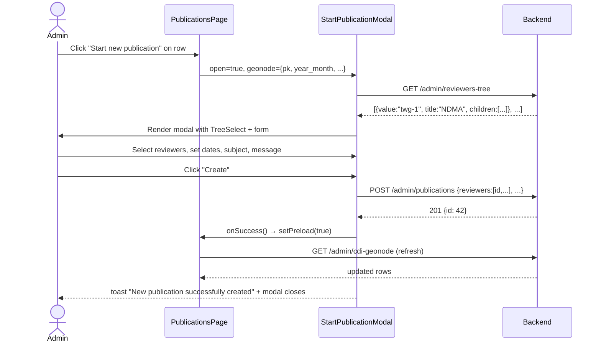

# Feature Design: CDI Publication — Start New Publication (Modal)

**Task ID**: Track 2 — Start New Publication (no issue number yet)
**Author**: Team
**Date**: 2026-07-23
**Status**: Draft

---

## 1. Context & Problem Statement

```
Currently:
- "Start new publication" navigates the user to a dedicated full-page route:
  /publications/create?cdi_geonode_id=<pk>
- The form (PublicationForm.js) renders a custom checkbox-list of reviewers
  with a manual search + "Load more" flow — paginated and scroll-heavy.
- Reviewer selection is done via a flat List with per-item Checkbox; it requires
  multiple API calls and does not group reviewers by Technical Working Group.
- ComponentRasterPreview (raster availability for a selected month) is inline
  in the middle of the form, between Publication Date and Review Deadline.
- The form layout is a two-column panel that feels like a separate admin tool,
  not a quick action.

Goal:
- Convert "Start new publication" from a full-page route into an AntD Modal
  launched directly from the publications list row action button.
- Replace the flat checkbox-list reviewer selection with an AntD TreeSelect
  grouped by TechnicalWorkingGroup (ndma / moag / met / dwa / uneswa + an
  "Unassigned" group for reviewers with no TWG). Multi-select enabled.
- Move ComponentRasterPreview to the bottom of the modal (below the Message
  textarea), so the critical inputs (reviewer, dates, subject, message) are
  front-and-centre.
- Backend: add GET /admin/reviewers-tree that returns the reviewer list
  pre-grouped by TWG, suitable for AntD TreeSelect's treeData shape.
  Reuse the existing ReviewerListAPI queryset + UserReviewerSerializer.
- The /publications/create page/route is retained as-is (fallback deep-link).
```

---

## 2. Figma Reference

**Node**: `4252:172162` — "Create new publication"
**Page**: Version 4 (`3019:7977`)
**Link**: https://www.figma.com/design/gtNfp5n7NawbYW5u8cPrpT/Eswatini-Drought-platform?node-id=4252-172162&m=dev

### Modal layout (604 × 840 px)

```
┌─────────────────────────────────────────────────────┐
│ Create new publication                              ✕ │
├─────────────────────────────────────────────────────┤
│ Pick the sector and write a clear title +            │
│ description. The Protocol ID is auto-generated.      │
│ ──────────────────────────────────────────────────── │
│ Select the reviewer                                  │
│ [ Select team member (TreeSelect, multi)        ▾ ]  │
│   Selected chip: "Jane Dlamini (NDMA)"               │
│                                                      │
│ Publication date      │  Review deadline             │
│ [📅 YYYY-MM         ] │  [📅 YYYY-MM-DD          ]   │
│                                                      │
│ Subject                                              │
│ [ CDI Drought Map Review — YYYY-MM               ]   │
│                                                      │
│ Message                                              │
│ ┌──────────────────────────────────────────────────┐ │
│ │ Add reviewer notes...   (TinyEditor, height=200) │ │
│ └──────────────────────────────────────────────────┘ │
│                                                      │
│ ── Component raster availability (BOTTOM) ────────── │
│ [ ESI ✓ ] [ EVI2 ✓ ] [ SM — not available ]         │
│                                                      │
├─────────────────────────────────────────────────────┤
│                      [ Cancel ]  [ Create ]          │
└─────────────────────────────────────────────────────┘
```

---

## 3. Requirements

### User Acceptance Criteria
- [ ] Clicking "Start new publication" on a list row opens the **AntD Modal** — no navigation.
- [ ] "Select the reviewer" is an AntD **TreeSelect** in multi-select mode, reviewers grouped by TWG (NDMA / MoAg / MET / DWA / UNESWA / Unassigned).
- [ ] Each leaf shows reviewer name; expandable to see email.
- [ ] Publication Date and Review Deadline are **side-by-side** (flex row).
- [ ] Subject pre-filled from `CREATE_PUBLICATION_MAIL.subject + year_month`.
- [ ] Message is a **TinyEditor** (rich-text) pre-filled from `CREATE_PUBLICATION_MAIL.message`.
- [ ] Each selected reviewer chip in the TreeSelect shows **name + TWG abbreviation**, e.g. `Jane Dlamini (NDMA)`.
- [ ] `ComponentRasterPreview` is rendered **at the bottom** of the modal content.
- [ ] Cancel closes the modal; Create submits and refreshes the list.
- [ ] Success toast: "New publication successfully created".
- [ ] All existing field validations are preserved (reviewer required, dates required, subject required).

### Technical Acceptance Criteria
- [ ] New `GET /api/v1/admin/reviewers-tree` endpoint returns TWG-grouped tree (§4).
- [ ] No changes to `POST /admin/publications` payload.
- [ ] `/publications/create` page route **kept** (not removed).
- [ ] New `StartPublicationModal` component at `frontend/src/components/Modals/StartPublicationModal.js`.
- [ ] `publications/page.js` opens modal instead of `router.push(...)` for new publications.
- [ ] Jest covers: modal open/close, tree shape, form submit, onSuccess refresh.

---

## 4. Backend: New Endpoint

### Endpoint

| Method | URL | Purpose | Auth |
|--------|-----|---------|------|
| GET | `/api/v1/admin/reviewers-tree` | All reviewers pre-grouped by TWG for TreeSelect | JWT admin |

> `GET /admin/reviewers` (paginated, flat) is **unchanged**.

### Response Shape

```jsonc
// GET /api/v1/admin/reviewers-tree
// Returns ALL reviewers (not paginated) shaped for AntD TreeSelect treeData.
[
  {
    "value": "twg-1",
    "title": "NDMA (National Disaster Management Agency)",
    "selectable": false,
    "children": [
      {
        "value": 12,           // SystemUser.id — submitted value
        "title": "Jane Dlamini",
        "subtitle": "jane@ndma.gov.sz",
        "email_verified": true,
        "selectable": true
      }
    ]
  },
  {
    "value": "twg-5",
    "title": "UNESWA (University of Eswatini)",
    "selectable": false,
    "children": [ ... ]
  },
  {
    "value": "twg-unassigned",
    "title": "Unassigned",
    "selectable": false,
    "children": [ ... ]
  }
]
// Groups with zero members are omitted.
```

### POST /admin/publications payload (unchanged)

```jsonc
{
  "cdi_geonode_id": 4021,
  "year_month": "2026-05-01",
  "due_date": "2026-06-15",
  "subject": "CDI Drought Map Review — 2026-05",
  "message": "...",
  "reviewers": [12, 7],   // SystemUser.id list from TreeSelect selected values
  "initial_values": [],
  "download_url": "https://geonode…/download"
}
```

---

## 5. Backend: Implementation Details

### New `ReviewerTreeAPI` view (`v1_users/views.py`)

```python
class ReviewerTreeAPI(GenericAPIView):
    permission_classes = [IsAuthenticated, IsAdmin]

    def get(self, request, *args, **kwargs):
        qs = SystemUser.objects.filter(
            role=UserRoleTypes.reviewer,
        ).order_by("technical_working_group", "name")

        groups = {}
        unassigned = []
        for user in qs:
            twg = user.technical_working_group
            if twg:
                groups.setdefault(twg, []).append(user)
            else:
                unassigned.append(user)

        tree = []
        for twg_int, label in TechnicalWorkingGroup.FieldStr.items():
            members = groups.get(twg_int, [])
            if not members:
                continue
            tree.append({
                "value": f"twg-{twg_int}",
                "title": label,
                "selectable": False,
                "children": [
                    {
                        "value": u.id,
                        "title": u.name,
                        "subtitle": u.email,
                        "email_verified": u.email_verified,
                        "selectable": True,
                    }
                    for u in members
                ],
            })
        if unassigned:
            tree.append({
                "value": "twg-unassigned",
                "title": "Unassigned",
                "selectable": False,
                "children": [
                    {
                        "value": u.id,
                        "title": u.name,
                        "subtitle": u.email,
                        "email_verified": u.email_verified,
                        "selectable": True,
                    }
                    for u in unassigned
                ],
            })
        return Response(tree)
```

### URL registration (`v1_users/urls.py`)

```python
re_path(
    r"^(?P<version>(v1))/admin/reviewers-tree",
    ReviewerTreeAPI.as_view(),
    name="reviewer-tree",
),
```

**No model or migration changes needed.**

---

## 6. Frontend: Component Design

### `StartPublicationModal` component

**Path**: `frontend/src/components/Modals/StartPublicationModal.js`

```
StartPublicationModal (AntD Modal)
├── Props:
│     geonode    — PublicationGeonode row {pk, title, year_month, download_url}
│     open       — boolean
│     onClose    — () => void
│     onSuccess  — () => void (triggers list refresh)
├── Local state:
│     reviewerTree  []    — fetched from GET /admin/reviewers-tree on mount
│     loading       bool  — submit spinner
│     errors        {}    — field-level errors from POST
├── AntD Form (layout="vertical"):
│     name="reviewers"    TreeSelect (treeData, multiple, treeCheckable)
│                         labelRender: (label, value) => `${label} (${abbrevOf(value)})`
│                         abbrev derived from the group title already in treeData
│     name="year_month"   DatePicker (picker="month")
│     name="due_date"     DatePicker
│     name="subject"      Input
│     name="message"      TinyEditor (height=200, same as PublicationForm)
│     [ComponentRasterPreview yearMonth={yearMonth}]  ← bottom
└── Footer:
│     <Button onClick={onClose}>Cancel</Button>
│     <SubmitButton>Create</SubmitButton>
```

### TreeSelect configuration

Each selected chip must show **name + TWG abbreviation** (Q1 resolved). Use `labelRender` to build the chip label. No `TWG_ABBREV` constant is needed: the group `title` (e.g. `"NDMA (National Disaster Management Agency)"`) is already in `treeData`, and the abbreviation is its first token — `title.split(" (")[0]`. This keeps TWG identity in one authoritative place (the backend tree / `TWG_OPTIONS`) instead of re-encoding the `"twg-N" → abbrev` mapping in a third location.

```jsx
// Build userId → group title from treeData on fetch. The group title carries
// the abbrev as its first token, so no separate abbreviation map is required.
const userTwgMap = useMemo(() => {
  const map = {};
  reviewerTree.forEach((group) => {
    group.children?.forEach((leaf) => {
      map[leaf.value] = group.title; // e.g. 12 → "NDMA (National Disaster…)"
    });
  });
  return map;
}, [reviewerTree]);

<TreeSelect
  treeData={reviewerTree}
  multiple
  treeCheckable
  showCheckedStrategy={TreeSelect.SHOW_CHILD}
  placeholder="Select team member"
  treeNodeLabelProp="title"
  treeNodeFilterProp="title"
  showSearch
  style={{ width: "100%" }}
  labelRender={({ value, label }) => {
    // "NDMA (National Disaster…)" → "NDMA"; "Unassigned" → "Unassigned"
    const abbrev = (userTwgMap[value] || "").split(" (")[0];
    return abbrev ? `${label} (${abbrev})` : label;
  }}
/>
```

### Changes to `publications/page.js`

```diff
+ import StartPublicationModal from "@/components/Modals/StartPublicationModal";
+ const [selectedGeonode, setSelectedGeonode] = useState(null);

  // In ACTIONS column — "Start new publication" button:
-   onClick={() => router.push(`/publications/create?cdi_geonode_id=${pk}`)}
+   onClick={() => setSelectedGeonode(record)}

  // At bottom of JSX (alongside existing embed Modal):
+ <StartPublicationModal
+   geonode={selectedGeonode}
+   open={!!selectedGeonode && !selectedGeonode.publication_id}
+   onClose={() => setSelectedGeonode(null)}
+   onSuccess={() => { setSelectedGeonode(null); setPreload(true); }}
+ />
```

> `router.push` for Validate (rows with `publication_id`) is **unchanged**.

---

## 7. Decision Log

### D-1: Modal over page navigation

**Decision**: Replace `/publications/create` navigation with an inline AntD Modal.

**Rationale**: Figma design shows a compact modal. The form is short (5 fields). Keeps the admin in context (filter state, scroll position).

**Retained**: `/publications/create` route is NOT removed — kept as fallback.

### D-2: Server-side TWG grouping (`GET /admin/reviewers-tree`)

**Options**:
1. Client-side: fetch paginated flat list, transform into tree.
2. Server-side: new endpoint returns shaped `treeData`.

**Decision**: Option 2.

**Rationale**: Flat `/admin/reviewers` is paginated; fetching all pages client-side is fragile. Backend grouping is clean and the reviewer count is small (O(10–50)). Logic lives in one authoritative place.

### D-3: TinyEditor is kept in the modal — ✅ **confirmed**

**Decision**: Keep `TinyEditor` for the Message field inside the modal (same as `PublicationForm.js`).

**Rationale**: Product confirmed rich-text is required for the notification email body. TinyEditor is already a project dependency; the added weight is acceptable. Height set to `200` for modal ergonomics (vs `300` on the full-page form).

**Rejected**: `Input.TextArea` — plain text insufficient for formatted email body.

### D-4: `ComponentRasterPreview` at bottom

**Decision**: Raster preview below Message field.

**Rationale**: Teammate requirement + Figma design. It is advisory/informational, not a required input.

### D-5: In-place list refresh on success

**Decision**: `onSuccess` → `setPreload(true)` to re-fetch the table.

**Rationale**: No redirect needed when the form is in a modal. Refreshing the table is the clean SPA pattern.

---

## 8. Type / Constant Mappings

| TWG int | Backend label | Tree `value` key |
|---------|--------------|-----------------|
| 1 | NDMA (National Disaster Management Agency) | `twg-1` |
| 2 | MoAg (Ministry of Agriculture) | `twg-2` |
| 3 | MET (Meteorological Office) | `twg-3` |
| 4 | DWA (Department of Water Affairs) | `twg-4` |
| 5 | UNESWA (University of Eswatini) | `twg-5` |
| null | Unassigned | `twg-unassigned` |

---

## 9. Sequence Flow



---

## 10. Compatibility & Migration

- [ ] `/publications/create` route and `PublicationForm.js` — **untouched**.
- [ ] `GET /admin/reviewers` (flat, paginated) — **unchanged**.
- [ ] `POST /admin/publications` payload — **unchanged**.
- [ ] `UserReviewerSerializer` — **unchanged**.
- [ ] No DB migration required.

---

## 11. Security Considerations

- [ ] `GET /admin/reviewers-tree` guarded by `[IsAuthenticated, IsAdmin]`.
- [ ] TreeSelect leaf values (user IDs) validated server-side by existing POST logic.
- [ ] No new permissions introduced.

---

## 12. Testing Strategy

### Backend

| Test file | Cases |
|-----------|-------|
| `tests_admin_reviewers_tree_endpoint.py` (new) | Returns TWG groups; empty groups omitted; leaf `value` = user id; unassigned group present when `twg=null`; 403 non-admin; 401 unauthenticated |

### Frontend (Jest)

| Test file | Cases |
|-----------|-------|
| `StartPublicationModal.test.js` (new) | Modal renders when `open=true`; TreeSelect renders grouped nodes; submit calls POST with `reviewers=[id,...]`; `onSuccess` called on 201; Cancel closes modal without submit |
| `publications.test.js` (regression) | "Start new publication" click opens modal (not router.push); Validate click still routes |

### Manual

- [ ] Modal opens from list row; TreeSelect shows TWG groups + search
- [ ] Unassigned group appears for reviewers without TWG
- [ ] Dates and subject/message pre-filled correctly
- [ ] `ComponentRasterPreview` at bottom of modal
- [ ] Submit with no reviewer → validation error
- [ ] Successful submit → modal closes, list refreshes, toast shown
- [ ] `/publications/create?cdi_geonode_id=<pk>` still works (regression)

---

## 13. Estimation

| Task | Min | Max | Confidence |
|------|-----|-----|-----------|
| BE-1: `ReviewerTreeAPI` view + URL | 1h | 2h | High |
| BE-2: Backend tests (`reviewers-tree`) | 1h | 1.5h | High |
| FE-1: `StartPublicationModal` component | 3h | 5h | Medium |
| FE-2: Wire modal into `publications/page.js` | 0.5h | 1h | High |
| FE-3: Jest tests (modal + regression) | 1.5h | 2.5h | Medium |
| **Total** | **7h** | **12h** | |

---

## 14. Resolved Questions

| # | Question | Decision |
|---|---|---|
| Q1 | TreeSelect chip label | ✅ **Name + TWG abbreviation** — e.g. `Jane Dlamini (NDMA)` — via `labelRender` + `userTwgMap` |
| Q2 | Message field in modal: TextArea or TinyEditor? | ✅ **TinyEditor kept** — same as full-page form, height=200 |
| Q3 | Issue number for commit | ⏳ **To be provided by team** before any `git commit` |

---

## 15. References

- Figma node `4252:172162`: "Create new publication" modal
- Current create page: [`frontend/src/app/(auth)/publications/create/page.js`](frontend/src/app/(auth)/publications/create/page.js)
- Current form: [`frontend/src/components/Forms/PublicationForm.js`](frontend/src/components/Forms/PublicationForm.js)
- List page: [`frontend/src/app/(auth)/publications/page.js`](frontend/src/app/(auth)/publications/page.js)
- Raster preview: [`frontend/src/components/ComponentRasterPreview.js`](frontend/src/components/ComponentRasterPreview.js)
- Reviewer API: [`backend/api/v1/v1_users/views.py`](backend/api/v1/v1_users/views.py)
- TWG constants: [`backend/api/v1/v1_users/constants.py`](backend/api/v1/v1_users/constants.py)
- Backend cache spec: [`cdi-publication-backend.md`](cdi-publication-backend.md)
- List restyle spec: [`cdi-publication-frontend.md`](cdi-publication-frontend.md)

---

## Approval

| Role | Name | Date | Status |
|------|------|------|--------|
| Developer | Galih | | |
| Tech Lead | Iwan | | |
| Product | | | |
