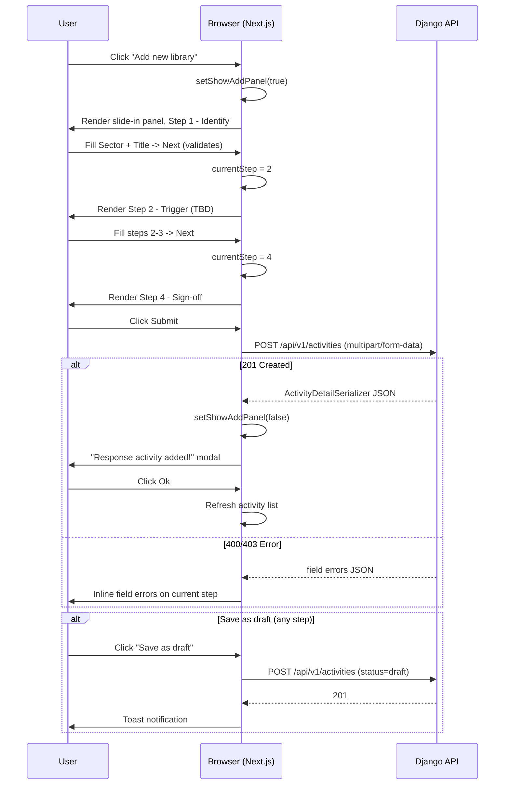

# Feature Design Document

## Feature: Activity Library — Add New Response Activity (4-Step Slide-In)

**Task ID**: TBD
**Author**: Galih Pratama
**Date**: 2026-07-14
**Status**: Draft — updated after Figma review (node 4139-141841)

---

## 1. Context & Problem Statement

```
Currently:
- The Activity Library page (/activity-library) is fully implemented: list,
  filter, search, export, and metrics cards.
- The "Add new library" button in the page header is present but wired to nothing.
- Users (admin or sector-lead reviewer) have no UI path to create a new
  ResponseActivity record.

Goal:
- Clicking "Add new library" opens a RIGHT-SIDE SLIDE-IN PANEL (604px wide,
  positioned anchored to the right of the page, overlaying content).
- The panel hosts a 4-step wizard:
    Step 1 — Identify   (Sector [shown as "Team member" in Figma], Protocol ID [auto], Title, Description)
    Step 2 — Trigger    (trigger conditions)
    Step 3 — Ownership  (owner/coord fields)
    Step 4 — Sign-off   (source doc + submit)
- Each step has a persistent bottom bar: [Save as draft] | [Cancel] [Next/Submit]
- On submit: POST /api/v1/activities (multipart/form-data).
- On success: show "Response activity added!" modal (Figma 3610-132022),
  close panel, refresh list.
- Zero backend changes are required.
```

---

## 2. Requirements

### User Acceptance Criteria

- [ ] Clicking "Add new library" opens the 604px slide-in panel from the right
- [ ] Panel header: "Add new response activity" + X close button
- [ ] 4-step progress bar at top of panel: Step 1 Identify → Step 2 Trigger → Step 3 Ownership → Step 4 Sign-off
- [ ] **Step 1 — Identify**:
  - Section heading "Identity" with helper text
  - Sector (required) — Select dropdown; placeholder "Select team member" (Figma label); maps to `sector` int on backend
  - Protocol ID — Read-only text input; auto-generated from sector on save; placeholder "ID"
  - Title (required) — Text input; placeholder "title"
  - Description (optional) — Textarea 100px; placeholder "Add reviewer notes..."
  - Footer: [Save as draft] on left | [Cancel] [Next] on right
- [ ] **Step 2 — Trigger** (all optional):
  - D-class threshold segmented pill: `None | D0 | D1 | D2 | D3 | D4`
  - "for at least [N] consecutive months" number input (w=143px)
  - 5 indicator rows with `[≥|≤]` operator toggle + number input: Water demand indicator, Susceptibility to drought threshold, Cattle count, Land use share, Population
  - Other condition free-text textarea (h=100px)
  - Live preview banner: "Would fire for N of 59 Tinkhundla"
  - Footer: [Save as draft] | [Back] [Next]
- [ ] **Step 3 — Ownership** (all optional):
  - Owner text input (label "Owner (role + organisation)", placeholder "DWA")
  - Coordinating partners text input (placeholder "title")
  - Type of activity radio card group: `[Institutional] [Public]` (border #d2d2d2, radius 8px, radio on right)
  - Footer: [Save as draft] | [Back] [Next]
- [ ] **Step 4 — Source & sign-off** (all optional):
  - Source document reference text input (placeholder "Title, section, or page reference for the source.")
  - File upload zone: click-to-upload or drag-and-drop, accepts SVG/PNG/JPG/GIF (max. 800×400px)
  - Notes textarea (h=100px, placeholder "Add reviewer notes...")
  - Footer: [Save as draft] | [Back] [**Publish**] (primary CTA is Publish, not Next)
- [ ] Next validates required fields (Sector + Title) before advancing from Step 1
- [ ] Back button returns to previous step, preserving all entered data
- [ ] Cancel closes the panel without saving
- [ ] Save as draft calls `POST /api/v1/activities` with `status=draft`
- [ ] 201 response shows success modal; Ok closes panel and refreshes list
- [ ] 400/403 errors shown as inline field errors
- [ ] X button closes the panel without saving

### Out of Scope

- Editing existing activities (separate ticket)
- Trigger live-preview panel on Step 2 (deferred)
- Live-preview Tinkhundla count on Step 2 (static banner only; no API call)

### Technical Acceptance Criteria

- [ ] Slide-in panel rendered as a right-anchored overlay on the `/activity-library` page (no new route)
- [ ] Panel is 604px wide, full-height, with `position: fixed; right: 0; top: 0`
- [ ] Backdrop/overlay behind panel; click-outside does NOT close (only Cancel/X closes)
- [ ] `formData` state managed in `ActivityLibraryPage` (or a context) and persisted across steps
- [ ] Step 4 submit: assemble `FormData`, call `api("POST", "/activities", fd)`
- [ ] `triggers` JSON serialised via `JSON.stringify` before appending to FormData
- [ ] Zero new backend endpoints, migrations, or model changes
- [ ] `python manage.py test api.v1.v1_activity` passes unchanged
- [ ] Jest tests cover Step 1 field validation + panel open/close behaviour

---

## 3. Data Model Changes

**None.** All fields exist on `ResponseActivity` and are handled by `ActivityWriteSerializer`.

---

## 4. API Contract

### Endpoint (existing, no changes)

| Method | URL | Purpose | Auth |
|--------|-----|---------|------|
| `POST` | `/api/v1/activities` | Create ResponseActivity | Required (`CanManageActivity`) |

### Request — multipart/form-data

```
POST /api/v1/activities
Content-Type: multipart/form-data

sector          = 1                  # required (ActivitySector int)
title           = "Activity Title"   # required (max 255)
description     = "..."              # optional
triggers        = '{"dclass":...}'   # optional (JSON string)
owner           = "Ministry of..."   # optional (max 255)
coord_with      = "UNICEF"           # optional (max 255)
response_type   = 1                  # optional (1=Public, 2=Institutional)
source_doc      = "https://..."      # optional (max 255)
source_file     = <binary>           # optional (File)
```

### Response — 201 Created

```json
{
  "id": 42,
  "code": "ACT-FOOD-001",
  "title": "Activity Title",
  "sector": 1,
  "sector_label": "Food & Agriculture",
  "status": 1,
  "status_label": "Draft",
  "version": "v1.0",
  "triggers": { "dclass": { "class": 3, "months": 2 }, "vuln": null, "exp": [], "other": null },
  "trigger_summary": "D2 for >=2 months",
  "owner": "Ministry of Health",
  "coord_with": "UNICEF",
  "response_type": 1,
  "response_type_label": "Public",
  "source_doc": "https://...",
  "source_file": null,
  "signoffs": [],
  "history": [{ "id": 1, "from_status": null, "to_status": 1, "action_label": "Created" }]
}
```

### Error — 400 Bad Request

```json
{ "sector": ["This field is required."], "title": ["This field may not be blank."] }
```

### Error — 403 Forbidden (sector mismatch for reviewer)

```json
{ "sector": ["You can only create activities in your own sector."] }
```

---

## 5. Architecture Overview

### Logic Flow

```
ActivityLibraryPage
  "Add new library" Button -> setShowAddPanel(true)

<AddActivitySlideIn open={showAddPanel} onClose={...}>  [NEW]
  Header: "Add new response activity" + X close
  Progress: Step 1 Identify | Step 2 Trigger | Step 3 Ownership | Step 4 Sign-off
  Card Content:
    switch(currentStep):
      1 -> <Step1Identify />   (Sector Select, Protocol ID [RO], Title, Description)
      2 -> <Step2Trigger />    (TBD)
      3 -> <Step3Ownership />  (TBD)
      4 -> <Step4Signoff />    (TBD)
  Bottom bar:
    [Save as draft]              [Cancel] [Next / Submit]

  On Next (Step 1):
    validate teamMember + title -> advance currentStep
  On Save as draft:
    assemble FormData -> api("POST", "/activities", fd)  (status = draft)
  On Submit (Step 4):
    assemble FormData -> api("POST", "/activities", fd)
      201 -> close panel, show ActivityAddedModal
      4xx -> inline field errors
```

### Mermaid Sequence Diagram



---

## 6. Frontend Components

### New Files

| File | Purpose |
|------|---------|
| `components/ActivityLibrary/AddActivity/AddActivitySlideIn.js` | Slide-in panel wizard shell coordinating transitions and form state |
| `components/ActivityLibrary/AddActivity/Step1Identify.js` | Step 1 Form component (Sector dropdown, Title input, Description textarea) |
| `components/ActivityLibrary/AddActivity/Step2Trigger.js` | Step 2 Form component (dclass pill, consecutive months, 5 indicator rows) |
| `components/ActivityLibrary/AddActivity/Step3Ownership.js` | Step 3 Form component (Owner input, coordinating partners, radio cards) |
| `components/ActivityLibrary/AddActivity/Step4Signoff.js` | Step 4 Form component (Source doc ref, file upload dropzone, notes) |
| `components/Modals/ActivityAddedModal.js` | Success modal matching Figma node 3610-132022 |

### Modified Files

| File | Change |
|------|--------|
| `components/ActivityLibrary/ActivityLibraryPage.js` | Add `showAddPanel` state; mount `<AddActivitySlideIn>`; wire "Add new library" button |

### Shared `formData` State Shape

```js
{
  // Step 1 — Identify
  sector: null,         // int: 1–8 (required) — shown as "Sector" / "Team member" in Figma placeholder
  protocol_id: "",      // string: READ-ONLY, auto-generated on save by backend
  title: "",            // string (required, max 255)
  description: "",      // string (optional)

  // Step 2 — Trigger (TBD after Figma Step 2 review)
  triggers: {
    dclass: null,       // { class: int|null, months: int } | null
    vuln: null,         // { op: int, value: int } | null
    exp: [],            // [{ indicator, op, value }]
    other: null,        // string | null
  },

  // Step 3 — Ownership (TBD after Figma Step 3 review)
  owner: "",            // string — label "Owner (role + organisation)"; placeholder "DWA"
  coord_with: "",       // string — label "Coordinating partners"; placeholder "title"
  response_type: null,  // int: 1=Institutional | 2=Public — radio card group

  // Step 4 — Sign-off (TBD after Figma Step 4 review)
  source_doc: "",       // string
  source_file: null,    // File object | null
}
```

> **Note**: The Figma placeholder text says "Select team member" but this field maps to `sector` (int 1–8) on the backend. The Protocol ID is auto-generated from the sector on save.

### FormData Assembly (Step 4 Submit)

```js
const fd = new FormData();
fd.append("sector", formData.sector);
fd.append("title", formData.title);
if (formData.description)    fd.append("description", formData.description);
if (formData.triggers)       fd.append("triggers", JSON.stringify(formData.triggers));
if (formData.owner)          fd.append("owner", formData.owner);
if (formData.coord_with)     fd.append("coord_with", formData.coord_with);
if (formData.response_type)  fd.append("response_type", formData.response_type);
if (formData.source_doc)     fd.append("source_doc", formData.source_doc);
if (formData.source_file)    fd.append("source_file", formData.source_file);
await api("POST", "/activities", fd);
```

---

## 7. UI Wireframes

### Step Progress Bar (top of all steps)

```
[FILLED]--[EMPTY]--[EMPTY]--[EMPTY]
   1          2        3        4
 Basic     Trigger  Ownership Source
  Info     Cond.
```

### Step 1 — Identify (Figma node 4139-141841)

```
+----------------------------------------------------+
| Add new response activity              [x]         | <- Header (sticky, border-bottom)
+----------------------------------------------------+
| [●]─────────────[○]─────────────[○]─────────[○]   | <- Progress bar
|  Step 1          Step 2          Step 3     Step 4 |
|  Identify        Trigger         Ownership  Sign-off|
+----------------------------------------------------+
|                                                    |
|  Identity                                          | <- H6 20px medium #333
|  Pick the sector and write a clear title +         | <- body 16px #606060
|  description. Protocol ID is auto-generated        |
|  from the sector on save.                          |
|  ─────────────────────────────────────────         | <- divider
|                                                    |
|  Sector *                                          | <- label 14px #606060
|  [ Select team member (= sector)            v ]   | <- AntD Select; maps to sector int
|                                                    |
|  Protocol ID                                       | <- label 14px #606060
|  [ ID                                        ]     | <- Input disabled/read-only
|                                                    |
|  Title *                                           | <- label 14px #606060
|  [ title                                     ]     | <- Input
|                                                    |
|  Description                                       | <- label 14px #606060
|  [ Add reviewer notes...                     ]     | <- Textarea h=100px
|  [                                           ]     |
|                                                    |
+----------------------------------------------------+
| [Save as draft]           [Cancel]  [Next]         | <- Footer (sticky border-top)
|  #485d92 link-style       white btn  #3e5eb9 btn   |
+----------------------------------------------------+
```

### Step 2 — Trigger Conditions (all optional)

```
+----------------------------------------------------+
| Add new response activity              [x]         | <- Header (sticky)
+----------------------------------------------------+
| [✓]─────────────[●]─────────────[○]─────────[○]   | <- Progress: Step 1 checked
|  Step 1          Step 2          Step 3     Step 4 |
|  Identify        Trigger         Ownership  Sign-off|
+----------------------------------------------------+
|                                                    |
|  Trigger condition                                 | <- H6 20px medium #333
|  Define the conditions that make this Response     | <- body 16px #606060
|  activity fire for an Inkhundla. The live preview  |
|  below shows how many Tinkhundla it would fire for |
|  if activated against current data.                |
|  ─────────────────────────────────────────         | <- divider
|                                                    |
|  D-class threshold:                                | <- label 14px #606060
|  [ None ][ D0 ][ D1 ][ D2 ][D3][ D4 ]            | <- segmented pill
|                          (active = filled solid)   |    bg #eceff8; active: #3e5eb9/#c23f01/#b10d0b
|                                              Amount|
|  for at least [N] consecutive months  [ 0,75   ]  | <- num input w=143px
|                                                    |
|  Water demand indicator          [≥][≤]  [ 0,75 ] | <- indicator row
|  Susceptibility to drought       [≥][≤]  [ 0,75 ] | <- indicator row
|  Cattle count                    [≥][≤]  [ 0,75 ] | <- indicator row
|  Land use share                  [≥][≤]  [ 0,75 ] | <- indicator row
|  Population                      [≥][≤]  [ 0,75 ] | <- indicator row
|   (operator toggle: ≥=blue active, ≤=inactive)     |
|                                                    |
|  Other condition (free-form)                       | <- label 14px #606060
|  [ Add reviewer notes...                     ]     | <- Textarea h=100px
|  [                                           ]     |
|                                                    |
|  [ℹ] Would fire for N of 59 Tinkhundla            | <- Alert banner bg #eceff8
|                                                    |
+----------------------------------------------------+
| [Save as draft]              [Back]   [Next]       | <- Footer (Back replaces Cancel)
+----------------------------------------------------+
```


### Step 3 — Ownership (Figma node 4139-147991, all optional)

```
+----------------------------------------------------+
| Add new response activity              [x]         | <- Header (sticky)
+----------------------------------------------------+
| [✓]─────────────[✓]─────────────[●]─────────[○]   | <- Steps 1+2 checked
|  Step 1          Step 2          Step 3     Step 4 |
|  Identify        Trigger         Ownership  Sign-off|
+----------------------------------------------------+
|                                                    |
|  Ownership                                         | <- H6 20px medium #333
|  Who owns the action and who coordinates.          | <- body 16px #606060
|  Detailed resource planning is handled             |
|  operationally - not encoded in the Response       |
|  activities.                                       |
|  ─────────────────────────────────────────         | <- divider
|                                                    |
|  Owner (role + organisation)                       | <- label 14px #606060
|  [ DWA                                       ]     | <- Text input; placeholder "DWA"
|                                                    |
|  Coordinating partners                             | <- label 14px #606060
|  [ title                                     ]     | <- Text input; placeholder "title"
|                                                    |
|  Type of activity                                  | <- label 14px #606060
|  +----------------------+ +----------------------+ |
|  |  Institutional    ○  | |  Public           ○  | | <- Radio card group
|  +----------------------+ +----------------------+ |
|   (border #d2d2d2, radius 8px, radio on right)     |
|                                                    |
+----------------------------------------------------+
| [Save as draft]              [Back]   [Next]       | <- Footer
+----------------------------------------------------+
```


### Step 4 — Source & Sign-off (Figma node 4139-153712, all optional)

```
+----------------------------------------------------+
| Add new response activity              [x]         | <- Header (sticky)
+----------------------------------------------------+
| [✓]─────────────[✓]─────────────[✓]─────────[●]   | <- Steps 1-3 checked
|  Step 1          Step 2          Step 3     Step 4 |
|  Identify        Trigger         Ownership  Sign-off|
+----------------------------------------------------+
|                                                    |
|  Source & sign-off                                 | <- H6 20px medium #333
|  Anchor the Response activity to a source document | <- body 16px #606060
|  and attach the file. The version is set at v1.0  |
|  for new Response activities; it auto-bumps only   |
|  on Approved → Active transitions.                 |
|  ─────────────────────────────────────────         | <- divider
|                                                    |
|  Source document reference                         | <- label 14px #606060
|  [ Title, section, or page reference for the... ] | <- Text input full-width
|                                                    |
|  +--------------------------------------------------+ |
|  |        [↑]                                      | |
|  |  Click to upload the source file or drag & drop | | <- Upload zone
|  |  SVG, PNG, JPG or GIF (max. 800×400px)         | |  border #d2d2d2, full-width
|  +--------------------------------------------------+ |
|                                                    |
|  Notes                                             | <- label 14px #606060
|  [ Add reviewer notes...                     ]     | <- Textarea h=100px
|  [                                           ]     |
|                                                    |
+----------------------------------------------------+
| [Save as draft]              [Back]  [Publish]     | <- Footer; "Publish" replaces "Next"
+----------------------------------------------------+
```


### Success Modal (Figma node 3610-132022)

```
+---------------------------------------------+  shadow/xl: 0px 20px 24px -4px rgba(16,24,40,0.08)
|                                             |             0px 8px 8px -4px rgba(16,24,40,0.03)
|  [check-square icon]                        |  <- 48×48 circle, bg #eceff8 (brand-primary-50)
|  (icon centered, 20×20)                     |     radius 28px
|                                             |
|  Response activity added!                   |  <- H6 20px medium #333 (Inter:Medium)
|                                             |
|  Your activity has been added to            |  <- body 16px regular #606060 (Inter:Regular)
|  the system.                                |
|                                             |
|  +---------------------------------------+  |
|  |                 Ok                    |  |  <- Primary btn, full-width, bg #3e5eb9, text white
|  +---------------------------------------+  |     py=12px px=24px
|                                             |
+---------------------------------------------+
  (decorative map-contour bg pattern, 10% opacity, rotated 90°)
```


---

## 8. Type / Constant Mappings

### ActivitySector (Step 1 dropdown)

| Label | `sector` int |
|---|---|
| Food & Agriculture | 1 |
| Health & Nutrition | 2 |
| Water & Sanitation | 3 |
| Education | 4 |
| Environment & Energy | 5 |
| Coordination | 6 |
| Social Protection | 7 |
| Transport & Logistics | 8 |

### ActivityResponseType (Step 3 select)

| Label | `response_type` int |
|---|---|
| Public | 1 |
| Institutional | 2 |

### TriggerOperator (Step 2 operator selects)

| Label | `op` int |
|---|---|
| >= (greater than or equal) | 1 |
| <= (less than or equal) | 2 |

### Drought Class / DroughtCategory (Step 2 dclass)

| Label | `dclass.class` int |
|---|---|
| (none / not set) | null |
| D0 | 1 |
| D1 | 2 |
| D2 | 3 |
| D3 | 4 |
| D4 | 5 |

### Exposure Indicators (Step 2 exp rows)

| Label | Indicator Name |
|---|---|
| Water demand indicator | `"water"` |
| Susceptibility to drought threshold | `"susceptibility"` |
| Cattle count | `"cattle"` |
| Land use share | `"land_use"` |
| Population | `"population"` |

---

## 9. Security Considerations

- [ ] `CanManageActivity` enforced server-side (admin or matching-sector reviewer)
- [ ] Sector restriction enforced in `ActivityWriteSerializer.create()` — surfaced as field error
- [ ] File upload validated by `files.validate_source_file()`
- [ ] Trigger JSON validated by `validate_triggers()`
- [ ] No new attack surface; uses existing authenticated `api()` helper

---

## 10. Testing Strategy

| Test Type | What to Test |
|-----------|-------------|
| Unit - Step1BasicInfo | Required field validation; Next blocked when sector/title empty |
| Unit - Step2Triggers | Exposure row add/remove; triggers object assembled correctly |
| Unit - Step3Ownership | Optional fields; state updated correctly |
| Unit - Step4Source | File stash (beforeUpload); source_doc input |
| Unit - AddActivityPage | Step progression; Back preserves state; FormData assembled correctly |
| Unit - ActivityAddedModal | Renders on success; Ok calls router.push |
| Integration | `api("POST", "/activities", fd)` called with correct multipart payload |
| Backend (existing) | `python manage.py test api.v1.v1_activity` -- all pass unchanged |

---

| Task | Min | Max | Confidence |
|------|-----|-----|------------|
| T1: `AddActivitySlideIn.js` Wizard shell + `Step1Identify.js` Form component | 3h | 5h | High |
| T2: `Step2Trigger.js` Form component (dclass pill, months, 5 indicator rows, preview banner) | 3h | 5h | Medium |
| T3: `Step3Ownership.js` Form component (Owner, coordinating, Type of activity radio cards) | 1h | 2h | High |
| T4: `Step4Signoff.js` Form component (Source doc ref, File upload input, Notes) + submit handler | 2h | 3h | High |
| T5: `ActivityAddedModal.js` success modal | 0.5h | 1h | High |
| T6: Wire slide-in mount + success modal to `ActivityLibraryPage.js` | 0.5h | 1h | High |
| T7: Jest unit tests for the shell and step components | 1.5h | 3h | Medium |
| **Total** | **11.5h** | **20h** | - |

> **Risk**: T3 (Step 2 triggers) is the highest-risk task due to the exposure row repeater.
> If too complex, simplify to a JSON textarea for v1 and defer the full trigger builder UI.

---

## 12. Open Questions

- [ ] **Trigger preview**: Should Step 2 include live preview via `POST /api/v1/activities/trigger-preview`?
  Current plan: **no** -- deferred to separate ticket.
- [ ] **Step 2 simplification**: If the full trigger builder UI is too complex for this ticket,
  should we ship Step 2 as a plain JSON textarea?

---

## 13. References

- Previous spec: `eswatini-v2/docs/track-3/activity-library.md`
- Backend serializer: `backend/api/v1/v1_activity/serializers.py`
- Backend validators: `backend/api/v1/v1_activity/validators.py`
- Backend constants: `backend/api/v1/v1_activity/constants.py`
- Existing route: `frontend/src/app/(auth)/activity-library/page.js`
- Figma Step 1 (Basic Info): node `4139-136226`
- Figma Step 2 (Triggers): node `4139-141948`
- Figma Step 3 (Ownership): node `4139-147990`
- Figma Step 4 (Source Doc): node `4139-153390`
- Figma Success Modal: node `3610-132022`

---

## Approval

| Role | Name | Date | Status |
|------|------|------|--------|
| Developer | | | |
| Tech Lead | | | |
| Product | | | |
