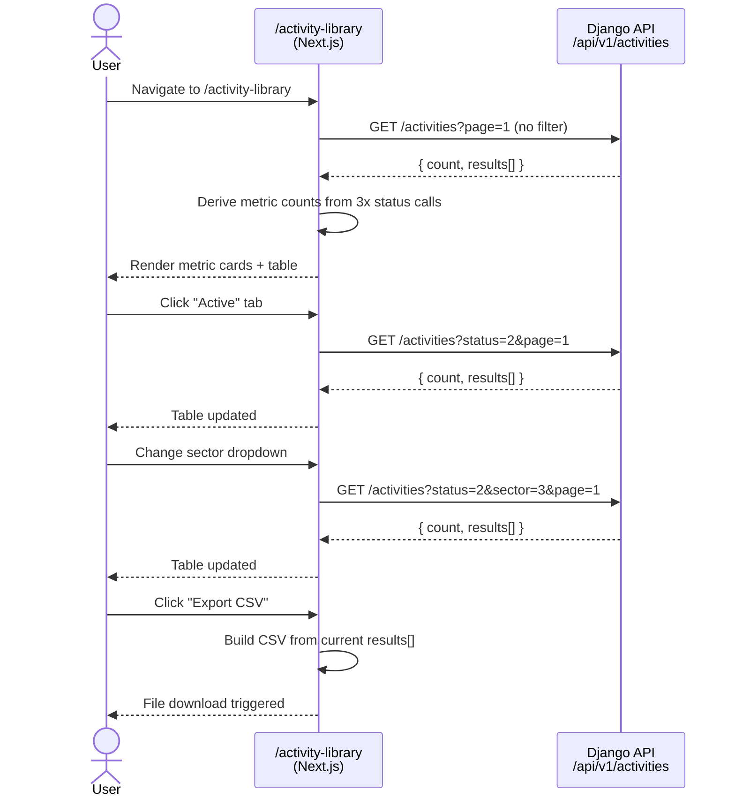

# Feature Design Document

## Feature: Activity Library

**Task ID**: TBD
**Author**: Galih Pratama
**Date**: 2026-07-13
**Status**: Approved

---

## 1. Context & Problem Statement

```
Currently:
- The Activity Library backend (v1_activity) is fully implemented: models,
  serializers, views, permissions, and endpoints all exist.
- There is NO frontend page exposing the library to authenticated users.
- Users in Track 3 (Operational Response) cannot browse, filter, or export
  the response activity (SOP) catalogue from the UI.

Goal:
- Build the frontend /activity-library page matching the Figma design
  (node 3483-63179) and wire it to the ready backend endpoints.
- Minor backend serializer gap: `owner` field is missing from the list
  serializer — add it so the table Owner column renders correctly.
```

---

## 2. Requirements

### User Acceptance Criteria

- [ ] Authenticated users can view the Activity Library page at `/activity-library`
- [ ] Page shows three summary metric cards: **Active**, **Draft**, **Archived** counts
- [ ] Table renders columns: Status badge | Protocol ID | Title | Sector badge | Owner | Version | Last Reviewed | Actions
- [ ] Status filter tabs (All / Active / Draft / Archived) filter the table via API
- [ ] "All Sectors" dropdown filters activities by sector via API
- [ ] Search input sends `?search=` to the backend and filters by title / protocol ID
- [ ] Pagination matches backend paginated response
- [ ] "Export CSV" button triggers a backend CSV download of the current filtered list
- [ ] "View" column renders a text link per row *(drawer/modal deferred — separate ticket)*
- [ ] "Add new activity" button is **out of scope** — separate ticket
- [ ] "Last updated" badge in the page header shows the most-recent `updated_at` value

### Out of Scope (this ticket)

- View activity drawer / detail modal
- Add new activity creation wizard

### Technical Acceptance Criteria

- [ ] `ActivityListSerializer` exposes `owner` field (additive, no migration)
- [ ] `ResponseActivityViewSet` supports `?search=` query param (title + code icontains)
- [ ] New `GET /api/v1/activities/export` endpoint returns a CSV file response
- [ ] Frontend fetches `/api/v1/activities?status=&sector=&search=&page=` with JWT auth
- [ ] Export button calls `/api/v1/activities/export?status=&sector=&search=` and triggers file download
- [ ] No new DB migrations required
- [ ] Existing backend tests pass unchanged

---

## 3. Data Model Changes

### No new models required.

### Modified Serializer Only

| Serializer | Change | Reason |
|---|---|---|
| `ActivityListSerializer` | Add `owner` field | Design shows Owner column in table |

```python
# backend/api/v1/v1_activity/serializers.py
class ActivityListSerializer(serializers.ModelSerializer):
    # ADD owner to fields:
    class Meta:
        model = ResponseActivity
        fields = [
            "id", "code", "title", "sector", "sector_label",
            "status", "status_label", "version", "trigger_summary",
            "response_type", "owner",    # <-- added
            "updated_at",
        ]
```

> **"Last Reviewed" column** maps to `updated_at` — no new model field needed.

### Modified Views

**1. Add `?search=` to `ResponseActivityViewSet.get_queryset()`:**

```python
def get_queryset(self):
    queryset = ResponseActivity.objects.all().order_by("-created_at")
    sector = self.request.query_params.get("sector")
    status_param = self.request.query_params.get("status")
    search = self.request.query_params.get("search")    # <-- new
    if sector:
        queryset = queryset.filter(sector=sector)
    if status_param:
        queryset = queryset.filter(status=status_param)
    if search:                                           # <-- new
        queryset = queryset.filter(
            models.Q(title__icontains=search) |
            models.Q(code__icontains=search)
        )
    return queryset
```

**2. New `ActivityExportAPI` view** returning CSV:

```python
# GET /api/v1/activities/export
class ActivityExportAPI(APIView):
    permission_classes = [IsAuthenticated]

    def get(self, request, version):
        # Reuse same filter logic as the list view
        queryset = ResponseActivity.objects.filter(
            deleted_at__isnull=True
        ).order_by("-created_at")
        sector = request.query_params.get("sector")
        status_param = request.query_params.get("status")
        search = request.query_params.get("search")
        if sector:
            queryset = queryset.filter(sector=sector)
        if status_param:
            queryset = queryset.filter(status=status_param)
        if search:
            queryset = queryset.filter(
                models.Q(title__icontains=search) |
                models.Q(code__icontains=search)
            )
        # Build CSV
        import csv
        from django.http import HttpResponse
        response = HttpResponse(content_type="text/csv")
        response["Content-Disposition"] = \
            'attachment; filename="activities.csv"'
        writer = csv.writer(response)
        writer.writerow(["Protocol ID", "Title", "Sector", "Owner",
                         "Version", "Status", "Last Updated"])
        for a in queryset:
            writer.writerow([
                a.code, a.title,
                ActivitySector.FieldStr.get(a.sector, ""),
                a.owner or "", a.version,
                ActivityStatus.FieldStr.get(a.status, ""),
                a.updated_at.strftime("%Y-%m-%d"),
            ])
        return response
```

### Migration Strategy

None — `owner` is an existing model `CharField`; only excluded from the
list serializer. No schema changes needed.

---

## 4. API Contract

### Endpoints Used

| Method | URL | Purpose | Auth | New? |
|--------|-----|---------|------|------|
| `GET` | `/api/v1/activities` | Paginated list (`?sector=&status=&search=&page=`) | Required | Search param only |
| `GET` | `/api/v1/activities/export` | CSV file download (`?sector=&status=&search=`) | Required | **New** |

### Query Parameters (list + export)

| Param | Type | Values |
|-------|------|--------|
| `sector` | int | 1 Food & Agri · 2 Health · 3 WASH · 4 Edu · 5 Env · 6 Coord · 7 Social · 8 Transport |
| `status` | int | 1 Draft · 2 Active · 3 Archived |
| `search` | string | Case-insensitive substring match on `title` and `code` |
| `page` | int | Page number — list endpoint only |

### List Response Shape (after serializer fix)

```json
{
  "count": 7,
  "next": null,
  "previous": null,
  "results": [
    {
      "id": 1,
      "code": "ACT-WASH-1",
      "title": "Borehole reinforcement & monitoring",
      "sector": 3,
      "sector_label": "Water & Sanitation",
      "status": 2,
      "status_label": "Active",
      "version": "v1.0",
      "trigger_summary": "D2+ for ≥1 month",
      "response_type": 1,
      "owner": "Eswatini Water Services + Red Cross",
      "updated_at": "2024-05-26T06:12:00Z"
    }
  ]
}
```

> **Metric card counts** (Active / Draft / Archived) are derived by three
> parallel GET requests with `?status=1`, `?status=2`, `?status=3`
> — or from one full unfiltered fetch aggregated client-side. Given the
> expected small dataset (< 200 records), the single-fetch approach is fine.

---

## 5. Frontend Architecture

### Route

```
frontend/src/app/activity-library/
└── page.js          ← new Next.js App Router page (Server or Client Component)
```

### New Components

```
frontend/src/components/ActivityLibrary/
├── index.js                    ← barrel export
├── ActivityLibraryPage.js      ← shell: page header + metric cards + table
├── ActivityMetricCards.js      ← 3 summary stat cards (Active / Draft / Archived)
├── ActivityTable.js            ← AntD Table with status tags, sector badges,
│                                  pagination, and "View" per-row action
├── ActivityTableFilters.js     ← status tab switch + sector dropdown +
│                                  search input + Export CSV button
└── ActivityStatusTag.js        ← colour-coded status badge (reusable atom)
```

### Local State Shape

```js
// All state lives in ActivityLibraryPage — no global context needed
const [activities, setActivities] = useState([]);
const [counts, setCounts] = useState({ active: 0, draft: 0, archived: 0 });
const [loading, setLoading] = useState(true);
const [statusFilter, setStatusFilter] = useState('all'); // 'all' | 1 | 2 | 3
const [sectorFilter, setSectorFilter] = useState('all'); // 'all' | int
const [searchQuery, setSearchQuery] = useState('');
const [page, setPage] = useState(1);
const [total, setTotal] = useState(0);
```

### Data Fetching Pattern

```js
// frontend/src/lib/api is the existing axios wrapper
const params = new URLSearchParams({ page });
if (statusFilter !== 'all') params.set('status', statusFilter);
if (sectorFilter !== 'all') params.set('sector', sectorFilter);
const { data } = await api.get(`/api/v1/activities?${params}`);
```

### Sector Badge Colours

Defined in the frontend (`config.js` or inline constant) — NOT from the API
response (follows AGENTS.md mock-data contract):

| Sector | Colour token |
|--------|-------------|
| Food & Agriculture | green |
| Health & Nutrition | red |
| Water & Sanitation | blue |
| Education | yellow |
| Environment & Energy | teal |
| Coordination | purple |
| Social Protection | orange |
| Transport & Logistics | gray |

### ASCII Wireframe

```
┌──────────────────────────────────────────────────────────────────┐
│ Navbar: … | Detailed Insights | Activity Library* | About        │
├──────────────────────────────────────────────────────────────────┤
│ 📅 Last updated · 15 May 2026                                    │
│ Activity Library                      [Add new activity] ←admin  │
│ Standard Operating Procedures | 7 Activities | click row…        │
├───────────────┬─────────────────┬────────────────────────────────┤
│  Active       │  Draft          │  Archived                      │
│     7         │     0           │     0                          │
├───────────────┴─────────────────┴────────────────────────────────┤
│ Operation procedures         [🔍 Search…]          [Export CSV]  │
│ [All] [Active] [Draft] [Archived]              [All Sectors ▾]   │
├─────────┬────────────┬────────────────┬──────────┬───────┬───────┤
│ Status  │Protocol ID │ Title          │ Sector   │ Owner │Actions│
├─────────┼────────────┼────────────────┼──────────┼───────┼───────┤
│ Active  │ ACT-WASH-1 │ Borehole…      │ WASH     │ EWS…  │ View  │
│ Active  │ ACT-FOOD-1 │ Geotechnical…  │ Food     │ MoA…  │ View  │
│ Draft   │ ACT-ENV-1  │ Slope…         │ Env      │ …     │ View  │
├─────────┴────────────┴────────────────┴──────────┴───────┴───────┤
│ Previous                         [1]                        Next │
└──────────────────────────────────────────────────────────────────┘
```

### Sequence Diagram



### Export CSV

Triggered by the "Export CSV" button — calls the backend endpoint with the
current active filters and lets the browser download the file:

```js
const handleExport = async () => {
  const params = new URLSearchParams();
  if (statusFilter !== 'all') params.set('status', statusFilter);
  if (sectorFilter !== 'all') params.set('sector', sectorFilter);
  if (searchQuery) params.set('search', searchQuery);
  // Trigger file download via anchor
  const url = `/api/v1/activities/export?${params}`;
  const link = document.createElement('a');
  link.href = url;
  link.download = 'activities.csv';
  link.click();
};
```

### "Add new activity" Button

**Out of scope** for this ticket — separate ticket.

---

## 6. Type / Constant Mappings

| Frontend Label | Backend Constant | DB Value |
|----------------|-----------------|----------|
| Active | `ActivityStatus.active` | `2` |
| Draft | `ActivityStatus.draft` | `1` |
| Archived | `ActivityStatus.archived` | `3` |
| Food & Agriculture | `ActivitySector.food` | `1` |
| Health & Nutrition | `ActivitySector.health` | `2` |
| Water & Sanitation | `ActivitySector.wash` | `3` |
| Education | `ActivitySector.edu` | `4` |
| Environment & Energy | `ActivitySector.env` | `5` |
| Coordination | `ActivitySector.coord` | `6` |
| Social Protection | `ActivitySector.social` | `7` |
| Transport & Logistics | `ActivitySector.trans` | `8` |

---

## 7. Compatibility & Migration

- [x] No DB migration needed
- [x] Serializer change is purely additive — existing API consumers unaffected
- [x] Existing data preserved

---

## 8. Security Considerations

- [x] Route protected by `IsAuthenticated` middleware (already in place)
- [x] "Add new activity" button hidden for `reviewer` role via CASL
- [x] Read-only list page — no new write surface
- [x] CSV export uses already-authorized fetched data — no additional attack surface

---

## 9. Testing Strategy

### Backend

```bash
cd backend && python manage.py test api.v1.v1_activity --shuffle
```

| Test | Coverage |
|------|----------|
| `test_list_includes_owner` (new) | `GET /api/v1/activities` response contains `owner` key |
| `test_search_by_title` (new) | `GET /api/v1/activities?search=bore` returns matching rows only |
| `test_search_by_code` (new) | `GET /api/v1/activities?search=WASH` returns matching rows only |
| `test_export_csv_returns_file` (new) | `GET /api/v1/activities/export` returns `Content-Type: text/csv` |
| `test_export_csv_with_filters` (new) | Export with `?status=2` contains only Active rows |
| Existing suite | Must stay green after all changes |

### Frontend

```bash
cd frontend && yarn test
```

| Test File | What to cover |
|-----------|--------------|
| `ActivityTable.test.js` | Renders rows: status badge, code, title, sector badge, owner |
| `ActivityTableFilters.test.js` | Tab filter triggers refetch; sector dropdown fires refetch; search debounce fires `?search=` param |
| `ActivityMetricCards.test.js` | Correct Active / Draft / Archived counts displayed |

---

## 10. Decisions Log

| # | Question | Decision |
|---|----------|----------|
| D-1 | Issue number | TBD — confirm before first commit |
| D-2 | "View" row action | Drawer / modal — **deferred to separate ticket** |
| D-3 | "Add new activity" button | **Separate ticket** — out of scope |
| D-4 | Search | **Server-side** — `?search=` param on list + export endpoints |
| D-5 | CSV Export | **Backend endpoint** — `GET /api/v1/activities/export` |

---

## 11. Task Estimation

| # | Task | Min | Max | Confidence |
|---|------|-----|-----|------------|
| B-1 | Add `owner` to `ActivityListSerializer` + test | 0.5h | 1h | High |
| B-2 | Add `?search=` filter to `ResponseActivityViewSet.get_queryset()` + tests | 1h | 1.5h | High |
| B-3 | New `ActivityExportAPI` view + URL registration + tests | 1h | 2h | High |
| F-1 | `/activity-library` route + `ActivityLibraryPage` shell + navbar link check | 1h | 2h | High |
| F-2 | `ActivityMetricCards` (3 stat cards with live counts) | 1h | 2h | High |
| F-3 | `ActivityTable` — AntD Table, status tags, sector badges, pagination | 2h | 3h | High |
| F-4 | `ActivityTableFilters` — tab switch + sector dropdown + search (debounced) + Export CSV button | 2h | 3h | Medium |
| F-5 | Frontend unit tests (3 test files) | 2h | 3h | Medium |
| F-6 | Polish & responsive QA | 0.5h | 1h | High |
| **Total** | | **11h** | **18.5h** | |

---

## 12. References

- Figma: [Activity Library — node 3483-63179](https://www.figma.com/design/gtNfp5n7NawbYW5u8cPrpT/Eswatini-Drought-platform?node-id=3483-63179&m=dev)
- Backend app: [`backend/api/v1/v1_activity/`](file:///Users/galihpratama/Sites/eswatini-droughtmap-hub/backend/api/v1/v1_activity/)
- Serializers: [`serializers.py`](file:///Users/galihpratama/Sites/eswatini-droughtmap-hub/backend/api/v1/v1_activity/serializers.py)
- Views & URL routes: [`views.py`](file:///Users/galihpratama/Sites/eswatini-droughtmap-hub/backend/api/v1/v1_activity/views.py) · [`urls.py`](file:///Users/galihpratama/Sites/eswatini-droughtmap-hub/backend/api/v1/v1_activity/urls.py)
- Constants: [`constants.py`](file:///Users/galihpratama/Sites/eswatini-droughtmap-hub/backend/api/v1/v1_activity/constants.py)
- Track 3 docs folder: [`eswatini-v2/docs/track-3/`](file:///Users/galihpratama/Sites/eswatini-droughtmap-hub/eswatini-v2/docs/track-3/)

---

## Approval

| Role | Name | Date | Status |
|------|------|------|--------|
| Developer | | | |
| Tech Lead | | | |
| Product | | | |
