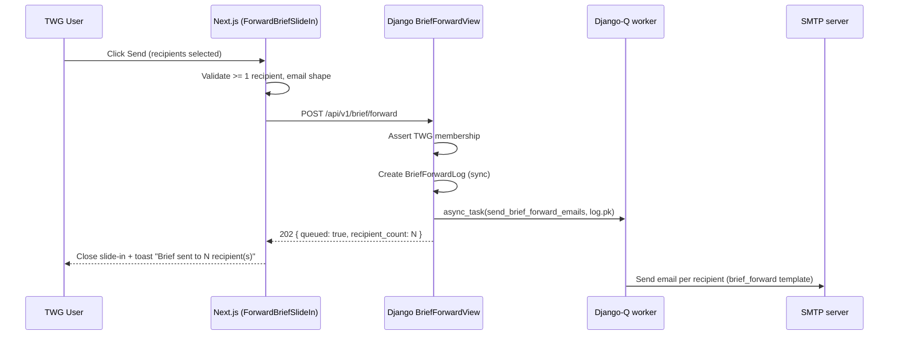

# Feature Design Document

## Feature: Brief Builder — Backend PDF Download & Email Forward (`BB-2`)

**Task ID**: BB-2
**Author**: Galih Pratama
**Date**: 2026-08-05
**Status**: Approved
**Track**: Track 3 — Operational response
**Figma**:
- [Brief Builder - selected · node `4155:169634`](https://www.figma.com/design/DCItYZPUbLX6B1T5XG4suI/Eswatini-Drought-platform--Copy-?node-id=4155-169634&m=dev) — Live preview section
- [Forward brief slide-in · node `4878:159328`](https://www.figma.com/design/gtNfp5n7NawbYW5u8cPrpT/Eswatini-Drought-platform?node-id=4878-159328&m=dev)

> **Predecessor**: BB-1 shipped the Brief Builder frontend — live preview, component panel, forward slide-in UI. All forms are fully built; no actual download or send was wired. This document covers BB-2: the backend that makes the two action buttons functional.

---

## 1. Context & Problem Statement

```
Currently (BB-1 as shipped):
- "Download PDF" renders as a primary button, disabled until an Inkhundla
  and at least one component are applied. When clicked, it does nothing.
  A tooltip says "PDF export is not available yet".
- "Forward to..." opens a full slide-in with recipient selection, optional note,
  CC-me toggle, and validation. On Send it shows an info toast: "Sending is
  not available yet" — no email is sent.
- ForwardBriefSlideIn shows recipients from useBriefRecipients
  (publications API). A new TWG multiselect filter has been requested
  above the individual-recipient list.

Goal for BB-2:
- Download PDF: call window.print() (browser print) scoped to the preview
  pane with a @media print stylesheet that isolates exactly the live preview
  section. File name follows DIH-brief_<Inkhundla>_<YYYY-MM>.pdf.
- Forward: POST /api/v1/brief/forward — accepts recipient list + optional
  note + current URL. Backend sends email via Django-Q async_task,
  then records the event in an audit log. Frontend wires the existing form.
- A new TWG multiselect filter is added to the slide-in recipient list,
  letting a user narrow recipients to one or more Technical Working Groups.
```

**Scope**: Backend new endpoint + audit model + Django-Q task + frontend wiring (print CSS, fetch POST, TWG filter, toast/modal feedback).

---

## 2. Requirements

### User Acceptance Criteria

**AC-7 . Download PDF**

- [ ] AC-7.1 — Only a signed-in TWG member with an Inkhundla applied can download.
  When they click "Download brief (PDF)" the browser print dialog opens,
  scoped to the live preview pane only; saving as PDF produces a file named
  `DIH-brief_<Inkhundla-slug>_<YYYY-MM>.pdf` (e.g. `DIH-brief_Big-Bend_2026-05.pdf`).
- [ ] AC-7.2 — Without an Inkhundla selected, the Download button is visibly
  disabled and a tooltip explains why. (Already implemented in BB-1; guard
  must remain after wiring the handler.)

**AC-8 . Forward-to**

- [ ] AC-8.1 — "Forward to..." button (already exists, already opens slide-in)
  wires Send to `POST /api/v1/brief/forward`. On success the slide-in closes.
- [ ] AC-8.2 — Sending with no recipient selected blocks at the frontend before
  any network call and shows an inline validation error.
- [ ] AC-8.3 — On successful send: slide-in closes, a toast shows
  "Brief sent to N recipient(s)", and the send event is written to the audit
  trail server-side.
- [ ] AC-8.4 (new) — A TWG multiselect appears above the individual-recipient
  list. When one or more TWGs are selected, only recipients belonging to those
  TWGs are shown. "All TWGs" (empty selection) shows everyone.

### Technical Acceptance Criteria

- [ ] Browser print (`window.print()`) with `@media print` CSS scoped to
  `#brief-print-area`. No server-side PDF renderer.
- [ ] `POST /api/v1/brief/forward` is `IsAuthenticated`; the backend also checks
  `technical_working_group is not None` and returns 403 otherwise (real
  server-side gate, not just a UI affordance).
- [ ] Email is dispatched via `django_q.tasks.async_task` — the HTTP response
  returns 202 Accepted immediately.
- [ ] Audit log stores: sender, recipients list, inkhundla_id, components list,
  brief_url, timestamp.
- [ ] Existing `send_email` / `email_helper.py` infrastructure is extended, not
  replaced.
- [ ] TWG multiselect derives its options from `TechnicalWorkingGroup.FieldStr`
  constants — no new endpoint.
- [ ] `yarn lint`, `yarn format:check`, `yarn build`, `yarn test` clean.
- [ ] `python manage.py test` for new backend code passes.
- [ ] No new `package.json` dependency.

---

## 3. Data Model Changes

### New Model: `BriefForwardLog`

The audit trail for the forward action. No `SoftDeletes` — audit rows must be immutable.

```python
# backend/api/v1/v1_publication/models.py  (append)

class BriefForwardLog(models.Model):
    """Immutable audit record for every "Forward brief" send."""

    sender = models.ForeignKey(
        "v1_users.SystemUser",
        on_delete=models.SET_NULL,
        null=True,
        related_name="brief_forwards",
    )
    # List of {email, name} dicts actually emailed.
    recipients_payload = models.JSONField(
        help_text="List of {email, name} dicts actually emailed."
    )
    inkhundla_id = models.IntegerField(
        help_text="administration PK at time of send."
    )
    inkhundla_name = models.CharField(max_length=120)
    components = models.JSONField(
        help_text="List of component key strings included in the brief."
    )
    brief_url = models.TextField(
        help_text="The /brief-builder?... URL embedded in the email body."
    )
    note = models.TextField(blank=True, default="")
    sent_at = models.DateTimeField(auto_now_add=True)

    class Meta:
        ordering = ["-sent_at"]

    def __str__(self):
        return f"BriefForward by {self.sender_id} at {self.sent_at:%Y-%m-%d %H:%M}"
```

**Migration**: `0008_briefforwardlog.py` in `v1_publication/migrations/`.

---

## 4. API Contract

### 4a. New endpoint: `POST /api/v1/brief/forward`

**Auth**: `IsAuthenticated`. Backend asserts `request.user.technical_working_group is not None`.

**Request body**:
```json
{
  "inkhundla_id": 4588078,
  "inkhundla_name": "Big Bend",
  "components": ["cover_header", "kpi_tiles", "situation_paragraph"],
  "recipients": [
    { "email": "a.dlamini@ndrma.gov.sz", "name": "Andile Dlamini" }
  ],
  "note": "Please review before Friday's TWG meeting.",
  "brief_url": "https://eswatini-droughtmap-hub.akvotest.org/brief-builder?inkhundla=4588078&components=cover_header%2Ckpi_tiles"
}
```

**Success response — `202 Accepted`**:
```json
{ "queued": true, "recipient_count": 1 }
```

**Error responses**:
| HTTP | Body | Condition |
|------|------|-----------|
| 400 | `{"recipients": ["At least one recipient is required."]}` | Empty recipients list |
| 400 | `{"recipients": ["<email> is not a valid email address."]}` | Malformed email |
| 403 | `{"detail": "TWG membership required to forward briefs."}` | No TWG on sender |

**Side-effects** (async, via Django-Q):
1. One email per recipient (not a bulk CC) — so each recipient gets a personalised To: field.
2. `BriefForwardLog` row written synchronously before queuing (so the count in the 202 body is accurate).

### 4b. Email template: `brief_forward`

New entry in `EmailTypes` and uses the existing `main.html` template via `send_email`.
Template path: `backend/eswatini/templates/email/brief_forward.html` (following
the actual template directory structure found in the codebase).

The email contains:
- Subject: `EDM — Inkhundla Brief: <Inkhundla name>`
- Body: sender's optional note + "Forwarded by <sender name>" + "View and print the brief:" link
- CTA button: links to `brief_url`

The URL in the email links to the prebuilt brief (`?inkhundla=&components=`
query-string from BB-1/D-3), so the recipient can open it in a browser and
print it themselves.

> **Per Lotte Savelberg's comment**: put Brief Builder URL in email content
> so they can print by themselves — no server-side PDF generation needed.

---

## 5. Architecture Overview

```
[Browser — BriefBuilderPage]
  |
  +-- "Download PDF" click
  |     +-- sets document.title, calls window.print()
  |          @media print hides everything except #brief-print-area
  |
  +-- "Send" click in ForwardBriefSlideIn
        |
        POST /api/v1/brief/forward  ->  BriefForwardView (IsAuthenticated + TWG check)
              |                              |
              |                       Writes BriefForwardLog row (sync)
              |                              |
              |                       async_task(send_brief_forward_emails, log.pk)
              |                              |       (Django-Q worker)
              |                       Returns 202 { queued, recipient_count }
              |
        Frontend receives 202
        +-- closes slide-in
        +-- shows toast: "Brief sent to N recipient(s)"
```

### Sequence Diagram



---

## 6. Frontend Changes

### 6a. Print area — `BriefPreview.js`

Add `id="brief-print-area"` to the root `<div>` of BriefPreview (line 114).
Single-attribute change.

### 6b. Print stylesheet — `frontend/src/app/brief-builder/print.css`

New file, imported in `brief-builder/page.js`:

```css
@media print {
  /* Hide everything except the preview pane */
  body > * { display: none; }
  #brief-print-area { display: block !important; }
  /* Ensure charts render correctly */
  canvas { max-width: 100% !important; }
}
```

> **Print title = file name**: Before calling `window.print()`, set
> `document.title` to the desired filename and restore it in the `afterprint`
> event. Chrome/Safari use the document title as the suggested file name in
> the Save PDF dialog.

### 6c. Download handler — `BriefBuilderPage.js`

```js
const handleDownload = useCallback(() => {
  const slug = selectedInkhundla?.replace(/\s+/g, "-") ?? "brief";
  const prev = document.title;
  document.title = `DIH-brief_${slug}_${period ?? dayjs().format("YYYY-MM")}.pdf`;
  window.print();
  window.addEventListener("afterprint", () => { document.title = prev; }, { once: true });
}, [selectedInkhundla, period]);
```

`canDownload = hasBrief && !twgLoading && isTwgMember`.
Button `onClick={handleDownload}` replacing the inert version.
Tooltip copy updated to match AC-7.2.

### 6d. TWG multiselect — `ForwardBriefSlideIn.js`

**Key insight from research**: `technical_working_group` on a recipient is a
string label (e.g. `"MET (Meteorological Office)"`) as serialised by
`TechnicalWorkingGroup.FieldStr`. The TWG filter options must match this
string format.

New state: `const [twgFilter, setTwgFilter] = useState([])`.

TWG options derived from the `TechnicalWorkingGroup.FieldStr` equivalent on
the frontend — which is the string labels returned by the API. The options can
be derived dynamically from the loaded recipients list:

```js
const twgOptions = [...new Set(recipients.map((r) => r.technical_working_group).filter(Boolean))]
  .map((label) => ({ label, value: label }));

const visibleRecipients = twgFilter.length
  ? recipients.filter((r) => twgFilter.includes(r.technical_working_group))
  : recipients;
```

An Ant Design `Select mode="multiple"` is inserted above the recipient list.

### 6e. Send handler — `ForwardBriefSlideIn.js`

Replace the `TODO(BB-2)` stub with a real POST. The session JWT carries `email`
(confirmed in `lib/auth.js` line 59), so CC-me can read the user's email from
session via `getSession()` server-side, or from context if already fetched via
`/users/me` in `BriefContextProvider`.

```js
const res = await api("POST", "/api/v1/brief/forward", {
  inkhundla_id: administrationId,
  inkhundla_name: inkhundla,
  components,
  recipients: chosenRecipients, // [{email, name}] built from selected IDs + other
  note,
  brief_url: window.location.href,
});
if (res?.queued) {
  message.success(`Brief sent to ${res.recipient_count} recipient(s).`);
  onClose();
}
```

---

## 7. Backend Changes

### 7a. New files

| File | Purpose |
|------|---------|
| `backend/api/v1/v1_publication/brief/__init__.py` | Package marker |
| `backend/api/v1/v1_publication/brief/view.py` | `BriefForwardView` |
| `backend/api/v1/v1_publication/brief/serializers.py` | Request serializer |
| `backend/api/v1/v1_publication/brief/tasks.py` | `send_brief_forward_emails(log_pk)` |
| `backend/api/v1/v1_publication/brief/tests/__init__.py` | Package marker |
| `backend/api/v1/v1_publication/brief/tests/tests_brief_forward.py` | Test file |
| `backend/eswatini/templates/email/brief_forward.html` | Email template |

### 7b. Modified files

| File | Change |
|------|--------|
| `backend/api/v1/v1_publication/models.py` | Append `BriefForwardLog` |
| `backend/api/v1/v1_publication/migrations/0008_briefforwardlog.py` | New migration |
| `backend/api/v1/v1_publication/urls.py` | Register `/brief/forward` + import |
| `backend/utils/email_helper.py` | Add `EmailTypes.brief_forward` + `email_context` branch |

### 7c. Template location

Email templates live in `backend/eswatini/templates/email/` (confirmed from codebase scan:
`main.html`, `citizen_weather_reminder.html`, etc. are all there). The new template
`brief_forward.html` extends or mirrors `main.html` by passing the existing
`body`, `cta_text`, `cta_url`, `subject` context variables that `main.html` renders.
No new template infrastructure needed — `send_email` + `email_context` already handles it.

### 7d. `BriefForwardView` sketch

```python
# backend/api/v1/v1_publication/brief/view.py
from django_q.tasks import async_task
from rest_framework.response import Response
from rest_framework.views import APIView
from rest_framework import status
from rest_framework.permissions import IsAuthenticated

from api.v1.v1_publication.models import BriefForwardLog
from .serializers import BriefForwardRequestSerializer
from .tasks import send_brief_forward_emails


class BriefForwardView(APIView):
    permission_classes = [IsAuthenticated]

    def post(self, request, *args, **kwargs):
        if request.user.technical_working_group is None:
            return Response(
                {"detail": "TWG membership required to forward briefs."},
                status=status.HTTP_403_FORBIDDEN,
            )
        ser = BriefForwardRequestSerializer(data=request.data)
        ser.is_valid(raise_exception=True)
        d = ser.validated_data

        log = BriefForwardLog.objects.create(
            sender=request.user,
            recipients_payload=d["recipients"],
            inkhundla_id=d["inkhundla_id"],
            inkhundla_name=d["inkhundla_name"],
            components=d["components"],
            brief_url=d["brief_url"],
            note=d.get("note", ""),
        )
        async_task(send_brief_forward_emails, log.pk)
        return Response(
            {"queued": True, "recipient_count": len(d["recipients"])},
            status=status.HTTP_202_ACCEPTED,
        )
```

### 7e. Async task sketch

```python
# backend/api/v1/v1_publication/brief/tasks.py
from utils.email_helper import send_email, EmailTypes
from api.v1.v1_publication.models import BriefForwardLog


def send_brief_forward_emails(log_pk: int):
    log = BriefForwardLog.objects.select_related("sender").get(pk=log_pk)
    for r in log.recipients_payload:
        send_email(
            context={
                "send_to": [r["email"]],
                "recipient_name": r.get("name", r["email"]),
                "sender_name": log.sender.name if log.sender else "A TWG member",
                "inkhundla_name": log.inkhundla_name,
                "note": log.note,
                "brief_url": log.brief_url,
            },
            type=EmailTypes.brief_forward,
        )
```

### 7f. URL registration

```python
# In backend/api/v1/v1_publication/urls.py
from .brief.view import BriefForwardView

re_path(
    r"^(?P<version>(v1))/brief/forward$",
    BriefForwardView.as_view(),
    name="brief-forward",
),
```

---

## 8. Decision Log

### D-1: PDF approach — browser print, not server-side WeasyPrint

**Options**:
1. WeasyPrint server endpoint returning `application/pdf`.
2. `jsPDF` + `html2canvas` (client-side).
3. Browser `window.print()` + `@media print` CSS.

**Decision**: Option 3.

**Rationale**: The BB-1 frontend spec (D-2) already recorded that browser
print is the cheapest path "precisely because the preview pane is already a
complete DOM rendering of the brief." ECharts and Leaflet render from the DOM;
no headless Chrome or WeasyPrint reimplementation of chart logic is needed.
File-naming via `document.title` is well-supported in Chrome and Safari.

---

### D-2: Forward email contains URL, not PDF attachment

**Decision**: Email body includes the `brief_url` as a CTA button. No PDF is
generated server-side.

**Rationale**: Lotte Savelberg's comment: "Put Brief builder URL in email
content, so they can print by themselves." This avoids server-side PDF
generation entirely and lets recipients customise their print (paper size,
etc.). The URL reconstructs exactly the same brief via the
`?inkhundla=&components=` URL schema from BB-1/D-3.

---

### D-3: One email per recipient (not a bulk CC)

**Decision**: Loop `send_email` per recipient rather than a single email with
multiple To: addresses.

**Rationale**: Prevents accidental reply-all to the full recipient list and
allows future per-recipient personalisation. The async task absorbs the latency
cost.

---

### D-4: TWG gate enforced server-side (not just UI)

**Decision**: `BriefForwardView` returns 403 when `request.user.technical_working_group is None`.

**Rationale**: The BB-1 spec (D-5) noted: "Real enforcement belongs to the
endpoint that eventually sends the brief (BB-2) — a disabled button is not
access control." BB-2 is that endpoint.

---

### D-5: `BriefForwardLog` written synchronously before queuing

**Decision**: Create the `BriefForwardLog` row in the view (sync), then queue
the email task with the log's PK.

**Rationale**: Guarantees the 202 response body contains an accurate
`recipient_count` even if the worker is delayed. The log row also acts as a
dead-letter record if the task fails.

---

### D-6: TWG multiselect filter is frontend-only, options derived from recipient list

**Decision**: TWG filter options are derived dynamically from the loaded
recipient list (`recipients.map(r => r.technical_working_group)`) rather than
from a static import. No new backend endpoint.

**Rationale**: `technical_working_group` on each recipient is already the
human-readable string label (e.g. `"MET (Meteorological Office)"`) from the
backend serializer. The filter options are stable and derivable client-side.

---

### D-7: CC-me uses session email (already in JWT)

**Decision**: The session JWT carries `email` (confirmed in `lib/auth.js`
`signIn` function). CC-me appends the sender's email to the recipients list
before the POST. The email is available via `useBrief` context or the
existing `/users/me` response already fetched in `BriefContextProvider`.

---

## 9. Technical Audit (Research Findings)

| Area | Finding |
|------|---------|
| Migration next number | `0008_briefforwardlog.py` (current latest is `0007_alter_administration_zone.py`) |
| Template directory | `backend/eswatini/templates/email/` (not `backend/templates/`) |
| Email infrastructure | `send_email()` in `utils/email_helper.py` uses `main.html` with `body`, `cta_text`, `cta_url`, `subject` context vars — no new template infrastructure needed |
| Django-Q pattern | `from django_q.tasks import async_task` already used in `v1_publication/utils.py` and `v1_weather/citizen_science.py` |
| TWG string format | `technical_working_group` on recipients is the **string label** (e.g. `"MET (Meteorological Office)"`) from `TechnicalWorkingGroup.FieldStr` via the `/users/me` serializer |
| Session email | `lib/auth.js` `signIn()` embeds `email` in JWT at line 59 — CC-me can use it without extra `/users/me` call |
| `isTwgMember` / `twgLoading` | Already in `BriefContextProvider` context (lines 165-166); `twg` is `undefined` while loading, `null` if no TWG, a string label if assigned |

---

## 10. Component Wireframes (ASCII)

### Forward slide-in with TWG filter

```
+-----------------------------------------------------+
|  Forward brief                                   x  |
+-----------------------------------------------------+
|  Forwarding "Big Bend" brief (May 2026) with 5 ...  |
|                                                      |
|  Filter by Technical Working Group                   |
|  +------------------------------------------------+  |
|  |  MoAg  x   MET  x   v Add TWG...              |  |  <- antd Select multi
|  +------------------------------------------------+  |
|                                                      |
|  +----------------------------------------------+   |
|  | Andile Dlamini         a.d@ndrma.gov.sz  ( ) |   |
|  +----------------------------------------------+   |
|  +----------------------------------------------+   |
|  | Thembi Simelane        t.s@met.gov.sz    ( ) |   |
|  +----------------------------------------------+   |
|                                                      |
|  Other (email address)                               |
|  +------------------------------------------------+  |
|  | someone@example.org                            |  |
|  +------------------------------------------------+  |
|                                                      |
|  Add a note (optional)                               |
|  +------------------------------------------------+  |
|  |                                                |  |
|  +------------------------------------------------+  |
|  [ ] CC me a copy                                    |
+-----------------------------------------------------+
|  [ Cancel ]                    [ Send  -> ]          |
+-----------------------------------------------------+
```

---

## 11. Verification Plan

### Automated Tests

**Backend**:
```bash
cd backend && python manage.py test api.v1.v1_publication.brief --verbosity=2
```

Test cases:
- Valid payload -> 202, `BriefForwardLog` created, `async_task` called.
- Missing recipients -> 400.
- Sender without TWG -> 403.
- Unauthenticated -> 401.
- `send_brief_forward_emails(log_pk)` calls `send_email` once per recipient.

**Frontend**:
```bash
cd frontend && yarn test
```

Test cases:
- TWG filter narrows visible recipients correctly.
- `handleSend` calls `api("POST", "/api/v1/brief/forward", ...)` on valid form.
- Success path: slide-in closes, toast shown.

### Manual Verification

1. `docker compose up -d`
2. Sign in as a reviewer with a TWG assigned.
3. Open `/brief-builder`, select Inkhundla, apply components.
4. **Download PDF**: click -> browser print dialog opens -> save -> confirm filename `DIH-brief_<Inkhundla>_<YYYY-MM>.pdf`.
5. **Forward to**: open slide-in -> use TWG filter -> select recipient -> click Send -> confirm toast, `BriefForwardLog` row in Django admin, SMTP inbox.
6. Sign in as reviewer without TWG -> "Forward to" disabled.
7. `POST /api/v1/brief/forward` as TWG-less user -> 403.

---

## 12. Task Estimation

| # | Task | File(s) | Min h | Max h |
|---|------|---------|-------|-------|
| 1 | `BriefForwardLog` model + migration | `models.py`, `0008_briefforwardlog.py` | 0.5 | 1 |
| 2 | `BriefForwardRequestSerializer` | `brief/serializers.py` | 0.5 | 1 |
| 3 | `BriefForwardView` + URL registration | `brief/view.py`, `urls.py` | 1 | 2 |
| 4 | Email type + `brief_forward` context | `email_helper.py` | 0.5 | 1 |
| 5 | Async task `send_brief_forward_emails` | `brief/tasks.py` | 0.5 | 1 |
| 6 | Backend tests | `brief/tests/tests_brief_forward.py` | 2 | 3 |
| 7 | Print area + print CSS | `BriefPreview.js`, `print.css`, `page.js` | 1 | 2 |
| 8 | Download handler wiring | `BriefBuilderPage.js` | 0.5 | 1 |
| 9 | TWG multiselect in slide-in | `ForwardBriefSlideIn.js` | 1 | 2 |
| 10 | Send handler wiring (POST) | `ForwardBriefSlideIn.js` | 1 | 2 |
| 11 | Frontend tests | `__tests__/` | 1.5 | 2.5 |
| **Total** | | | **10.5** | **19.5** |

> Confidence: **Medium-High** — Django-Q and email patterns are well-established. Print CSS may need iteration for ECharts canvas. Tasks 7-8 should stay together.
