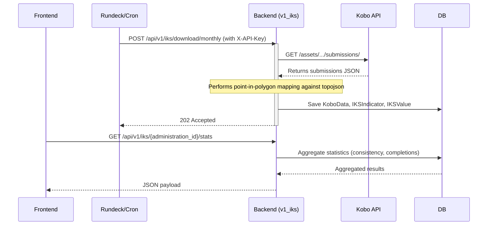

# Feature Design: Track 3 Operational Response - IKS Explorer Backend

**Task ID**: IKS-Backend
**Author**: Galih Pratama
**Date**: 2026-07-08
**Status**: Approved

---

## 1. Context & Problem Statement

### Currently

- The hub lacks Indigenous Knowledge Systems (IKS) storage and query capabilities on the backend.
- Observations recorded via KoboToolbox need to be fetched, processed, and mapped to specific administration regions (Tinkhundla) for decision-making.
- A central catalogue of IKS indicators and observational series data is required to feed the frontend visualizations.

### Goal

- Implement a versioned backend app `v1_iks` to manage Kobo configurations, forms, raw submissions, and mapped IKS values.
- Provide Django commands to seed default Kobo credentials, and download data from the Kobo API.
- Map observations to administration boundaries using coordinates and point-in-polygon analysis against eswatini.topojson.
- Expose the Explorer stats and series APIs, secured via standard token authentication or X-API-Key where appropriate.

### 1.1 Architecture & Ingestion Flow

1. **Rundeck Trigger / Cron** → Invokes `POST /api/v1/iks/download/monthly` with `X-API-Key`.
2. **Monthly Sync** → Triggers Django command `download_iks_data.py`.
3. **Fetch Submissions** → Queries KoboToolbox API using `KoboAdapter` credentials.
4. **Geo Boundary Mapping** → Parses the `geo` field (coordinates) and maps it to `Administration` using `eswatini.topojson` spatial geometries via `geopandas`/`shapely`.
5. **Database Storage** → populates `KoboData`, `IKSIndicator`, and `IKSValue`.
6. **Async Job** → Spawns worker jobs to download associated images asynchronously.
7. **Client consumption** → Frontend/Admin requests statistics and time series data via REST APIs.



---

## 2. Requirements

### User Acceptance Criteria

- [ ] Admins can seed and configure Kobo credentials and forms.
- [ ] Users can query statistical calculations (total reported, percentage validation, average validation time, form completion) per Inkhundla.
- [ ] Users can retrieve fiscal year series data for selected indicators and Inkhundla.
- [ ] External triggers can invoke monthly Kobo data download securely.

### Technical Acceptance Criteria

- [ ] Base all work on the `develop` branch.
- [ ] Create a new Django app `api.v1.v1_iks` registered in `API_APPS` inside [settings.py](/backend/eswatini/settings.py).
- [ ] Support `X_API_KEY_HEADER = "HTTP_X_API_KEY"` validation inside `settings.py` and implement a validation mechanism for the download trigger.
- [ ] Map coordinates (`geo` field) to `Administration` using `eswatini.topojson` polygon boundaries using `geopandas` and `shapely`.
- [ ] Implement async background tasks for image downloads (via Django-Q/Jobs).

---

## 3. Data Model Changes

### New Models

```python
# backend/api/v1/v1_iks/models.py
from django.db import models
from api.v1.v1_publication.models import Administration

class KoboAdapter(models.Model):
    server_url = models.URLField(max_length=255)
    username = models.CharField(max_length=150)
    password = models.CharField(max_length=128)  # plain text or encrypted
    last_sync_timestamp = models.DateTimeField(null=True, blank=True)
    active = models.BooleanField(default=True)
    created_at = models.DateTimeField(auto_now_add=True)
    updated_at = models.DateTimeField(auto_now=True)

    class Meta:
        db_table = "kobo_adapters"

class KoboForm(models.Model):
    uuid = models.CharField(max_length=100, unique=True)
    name = models.CharField(max_length=255)
    description = models.TextField(null=True, blank=True)
    questions = models.JSONField(default=dict)
    options = models.JSONField(default=dict)
    languages = models.JSONField(default=list)
    created_at = models.DateTimeField(auto_now_add=True)
    updated_at = models.DateTimeField(auto_now=True)

    class Meta:
        db_table = "kobo_forms"

class KoboData(models.Model):
    form = models.ForeignKey(KoboForm, on_delete=models.CASCADE, related_name="data")
    kobo_id = models.BigIntegerField(unique=True)
    geo = models.JSONField(null=True, blank=True)  # Storing raw coordinates/geometry info
    submission_time = models.DateTimeField()
    submitted_by = models.CharField(max_length=150, null=True, blank=True)
    instance_name = models.CharField(max_length=255, null=True, blank=True)
    raw_data = models.JSONField(default=dict)
    created = models.DateTimeField(auto_now_add=True)
    updated = models.DateTimeField(auto_now=True)

    class Meta:
        db_table = "kobo_data"

class IKSIndicator(models.Model):
    kobo_form = models.ForeignKey(KoboForm, on_delete=models.CASCADE, related_name="indicators")
    name = models.CharField(max_length=255)
    created = models.DateTimeField(auto_now_add=True)
    updated = models.DateTimeField(auto_now=True)

    class Meta:
        db_table = "iks_indicators"

class IKSValue(models.Model):
    kobo_id = models.BigIntegerField()
    administration = models.ForeignKey(Administration, on_delete=models.CASCADE, related_name="iks_values")
    iks_indicator = models.ForeignKey(IKSIndicator, on_delete=models.CASCADE, related_name="values")
    value = models.CharField(max_length=255)
    created = models.DateTimeField(auto_now_add=True)
    updated = models.DateTimeField(auto_now=True)

    class Meta:
        db_table = "iks_values"
```

---

## 4. API Contract

### 4.1 Backend Endpoints

| Method | URL | Purpose | Auth |
|--------|-----|---------|------|
| GET | `/api/v1/iks/{administration_id}/stats` | Get observational stats in date range | JWT/Auth |
| GET | `/api/v1/iks/{administration_id}/series` | Get time series data for specific indicator | JWT/Auth |
| POST | `/api/v1/iks/download/monthly` | Trigger download CLI sync command | `X-API-Key` |

#### GET `/api/v1/iks/{administration_id}/stats?start_date=2026-01-01&end_date=2026-02-01`

**Response 200**:

```json
{
  "total_reports_received": 142,
  "total_months_drought": 3,
  "reporting_consistency_percentage": 85.5,
  "validation_rate_percentage": 92.0,
  "average_validation_time_days": 1.4,
  "form_completion_percentage": 98.2
}
```

#### GET `/api/v1/iks/{administration_id}/series?start_date=2026-01-01&end_date=2026-12-31&indicator_id=5`

**Response 200**:

```json
{
  "indicator_id": 5,
  "indicator_name": "Blue Swallows appearance",
  "series": [
    {
      "period": "2026-01",
      "value": "observed",
      "count": 12
    }
  ]
}
```

---

## 5. Decision Log

### D-1: Spatial matching logic & Geolocation Source

- **Problem**: The Kobo survey form has no direct input field for Inkhundla. Instead, we must map submissions to their administrative region (Tinkhundla) using geolocation.
- **Source Field**: We use the survey metadata field `survey_start_gps` (e.g., `"-26.18750540704125 31.396586056044477 0 0"`).
- **Options**:
  1. Store boundary polygons in DB (GeoDjango/PostGIS).
  2. Perform spatial matching using python `geopandas`/`shapely` during Kobo ingestion.
- **Decision**: Option 2. Standard postgres is used without PostGIS.
- **Mechanism**:
  1. Parse `survey_start_gps` by splitting the string by whitespace: `lat, lon = [float(val) for val in raw_gps.split()[:2]]`.
  2. Create a Shapely `Point(lon, lat)`.
  3. Read `backend/source/eswatini.topojson` via `geopandas.read_file()`.
  4. Perform a containment check: find which administration boundary polygon contains the point to map the `administration_id` (representing the Inkhundla).

---

## 6. Security Considerations

- Predefined header `X-API-Key` will be validated against a setting `X_API_KEY` (configured in env var) for the monthly download trigger API.

---

## 9. Testing & Verification Strategy

| Test Type | Coverage | Verification Commands |
|-----------|----------|-----------------------|
| Unit | Model creation, commands, endpoint parameters | `docker compose -f docker-compose.test.yml run -T backend ./test.sh` |

---

## 12. Epic & Ballpark Estimation

- Confidence Level: High
- Dependencies: None

| Task ID | Component & Description | Est. Hours (Min - Max) | Priority |
|---------|-------------------------|------------------------|----------|
| T-001   | App Setup & Data Models (`v1_iks`) | 2h - 4h | Must Have |
| T-002   | Seeders & download CLI command (`download_iks_data.py`) | 4h - 6h | Must Have |
| T-003   | Point-In-Polygon Mapping logic | 3h - 5h | Must Have |
| T-004   | Stats and Series API Views & Serializers | 4h - 6h | Must Have |
| T-005   | API Key authentication & POST monthly endpoint | 2h - 3h | Must Have |
