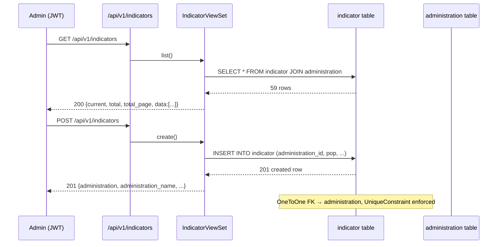

# Feature Design Document

> **Purpose**: Use this document when planning new features that require data model changes, API design, or architectural decisions. Complete this document BEFORE implementation begins.

---

## Feature: Track 3 — Operational Response: Risk Level — Backend `v1_indicators`

**Task ID**: [#132]
**Track**: Track 3 — Operational Response
**Author**: Galih Pratama
**Date**: 2026-07-21
**Status**: IMPLEMENTED — **SUPERSEDED** by [`risk-level-v2-risk-scoring-redesign.md`](./risk-level-v2-risk-scoring-redesign.md) (built against the old `priority_areas.csv` prototype; the new DIH Risk Dataset Handover methodology replaces this model).

**Related specs**:
- Previous draft: [`eswatini-v2/docs/specs/PA-1_v1_indicators.md`](../specs/PA-1_v1_indicators.md) _(terminology updated: "Priority Area" → "Risk Level")_
- Frontend mock companion: [`risk-level-fe-mock-data.md`](./risk-level-fe-mock-data.md)

---

## 1. Context & Problem Statement

```
Currently:
- Administration (backend/api/v1/v1_publication/models.py) is MINIMAL:
  name, region, timestamps, PK = administration_id (topojson int).
  It has NO demographic or vulnerability fields.
- Publication.validated_values carries only per-Inkhundla drought
  category/value. There is nowhere to store population, cropland,
  water-point counts, IPC/preparedness vulnerability, or provenance
  (source/as_of).
- The Streamlit prototype computes a Risk Level score (priority_areas.csv)
  from exposure & vulnerability columns that have no home in the Django hub.

Goal:
- Add a dedicated v1_indicators app holding one indicator record per
  Administration (exposure + vulnerability inputs) with explicit provenance.
- Provide admin-only CRUD so NDMA staff curate indicators per Inkhundla.
- Seed all 59 Tinkhundla idempotently from the prototype CSV so the
  Risk Level scoring service has a complete, ranked data source.
```

> **Terminology**: what the Streamlit prototype called "Priority Area" is now
> called **"Risk Level"** throughout the hub. All code labels, Swagger tags,
> and spec references use "Risk Level".

### 1.1 Architecture Overview & Data Flow



---

## 2. Requirements

### User Acceptance Criteria

- [x] An admin can list, create, retrieve, update and delete an indicator record per Inkhundla.
- [x] A non-admin (reviewer / anonymous) receives `403` on any write and on the admin list/detail endpoints.
- [x] Every indicator exposes `source` and `as_of` so the data origin and freshness are visible.
- [x] After seeding, all 59 Tinkhundla have an indicator row, every one flagged `is_placeholder=True` — the prototype values are illustrative, not real NDMA data. Real curation happens later via admin CRUD.

### Technical Acceptance Criteria

- [x] App `v1_indicators` follows hub conventions (`models` / `serializers` / `views` / `urls` / `constants` / `apps` + `management/commands` + `tests`), registered in `API_APPS` and `backend/eswatini/urls.py`.
- [x] `Indicator` is `OneToOne` to `Administration` (Decision D-1: never alter the core model).
- [x] Seeder `generate_indicators_seeder` is idempotent and produces exactly 59 rows on repeat runs (no duplicates).
- [x] DB constraints (one indicator per administration; non-negative counts; `rainfed_share`/`v_*` in `[0,1]`) enforced and tested.
- [x] Admin-only permission enforced and tested (`APITestCase`).
- [x] Endpoints appear in Swagger via `@extend_schema(tags=["Risk Level - Indicators"])`.

---

## 3. Data Model Changes

### New Models

```python
# backend/api/v1/v1_indicators/models.py
from django.db import models
from django.core.validators import MinValueValidator, MaxValueValidator
from api.v1.v1_publication.models import Administration


class Indicator(models.Model):
    # D-1: one row per Administration, attached via OneToOne; Administration unchanged.
    administration = models.OneToOneField(
        Administration,
        on_delete=models.CASCADE,
        related_name="indicator",
        db_column="administration_id",
    )
    # Exposure inputs
    population    = models.PositiveIntegerField(default=0)   # pop
    under_five    = models.PositiveIntegerField(default=0)   # u5
    cropland_ha   = models.PositiveIntegerField(default=0)   # cropland (ha)
    rainfed_share = models.FloatField(                        # rfShare, 0..1
        default=0.0,
        validators=[MinValueValidator(0.0), MaxValueValidator(1.0)],
    )
    livestock  = models.PositiveIntegerField(default=0)      # livestock (TLU)
    rangeland  = models.PositiveIntegerField(default=0)      # rangeland (ha)
    # Water-point inputs
    boreholes = models.PositiveIntegerField(default=0)
    taps      = models.PositiveIntegerField(default=0)
    # Vulnerability inputs (0..1)
    v_ipc = models.FloatField(
        default=0.0,
        validators=[MinValueValidator(0.0), MaxValueValidator(1.0)],
    )
    v_prep = models.FloatField(
        default=0.0,
        validators=[MinValueValidator(0.0), MaxValueValidator(1.0)],
    )
    # Provenance
    source         = models.CharField(max_length=255, default="placeholder")
    as_of          = models.DateField(null=True, blank=True)
    is_placeholder = models.BooleanField(default=True)
    created        = models.DateTimeField(auto_now_add=True)
    updated        = models.DateTimeField(auto_now=True)

    class Meta:
        db_table = "indicator"
        constraints = [
            models.UniqueConstraint(
                fields=["administration"],
                name="uniq_indicator_per_administration",
            ),
            models.CheckConstraint(
                check=models.Q(rainfed_share__gte=0.0) & models.Q(rainfed_share__lte=1.0),
                name="ck_indicator_rainfed_share_unit",
            ),
            models.CheckConstraint(
                check=models.Q(v_ipc__gte=0.0) & models.Q(v_ipc__lte=1.0)
                & models.Q(v_prep__gte=0.0) & models.Q(v_prep__lte=1.0),
                name="ck_indicator_vuln_unit",
            ),
        ]
```

> **Note**: `waterPoints`, `peoplePerWP`, `popNorm`, `rainfedNorm`, `vWater`, `riskScore`, `dclass`
> are **not** stored here — they are derived downstream by a future Risk Level scoring service.

### Modified Models

| Model | Change | Reason |
|-------|--------|--------|
| `Administration` | **None** | D-1: extend by FK only; core model stays minimal. |

### Migration Strategy

```
0001_initial — creates the `indicator` table with FK + constraints.
- No existing rows to backfill (new table).
- Defaults safe for placeholder seeding
  (counts=0, shares=0.0, source="placeholder", as_of=NULL, is_placeholder=True).
- Rollback: migrate v1_indicators zero; CASCADE FK — no orphan handling needed.
- Administration rows must exist first; seeder depends on
  generate_administrations_seeder having already run.
```

---

## 4. API Contract & Frontend Design

### 4.1 Backend Endpoints

| Method | URL | Purpose | Auth |
|--------|-----|---------|------|
| `GET` | `/api/v1/indicators` | List all indicators (paginated) | Admin |
| `POST` | `/api/v1/indicators` | Create indicator for an administration | Admin |
| `GET` | `/api/v1/indicators/{administration_id}` | Retrieve one indicator | Admin |
| `PUT/PATCH` | `/api/v1/indicators/{administration_id}` | Full/partial update | Admin |
| `DELETE` | `/api/v1/indicators/{administration_id}` | Delete indicator | Admin |

**URL wiring** (`backend/api/v1/v1_indicators/urls.py`):

```python
from django.urls import re_path
from api.v1.v1_indicators.views import IndicatorViewSet

urlpatterns = [
    re_path(
        r"^(?P<version>(v1))/indicators$",
        IndicatorViewSet.as_view({"get": "list", "post": "create"}),
    ),
    re_path(
        r"^(?P<version>(v1))/indicators/(?P<administration_id>[0-9]+)$",
        IndicatorViewSet.as_view({
            "get": "retrieve", "put": "update",
            "patch": "partial_update", "delete": "destroy",
        }),
    ),
]
```

`lookup_field = "administration_id"` (PK of the OneToOne target).

#### Request/Response Examples

```json
// POST /api/v1/indicators  (admin JWT)
{
  "administration": 4588078,
  "population": 8956,
  "under_five": 184,
  "cropland_ha": 1691,
  "rainfed_share": 0.6321,
  "boreholes": 2,
  "taps": 2,
  "v_ipc": 0.53425,
  "v_prep": 0.4666,
  "source": "NDMA 2024 vulnerability assessment",
  "as_of": "2024-11-01"
}

// Response 201
{
  "administration": 4588078,
  "administration_name": "Nkwene",
  "region": "Shiselweni",
  "population": 8956,
  "under_five": 184,
  "cropland_ha": 1691,
  "rainfed_share": 0.6321,
  "boreholes": 2,
  "taps": 2,
  "v_ipc": 0.53425,
  "v_prep": 0.4666,
  "source": "NDMA 2024 vulnerability assessment",
  "as_of": "2024-11-01",
  "is_placeholder": false
}
```

List response uses the shared paginator (`{current, total, total_page, data}`, `page_size=10`).

### 4.2 Frontend Integration

Consumed by the **Risk Level tab** (`/detailed-insights/risk-level/`):
- Exposure accordion: `population`, `cropland_ha`, `rainfed_share`, `boreholes`, `taps`, `livestock`
- Vulnerability accordion: `v_ipc`, `v_prep`

Mock endpoint path used by frontend until this backend ships:
```
GET /api/v1/indicators/{administration_id}  →  single indicator per selected Inkhundla
```

---

## 5. Decision Log

### D-1: Attach indicators via OneToOne to Administration

**Options Considered**:
1. Add columns directly to `Administration`.
2. Separate `Indicator` model with `OneToOneField` to `Administration`.

**Decision**: Option 2.

**Rationale**: `Administration` is sourced from `backend/source/eswatini.topojson` and kept minimal. Widening it risks the publication/review pipeline. A dedicated model isolates demographic/vulnerability concerns and allows Risk Level service to read indicators independently.

**Impact**: New `indicator` table + FK; no migration touches `administration`.

---

### D-2: One indicator per Inkhundla (not time-series) for v1

**Options Considered**:
1. `OneToOne` — current snapshot only.
2. `ForeignKey` with `as_of` history — many rows per administration.

**Decision**: `OneToOne` for v1. History can be added later by relaxing the unique constraint.

**Impact**: Lookup by `administration_id` is unambiguous.

---

### D-4: Seed by Inkhundla name → administration_id

**Decision**: The seeder joins the name-keyed CSV to `Administration.name`; unmatched names are **logged** (warning), not dropped.

**Verified**: All 59 CSV rows match the 59 topojson administration names exactly → 0 unmatched in normal run.
CSV file is already available at `backend/source/priority_areas.csv` (same location as `eswatini.topojson`).

---

## 6. Type/Constant Mappings

Prototype CSV column → `Indicator` model field:

| Frontend / CSV column | Backend field | DB column | Notes |
|-----------------------|---------------|-----------|-------|
| `pop` | `population` | `population` | PositiveInteger |
| `u5` | `under_five` | `under_five` | PositiveInteger |
| `cropland` | `cropland_ha` | `cropland_ha` | hectares |
| `rfShare` | `rainfed_share` | `rainfed_share` | float 0..1 |
| `livestock` | `livestock` | `livestock` | PositiveInteger (TLU) |
| `rangeland` | `rangeland` | `rangeland` | PositiveInteger (ha) |
| `boreholes` | `boreholes` | `boreholes` | PositiveInteger |
| `taps` | `taps` | `taps` | PositiveInteger |
| `vIpc` | `v_ipc` | `v_ipc` | float 0..1 |
| `vPrep` | `v_prep` | `v_prep` | float 0..1 |
| _(curator-entered)_ | `source` | `source` | provenance string |
| _(curator-entered)_ | `as_of` | `as_of` | ISO date |
| `name` _(CSV key)_ | `administration` (FK by name lookup) | `administration_id` | D-4 |

Constants (`backend/api/v1/v1_indicators/constants.py`):

```python
class IndicatorSource:
    placeholder = "placeholder"
    PLACEHOLDER_LABEL = "Placeholder (uncurated)"
    PROTOTYPE = "prototype-illustrative"
```

---

## 7. Compatibility & Migration

### Backward Compatibility

- [x] Existing API consumers unaffected (new endpoints only).
- [x] Existing data preserved (`Administration` untouched).
- [x] CLI/seeders for administrations/users still work.

### Seeder / CLI

- [x] Existing seeders unchanged.
- [x] New management command: `python manage.py generate_indicators_seeder [--test True]`
  - Reads `./source/priority_areas.csv` (relative to backend working dir — same as topojson seeder).
  - Upserts all 59 rows with `is_placeholder=True`, `source="prototype-illustrative"`, `as_of=NULL`.
  - Idempotent: repeat runs produce exactly 59 rows (`update_or_create` pattern).
  - Unmatched CSV names → `logger.warning(...)`.

---

## 8. Security Considerations

- [x] **Permission model**: all endpoints require `IsAuthenticated & IsAdmin` (role == 1). Reviewers and anonymous get `403`.

```python
class IndicatorViewSet(viewsets.ModelViewSet):
    permission_classes = [IsAuthenticated, IsAdmin]
    serializer_class = IndicatorSerializer
    queryset = Indicator.objects.select_related("administration").all()
    lookup_field = "administration_id"
    pagination_class = Pagination
```

- [x] **Input validation**: `rainfed_share`/`v_ipc`/`v_prep` in `[0,1]` + counts `>= 0`. Duplicate creation blocked by `UniqueConstraint` → `400`.
- [x] **Provenance gate**: serializer requires `source` and `as_of` when `is_placeholder=False`.
- [x] No new attack vectors introduced.

---

## 9. Testing Strategy

Test module: `backend/api/v1/v1_indicators/tests/` using `APITestCase`.

`setUp()` pattern (matches hub convention from `v1_publication/tests/`):
```python
call_command("generate_administrations_seeder", "--test", True)
call_command("generate_admin_seeder", "--test", True)
call_command("fake_users_seeder", "--test", True, "--repeat", 3)
self.admin_user = SystemUser.objects.filter(role=UserRoleTypes.admin).first()
self.reviewer_user = SystemUser.objects.filter(role=UserRoleTypes.reviewer).first()
```

| Test Type | Coverage |
|-----------|----------|
| **Unit** | Model constraints: duplicate indicator per administration → `IntegrityError`; `rainfed_share=1.2` / `v_ipc=-0.1` rejected by `CheckConstraint`. |
| **Integration — Seeder** | `generate_indicators_seeder --test True` yields exactly 59 rows; idempotent (run twice → still 59); all 59 are `is_placeholder=True`; spot-check Nkwene `population=8956`, `rainfed_share=0.6321`. Warning path covered by synthetic unmatched-name fixture row. |
| **Integration — CRUD** | Admin `POST/GET/PUT/PATCH/DELETE` all succeed (2xx). Reviewer + anonymous get `403` on list, detail, and all writes. |
| **Integration — Shape** | List response shape `{current, total, total_page, data}`; `source` + `as_of` present in serialized output. |
| **E2E (schema)** | `GET /api/schema/` includes `Risk Level - Indicators`-tagged paths. |

### Verification Commands

```bash
# Docker (CI-equivalent)
docker compose -f docker-compose.test.yml run -T backend \
  python manage.py test api.v1.v1_indicators --shuffle

# Local
cd backend && python manage.py test api.v1.v1_indicators --shuffle --parallel 4
```

---

## 10. Open Questions / Findings

All resolved (verified 2026-06-12, confirmed 2026-07-21):

- [x] **CSV location**: `backend/source/priority_areas.csv` already present — seeder reads `./source/priority_areas.csv`.
- [x] **Which Tinkhundla are "curated"?** — None yet. All 59 seeded as `is_placeholder=True`. Real curation via admin CRUD later.
- [x] **Should `as_of` be required for curated rows?** — Yes. Serializer requires `source` and `as_of` when `is_placeholder=False`.
- [x] **Time-series indicators?** — Not for v1. Keep `OneToOne`.
- [x] **CSV vs topojson coverage** — 59 administrations = 59 CSV rows; all names match → 0 unmatched in normal seeder run.

---

## 11. References

- Related task: [#132]
- Companion frontend spec: [`risk-level-fe-mock-data.md`](./risk-level-fe-mock-data.md)
- Prototype data: `backend/source/priority_areas.csv` (also at `eswatini-v2/data/prototype/priority_areas.csv`)
- Hub conventions: `backend/utils/custom_permissions.py`, `backend/utils/custom_pagination.py`
- Reference app (same pattern): `backend/api/v1/v1_iks/`
- Previous draft (PA-1): `eswatini-v2/docs/specs/PA-1_v1_indicators.md`
- Implementation checklist: `task.md` (workspace root)

---

## 12. Epic & Ballpark Estimation

> Confidence Level: **High** (conventions well-established; no external dependencies)
> Dependencies: `generate_administrations_seeder` must have run before seeder.

| Task ID | Component & Description | Est. Hours (Min–Max) | Priority |
|---------|-------------------------|----------------------|----------|
| T-1 | App scaffold: `apps.py`, `__init__.py`, register in `API_APPS` + `urls.py` | 0.5h – 1h | Must Have |
| T-2 | `models.py` — `Indicator` model + `0001_initial` migration | 1h – 2h | Must Have |
| T-3 | `serializers.py` — `IndicatorSerializer` with validation + provenance gate | 1h – 2h | Must Have |
| T-4 | `views.py` — `IndicatorViewSet` (ModelViewSet, admin-only, `lookup_field`) | 1h – 2h | Must Have |
| T-5 | `urls.py` + Swagger `@extend_schema(tags=["Risk Level - Indicators"])` | 0.5h – 1h | Must Have |
| T-6 | `constants.py` — `IndicatorSource` constants | 0.25h – 0.5h | Must Have |
| T-7 | Management command `generate_indicators_seeder` (idempotent, CSV-driven, `--test`) | 2h – 3h | Must Have |
| T-8 | Tests: unit (constraints) + integration (seeder, CRUD, 403, shape, schema) | 3h – 5h | Must Have |
| **Total** | | **~9h – 16.5h** | |

---

## Approval

| Role | Name | Date | Status |
|------|------|------|--------|
| Developer | | | |
| Tech Lead | | | |
| Product | | | |
