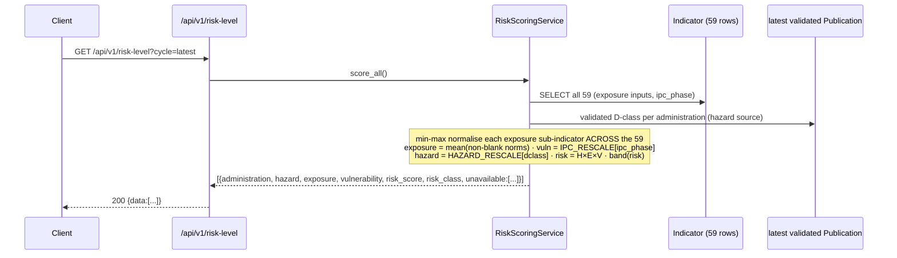

# Feature Design Document

> **Purpose**: Use this document when planning new features that require data model changes, API design, or architectural decisions. Complete this document BEFORE implementation begins.

---

## Feature: Track 3 — Operational Response: Risk Level v2 — Hazard × Exposure × Vulnerability scoring

**Task ID**: [#132] (revision)
**Track**: Track 3 — Operational Response
**Author**: Iwan Firmawan
**Date**: 2026-07-24
**Status**: Approved (2026-07-27)

**Supersedes**: [`risk-level-backend-v1_indicators.md`](./risk-level-backend-v1_indicators.md) — that doc is marked IMPLEMENTED but was written against the superseded `priority_areas.csv` prototype. This revision realigns `v1_indicators` (and the `v1_activity` trigger seam) to the new **DIH Risk Dataset Handover** methodology.

**New sources of truth** (authoritative over the old prototype):
- `eswatini-v2/resources/risk_dataset.xlsx` — "DIH Risk Dataset Handover" workbook (Methodology + per-layer input sheets + `Risk_expected` verification target).
- `eswatini-v2/resources/response_activity_inventory.xlsx` — SOP inventory + trigger-field vocabulary + status workflow.
- `eswatini-v2/eswatini_sop_insights_v2.ipynb` — reference implementation (Cell 3 = risk model; Cells 7–8 = trigger rules).

**Related specs**:
- Previous draft: [`../specs/PA-1_v1_indicators.md`](../specs/PA-1_v1_indicators.md)
- Frontend companion: [`risk-level-fe-mock-data.md`](./risk-level-fe-mock-data.md)
- SOP trigger seam: [`sop-trigger-evaluation-backend.md`](./sop-trigger-evaluation-backend.md)

---

## 1. Context & Problem Statement

```
Currently:
- v1_indicators.Indicator stores the OLD prototype proxies: rainfed_share,
  v_ipc (0..1 float), v_prep, cropland_ha, under_five, boreholes, taps,
  livestock, rangeland. Seeder reads ./source/priority_areas.csv.
- There is NO risk-scoring service. The old plan explicitly deferred
  riskScore/riskClass/exposure/normalisation to "a future service".
- v1_activity models SOP triggers as {dclass, vuln, exp, other} and reads
  per-administration values from priority_areas.csv via build_dataset().
  ipc_phase/water/months are stubbed UNAVAILABLE (always pass).

The new concept redefines the risk model entirely (Methodology sheet):
    Risk(i) = Hazard(i) × Exposure(i) × Vulnerability(i)   — all in [0,1]
- Multiplicative: risk collapses to 0 if ANY component is absent.
- Vulnerability is now a SINGLE national IPC layer (per-sector v_prep is gone).
- Exposure is a composite of min-max-normalised sub-indicators computed
  ACROSS the 59 Tinkhundla within the current cycle.
- Hazard is the validated D-class of the current publication cycle.

Goal:
- Rework v1_indicators to hold the new risk inputs and derive the score.
- Add a RiskScoringService that reproduces the workbook's Risk_expected
  columns exactly.
- Realign the v1_activity trigger seam (IPC 1..5, riskClass triggers, real
  ipc_phase/water source, richer status lifecycle) onto the same data.
```

> **Terminology unchanged**: "Priority Area" → **"Risk Level"** throughout.

### 1.1 The new risk model (Methodology sheet — authoritative)

```
Risk(i) = Hazard(i) × Exposure(i) × Vulnerability(i)     multiplicative, all ∈ [0,1]

Hazard        validated D-class → H
              None 0.00 · D0 0.20 · D1 0.40 · D2 0.60 · D3 0.80 · D4 1.00   (per cycle)

Exposure      arithmetic mean of these sub-indicators, each min-max normalised
              across the 59 Tinkhundla within the current cycle:
                land_use (DVI-agri) · population · cattle · water_demand
              Water demand is PENDING (DWA methodology TBD) → interim mean of the
              3 available sub-indicators at 1/3 weight each (average non-blank).

Vulnerability IPC phase → V
              1→0.10 · 2→0.30 · 3→0.60 · 4→0.85 · 5→1.00   (non-linear; phase 1 non-zero)

Risk bands    ≥0.50 Very High · ≥0.30 High · ≥0.15 Moderate · else Low

DVI-agri land-cover weights (reference; DVI-agri arrives pre-computed per Inkhundla):
  Cropland 0.90 · Grassland 0.75 · Shrubland 0.55 · Trees 0.30 · Water/Built/Other 0.05
```

---

## 2. Requirements

### User Acceptance Criteria
- [ ] An admin can curate the new risk inputs per Inkhundla (`land_use_dvi_agri`, `population`, `cattle`, `water_demand`, `ipc_phase`) with provenance (`source`, `as_of`).
- [ ] The Risk Level surface shows, per Inkhundla and for the current cycle: `hazard`, `exposure`, `vulnerability`, `risk_score`, `risk_class`, plus the normalised exposure sub-components.
- [ ] A partial dataset (water demand blank, cattle/hazard not yet filled) still yields a score using the interim 3-of-4 exposure rule, and the response flags which components were unavailable.
- [ ] An SOP can trigger on `risk_class` / `risk_score` and on IPC phase up to **5**.

### Technical Acceptance Criteria
- [ ] `RiskScoringService` reproduces the workbook `Risk_expected` sheet columns J (`Risk score`) and K (`Risk class`) exactly for every populated Inkhundla.
- [ ] Exposure normalisation is min-max **across the current 59-row set per cycle**, never a stored static per-row value.
- [ ] Hazard is sourced from the latest validated `Publication` (Indicator × Publication join), not stored on `Indicator`.
- [ ] Rescale/band tables live in `constants.py` and are the single source used by both the service and the trigger evaluator.
- [ ] `v1_activity` trigger vocabulary, IPC range (1..5), and `riskClass` gate updated; `build_dataset()` reads the Indicator table, not `priority_areas.csv`.
- [ ] Endpoints tagged `Risk Level - Indicators`; admin-only writes preserved.

---

## 3. Gap Findings (main reference for this redesign)

> This is the backbone of the redesign — every change below traces to a numbered gap. `v1_indicators` diverges critically; `v1_activity` is close with targeted gaps.

### 3.1 `v1_indicators` — CRITICAL divergence

| # | Sev | Gap | Current state | New concept requires |
|---|-----|-----|---------------|----------------------|
| **I-1** | 🔴 Critical | Field schema is the wrong model | `rainfed_share`, `v_ipc`(0–1 float), `v_prep`, `cropland_ha`, `under_five`, `boreholes`, `taps`, `livestock`, `rangeland` | Risk inputs: `land_use_dvi_agri`(raw ~0.55–0.90), `population`, `cattle`, `water_demand`(nullable/pending), `ipc_phase`(**int 1–5**). `v_prep` **deleted** — vulnerability is a single national IPC layer. Old count fields become **eligibility filters** (Inkhundla_master), not risk inputs. |
| **I-2** | 🔴 Critical | No risk-scoring service exists | Old plan deferred `riskScore/riskClass/exposure/norm` to "a future service"; nothing computes it | Service now fully specified: rescale tables, min-max norm across 59, exposure mean, multiplicative combine, bands. `Risk_expected` sheet is the exact oracle (reproduce cols J & K). |
| **I-3** | 🟠 High | `v_ipc` type mismatch | Serializer validates `v_ipc` ∈ [0,1] | Store `ipc_phase` **integer 1–5**; the [0,1] V value is *derived* via IPC rescale, not entered. |
| **I-4** | 🟠 High | Normalisation is cycle-relative & cross-row | Model is a static per-row `OneToOne` snapshot | Min-max computed **across all 59 within the current cycle** → risk score computed on-read/on-publish over the full set, not stored per row. Static-snapshot design doesn't hold the cycle dimension. |
| **I-5** | 🟠 High | Hazard is per-cycle, tied to Publication | Not modelled in `Indicator` | `hazard` = validated D-class of the current publication cycle. Risk = f(static exposure/vuln inputs, **current-cycle hazard**). Needs Indicator × latest-Publication join. |
| **I-6** | 🟡 Medium | Rescale tables not encoded | `constants.py` only has `IndicatorSource` strings | HAZARD_RESCALE, IPC_RESCALE, RISK_BANDS, exposure weights + interim water-pending rule must become constants (Methodology sheet canonical). |
| **I-7** | 🟡 Medium | Seeder reads the wrong source | `generate_indicators_seeder` reads `priority_areas.csv` | Source of truth is `risk_dataset.xlsx` (one sheet per layer). **Cattle & Hazard sheets empty**, water demand PENDING — ingester must handle partial data. Notebook proxy-fallback (cropland+rangeland→DVI-agri, livestock→cattle, vIpc→ipc_phase) is the migration bridge. |

### 3.2 `v1_activity` — mostly aligned, targeted gaps

| # | Sev | Gap | Detail |
|---|-----|-----|--------|
| **A-1** | 🟠 High | No `riskClass` trigger | RA Inventory has a "Risk-class trigger" column; Trigger fields list `riskScore`/`riskClass`; Education SOPs trigger on `riskScore`. Trigger schema has only `dclass`+`vuln`+`exp`. (Blocked on I-2.) |
| **A-2** | 🟠 High | IPC phase off-by-one | `VULN_PHASE_MIN, MAX = 1, 4`; new methodology is **1–5** (5 = Famine). A SOP can't trigger on Phase 5 today. |
| **A-3** | 🟠 High | Status lifecycle too coarse | Enum: Draft/Active/Archived (3). Inventory workflow: **Draft/Review/Approved/Active/Archived** (5) + a 4-step approval chain (Sector lead → NDRMA SOP lead → DG → Minister). `ActivitySignOff` logs sign-offs but the enum can't represent Review/Approved. |
| **A-4** | 🟡 Medium | `build_dataset` reads `priority_areas.csv` | Same stale source (the `TODO(PA-2)` flags it). Read exposure/ipc from the Indicator table + hazard/dclass from the latest publication. Then `ipc_phase`/`water` stop being `UNAVAILABLE`. |
| **A-5** | 🟡 Medium | Exposure vocabulary drift | `EXPOSURE_INDICATORS = [population, cropland, water, cattle]`. New vocabulary splits **risk sub-indicators** (`land_use_dvi_agri`, `pop`, `cattle`, `water_demand`) from **eligibility counts** (`u5`, `elderly`, `rainfed_cropland`, `rangeland`, `boreholes`). Flat list conflates them; `cropland`→rainfedCropland proxy is ambiguous. |
| **A-6** | 🟡 Medium | `months` consecutive gate stubbed | RA Inventory "Consecutive number of months" is a real trigger; `dclass.months` exists in schema but eval treats it as `UNAVAILABLE`. Needs per-cycle publication history. |
| **A-7** | 🟢 Low | `Resources required` field absent | Inventory column has no model home (only free-text `notes`). |
| **A-8** | 🟢 Low | Sector naming drift | Model "Food & Agriculture" vs inventory "Agriculture and Food" + separate "Food and Nutrition". Cosmetic; reconcile labels. |

---

## 4. Data Model Changes

### 4.1 Reworked `Indicator` (I-1, I-3)

```python
# backend/api/v1/v1_indicators/models.py
class Indicator(models.Model):
    # D-1 (retained): one row per Administration via OneToOne; Administration unchanged.
    administration = models.OneToOneField(
        Administration, on_delete=models.CASCADE,
        related_name="indicator", db_column="administration_id",
    )

    # --- Risk exposure sub-indicators (raw inputs; normalisation is derived per cycle) ---
    land_use_dvi_agri = models.FloatField(          # Exposure_LandUse · DVI-agri (raw), ~0.55–0.90
        null=True, blank=True,
        validators=[MinValueValidator(0.0), MaxValueValidator(1.0)],
    )
    population   = models.PositiveIntegerField(null=True, blank=True)   # Exposure_Population
    cattle       = models.PositiveIntegerField(null=True, blank=True)   # Exposure_Cattle (MoA census)
    water_demand = models.FloatField(null=True, blank=True)             # Exposure_WaterDemand (PENDING)

    # --- Vulnerability input (single national IPC layer; V value derived via rescale) ---
    ipc_phase = models.PositiveSmallIntegerField(   # 1..5; NULL until IPC feed populated
        null=True, blank=True,
        validators=[MinValueValidator(1), MaxValueValidator(5)],
    )

    # --- Eligibility filters (NOT risk inputs; referenced by SOP triggers — A-5) ---
    under_five       = models.PositiveIntegerField(default=0)
    elderly          = models.PositiveIntegerField(default=0)
    rainfed_cropland = models.PositiveIntegerField(default=0)   # ha
    rangeland        = models.PositiveIntegerField(default=0)   # ha
    boreholes        = models.PositiveIntegerField(default=0)
    taps             = models.PositiveIntegerField(default=0)

    # --- Provenance ---
    source         = models.CharField(max_length=255, default="placeholder")
    as_of          = models.DateField(null=True, blank=True)
    is_placeholder = models.BooleanField(default=True)
    created        = models.DateTimeField(auto_now_add=True)
    updated        = models.DateTimeField(auto_now=True)

    class Meta:
        db_table = "indicator"
        constraints = [
            models.UniqueConstraint(fields=["administration"],
                name="uniq_indicator_per_administration"),
            models.CheckConstraint(
                check=models.Q(land_use_dvi_agri__isnull=True)
                | (models.Q(land_use_dvi_agri__gte=0.0) & models.Q(land_use_dvi_agri__lte=1.0)),
                name="ck_indicator_dvi_agri_unit"),
            models.CheckConstraint(
                check=models.Q(ipc_phase__isnull=True)
                | (models.Q(ipc_phase__gte=1) & models.Q(ipc_phase__lte=5)),
                name="ck_indicator_ipc_phase_range"),
        ]
```

> **NOT stored** (all derived by the scoring service, I-2/I-4/I-5): `land_use_norm`, `population_norm`,
> `cattle_norm`, `water_demand_norm`, `exposure`, `vulnerability`, `hazard`, `risk_score`, `risk_class`.
> `hazard` comes from the current-cycle validated `Publication`.

### 4.2 Modified models

| Model | Change | Reason |
|-------|--------|--------|
| `Administration` | **None** | D-1: extend by FK only; core model stays minimal. |
| `Indicator` | Replace prototype fields with new risk inputs + eligibility split (§4.1) | I-1, I-3, A-5 |
| `ResponseActivity.status` | Expand enum Draft/Review/Approved/Active/Archived (§4.3) | A-3 — **partner-gated** |
| — | `VULN_PHASE_MAX` 4 → 5; add `risk_class`/`risk_score` to trigger schema | A-1, A-2 |

### 4.3 Status lifecycle (A-3, partner-gated)

```
Draft → Review → Approved → Active → Archived
  (Sector lead)  (NDRMA SOP lead)  (NDRMA DG: → Active)   (methodology sign-off: Minister, annual)
```
Model this only if the partner confirms they want the full review/approve chain surfaced in the hub
(see Open Question OQ-2). The `ActivitySignOff` table already records who signed; the enum expansion
adds the intermediate visibility states.

### 4.4 Migration strategy

```
v1_indicators 0002_risk_model_v2:
- Add new nullable fields; add elderly.
- Data bridge (I-7 migration): where old columns held proxy data, derive new inputs per the
  notebook fallback (cropland+rangeland→DVI-agri weighted, livestock→cattle, vIpc→ipc_phase band),
  flag is_placeholder=True, source="prototype-illustrative".
- Drop rainfed_share, v_ipc(float), v_prep, cropland_ha (renamed → rainfed_cropland kept as
  eligibility). Removal of drought-model check constraints ck_indicator_rainfed_share_unit /
  ck_indicator_vuln_unit.
- Rollback: reverse migration restores old columns from the bridge is lossy — keep a data dump
  before applying in prod (only placeholder data exists today, so low risk).

v1_activity 0002_trigger_vocab:
- Widen IPC phase range constant (no DB change — validator only).
- Extend triggers JSON schema (validator) to accept {risk: {op, value|class}}.
- Repoint build_dataset() at the Indicator table (no schema change).
```

---

## 5. Architecture — the scoring service (I-2, I-4, I-5)



**Service contract** (`v1_indicators/services.py`, new):

```python
def score_all(cycle="latest") -> list[dict]:
    """Compute Hazard × Exposure × Vulnerability for all 59 Tinkhundla for a cycle.
    Normalisation is min-max across the returned set. Reproduces Risk_expected J & K."""
```

Key invariants (from Methodology sheet, verified against `Risk_expected`):
- Normalisation is **per call over the current 59-row set** — never persisted per row (I-4).
- Exposure = `mean` of **non-blank** normalised sub-indicators (interim 3-of-4 when water demand blank).
- A missing hazard/vulnerability collapses that Inkhundla's risk to 0 (multiplicative), and is reported in `unavailable`.

---

## 6. API Contract

### 6.1 Indicators CRUD (admin) — unchanged shape, new fields (I-1)

| Method | URL | Purpose | Auth |
|--------|-----|---------|------|
| GET/POST | `/api/v1/indicators` | List / create indicator inputs | Admin |
| GET/PUT/PATCH/DELETE | `/api/v1/indicators/{administration_id}` | Retrieve / update / delete | Admin |

```json
// POST /api/v1/indicators
{ "administration": 4588078, "land_use_dvi_agri": 0.612, "population": 8956,
  "cattle": 1420, "water_demand": null, "ipc_phase": 3,
  "rainfed_cropland": 1691, "rangeland": 3200, "under_five": 184, "boreholes": 2, "taps": 2,
  "source": "DIH Risk Dataset Handover 2026-07", "as_of": "2026-07-22" }
```

### 6.2 Risk Level (scored, read-only) — new (I-2)

| Method | URL | Purpose | Auth |
|--------|-----|---------|------|
| GET | `/api/v1/risk-level` | Scored risk for all 59 (current cycle) | **DEPRECATED 2026-08-05** — use `/api/v1/risk-levels` |
| GET | `/api/v1/risk-level/{administration_id}` | Scored risk for one Inkhundla | **DEPRECATED 2026-08-05** — use `/api/v1/risk-levels/{administration_id}` |

> Both are flagged `deprecated=True` in Swagger and stay public for one release so any unknown caller appears in the logs, then return to `IsAuthenticated & IsAdmin` as the raw-scoring QA view ([RL-2](./risk-level-detail-buildup-api.md) D-1 / OQ-6).

> **Note on Nullability**: `exposure`, `vulnerability`, `risk_score`, and `risk_class` are `null` if their required inputs (IPC phase or exposure sub-indicators) are missing (e.g. unscored Tinkhundla).

```json
// GET /api/v1/risk-level/4588078
{ "administration": 4588078, "administration_name": "Nkwene", "region": "Shiselweni",
  "hazard": 0.60, "exposure": 0.489, "vulnerability": 0.60,
  "risk_score": 0.176, "risk_class": "Moderate",
  "components": { "land_use_norm": 0.156, "population_norm": 0.822, "cattle_norm": null,
                  "water_demand_norm": null },
  "unavailable": ["cattle", "water_demand"], "cycle": "2026-07" }
```

---

## 7. Decision Log

### D-1: Keep `Indicator` OneToOne to `Administration` (retained)
Unchanged from the original plan — extend by FK, never widen `Administration`.

### D-5: Risk score is computed, never stored per row
**Options**: (A) store `risk_score`/`risk_class` columns; (B) compute on-read via the service.
**Decision**: B for the score itself; consider a per-cycle **snapshot table** only if read latency demands it (OQ-1).
**Rationale**: exposure normalisation is min-max across the 59 within a cycle (Methodology §Exposure composition) — a stored per-row value would go stale the moment any Inkhundla's input changes. Computing over the current set is always correct.
**Impact**: `RiskScoringService.score_all()` is the single computation path; trigger evaluation calls the same service.

### D-6: Hazard lives with the Publication cycle, not the Indicator
**Decision**: `hazard` derives from the latest validated `Publication`'s D-class per administration; `Indicator` holds only the static exposure/vulnerability inputs.
**Rationale**: hazard is per-cycle and already validated in the publication pipeline (I-5). Duplicating it on `Indicator` would desync.

### D-7: Vulnerability is a single national IPC layer
**Decision**: drop per-sector `v_prep`; store one `ipc_phase` (1–5) per Inkhundla, map to V via rescale.
**Rationale**: Sector reference sheet — "sectors no longer have their own vulnerability sub-indices."

### D-8: Split risk sub-indicators from eligibility counts (A-5)
**Decision**: `land_use_dvi_agri`/`population`/`cattle`/`water_demand` feed the risk score; `u5`/`elderly`/`rainfed_cropland`/`rangeland`/`boreholes`/`taps` are eligibility filters SOP triggers reference but the score ignores.
**Rationale**: Trigger fields + Sector reference sheets draw this line explicitly.

---

## 8. Type/Constant Mappings

New `constants.py` (I-6) — single source for service **and** trigger evaluator:

```python
HAZARD_RESCALE = {"None": 0.0, "D0": 0.2, "D1": 0.4, "D2": 0.6, "D3": 0.8, "D4": 1.0}
IPC_RESCALE    = {1: 0.10, 2: 0.30, 3: 0.60, 4: 0.85, 5: 1.00}
RISK_BANDS     = [(0.50, "Very High"), (0.30, "High"), (0.15, "Moderate"), (0.0, "Low")]
EXPOSURE_SUBINDICATORS = ["land_use_dvi_agri", "population", "cattle", "water_demand"]
DVI_LAND_WEIGHTS = {"cropland": 0.90, "grassland": 0.75, "shrubland": 0.55, "tree": 0.30, "other": 0.05}
```

Workbook sheet → model field:

| Workbook sheet · column | Backend field | Notes |
|-------------------------|---------------|-------|
| `Exposure_LandUse · DVI-agri (raw)` | `land_use_dvi_agri` | raw ~0.55–0.90; norm derived |
| `Exposure_Population · Population count` | `population` | norm derived across 59 |
| `Exposure_Cattle · Cattle count` | `cattle` | sheet empty today → NULL |
| `Exposure_WaterDemand · Water demand (raw)` | `water_demand` | PENDING → NULL, interim 3-of-4 |
| `Vulnerability_IPC · IPC phase (1–5)` | `ipc_phase` | V value derived via IPC_RESCALE |
| `Hazard_current_cycle · Validated D-class` | *(from Publication)* | D-6, not on Indicator |
| `Risk_expected · Risk score / Risk class` | *(service output)* | verification oracle |

`v1_activity` trigger vocabulary (A-1, A-2, A-5): add `risk` gate `{op, value}` (score) or `{class}`; `EXPOSURE_INDICATORS` → risk sub-indicators + eligibility counts; `VULN_PHASE_MAX = 5`.

---

## 9. Compatibility & Migration

### Backward compatibility
- [ ] Indicators CRUD keeps the same URLs/shape; field set changes (frontend companion `risk-level-fe-mock-data.md` must update to the new keys).
- [ ] Only placeholder data exists in `indicator` today → field rework is low-risk.
- [ ] `Administration`, publication/review pipeline untouched.

### Seeder / CLI (I-7)
- [ ] `generate_indicators_seeder` re-pointed at `risk_dataset.xlsx` (per-layer sheets), tolerant of empty Cattle/Hazard/WaterDemand sheets; idempotent, 59 rows, `is_placeholder=True`.
- [ ] Retire `priority_areas.csv` as the risk source once the seeder and `build_dataset()` both read the Indicator table (A-4).

---

## 10. Security Considerations
- [ ] Indicators write endpoints remain `IsAuthenticated & IsAdmin`; `/risk-level` read is public (`AllowAny`).
- [ ] Input validation: `land_use_dvi_agri` ∈ [0,1], `ipc_phase` ∈ 1..5, counts ≥ 0; duplicate indicator blocked by `UniqueConstraint`.
- [ ] Provenance gate retained: `source` + `as_of` required when `is_placeholder=False`.

---

## 11. Testing Strategy

| Test Type | Coverage |
|-----------|----------|
| **Unit — service** | `score_all()` reproduces `Risk_expected` cols J & K exactly for every populated Inkhundla (workbook is the oracle). Multiplicative-zero: missing hazard/vuln → risk 0. Interim exposure: water blank → mean of 3 norms. |
| **Unit — model** | `ipc_phase=6` and `land_use_dvi_agri=1.2` rejected by CheckConstraint; duplicate indicator → IntegrityError. |
| **Integration — seeder** | `generate_indicators_seeder` from `risk_dataset.xlsx` → 59 rows, idempotent, empty Cattle/Hazard sheets tolerated (NULLs), spot-check Hhukwini pop≈13992, Lobamba pop-norm≈0.924. |
| **Integration — CRUD** | Admin 2xx; reviewer/anon 403 on writes and `/indicators`. |
| **Integration — trigger seam** | `activity_passes` fires on IPC phase 5 (A-2) and on `risk_class ≥ High` (A-1); `build_dataset` reads Indicator table (A-4). |
| **E2E (schema)** | `/api/schema/` includes `Risk Level - Indicators` + risk-level paths. |

Verification oracle: the `Risk_expected` sheet in `risk_dataset.xlsx` — assert per-Inkhundla `risk_score`/`risk_class` match to a tolerance (float rounding).

---

## 12. Open Questions

- [ ] **OQ-1 (I-4)**: Compute risk purely on-read, or snapshot per cycle on publish? Cross-row normalisation favours on-read; snapshot only if read latency demands it. **Product/tech-lead call.**
- [ ] **OQ-2 (A-3)**: Adopt the full 5-state SOP lifecycle (Draft/Review/Approved/Active/Archived) + approval chain, or keep the 3-state model and rely on `ActivitySignOff` for the chain? **Partner call.**
- [ ] **OQ-3 (I-7)**: Handover workbook has empty Cattle & Hazard sheets and PENDING water demand — confirm the seeder should ship placeholder/proxy values until real data lands, matching the notebook's WARNING-flagged fallback.
- [ ] **OQ-4 (A-6/A-8)**: Wire the `months` consecutive-D-class gate to publication history now, or defer? Reconcile sector label drift ("Agriculture and Food" vs "Food & Agriculture" + "Food and Nutrition").
- [ ] **OQ-5**: `water_demand` normalisation method is "min-max of Inkhundla water demand across 59" but the methodology is TBD with DWA — the raw unit/source is undefined until then.

---

## 13. References

- Superseded plan: [`risk-level-backend-v1_indicators.md`](./risk-level-backend-v1_indicators.md)
- New sources of truth: `eswatini-v2/resources/risk_dataset.xlsx`, `eswatini-v2/resources/response_activity_inventory.xlsx`, `eswatini-v2/eswatini_sop_insights_v2.ipynb`
- Reference implementation: notebook Cell 3 (risk model), Cells 7–8 (trigger rules)
- Current code: `backend/api/v1/v1_indicators/`, `backend/api/v1/v1_activity/` (`trigger_evaluation.py`, `constants.py`, `validators.py`)
- SOP trigger seam: [`sop-trigger-evaluation-backend.md`](./sop-trigger-evaluation-backend.md)

---

## Approval

| Role | Name | Date | Status |
|------|------|------|--------|
| Developer | | | |
| Tech Lead | | | |
| Product | | | |
